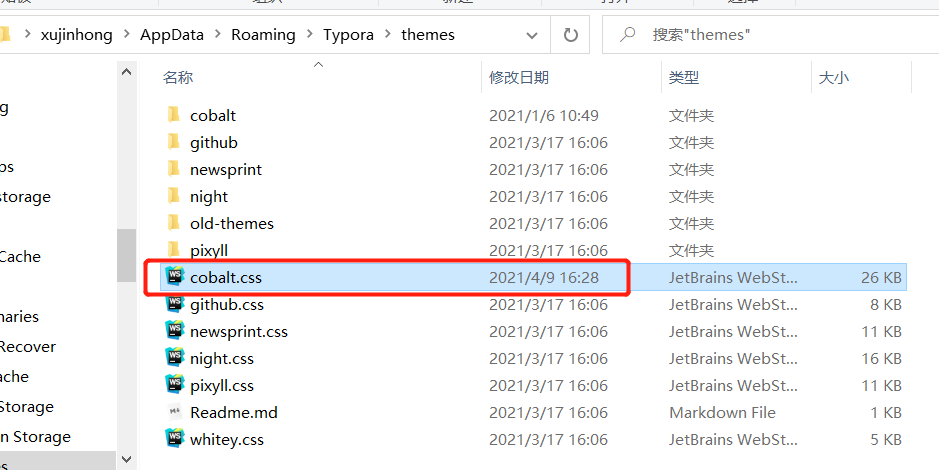

<h1 align = "center">Typora</h1>

## 使用手册

### 1.标题居中

```html
<h1 align = "center">标题居中的方法</h1>
```

### 2. 插入URL

ctrl  +  k   插入超链接 ( 直接拖入pdf  文件  或者视频网页地址都是可行的 )


ctrl  +  鼠标左键   打开超链接


### 3. 如何添加Typora主题皮肤

1. **首先，先打开Typora官网下载主题皮肤！**

地址： https://theme.typora.io


点击进入自己喜欢的主题之后，点击download控件即可。示例：


然后进入GitHub资源页面，直接点击下载.zip文件即可，示例：


2. **下载后解压**


3. **打开偏好设置**


4. 点击打开主题文件夹后，会出现Typora\themes文件夹。
   之后将解压的文件的vue文件夹和vue.css文件复制到主题Typora\themes文件夹里！最后重新启动Typora即可！

   


### 4. 图片左对齐

1. 外观  偏好设置 

   

   2. 打开 github.css,复制下面这段代码

      

```
p .md-image:only-child{
    width: auto;
    text-align: left !important;
}
```

### 5. Typora退出上一行格式

```
windows上的键是  ctrl + [
```

### 6. Typora快捷键

| 快捷键      | 作用               | 快捷键       | 作用           |
| ----------- | ------------------ | ------------ | -------------- |
| Ctrl+1      | 一阶标题           | Ctrl+B       | 字体加粗       |
| Ctrl+2      | 二阶标题           | Ctrl+I       | 字体倾斜       |
| Ctrl+3      | 三阶标题           | Ctrl+U       | 下划线         |
| Ctrl+4      | 四阶标题           | Ctrl+Home    | 返回Typora顶部 |
| Ctrl+5      | 五阶标题           | Ctrl+End     | 返回Typora底部 |
| Ctrl+6      | 六阶标题           | Ctrl+T       | 创建表格       |
| Ctrl+L      | 选中某句话         | Ctrl+K       | 创建超链接     |
| Ctrl+D      | 选中某个单词       | Ctrl+F       | 搜索           |
| Ctrl+E      | 选中相同格式的文字 | Ctrl+H       | 搜索并替换     |
| Alt+Shift+5 | 删除线             | Ctrl+Shift+I | 插入图片       |

### 7 w10快捷键

```
Win  + Tab  切换窗口
Win  + Ctrl + 键盘左右方向键 切换桌面
```

### 8.  图片相对位置修改

#### 8.1  点击文件，点击偏好设置


#### 8.2   修改设置


### 9. 高亮设置

1. 在偏好设置-->markdown-->markdown扩展语法里勾选

2. 

3. 先找到主题文件：「文件」 ==> 「偏好设置」（或者直接 Ctrl + 逗号），在右边「外观」栏中找到「打开主题文件」打开：

   

   打开主题对应的 .css 文件，在最后面加上下面的文字：

   ```
   mark {
     background: #3D9140;
     color: #FFFFFF;
     padding:5px;
     margin: 2px;
   }
   ```

   

4. Typora 中「高亮」没有快捷键，但是可以自定义。`Ctrl+逗号`打开「偏好设置」，在「通用」里最下面打开高级设置，找到下图位置，添加自己需要的快捷键：

   

```
Ctrl + q
```


### 10 插入视频和PDF

#### 10.1 嵌入视频

以B站为例，复制其嵌入代码

[https://www.bilibili.com/video/BV1kk4y1m7sT](https://link.zhihu.com/?target=https%3A//www.bilibili.com/video/BV1kk4y1m7sT) (二维码自动识别)

```
<iframe src="//player.bilibili.com/player.html?aid=754115200&bvid=BV1kk4y1m7sT&cid=220773148&page=1" scrolling="no" border="0" frameborder="no" framespacing="0" allowfullscreen="true"> </iframe>
```

#### 10.2 嵌入PDF

当然，区区PDF也不在话下，如果是本地文件，直接拖入即可。

如果想导入云端PDF，需要通过 `Google Drive Viewer` 来显示：

```
<iframe src="https://docs.google.com/gview?embedded=true&url=http://infolab.stanford.edu/pub/papers/google.pdf" style="width:800px; height:500px;" frameborder="0"></iframe>
```

只需把 `url=http://infolab.stanford.edu/pub/papers/google.pdf` 替换成自己的PDF链接即可

### 11.  typora 快捷键

```
shift + tab  返回上一级样式

Ctrl+N  #新建文件
Ctrl+O  #打开文件

Ctrl+Shift+F  #全局查找

Ctrl+D  #选中当前单词
Ctrl+L  #选中当前行


Ctrl+Shift+[  #插入有序列表
Ctrl+Shift+]  #插入无序列表

Ctrl+[  #減少列表缩进
Ctrl+]  #增加列表缩进

Ctrl+/  #进入|退出源代码模式

Ctrl+Shift+K  #插入代码块

Ctrl+K  #插入超链接

Ctrl+T  #插入表格

Ctrl+Shift+I  #插入图片
```

