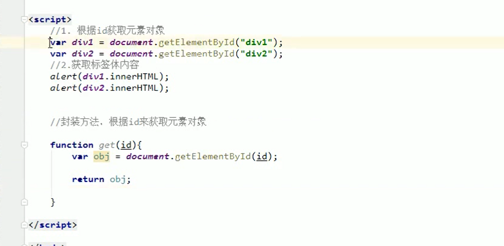

<h1 align='center'>JavaScript基础</h1>

## 1. 概念

一门客户端脚本语言

运行在客户端浏览器中的。每一个浏览器都有JavaScript的解析引擎

脚本语言：不需要编译，直接就可以被浏览器解析执行了

## 2. 功能

可以来增强用户和html页面的交互过程，可以来控制html元素，让页面有一些动态的效果，增强用户的体验。

## 3 ECMAScript

客户端脚本语言的标准

JavaScript   =   ECMAScript  +   JavaScript特有的东西( BOM   +   DOM)  

### 3.1 基本语法

#### 3.1.1 与html结合方式

```javascript
1. 内部JS：
	* 定义<script>，标签体内容就是js代码
2. 外部JS：
	* 定义<script>，通过src属性引入外部的js文件

* 注意：
	1. <script>可以定义在html页面的任何地方。但是定义的位置会影响执行顺序。
	2. <script>可以定义多个。
```

#### 3.1.2 注释

```javascript
1. 单行注释：//注释内容
2. 多行注释：/*注释内容*/
```

#### 3.1.3  数据类型

##### 3.1.3.1 原始数据类型

也叫基本数据类型

```javascript
1. number：数字。 整数/小数/NaN(not a number 一个不是数字的数字类型)
2. string：字符串。 字符串  "abc" "a" 'abc'
3. boolean: true和false
4. null：一个对象为空的占位符
5. undefined：未定义。如果一个变量没有给初始化值，则会被默认赋值为		undefined
```

##### 3.1.3.2 引用数据类型

对象

#### 3.1.4 变量

```javascript
* 变量：一小块存储数据的内存空间
* Java语言是强类型语言，而JavaScript是弱类型语言。
* 强类型：在开辟变量存储空间时，定义了空间将来存储的数据的数据类型。只能存储固定类型的数据
* 弱类型：在开辟变量存储空间时，不定义空间将来的存储数据类型，可以存放任意类型的数据。
* 语法：
		* var 变量名 = 初始化值;
		* typeof运算符：获取变量的类型。
		* 注：null运算后得到的是object
```

#### 3.1.5 运算符

##### 3.1.5.1 一元运算符

```javascript
1. 一元运算符：只有一个运算数的运算符
		++，-- ， +(正号)  
		* ++ --: 自增(自减)
		* ++(--) 在前，先自增(自减)，再运算
		* ++(--) 在后，先运算，再自增(自减)
		* +(-)：正负号
		* 注意：在JS中，如果运算数不是运算符所要求的类型，那么js引擎会自动的将运算数进行类型转换
        * 其他类型转number：
        * string转number：按照字面值转换。如果字面值不是数字，则转为NaN（不是数字的数字）
        * boolean转number：true转为1，false转为0
```

##### 3.1.5.2 算数运算符

```javascript
+ - * / % ...
```

##### 3.1.5.3 赋值运算符

```javascript
= += -+....
```

##### 3.1.5.4 比较运算符

```javascript
> < >= <= == ===(全等于)
* 比较方式
1. 类型相同：直接比较
	* 字符串：按照字典顺序比较。按位逐一比较，直到得出大小为止。
2. 类型不同：先进行类型转换，再比较
	* ===：全等于。在比较之前，先判断类型，如果类型不一样，则直接返回false
```

##### 3.1.5.5 逻辑运算符

```javascript
&& || !
	 * 其他类型转boolean：
     1. number：0或NaN为假，其他为真
     2. string：除了空字符串("")，其他都是true
     3. null & undefined:都是false
     4. 对象：所有对象都为true
```

##### 3.1.5.6  三元运算符

```javascript
? : 表达式
var a = 3;
var b = 4;
var c = a > b ? 1:0;
	* 语法：
	* 表达式? 值1:值2;
	* 判断表达式的值，如果是true则取值1，如果是false则取值2；
```

#### 3.1.6  流程控制语句

```javascript
1. if...else...
2. switch:
	* 在java中，switch语句可以接受的数据类型： byte int short char,枚举	 (1.5) ,String(1.7)
	* switch(变量):
	case 值:
    * 在JS中,switch语句可以接受任意的原始数据类型
3. while
4. do...while
5. for
```


#### 3.1.7 JS特殊语法

```javascript
1. 语句以;结尾，如果一行只有一条语句则 ;可以省略 (不建议)
2. 变量的定义使用var关键字，也可以不使用
     * 用： 定义的变量是局部变量
     * 不用：定义的变量是全局变量(不建议)
```

### 3.2 基本对象

#### 3.2.1 Function：函数(方法)对象

```javascript
 1. 创建：
 	1. var fun = new Function(形式参数列表,方法体);  //忘掉吧
    2. 
       function 方法名称(形式参数列表){
                方法体
       }

   3. 
       var 方法名 = function(形式参数列表){
                方法体
       }
2. 方法：

3. 属性：
      length:代表形参的个数
4. 特点：
       1. 方法定义是，形参的类型不用写,返回值类型也不写。
       2. 方法是一个对象，如果定义名称相同的方法，会覆盖
       3. 在JS中，方法的调用只与方法的名称有关，和参数列表无关
       4. 在方法声明中有一个隐藏的内置对象（数组），arguments,封装所有的实际参数
5. 调用：
       方法名称(实际参数列表);
```

#### 3.2.2 Array:数组对象

```javascript
1. 创建：
       1. var arr = new Array(元素列表);
       2. var arr = new Array(默认长度);
       3. var arr = [元素列表];
2. 方法
       join(参数):将数组中的元素按照指定的分隔符拼接为字符串
       push()	向数组的末尾添加一个或更多元素，并返回新的长度。
3. 属性
       ength:数组的长度
 4. 特点：
       1. JS中，数组元素的类型可变的。
       2. JS中，数组长度可变的。
```

#### 3.2.3  Boolean

#### 3.2.4 Date 日期对象

```javascript
 1. 创建：
        var date = new Date();
2. 方法：
        toLocaleString()：返回当前date对象对应的时间本地字符串格式
        getTime():获取毫秒值。返回当前如期对象描述的时间到1970年1月1日零点的毫秒值差
```

#### 3.2.5 Math：数学对象

```javascript
1. 创建：
       * 特点：Math对象不用创建，直接使用。  Math.方法名();

2. 方法：
       random():返回 0 ~ 1 之间的随机数。 含0不含1
       ceil(x)：对数进行上舍入。
       floor(x)：对数进行下舍入。
       round(x)：把数四舍五入为最接近的整数。
3. 属性：
       PI
```

#### 3.2.6 Number

#### 3.2.7 String

#### 3.2.8  RegExp：正则表达式对象

```javascript
1. 正则表达式：定义字符串的组成规则。
	 1. 单个字符:[]
		如：  [a] 
        	 [ab] 
        	 [a-zA-Z0-9_]    除了小写字母，大写字母和数字外，还可以匹配下划线字符。   
		* 特殊符号代表特殊含义的单个字符:
		\d:单个数字字符 [0-9]
		\w:单个单词字符[a-zA-Z0-9_]
	2. 量词符号：
		?：表示出现0次或1次
		*：表示出现0次或多次
		+：出现1次或多次
		{m,n}:表示 m<= 数量 <= n
			 * m如果缺省： {,n}:最多n次
			 * n如果缺省：{m,} 最少m次
	3. 开始结束符号
		* ^:开始
		* $:结束
2. 正则对象：
	1. 创建
		1. var reg = new RegExp("正则表达式");
		2. var reg = /正则表达式/;
	2. 方法	
		1. test(参数):验证指定的字符串是否符合正则定义的规范	
```

6到12位单词字符案例


#### 3.2.9  Global

```javascript
1. 特点：全局对象，这个Global中封装的方法不需要对象就可以直接调用。  方法名();
2. 方法：
		encodeURI() : url编码
		decodeURI() : url解码

		encodeURIComponent() : url编码,编码的字符更多
		decodeURIComponent() : url解码

		parseInt() : 将字符串转为数字
			* 逐一判断每一个字符是否是数字，直到不是数字为止，将前边数字部分转为number
		isNaN() : 判断一个值是否是NaN
			 * NaN六亲不认，连自己都不认。NaN参与的==比较全部问false
		eval() : 讲 JavaScript 字符串，并把它作为脚本代码来执行。
3. URL编码
```

## 4 优化js

### 4.1 包装方法代替 document.getelementbyid()

#### 4.1.1 页面直接书写



#### 4.1.2  封装js方法


引入js 方法,然后使用

