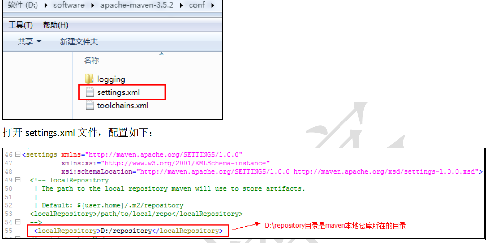
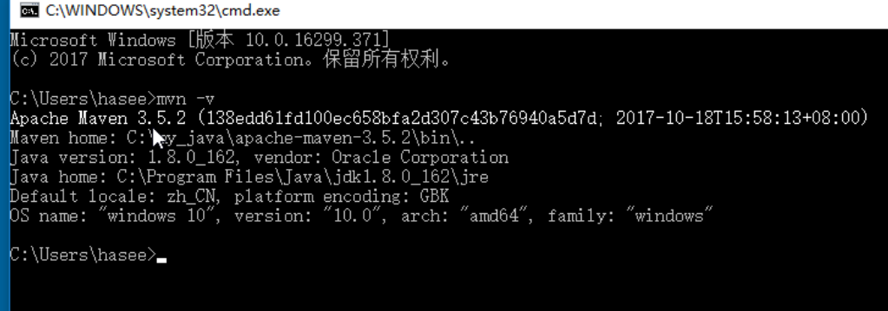
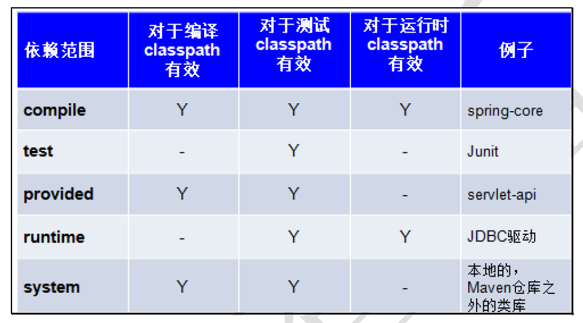
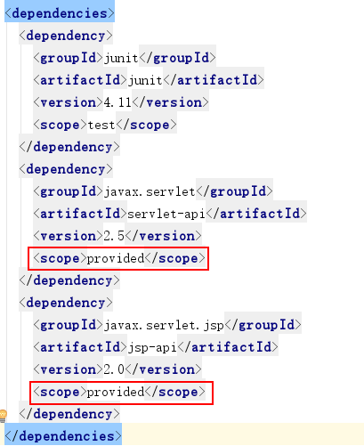

<h1 align = "center">Maven基础</h1>

## 1.1  什么是Maven

```
Maven是一个项目管理工具，它包含了一个项目对象模型 (POM：Project Object Model)，一组标准集合，一个项目生命周期(Project Lifecycle)，一个依赖管理系统(Dependency Management System)，和用来运行定义在生命周期阶段(phase)中插件(plugin)目标(goal)的逻辑。
```

## 1.2 Maven仓库的分类

### 1.2.1  本地仓库

```
本地仓库 ：用来存储从远程仓库或中央仓库下载的插件和jar包，项目使用一些插件或jar包，优先从本地仓库查找
默认本地仓库位置在 ${user.dir}/.m2/repository，${user.dir}表示windows用户目录。
```

### 1.2.2  远程仓库

```
远程仓库：如果本地需要插件或者jar包，本地仓库没有，默认去远程仓库下载。
远程仓库可以在互联网内也可以在局域网内。
```

### 1.2.2  中央仓库

```
中央仓库 ：在maven软件中内置一个远程仓库地址http://repo1.maven.org/maven2 ，它是中央仓库，服务于整个互联网，它是由Maven团队自己维护，里面存储了非常全的jar包，它包含了世界上大部分流行的开源项目构件。
```

## 1.3  Maven本地仓库的配置



## 1.4 maven 命令

### 1.4.1 mvn - v



## 1.5  maven  下载jar包

```
http://mvnrepository.com/
http://search.maven.org/
```

## 1.6 依赖范围

### 1.6.1 依赖范围介绍

A依赖B，需要在A的pom.xml文件中添加B的坐标，添加坐标时需要指定依赖范围，依赖范围包括：

 compile：编译范围，指A在编译时依赖B，此范围为默认依赖范围。编译范围的依赖会用在编译、测试、运行，由于运行时需要所以编译范围的依赖会被打包。
 provided：provided依赖只有在当JDK或者一个容器已提供该依赖之后才使用， provided依赖在编译和测试时需要，在运行时不需要，比如：servlet api被tomcat容器提供。
 runtime：runtime依赖在运行和测试系统的时候需要，但在编译的时候不需要。比如：jdbc的驱动包。由于运行时需要所以runtime范围的依赖会被打包。
 test：test范围依赖 在编译和运行时都不需要，它们只有在测试编译和测试运行阶段可用，比如：junit。由于运行时不需要所以test范围依赖不会被打包。
 system：system范围依赖与provided类似，但是你必须显式的提供一个对于本地系统中JAR文件的路径，需要指定systemPath磁盘路径，system依赖不推荐使用。



在maven-web工程中测试各各scop。
测试总结：
 默认引入 的jar包 ------- compile 【默认范围 可以不写】（编译、测试、运行 都有效 ）
 servlet-api 、jsp-api ------- provided （编译、测试 有效， 运行时无效 防止和tomcat下jar冲突）
 jdbc驱动jar包 ---- runtime （测试、运行 有效 ）
 junit ----- test （测试有效）
依赖范围由强到弱的顺序是：compile>provided>runtime>test

### 1.6.1  项目中添加的坐标

