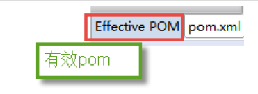

<h1 align = "center">Maven高级</h1>

# 1. 回顾[理解]

## 1.1 Maven的好处

节省磁盘空间
可以一键构建
可以跨平台
应用在大型项目时可以提高开发效率

## 1.2 安装配置maven

注意：3.3+版本需要jdkj.7+以上的支持

## 1.3  三种仓库

本地仓库
远程仓库（私服）
中央仓库

## 1.4  常见的命令

```
Compile
Test
Package
Install
Deploy
Clean
```

## 1.5  坐标的书写规范

```
groupId 	公司或组织域名的倒序
artifactId 	项目名或模块名
version 	版本号
```

## 1.6 如何添加坐标

```
1、在本地仓库中搜索
2、互联网上搜，推荐网址 http://www.mvnrepository.com/
```

## 1.7  依赖范围

```
Compile
Test
Runtime
Provided
```

# 2. maven构建SSM工程[应用]

## 2.1  需求


实现SSM工程构建，规范依赖管理。场景：根据id展示商品信息

## 2.2 准备数据库

导入以下语句


## 2.3  创建一个maven工程

### 2.3.1  新建一个ssm_maven项目,使用下图选中的骨架


### 2.3.2  填写坐标


### 2.3.3 查看是否使用的自己的私服


### 2.3.4  在main目录下新建 java和resources文件夹

### 

### 2.3.5  把java和resources文件夹转成source root


### 2.3.6  修改编译版本，在pom.xml文件中添加


## 2.4  知识点准备

### 2.4.1  什么是依赖传递

先添加 springmvc 的核心依赖的坐标

```
<dependencies> 
	<dependency>
		<groupId>org.springframework</groupId> 
		<artifactId>spring-webmvc</artifactId>
        <version>4.2.4.RELEASE</version>
	</dependency> 	
</dependencies>
```

会发现出现除了spring-webmvc以外的其他jar。因为我们的项目依赖spring-webmv.jar，而spring-webmv.jar会依赖spring-beans.jar等等，所以spring-beans.jar这些jar包也出现在了我们的maven工程中，这种现象我们称为依赖传递。从下图中可看到他们的关系：（请注意spring-beans的版本）


### 2.4.2  依赖冲突的解决

接着添加一个依赖


我们会发现这两个jar包同时都依赖了spring-beans


但是
spring-webmvc依赖spirng-beans-4.2.4，spring-context依赖spring-beans-5.0.2，但是发现spirng-beans-4.2.4加入到工程中


#### 2.4.2.1 依赖调解原则

maven自动按照下边的原则调解：

##### 2.4.2.1.1  第一声明者优先原则

```
 1、第一声明者优先原则
在pom文件定义依赖，先声明的依赖为准。
测试：
如果将上边spring-webmvc和spring-context顺序颠倒，系统将导入spring-beans-5.0.2。
分析：
由于spring-webmvc在前边以spring-webmvc依赖的spring-beans-5.0.2为准，所以最终

spring-beans-5.0.2添加到了工程中。
```

##### 2.4.2.1.2  路径近者优先原则

```
2、路径近者优先原则
例如：还是上述情况，spring-contex和spring-webmvc都会传递过来 spirng-beans，那如果直接把spring-beans的依赖直接写到pom文件中，那么项目就不会再使用其他依赖传递来的spring-beans，因为自己直接在pom中定义spring-beans要比其他依赖传递过来的路径要近。
在本工程中的pom中加入spirng-beans-5.0.2的依赖，根据路径近者优先原则，系统将导入spirng-beans-5.0.2：
```


### 2.4.2.2  排除依赖

上边的问题也可以通过排除依赖方法辅助依赖调解，如下：
比如在依赖spring-webmvc的设置中添加排除依赖，排除spring-beans，
下边的配置表示：依赖spring-webmvc，但排除spring-webmvc所依赖的spring-beans。


### 2.4.2.3  锁定版本

面对众多的依赖，有一种方法不用考虑依赖路径、声明优化等因素可以采用直接锁定版本的方法确定依赖构件的版本，版本锁定后则不考虑依赖的声明顺序或依赖的路径，以锁定的版本的为准添加到工程中，此方法在企业开发中常用。
如下的配置是锁定了spring-beans和spring-context的版本：


还可以把版本号提取出来，使用<properties>标签设置成变量。


注意：在工程中锁定依赖的版本并不代表在工程中添加了依赖，如果工程需要添加锁定版本的依赖则需要单独添加<dependencies></dependencies>标签，如下：


上边添加的依赖并没有指定版本，原因是已在<dependencyManagement>中锁定了版本，所以在<dependency>下不需要再指定版本。

## 2.5  定义pom.xml

maven工程首先要识别依赖，web工程实现SSM整合，需要依赖spring-webmvc5.0.2、 spring5.0.2、mybatis3.4.5等，在pom.xml添加工程如下依赖：
（在实际企业开发中会有架构师专门来编写pom.xml）

分两步：
1）锁定依赖版本
2）添加依赖

```xml
<?xml version="1.0" encoding="UTF-8"?>
<project xmlns="http://maven.apache.org/POM/4.0.0" xmlns:xsi="http://www.w3.org/2001/XMLSchema-instance"
         xsi:schemaLocation="http://maven.apache.org/POM/4.0.0 http://maven.apache.org/xsd/maven-4.0.0.xsd">
    <modelVersion>4.0.0</modelVersion>
    <groupId>cn.itcast.ssm_maven</groupId>
    <artifactId>ssm_maven</artifactId>
    <version>1.0-SNAPSHOT</version>
    <packaging>war</packaging>
    <properties>
        <spring.version>5.0.2.RELEASE</spring.version>
        <springmvc.version>5.0.2.RELEASE</springmvc.version>
        <mybatis.version>3.4.5</mybatis.version>
    </properties> <!--锁定依赖版本-->
    <dependencyManagement>
        <dependencies> <!-- Mybatis -->
            <dependency>
                <groupId>org.mybatis</groupId>
                <artifactId>mybatis</artifactId>
                <version>${mybatis.version}</version>
            </dependency> <!-- springMVC -->
            <dependency>
                <groupId>org.springframework</groupId>
                <artifactId>spring-webmvc</artifactId>
                <version>${springmvc.version}</version>
            </dependency>
            <dependency>
                <groupId>org.springframework</groupId>
                <artifactId>spring-context</artifactId>
                <version>${spring.version}</version>
            </dependency> <!-- spring -->
            <dependency>
                <groupId>org.springframework</groupId>
                <artifactId>spring-core</artifactId>
                <version>${spring.version}</version>
            </dependency>
            <dependency>
                <groupId>org.springframework</groupId>
                <artifactId>spring-aop</artifactId>
                <version>${spring.version}</version>
            </dependency>
            <dependency>
                <groupId>org.springframework</groupId>
                <artifactId>spring-web</artifactId>
                <version>${spring.version}</version>
            </dependency>
            <dependency>
                <groupId>org.springframework</groupId>
                <artifactId>spring-expression</artifactId>
                <version>${spring.version}</version>
            </dependency>
            <dependency>
                <groupId>org.springframework</groupId>
                <artifactId>spring-beans</artifactId>
                <version>${spring.version}</version>
            </dependency>
            <dependency>
                <groupId>org.springframework</groupId>
                <artifactId>spring-aspects</artifactId>
                <version>${spring.version}</version>
            </dependency>
            <dependency>
                <groupId>org.springframework</groupId>
                <artifactId>spring-context-support</artifactId>
                <version>${spring.version}</version>
            </dependency>
            <dependency>
                <groupId>org.springframework</groupId>
                <artifactId>spring-test</artifactId>
                <version>${spring.version}</version>
            </dependency>
            <dependency>
                <groupId>org.springframework</groupId>
                <artifactId>spring-jdbc</artifactId>
                <version>${spring.version}</version>
            </dependency>
            <dependency>
                <groupId>org.springframework</groupId>
                <artifactId>spring-tx</artifactId>
                <version>${spring.version}</version>
            </dependency>
        </dependencies>
    </dependencyManagement> <!--添加依赖-->
    <dependencies> <!-- Mybatis和mybatis与spring的整合 -->
        <dependency>
            <groupId>org.mybatis</groupId>
            <artifactId>mybatis</artifactId>
        </dependency>
        <dependency>
            <groupId>org.mybatis</groupId>
            <artifactId>mybatis-spring</artifactId>
            <version>1.3.1</version>
        </dependency> <!-- MySql驱动 -->
        <dependency>
            <groupId>mysql</groupId>
            <artifactId>mysql-connector-java</artifactId>
            <version>5.1.32</version>
        </dependency> <!-- druid数据库连接池 -->
        <dependency>
            <groupId>com.alibaba</groupId>
            <artifactId>druid</artifactId>
            <version>1.0.9</version>
        </dependency> <!-- springMVC核心-->
        <dependency>
            <groupId>org.springframework</groupId>
            <artifactId>spring-webmvc</artifactId>
        </dependency> <!-- spring相关 -->
        <dependency>
            <groupId>org.springframework</groupId>
            <artifactId>spring-context</artifactId>
        </dependency>
        <dependency>
            <groupId>org.springframework</groupId>
            <artifactId>spring-core</artifactId>
        </dependency>
        <dependency>
            <groupId>org.springframework</groupId>
            <artifactId>spring-aop</artifactId>
        </dependency>
        <dependency>
            <groupId>org.springframework</groupId>
            <artifactId>spring-web</artifactId>
        </dependency>
        <dependency>
            <groupId>org.springframework</groupId>
            <artifactId>spring-expression</artifactId>
        </dependency>
        <dependency>
            <groupId>org.springframework</groupId>
            <artifactId>spring-beans</artifactId>
        </dependency>
        <dependency>
            <groupId>org.springframework</groupId>
            <artifactId>spring-aspects</artifactId>
        </dependency>
        <dependency>
            <groupId>org.springframework</groupId>
            <artifactId>spring-context-support</artifactId>
        </dependency>
        <dependency>
            <groupId>org.springframework</groupId>
            <artifactId>spring-test</artifactId>
        </dependency>
        <dependency>
            <groupId>org.springframework</groupId>
            <artifactId>spring-jdbc</artifactId>
        </dependency>
        <dependency>
            <groupId>org.springframework</groupId>
            <artifactId>spring-tx</artifactId>
        </dependency> <!-- junit测试 -->
        <dependency>
            <groupId>junit</groupId>
            <artifactId>junit</artifactId>
            <version>4.12</version>
        </dependency>
        <dependency>
            <groupId>javax.servlet</groupId>
            <artifactId>servlet-api</artifactId>
            <version>2.5</version>
            <scope>provided</scope>
        </dependency>
        <dependency>
            <groupId>javax.servlet</groupId>
            <artifactId>jsp-api</artifactId>
            <version>2.0</version>
            <scope>provided</scope>
        </dependency> <!-- jstl -->
        <dependency>
            <groupId>javax.servlet</groupId>
            <artifactId>jstl</artifactId>
            <version>1.2</version>
        </dependency>
    </dependencies>
    <build>
        <plugins> <!-- 设置编译版本为1.8 -->
            <plugin>
                <groupId>org.apache.maven.plugins</groupId>
                <artifactId>maven-compiler-plugin</artifactId>
                <version>3.1</version>
                <configuration>
                    <source>1.8</source>
                    <target>1.8</target>
                    <encoding>UTF-8</encoding>
                </configuration>
            </plugin>
            <plugin>
                <groupId>org.apache.tomcat.maven</groupId>
                <artifactId>tomcat7-maven-plugin</artifactId>
                <version>2.2</version>
                <configuration>
                    <path>/</path>
                    <port>8080</port>
                </configuration>
            </plugin>
        </plugins>
    </build>
</project>
```

## 2.6  Dao层

在src/main/java中定义dao接口，实现根据id 查询商品信息：

### 2.6.1  pojo模型类

在src/man/java创建模型类


```java
public class Items { 
    private Integer id; 
    private String name; 
    private Float price; 
    private String pic; 
    private Date createtime; 
    private String detail; 
    ………
}
```

### 2.6.2   dao层代码


### 2.6.3  配置文件

注意配置文件的位置


内容如下

```
<?xml version="1.0" encoding="UTF-8" ?> <!DOCTYPE mapper PUBLIC "-//mybatis.org//DTD Mapper 3.0//EN"
        "http://mybatis.org/dtd/mybatis-3-mapper.dtd" >
<mapper namespace="cn.itcast.ssm.dao.ItemsMapper">
    <select id="findById" parameterType="int" resultType="items"> select * from items where id=#{id} </select>
</mapper>
```

 在 src/main/resources创建applicationContext.xml

```
<?xml version="1.0" encoding="UTF-8"?>
<beans xmlns="http://www.springframework.org/schema/beans" xmlns:context="http://www.springframework.org/schema/context"
       xmlns:p="http://www.springframework.org/schema/p" xmlns:aop="http://www.springframework.org/schema/aop"
       xmlns:tx="http://www.springframework.org/schema/tx" xmlns:xsi="http://www.w3.org/2001/XMLSchema-instance"
       xsi:schemaLocation="http://www.springframework.org/schema/beans http://www.springframework.org/schema/beans/spring-beans-4.0.xsd http://www.springframework.org/schema/contexthttp://www.springframework.org/schema/context/spring-context-4.0.xsd http://www.springframework.org/schema/aop http://www.springframework.org/schema/aop/spring-aop-4.0.xsd http://www.springframework.org/schema/tx http://www.springframework.org/schema/tx/spring-tx-4.0.xsd http://www.springframework.org/schema/util http://www.springframework.org/schema/util/spring-util-4.0.xsd"> <!-- 数据库连接池 -->
    <bean id="dataSource" class="com.alibaba.druid.pool.DruidDataSource"> <!-- 驱动 -->
        <property name="driverClassName" value="com.mysql.jdbc.Driver"/> <!-- url -->
        <property name="url" value="jdbc:mysql://localhost:3306/maven"/> <!-- 用户名 -->
        <property name="username" value="root"/> <!-- 密码 -->
        <property name="password" value="root"/>
    </bean> <!-- mapper配置 --> <!-- 让spring管理sqlsessionfactory 使用mybatis和spring整合包中的 -->
    <bean id="sqlSessionFactory" class="org.mybatis.spring.SqlSessionFactoryBean"> <!-- 数据库连接池 -->
        <property name="dataSource" ref="dataSource"/>
        <property name="typeAliasesPackage" value="cn.itcast.ssm.pojo"></property>
    </bean> <!-- mapper扫描器 ：用来产生代理对象-->
    <bean class="org.mybatis.spring.mapper.MapperScannerConfigurer">
        <property name="basePackage" value="cn.itcast.ssm.dao"></property>
    </bean>
</beans>
```

在src/main/resources配置log4j.properties

```
### direct log messages to stdout ### log4j.appender.stdout=org.apache.log4j.ConsoleAppender log4j.appender.stdout.Target=System.out log4j.appender.stdout.layout=org.apache.log4j.PatternLayout log4j.appender.stdout.layout.ConversionPattern=%d{ABSOLUTE} %5p %c{1}:%L - %m%n ### set log levels - for more verbose logging change 'info' to 'debug' ### #在开发阶段日志级别使用debug log4j.rootLogger=debug, stdout ### 在日志中输出sql的输入参数 ### log4j.logger.org.hibernate.type=TRACE
```

### 2.6.4  单元测试

在src/test/java创建单元测试类

```
public class ItemsMapperTest {
@Test public void testFindItemsById() { //获取spring容器 ApplicationContext applicationContext = new ClassPathXmlApplicationContext("classpath:applicationContext.xml"); //获取Mapper ItemsMapper itemsMapper = applicationContext.getBean(ItemsMapper.class); //调用Mapper方法 Items items = itemsMapper.findById(1); System.out.println(items); } 
}
```

## 2.7   Service层

### 2.7.1  代码

```
@Service @Transactional 
public class ItemsServiceImpl implements ItemsService { 
@Autowired private ItemsMapper itemsMapper; 
@Override public Items findById(int itemId) { return itemsMapper.findById(itemId); } 
}
```

### 2.7.2  配置文件

在applicationContext.xml中配置service

```
<context:component-scan base-package="cn.itcast.ssm.service"/>
```

## 2.8  Web层

### 2.8.1  代码

```java
@Controller @RequestMapping("/items/") 
public class ItemsController { 
@Autowired private ItemsService itemsService ; // 展示商品信息页面 @RequestMapping("/showItem") 
public String showItem(int id,Model model){ 
Items items = itemsService.findById(id); model.addAttribute("item", items); return "viewItem";
}
```

### 2.8.2  配置文件

在springmvc.xml

```xml
<?xml version="1.0" encoding="UTF-8"?>
<beans xmlns="http://www.springframework.org/schema/beans" xmlns:xsi="http://www.w3.org/2001/XMLSchema-instance"
       xmlns:p="http://www.springframework.org/schema/p" xmlns:context="http://www.springframework.org/schema/context"
       xmlns:mvc="http://www.springframework.org/schema/mvc"
       xsi:schemaLocation="http://www.springframework.org/schema/beans http://www.springframework.org/schema/beans/spring-beans-4.2.xsd http://www.springframework.org/schema/mvc http://www.springframework.org/schema/mvc/spring-mvc-4.2.xsd http://www.springframework.org/schema/context http://www.springframework.org/schema/context/spring-context-4.2.xsd">
    <context:component-scan base-package="cn.itcast.ssm.controller"></context:component-scan> <!-- 配置视图解析器的前缀和后缀 --> <br
    "> <property name="prefix" value="/WEB-INF/jsp/"></property>
    <property name="suffix" value=".jsp"></property>
</bean> </beans>ean class="org.springframework.web.servlet.view.InternalResourceViewResolve
```

Web.xml
加载spring容器，配置springmvc前端控制器

```xml
<?xml version="1.0" encoding="UTF-8"?>
<web-app xmlns:xsi="http://www.w3.org/2001/XMLSchema-instance" xmlns="http://java.sun.com/xml/ns/javaee"
         xsi:schemaLocation="http://java.sun.com/xml/ns/javaee http://java.sun.com/xml/ns/javaee/web-app_2_5.xsd"
         id="WebApp_ID" version="2.5"> <!-- 前端控制器 加载springmvc容器 -->
    <servlet>
        <servlet-name>springmvc</servlet-name>
        <servlet-class>org.springframework.web.servlet.DispatcherServlet</servlet-class>
        <init-param>
            <param-name>contextConfigLocation</param-name>
            <param-value>classpath:springmvc.xml</param-value>
        </init-param>
    </servlet>
    <servlet-mapping>
        <servlet-name>springmvc</servlet-name>
        <url-pattern>*.action</url-pattern>
    </servlet-mapping> <!-- 监听器 加载spring容器 -->
    <listener>
        <listener-class>org.springframework.web.context.ContextLoaderListener</listener-class>
    </listener>
    <context-param>
        <param-name>contextConfigLocation</param-name>
        <param-value>classpath*:applicationContext*.xml</param-value>
    </context-param>
</web-app>
```

## 2.9  Jsp

/WEB-INF/jsp/viewItem.jsp如下：

```
<%@ page language="java" contentType="text/html; charset=UTF-8" pageEncoding="UTF-8"%> <%@ taglib uri="http://java.sun.com/jsp/jstl/core" prefix="c" %>
```

```
<%@ taglib uri="http://java.sun.com/jsp/jstl/fmt" prefix="fmt"%> 
<!DOCTYPE html PUBLIC "-//W3C//DTD HTML 4.01 Transitional//EN" "http://www.w3.org/TR/html4/loose.dtd"> <html> <head> <meta http-equiv="Content-Type" content="text/html; charset=UTF-8"> <title>商品信息</title> </head> <body> <form> <table width="100%" border=1> <tr> <td>商品名称</td> <td> ${item.name } </td> </tr> <tr> <td>商品价格</td> <td> ${item.price } </td> </tr> <tr> <td>生成日期</td> <td> <fmt:formatDate value="${item.createtime}" pattern="yyyy-MM-dd HH:mm:ss"/> </td> </tr> <tr> <td>商品简介</td> <td>${item.detail} </textarea> </td> </tr> </table> </form> </body> 
</html>
```

## 2.10  运行与调试

添加tomcat7插件，双击右侧tomcat7运行


运行结果如下：


# 3. 分模块构建工程[应用]

基于上边的三个工程分析
继承：创建一个parent工程将所需的依赖都配置在pom中
聚合：聚合多个模块运行。

## 3.1  需求

需求描述
将SSM工程拆分为多个模块开发：

ssm_dao
ssm_service
ssm_web


理解继承和聚合

```
通常继承和聚合同时使用。
 何为继承？
继承是为了消除重复，如果将dao、service、web分开创建独立的工程则每个工程的pom.xml文件中的内容存在重复，比如：设置编译版本、锁定spring的版本的等，可以将这些重复的配置提取出来在父工程的pom.xml中定义。
 何为聚合？
项目开发通常是分组分模块开发，每个模块开发完成要运行整个工程需要将每个模块聚合在一起运行，比如：dao、service、web三个工程最终会打一个独立的war运行。
```

## 3.2  案例实现

### 3.2.1   maven-parent父模块

#### 3.2.1.1  创建父工程

##### 3.2.1.1.1  选择骨架创建父工程


##### 3.2.1.1.2	填写坐标


##### 3.2.1.1.3 	确认使用的是本地仓库


##### 3.2.1.1.4  注意代码所在的路径（默认）


##### 3.2.1.1.5   设置项目的打包方式


#### 3.2.1.2 定义pom.xml

在父工程的pom.xml中抽取一些重复的配置的，比如：锁定jar包的版本、设置编译版本等。

```xml
<properties>
    <spring.version>5.0.2.RELEASE</spring.version>
    <springmvc.version>5.0.4.RELEASE</springmvc.version>
    <mybatis.version>3.4.5</mybatis.version>
</properties> <dependencyManagement>
<dependencies> <!-- Mybatis -->
    <dependency>
        <groupId>org.mybatis</groupId>
        <artifactId>mybatis</artifactId>
        <version>${mybatis.version}</version>
    </dependency> <!-- springMVC -->
    <dependency>
        <groupId>org.springframework</groupId>
        <artifactId>spring-webmvc</artifactId>
        <version>${springmvc.version}</version>
    </dependency>
    <dependency>
        <groupId>org.springframework</groupId>
        <artifactId>spring-context</artifactId>
        <version>${spring.version}</version>
    </dependency> <!-- spring -->
    <dependency>
        <groupId>org.springframework</groupId>
        <artifactId>spring-core</artifactId>
        <version>${spring.version}</version>
    </dependency>
    <dependency>
        <groupId>org.springframework</groupId>
        <artifactId>spring-aop</artifactId>
        <version>${spring.version}</version>
    </dependency>
    <dependency>
        <groupId>org.springframework</groupId>
        <artifactId>spring-web</artifactId>
        <version>${spring.version}</version>
    </dependency>
    <dependency>
        <groupId>org.springframework</groupId>
        <artifactId>spring-expression</artifactId>
        <version>${spring.version}</version>
    </dependency>
    <dependency>
        <groupId>org.springframework</groupId>
        <artifactId>spring-beans</artifactId>
        <version>${spring.version}</version>
    </dependency>
    <dependency>
        <groupId>org.springframework</groupId>
        <artifactId>spring-aspects</artifactId>
        <version>${spring.version}</version>
    </dependency>
    <dependency>
        <groupId>org.springframework</groupId>
        <artifactId>spring-context-support</artifactId>
        <version>${spring.version}</version>
    </dependency>
    <dependency>
        <groupId>org.springframework</groupId>
        <artifactId>spring-test</artifactId>
        <version>${spring.version}</version>
    </dependency>
    <dependency>
        <groupId>org.springframework</groupId>
        <artifactId>spring-jdbc</artifactId>
        <version>${spring.version}</version>
    </dependency>
    <dependency>
        <groupId>org.springframework</groupId>
        <artifactId>spring-tx</artifactId>
        <version>${spring.version}</version>
    </dependency>
</dependencies>
</dependencyManagement> <build>
<plugins>
    <plugin>
        <groupId>org.apache.maven.plugins</groupId>
        <artifactId>maven-compiler-plugin</artifactId>
        <version>3.1</version>
        <configuration>
            <target>1.8</target>
            <source>1.8</source>
        </configuration>
    </plugin>
</plugins>
</build>
```

#### 3.2.1.3  将父工程发布至仓库

父工程创建完成执行install将父工程发布到仓库方便子工程继承：


### 3.2.2   ssm_dao子模块

#### 3.2.2.1  创建dao子模块

##### 3.2.2.1.1  在父工程上右击创建maven模块


##### 3.2.2.1.2  选择“跳过骨架选择”


##### 3.2.2.1.3  填写模块名称


##### 3.2.2.1.4 下一步，确定项目的目录


##### 3.2.2.1.5 打包方式是jar


#### 3.2.2.2  定义pom.xml

只添加到层的pom，mybatis和spring的整合相关依赖

```
<dependencies> <!-- Mybatis和mybatis与spring的整合 -->
    <dependency>
        <groupId>org.mybatis</groupId>
        <artifactId>mybatis</artifactId>
    </dependency>
    <dependency>
        <groupId>org.mybatis</groupId>
        <artifactId>mybatis-spring</artifactId>
        <version>1.3.1</version>
    </dependency> <!-- MySql驱动 -->
    <dependency>
        <groupId>mysql</groupId>
        <artifactId>mysql-connector-java</artifactId>
        <version>5.1.32</version>
    </dependency> <!-- druid数据库连接池 -->
    <dependency>
        <groupId>com.alibaba</groupId>
        <artifactId>druid</artifactId>
        <version>1.0.9</version>
    </dependency> <!-- spring相关 -->
    <dependency>
        <groupId>org.springframework</groupId>
        <artifactId>spring-context</artifactId>
    </dependency>
    <dependency>
        <groupId>org.springframework</groupId>
        <artifactId>spring-core</artifactId>
    </dependency>
    <dependency>
        <groupId>org.springframework</groupId>
        <artifactId>spring-aop</artifactId>
    </dependency>
    <dependency>
        <groupId>org.springframework</groupId>
        <artifactId>spring-web</artifactId>
    </dependency>
    <dependency>
        <groupId>org.springframework</groupId>
        <artifactId>spring-expression</artifactId>
    </dependency>
    <dependency>
        <groupId>org.springframework</groupId>
        <artifactId>spring-beans</artifactId>
    </dependency>
    <dependency>
        <groupId>org.springframework</groupId>
        <artifactId>spring-aspects</artifactId>
    </dependency>
    <dependency>
        <groupId>org.springframework</groupId>
        <artifactId>spring-context-support</artifactId>
    </dependency>
    <dependency>
        <groupId>org.springframework</groupId>
        <artifactId>spring-test</artifactId>
    </dependency>
    <dependency>
        <groupId>org.springframework</groupId>
        <artifactId>spring-jdbc</artifactId>
    </dependency>
    <dependency>
        <groupId>org.springframework</groupId>
        <artifactId>spring-tx</artifactId>
    </dependency>
</dependencies>
```

#### 3.2.2.3  dao代码

把文件夹转成sources root


北京市昌平区建材城西路金燕龙办公楼一层 电话：400-618-9090
2.2.3 dao代码
把文件夹转成sources root
将ssm_maven工程中的dao接口、映射文件及pojo类拷贝到src/main/java中：


#### 3.2.2.4  配置文件

将applicationContext.xml拆分出一个applicationContext-dao.xml，此文件中只配置dao相关

```
<?xml version="1.0" encoding="UTF-8"?>
<beans xmlns="http://www.springframework.org/schema/beans" xmlns:context="http://www.springframework.org/schema/context"
       xmlns:p="http://www.springframework.org/schema/p" xmlns:aop="http://www.springframework.org/schema/aop"
       xmlns:tx="http://www.springframework.org/schema/tx" xmlns:xsi="http://www.w3.org/2001/XMLSchema-instance"
       xsi:schemaLocation="http://www.springframework.org/schema/beans http://www.springframework.org/schema/beans/spring-beans-4.0.xsd http://www.springframework.org/schema/context http://www.springframework.org/schema/context/spring-context-4.0.xsd http://www.springframework.org/schema/aop http://www.springframework.org/schema/aop/spring-aop-4.0.xsd http://www.springframework.org/schema/tx http://www.springframework.org/schema/tx/spring-tx-4.0.xsd http://www.springframework.org/schema/util http://www.springframework.org/schema/util/spring-util-4.0.xsd"> <!-- 数据库连接池 -->
    <bean id="dataSource" class="com.alibaba.druid.pool.DruidDataSource"> <!-- 驱动 -->
        <property name="driverClassName" value="com.mysql.jdbc.Driver"/> <!-- url -->
        <property name="url" value="jdbc:mysql://localhost:3306/maven"/> <!-- 用户名 -->
        <property name="username" value="root"/> <!-- 密码 -->
        <property name="password" value="root"/>
    </bean> <!-- mapper配置 --> <!-- 让spring管理sqlsessionfactory 使用mybatis和spring整合包中的 -->
    <bean id="sqlSessionFactory" class="org.mybatis.spring.SqlSessionFactoryBean"> <!-- 数据库连接池 -->
        <property name="dataSource" ref="dataSource"/>
        <property name="typeAliasesPackage" value="cn.itcast.ssm.pojo"></property>
    </bean> <!-- mapper扫描器 ：用来产生代理对象-->
    <bean class="org.mybatis.spring.mapper.MapperScannerConfigurer">
        <property name="basePackage" value="cn.itcast.ssm.dao"></property>
    </bean>
</beans>
```

#### 3.2.2.5  单元测试

##### 3.2.2.5.1  首先在dao模块的pom.xml添加junit的依赖，添加时Scope选择 test


##### 3.2.2.5.2  编写junit测试代码


#### 3.2.2.6  把dao模块install到本地仓库

调过测试，install到本地仓库


### 3.2.3 ssm_service子模块

#### 3.2.3.1 创建service子模块

方法同ssm_dao模块创建方法，模块名称为ssm_service。

#### 3.2.3.2 定义pom.xml

ssm_service模块的pom.xml文件中需要继承父模块，ssm_service依赖ssm_dao模块，添加spring相关的依赖：

```
<dependencies> <!-- spring相关 -->
    <dependency>
        <groupId>org.springframework</groupId>
        <artifactId>spring-jdbc</artifactId>
    </dependency>
    <dependency>
        <groupId>org.springframework</groupId>
        <artifactId>spring-tx</artifactId>
    </dependency> <!-- dao层的依赖 -->
    <dependency>
        <groupId>cn.itcast.ssm</groupId>
        <artifactId>ssm_dao</artifactId>
        <version>1.0-SNAPSHOT</version>
    </dependency>
</dependencies>
```

#### 3.2.3.3 service接口

将ssm_maven工程中的service接口拷贝到src/main/java中：


#### 3.2.3.4 配置文件

创建applicationContext-service.xml，此文件中定义的service。

```
<context:component-scan base-package="cn.itcast.ssm"/>
```

#### 3.2.3.5  依赖范围对传递依赖的影响（了解）

##### 3.2.3.5.1 问题描述

当在写junit测试时发现，代码报出没有找不到类的错误信息：


是因为没有junit.jar引起的!为什么会这样呢？我们ssm_dao模块中有junit依赖而ssm_service模块依赖了ssm_dao，难道junit不应该传递过来吗？

##### 3.2.3.5.2 依赖范围对传递依赖的影响

是因为依赖会有依赖范围，依赖范围对传递依赖也有影响，例如有A、B、C，A依赖B、B依赖C，C可能是A的传递依赖，如下图：


最左边一列为直接依赖，理解为A依赖B的范围，最顶层一行为传递依赖，理解为B依赖C的范围，行与列的交叉即为A传递依赖C的范围。

举例1：
比如 A对 B 有 compile 依赖，B 对C有 runtime 依赖，那么根据表格所示A对C 有 runtime 依赖。

ssm_dao依赖junit，scop为test
ssm_service依赖ssm_dao.
查看下图红色框内所示传递依赖范围：


所以ssm_dao工程所依赖的junit的jar没有加入到ssm_service工程。

举例2：如果修改ssm_dao工程依赖junit的scop为compile，ssm_dao工程所依赖的junit的jar包会加入到ssm_service工程中，符合上边表格所示，查看下图红色框内所示：


#### 3.2.3.6   单元测试

遇到依赖没有传递过来的问题我们通常的解决方案是在本工程中直接添加依赖：
把如下依赖添加到ssm_service的工程中：


再看测试代码也不报错了


#### 3.2.3.7  Install到本地仓库


### 3.2.4   ssm_web子模块

#### 3.2.4.1创建web子模块

##### 3.2.4.1.1 选择骨架创建web子模块


##### 3.2.4.1.2 确认使用自己的本地仓库


##### 3.2.4.1.3 填写模块名称


使用骨架创建web项目会花费些时间，请耐心等待

##### 3.2.4.1.4  创建java和resources文件夹，转成source root


##### 3.2.4.1.5 添加打包方式war


#### 3.2.4.2 定义pom.xml

ssm_web模块的pom.xml文件中需要继承父模块，ssm_web依赖ssm_service模块,和springmvc的依赖

```
<?xml version="1.0" encoding="UTF-8"?>
<project xmlns="http://maven.apache.org/POM/4.0.0" xmlns:xsi="http://www.w3.org/2001/XMLSchema-instance"
         xsi:schemaLocation="http://maven.apache.org/POM/4.0.0 http://maven.apache.org/xsd/maven-4.0.0.xsd">
    <parent>
        <artifactId>ssm_parent</artifactId>
        <groupId>cn.itcast.ssm</groupId>
        <version>1.0-SNAPSHOT</version>
    </parent>
    <modelVersion>4.0.0</modelVersion>
    <artifactId>ssm_web</artifactId>
    <packaging>war</packaging>
    <dependencies> <!-- 依赖service -->
        <dependency>
            <groupId>cn.itcast.ssm</groupId>
            <artifactId>ssm_service</artifactId>
            <version>1.0-SNAPSHOT</version>
        </dependency> <!-- springMVC -->
        <dependency>
            <groupId>org.springframework</groupId>
            <artifactId>spring-webmvc</artifactId>
            <version>${springmvc.version}</version>
        </dependency>
    </dependencies>
</project>
```

#### 3.2.4.3 controller

将ssm_web工程中的controller代码拷贝到src/main/java中：


#### 3.2.4.4 配置文件

拷贝ssm_web工程中如下配置文件：


### 3.2.5   运行调试

方法1：在ssm_web工程的pom.xml中配置tomcat插件运行
运行ssm_web工程它会从本地仓库下载依赖的jar包，所以当ssm_web依赖的jar包内容修改了必须及时发布到本地仓库，比如：ssm_web依赖的ssm_service修改了，需要及时将

ssm_service发布到本地仓库。
方法2：在父工程的pom.xml中配置tomcat插件运行，自动聚合并执行
推荐方法2，如果子工程都在本地，采用方法2则不需要子工程修改就立即发布到本地仓库，父工程会自动聚合并使用最新代码执行。

注意：如果子工程和父工程中都配置了tomcat插件，运行的端口和路径以子工程为准。

## 3.3 分模块构建工程-依赖整合

每个模块都需要spring或者junit的jar，况且最终package打完包最后生成的项目中的jar就是各个模块依赖的整合，所以我们可以把项目中所需的依赖都可以放到父工程中,模块中只留模块和模块之间的依赖，那父工程的pom.xml可以如下配置：

```xml
<properties>
    <spring.version>5.0.2.RELEASE</spring.version>
    <springmvc.version>5.0.2.RELEASE</springmvc.version>
    <mybatis.version>3.4.5</mybatis.version>
</properties> <dependencyManagement>
<dependencies> <!-- Mybatis -->
    <dependency>
        <groupId>org.mybatis</groupId>
        <artifactId>mybatis</artifactId>
        <version>${mybatis.version}</version>
    </dependency> <!-- springMVC -->
    <dependency>
        <groupId>org.springframework</groupId>
        <artifactId>spring-webmvc</artifactId>
        <version>${springmvc.version}</version>
    </dependency>
    <dependency>
        <groupId>org.springframework</groupId>
        <artifactId>spring-context</artifactId>
        <version>${spring.version}</version>
    </dependency> <!-- spring -->
    <dependency>
        <groupId>org.springframework</groupId>
        <artifactId>spring-core</artifactId>
        <version>${spring.version}</version>
    </dependency>
    <dependency>
        <groupId>org.springframework</groupId>
        <artifactId>spring-aop</artifactId>
        <version>${spring.version}</version>
    </dependency>
    <dependency>
        <groupId>org.springframework</groupId>
        <artifactId>spring-web</artifactId>
        <version>${spring.version}</version>
    </dependency>
    <dependency>
        <groupId>org.springframework</groupId>
        <artifactId>spring-expression</artifactId>
        <version>${spring.version}</version>
    </dependency>
    <dependency>
        <groupId>org.springframework</groupId>
        <artifactId>spring-beans</artifactId>
        <version>${spring.version}</version>
    </dependency>
    <dependency>
        <groupId>org.springframework</groupId>
        <artifactId>spring-aspects</artifactId>
        <version>${spring.version}</version>
    </dependency>
    <dependency>
        <groupId>org.springframework</groupId>
        <artifactId>spring-context-support</artifactId>
        <version>${spring.version}</version>
    </dependency>
    <dependency>
        <groupId>org.springframework</groupId>
        <artifactId>spring-test</artifactId>
        <version>${spring.version}</version>
    </dependency>
    <dependency>
        <groupId>org.springframework</groupId>
        <artifactId>spring-jdbc</artifactId>
        <version>${spring.version}</version>
    </dependency>
    <dependency>
        <groupId>org.springframework</groupId>
        <artifactId>spring-tx</artifactId>
        <version>${spring.version}</version>
    </dependency>
</dependencies>
</dependencyManagement> <dependencies> <!-- Mybatis和mybatis与spring的整合 -->
<dependency>
    <groupId>org.mybatis</groupId>
    <artifactId>mybatis</artifactId>
</dependency>
<dependency>
    <groupId>org.mybatis</groupId>
    <artifactId>mybatis-spring</artifactId>
    <version>1.3.1</version>
</dependency> <!-- MySql驱动 -->
<dependency>
    <groupId>mysql</groupId>
    <artifactId>mysql-connector-java</artifactId>
    <version>5.1.32</version>
</dependency> <!-- druid数据库连接池 -->
<dependency>
    <groupId>com.alibaba</groupId>
    <artifactId>druid</artifactId>
    <version>1.0.9</version>
</dependency> <!-- springMVC -->
<dependency>
    <groupId>org.springframework</groupId>
    <artifactId>spring-webmvc</artifactId>
    <version>${springmvc.version}</version>
</dependency> <!-- spring相关 -->
<dependency>
    <groupId>org.springframework</groupId>
    <artifactId>spring-context</artifactId>
</dependency>
<dependency>
    <groupId>org.springframework</groupId>
    <artifactId>spring-core</artifactId>
</dependency>
<dependency>
    <groupId>org.springframework</groupId>
    <artifactId>spring-aop</artifactId>
</dependency>
<dependency>
    <groupId>org.springframework</groupId>
    <artifactId>spring-web</artifactId>
</dependency>
<dependency>
    <groupId>org.springframework</groupId>
    <artifactId>spring-expression</artifactId>
</dependency>
<dependency>
    <groupId>org.springframework</groupId>
    <artifactId>spring-beans</artifactId>
</dependency>
<dependency>
    <groupId>org.springframework</groupId>
    <artifactId>spring-aspects</artifactId>
</dependency>
<dependency>
    <groupId>org.springframework</groupId>
    <artifactId>spring-context-support</artifactId>
</dependency>
<dependency>
    <groupId>org.springframework</groupId>
    <artifactId>spring-test</artifactId>
</dependency>
<dependency>
    <groupId>org.springframework</groupId>
    <artifactId>spring-jdbc</artifactId>
</dependency>
<dependency>
    <groupId>org.springframework</groupId>
    <artifactId>spring-tx</artifactId>
</dependency> <!-- spring相关 事务相关 -->
<dependency>
    <groupId>org.springframework</groupId>
    <artifactId>spring-jdbc</artifactId>
</dependency>
<dependency>
    <groupId>org.springframework</groupId>
    <artifactId>spring-tx</artifactId>
</dependency> <!-- junit测试 -->
<dependency>
    <groupId>junit</groupId>
    <artifactId>junit</artifactId>
    <version>4.12</version>
    <scope>test</scope>
</dependency>
<dependency>
    <groupId>javax.servlet</groupId>
    <artifactId>servlet-api</artifactId>
    <version>2.5</version>
    <scope>provided</scope>
</dependency>
<dependency>
    <groupId>javax.servlet</groupId>
    <artifactId>jsp-api</artifactId>
    <version>2.0</version>
    <scope>provided</scope>
</dependency> <!-- jstl -->
<dependency>
    <groupId>javax.servlet</groupId>
    <artifactId>jstl</artifactId>
    <version>1.2</version>
</dependency>
</dependencies> <build>
<plugins>
    <plugin>
        <groupId>org.apache.maven.plugins</groupId>
        <artifactId>maven-compiler-plugin</artifactId>
        <version>3.1</version>
        <configuration>
            <target>1.8</target>
            <source>1.8</source>
        </configuration>
    </plugin>
    <plugin>
        <groupId>org.apache.tomcat.maven</groupId>
        <artifactId>tomcat7-maven-plugin</artifactId>
        <version>2.2</version>
    </plugin>
</plugins>
</build>
```

# 4. maven私服[了解]

## 4.1 需求

正式开发，不同的项目组开发不同的工程。
ssm_dao工程开发完毕，发布到私服。

ssm_service从私服下载dao

## 4.2  分析

公司在自己的局域网内搭建自己的远程仓库服务器，称为私服，私服服务器即是公司内部的maven远程仓库，每个员工的电脑上安装maven软件并且连接私服服务器，员工将自己开发的项目打成jar并发布到私服服务器，其它项目组从私服服务器下载所依赖的构件（jar）。

私服还充当一个代理服务器，当私服上没有jar包会从互联网中央仓库自动下载，如下图：


## 4.3 搭建私服环境

### 4.3.1下载nexus

Nexus 是Maven仓库管理器，通过nexus可以搭建maven仓库，同时nexus还提供强大的仓库管理功能，构件搜索功能等。
下载Nexus， 下载地址：http://www.sonatype.org/nexus/archived/


### 4.3.2 安装nexus

解压nexus-2.12.0-01-bundle.zip，本教程将它解压在F盘，进入bin目录：


cmd进入bin目录，执行nexus.bat install


安装成功在服务中查看有nexus服务：


### 4.3.3 卸载nexus

cmd进入nexus的bin目录，执行：nexus.bat uninstall


查看window服务列表nexus已被删除。

### 4.3.4  启动nexus

方法1：
cmd进入bin目录，执行nexus.bat start

方法2：
直接启动nexus服务


查看nexus的配置文件conf/nexus.properties


```
# Jetty section
application-port=8081 # nexus的访问端口配置
application-host=0.0.0.0 # nexus主机监听配置(不用修改)
nexus-webapp=${bundleBasedir}/nexus # nexus工程目录
nexus-webapp-context-path=/nexus # nexus的web访问路径
# Nexus section
nexus-work=${bundleBasedir}/../sonatype-work/nexus # nexus仓库目录
runtime=${bundleBasedir}/nexus/WEB-INF # nexus运行程序目录
```

访问：
http://localhost:8081/nexus/


使用Nexus 内置账户admin/admin123登陆：
点击右上角的Log in，输入账号和密码 登陆


登陆成功：


### 4.3.5  仓库类型

nexus

查看nexus的仓库：


nexus的仓库有4种类型：


```
1. hosted，宿主仓库，部署自己的jar到这个类型的仓库，包括releases和snapshot两部分，Releases公司内部发布版本仓库、 Snapshots 公司内部测试版本仓库
2. proxy，代理仓库，用于代理远程的公共仓库，如maven中央仓库，用户连接私服，私服自动去中央仓库下载jar包或者插件。
3. group，仓库组，用来合并多个hosted/proxy仓库，通常我们配置自己的maven连接仓库组。
4. virtual(虚拟)：兼容Maven1 版本的jar或者插件
```

nexus仓库默认在sonatype-work目录中：


 central：代理仓库，代理中央仓库


 apache-snapshots：代理仓库
存储snapshots构件，代理地址https://repository.apache.org/snapshots/
 central-m1：virtual类型仓库，兼容Maven1 版本的jar或者插件
 releases：本地仓库，存储releases构件。
 snapshots：本地仓库，存储snapshots构件。
 thirdparty：第三方仓库
 public：仓库组

## 4.4  将项目发布到私服

### 4.4.1 需求

企业中多个团队协作开发通常会将一些公用的组件、开发模块等发布到私服供其它团队或模块开发人员使用。
本例子假设多团队分别开发ssm_dao、ssm_service、ssm_web，某个团队开发完在ssm_dao会将ssm_dao发布到私服供ssm_service团队使用，本例子会将ssm_dao工程打成jar包发布到私服。


### 4.4.2 配置

#### 4.4.2.1  第一步

第一步： 需要在客户端即部署ssm_dao工程的电脑上配置 maven环境，并修改 settings.xml 文件，配置连接私服的用户和密码 。
此用户名和密码用于私服校验，因为私服需要知道上传的账号和密码是否和私服中的账号和密码一致。

```
<server>
    <id>releases</id>
    <username>admin</username>
    <password>admin123</password>
</server>

<server>
    <id>snapshots</id>
    <username>admin</username>
    <password>admin123</password>
</server>
```

releases 连接发布版本项目仓库
snapshots 连接测试版本项目仓库


#### 4.4.2.2  第二步

第二步： 配置项目pom.xml
配置私服仓库的地址，本公司的自己的jar包会上传到私服的宿主仓库，根据工程的版本号决定上传到哪个宿主仓库，如果版本为release则上传到私服的release仓库，如果版本为snapshot则上传到私服的snapshot仓库

```
<distributionManagement>
    <repository>
        <id>releases</id>
        <url>http://localhost:8081/nexus/content/repositories/releases/</url>
    </repository>
    <snapshotRepository>
        <id>snapshots</id>
        <url>http://localhost:8081/nexus/content/repositories/snapshots/</url>
    </snapshotRepository>
</distributionManagement>
```

注意：pom.xml这里<id> 和 settings.xml 配置 <id> 对应！

### 4.4.3   测试

将项目dao工程打成jar包发布到私服：

1、首先启动nexus
2、对ssm_dao工程执行deploy命令


根据本项目pom.xml中version定义决定发布到哪个仓库，如果version定义为snapshot，执行deploy后查看nexus的snapshot仓库，如果version定义为release则项目将发布到nexus的release仓库，本项目将发布到snapshot仓库：


## 4.5  从私服下载jar包

### 4.5.1 需求

没有配置nexus之前，如果本地仓库没有，去中央仓库下载，通常在企业中会在局域网内部署一台私服服务器，有了私服本地项目首先去本地仓库找jar，如果没有找到则连接私服从私服下载jar包，如果私服没有jar包私服同时作为代理服务器从中央仓库下载jar包，这样做的好处是一方面由私服对公司项目的依赖jar包统一管理，一方面提高下载速度，项目连接私服下载jar包的速度要比项目连接中央仓库的速度快的多。

本例子测试从私服下载ssm_dao 工程jar包。

### 4.5.2 管理仓库组

nexus中包括很多仓库，hosted中存放的是企业自己发布的jar包及第三方公司的jar包，proxy中存放的是中央仓库的jar，为了方便从私服下载jar包可以将多个仓库组成一个仓库组，每个工程需要连接私服的仓库组下载jar包。

打开nexus配置仓库组，如下图：


上图中仓库组包括了本地仓库、代理仓库等。

### 4.5.3   在setting.xml中配置仓库

在客户端的setting.xml中配置私服的仓库，由于setting.xml中没有repositories的配置标签需要使用profile定义仓库。

```xml
<profile> <!--profile的id-->
    <id>dev</id>
    <repositories>
        <repository> <!--仓库id，repositories可以配置多个仓库，保证id不重复-->
            <id>nexus</id>
            <!--仓库地址，即nexus仓库组的地址-->
            <url>http://localhost:8081/nexus/content/groups/public/</url> <!--是否下载releases构件-->
            <releases>
                <enabled>true</enabled>
            </releases> <!--是否下载snapshots构件-->
            <snapshots>
                <enabled>true</enabled>
            </snapshots>
        </repository>
    </repositories>
    <pluginRepositories> <!-- 插件仓库，maven的运行依赖插件，也需要从私服下载插件 -->
        <pluginRepository> <!-- 插件仓库的id不允许重复，如果重复后边配置会覆盖前边 -->
            <id>public</id>
            <name>Public Repositories</name>
            <url>http://localhost:8081/nexus/content/groups/public/</url>
        </pluginRepository>
    </pluginRepositories>
</profile>
```

使用profile定义仓库需要激活才可生效。

```xml
<activeProfiles> 
	<activeProfile>dev</activeProfile>
</activeProfiles>
```

配置成功后通过eclipse查看有效pom，有效pom是maven软件最终使用的pom内容，程序员不直接编辑有效pom，打开有效pom



有效pom内容如下：
下边的pom内容中有两个仓库地址，maven会先从前边的仓库的找，如果找不到jar包再从下边的找，从而就实现了从私服下载jar包。

```
<repositories>
    <repository>
        <releases>
            <enabled>true</enabled>
        </releases>
        <snapshots>
            <enabled>true</enabled>
        </snapshots>
        <id>public</id>
        <name>Public Repositories</name>
        <url>http://localhost:8081/nexus/content/groups/public/</url>
    </repository>
    <repository>
        <snapshots>
            <enabled>false</enabled>
        </snapshots>
        <id>central</id>
        <name>Central Repository</name>
        <url>https://repo.maven.apache.org/maven2</url>
    </repository>
</repositories> 
<pluginRepositories>
    <pluginRepository>
    <id>public</id>
    <name>Public Repositories</name>
    <url>http://localhost:8081/nexus/content/groups/public/</url>
</pluginRepository>
    <pluginRepository>
    <releases>
        <updatePolicy>never</updatePolicy>
    </releases>
    <snapshots>
        <enabled>false</enabled>
    </snapshots>
    <id>central</id>
    <name>Central Repository</name>
    <url>https://repo.maven.apache.org/maven2</url>
</pluginRepository>
</pluginRepositories>
```

### 4.5.4 测试从私服下载jar包

测试1：局域网环境或本地网络即可
在ssm_service工程中添加以上配置后，添加ssm_dao工程的依赖，删除本地仓库中ssm_dao工程，同时在eclipse中关闭ssm_dao工程。
观察控制台：


项目先从本地仓库找ssm_dao，找不到从私服找，由于之前执行deploy将ssm_dao部署到私服中，所以成功从私服下载ssm_dao并在本地仓库保存一份。
如果此时删除私服中的ssm_dao，执行update project之后是否正常？
如果将本地仓库的ssm_dao和私服的ssm_dao全部删除是否正常？
测试2：需要互联网环境
在项目的pom.xml添加一个依赖，此依赖在本地仓库和私服都不存在，maven会先从本地仓库找，本地仓库没有再从私服找，私服没有再去中央仓库下载，jar包下载成功在私服、本地仓库分别存储一份。

# 5、 把第三方jar包放入本地仓库或私服

## 5.1   导入本地库

```
随便找一个jar包测试，可以先CMD进入到jar包所在位置，
运行 mvn install:install-file -DgroupId=com.alibaba -DartifactId=fastjson -Dversion=1.1.37 -Dfile= fastjson-1.1.37.jar -Dpackaging=jar
```


## 5.2  导入私服

需要在maven软件的核心配置文件settings.xml中配置第三方仓库的server信息

```
<server>
    <id>thirdparty</id>
    <username>admin</username>
    <password>admin123</password>
</server>
```

才能执行一下命令

```
mvn deploy:deploy-file -DgroupId=com.alibaba -DartifactId=fastjson -Dversion=1.1.37 
-Dpackaging=jar -Dfile=fastjson-1.1.37.jar 
-Durl=http://localhost:8081/nexus/content/repositories/thirdparty/ 
-DrepositoryId=thirdparty
```


## 5. 3. 参数说明

```
DgroupId和DartifactId构成了该jar包在pom.xml的坐标，项目就是依靠这两个属性定位。
自己起名字也行。
Dfile表示需要上传的jar包的绝对路径。 
Durl私服上仓库的位置，打开nexus——>repositories菜单，可以看到该路径。
DrepositoryId服务器的表示id，在nexus的configuration可以看到。
Dversion表示版本信息，
```

关于jar包准确的版本：

 包的名字上一般会带版本号，如果没有那可以解压该包，会发现一个叫MANIFEST.MF的文件，这个文件就有描述该包的版本信息。 比如Specification-Version: 2.2可以知道该包的版本了。 上传成功后，在nexus界面点击3rd party仓库可以看到这包。 