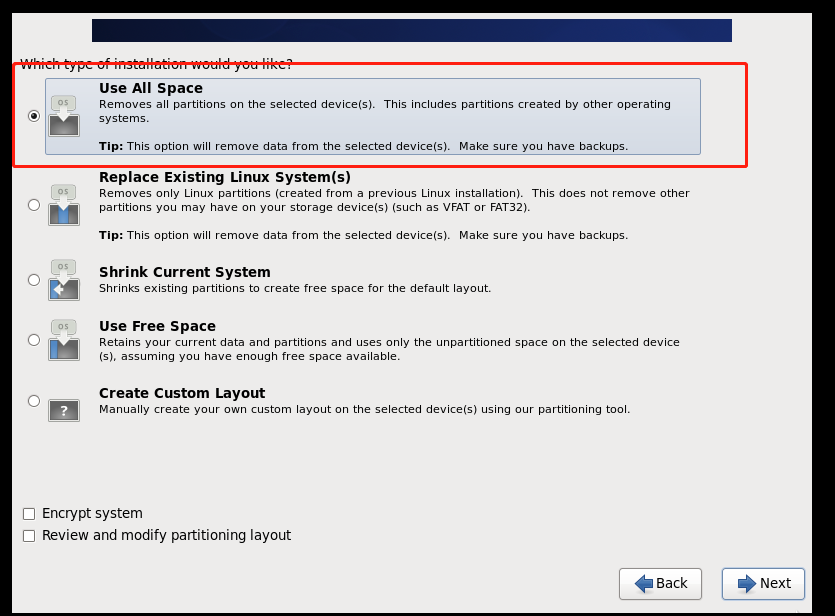
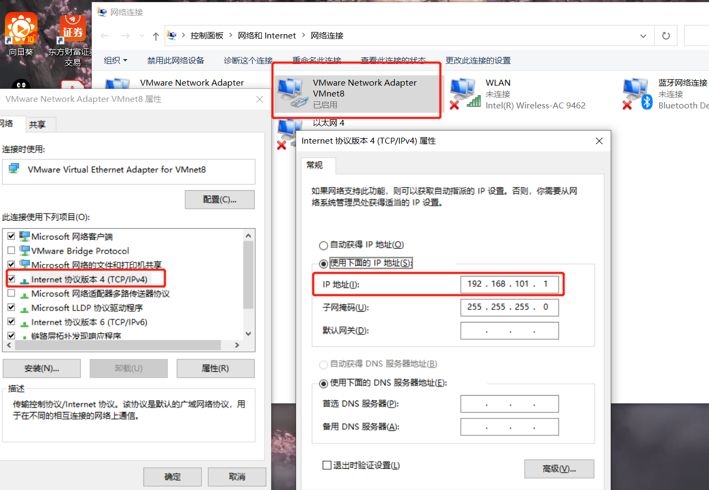
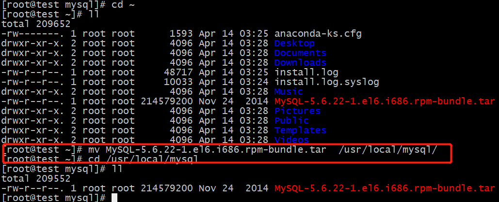
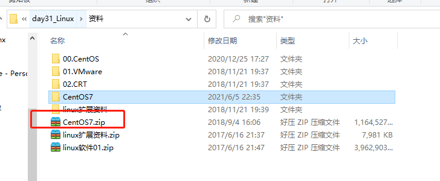
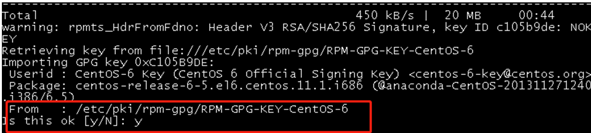

# 														Linux

 [CentOS6详细安装文档.pdf](..\..\..\pdf文件地址\CentOS6详细安装文档.pdf)   (第22步骤少了下图)    (登录使用root用户)



 [虚拟软件vmware安装.pdf](..\..\..\pdf文件地址\虚拟软件vmware安装.pdf) 

## 0. 重点配置

### 0.1 连接配置

#### 0.1.1  本机配置(控制面板)



#### 0.1.2  虚拟机配置


## 0.2 中文乱码


##  1.查看ip

```
ifconfig   linux系统
ipconfig   window系统
```

##  2.Linux的目录结构


| 目录        |                                                              |
| :---------- | :----------------------------------------------------------- |
| /bin        | 存放二进制可执行文件(ls,cat,mkdir等)，常用命令一般都在这里。 |
| /etc        | 存放系统管理和配置文件                                       |
| /home       | 存放所有用户文件的根目录，是用户主目录的基点，比如用户user的主目录就是/home/user，可以用~user表示 |
| /usr        | 用于存放系统应用程序，比较重要的目录/usr/local 本地系统管理员软件安装目录（安装系统级的应用）。这是最庞大的目录，要用到的应用程序和文件几乎都在这个目录/usr/x11r6 存放x window的目录<br/>/usr/bin 众多的应用程序  <br/>/usr/sbin 	超级用户的一些管理程序  <br/>/usr/doc linux文档  <br/>/usr/include linux下开发和编译应用程序所需要的头文件  <br/>/usr/lib 常用的动态链接库和软件包的配置文件  <br/>/usr/man 帮助文档  <br/>/usr/src 源代码，linux内核的源代码就放在/usr/src/linux里  <br/>/usr/local/bin 本地增加的命令  <br/>/usr/local/lib 本地增加的库 |
| /opt        | 额外安装的可选应用程序包所放置的位置。一般情况下，我们可以把tomcat等都安装到这里。 |
| /proc       | 虚拟文件系统目录，是系统内存的映射。可直接访问这个目录来获取系统信息。 |
| /root       | 超级用户（系统管理员）的主目录（特权阶级^o^）                |
| /sbin       | 存放二进制可执行文件，只有root才能访问。这里存放的是系统管理员使用的系统级别的管理命令和程序。如ifconfig等。 |
| /dev        | 用于存放设备文件。                                           |
| /mnt        | 系统管理员安装临时文件系统的安装点，系统提供这个目录是让用户临时挂载其他的文件系统。 |
| /boot       | 存放用于系统引导时使用的各种文件                             |
| /lib        | 存放跟文件系统中的程序运行所需要的共享库及内核模块。共享库又叫动态链接共享库，作用类似windows里的.dll文件，存放了根文件系统程序运行所需的共享文件。 |
| /tmp        | 用于存放各种临时文件，是公用的临时文件存储点。               |
| /var        | 用于存放运行时需要改变数据的文件，也是某些大文件的溢出区，比方说各种服务的日志文件（系统启动日志等。）等。 |
| /lost+found | 这个目录平时是空的，系统非正常关机而留下“无家可归”的文件（windows下叫什么.chk）就在这里 |

##  3.Linux的常用命令

用scrt 连接linux  修改字符编码


### 3.1切换目录命令cd

```
cd app(文件夹名称)	切换到app目录
cd ..	  切换到上一层目录
cd /	  切换到系统根目录
cd ~      进入用户主目录 
cd -      返回进入此目录之前所在目录 
cd ..     返回上一级目录 
cd ../..  返回上两级目录 
cd !$    把上个命令的参数作为cd 参数使用 
cd .      当前目录

```

### 3.2 列出文件列表: ls ll 

```
ll    垂直排序  
ls    横向排序
ls -a  显示所有文件或目录（包含隐藏的文件）
```

### 3.3 创建目录和移除目录: mkdir rmdir

```
mkdir app   在当前目录下创建app目录
mkdir –p app2/test   级联创建aap2以及test目录
rmdir app   删除app目录(空的目录)
```

### 3.4  浏览文件:  cat、more、less  tail

```
* cat yum.conf  
* more yum.conf 空格显示下一页数据  回车显示下一行的数据 
* less yum.conf 
按 q 键退出查看
```

```
tail 它的功能是：用于显示文件后几行的内容
（1）实时查看日志文件       	    tail -f 日志文件名
（2）只查看日志文件后100行  	   tail -f -n 100 日志文件名
（3）只查看日志文件后100行  	   tail -100 日志文件名 (同上也可以)
（4）搜寻字符串				 grep '搜寻字符串' 日志文件名
按ctrl+c 退出
```

### 3.5 文件操作   

#### 3.5.1  【rm】  删除文件

```
(1) rm a.txt   			删除a.txt文件  删除需要用户确认，y/n 
(2) rm -f a.txt   		删除不询问
(3) 直接删除rm 删除目录
rm -r 文件夹名称       	递归删除不询问递归删除（慎用）
rm -rf  文件夹名称    	不询问递归删除
rm -rf *     			删除所有文件
rm -rf /*     			自杀
```

#### 3.5.2  【cp、mv】 

```
cp(copy)命令可以将文件从一处复制到另一处。一般在使用cp命令时将一个文件复制成另一个文件或复制到某目录时，需要指定源文件名与目标文件名或目录。
cp a.txt b.txt    	将a.txt复制为b.txt文件
cp a.txt ../    	将a.txt文件复制到上一层目录中
```

```
mv 移动或者重命名
mv a.txt ../    	将a.txt文件移动到上一层目录中
mv a.txt b.txt   	将a.txt文件重命名为b.txt
```

#### 3.5.3  【tar】命令:(***** 打包或解压)     

```
重点 - 切换成英文输入,否则出错
tar命令位于/bin目录下，它能够将用户所指定的文件或目录打包成一个文件，但不做压缩。一般Linux上常用的压缩方式是选用tar将许多文件打包成一个文件，再以gzip压缩命令压缩成xxx.tar.gz(或称为xxx.tgz)的文件。
常用参数：
-c：创建一个新tar文件
-v：显示运行过程的信息
-f：指定文件名
-z：调用gzip压缩命令进行压缩 (压缩成xxx.tar.gz(或称为xxx.tgz)的文件)     
-t：查看压缩文件的内容
-x：解开tar文件

打包该文件夹下所有文件：  
tar –cvf xxx.tar 文件夹名/      打包该文件夹下的文件
tar –cvf xxx.tar ./*		   打包当前文件夹下所有文件
打包并且压缩：
tar –zcvf xxx.tar 文件夹名/      打包该文件夹下的文件并压缩
tar –zcvf xxx.tar.gz ./*		打包当前文件夹下所有文件并压缩
解压:
tar –xvf xxx.tar
tar -zxvf xxx.tar.gz -C /usr/aaa        -C 指定解压的目录
```

#### 3.5.4 【find】命令(找文件)

```
find指令用于查找符合条件的文件
示例：
find / -name ins* 查找文件名称是以ins开头的文件
find / -name ins* –ls 
find / –user itcast –ls 查找用户itcast的文件
find / –user itcast –type d –ls 查找用户itcast的目录
find /-perm -777 –type d-ls 查找权限是777的文件
```

#### 3.5.5 【grep】命令(找文件里面的)

```
查找文件里符合条件的字符串。
用法: grep [选项]... PATTERN [FILE]...示例：
grep lang anaconda-ks.cfg  在文件anaconda-ks.cfg中查找lang
grep lang anaconda-ks.cfg --color 高亮显示
grep lang anaconda-ks.cfg --color -A1 -B1 高亮显示加上前一行 后一行
```

#### 3.5.6    其他常用命令

```
【pwd】 				显示当前所在目录
【touch】 touch a.txt  创建一个空文件
【clear/ crtl + L】    清屏
```

##  4.Vi和Vim编辑器

### 4.1 Vim编辑器：

在Linux下一般使用vi编辑器来编辑文件。vi既可以查看文件也可以编辑文件。三种模式：命令行、插入、底行模式。

```
切换到命令行模式：按Esc键；
切换到插入模式：按 i 、o、a键；
i 在当前位置前插入
I 在当前行首插入
a 在当前位置后插入
A 在当前行尾插入
o 在当前行之后插入一行
O 在当前行之前插入一行
```

```
打开文件：vim file 
退出：esc→ :q  （冒号不要忘记）
修改文件：输入i进入插入模式
保存并退出：esc→ :wq
不保存退出：esc→ :q!
:/搜索内容  可以快速搜索
```

```
快捷键：
dd – 快速删除一行
yy - 复制当前行
nyy - 从当前行向后复制几行
p - 粘贴
R – 替换
```

### 4.2 重定向输出>和>>

```
>  重定向输出，覆盖原有内容；>> 重定向输出，又追加功能；示例：
cat /etc/passwd > a.txt  将输出定向到a.txt中
cat /etc/passwd >> a.txt  输出并且追加
ifconfig > ifconfig.txt
```

### 4.3 系统管理命令  ps –ef  kill

```
ps 正在运行的某个进程的状态
ps –ef  查看所有进程
ps –ef | grep java 查找包含java的进程
kill 2868  杀掉2868编号的进程
kill -9 2868  强制杀死进程
```

### 4.4  管道 |   例如:ps –ef | grep java

```
管道是Linux命令中重要的一个概念，其作用是将一个命令的输出用作另一个命令的输入。示例
ls --help | more  分页查询帮助信息
ps –ef | grep java  查询名称中包含java的进程

ifconfig | more
cat index.html | more
ps –ef | grep aio
```

## 5. Linux上常用网络操作

### 5.1  主机名配置

```
hostname 查看主机名
hostname xxx 修改主机名 重启后无效
如果想要永久生效，可以修改/etc/sysconfig/network文件
```

###  5.2  IP地址配置

```
ifconfig 查看(修改)ip地址(重启后无效)
ifconfig eth0 192.168.12.22 修改ip地址

如果想要永久生效
修改 /etc/sysconfig/network-scripts/ifcfg-eth0 文件  (以下面的图片为准)

DEVICE=eth0 #网卡名称
BOOTPROTO=dhcp #获取ip的方式(static/dhcp/bootp/none)
HWADDR=00:0C:29:B5:B2:69 #MAC地址
IPADDR=192.168.177.129 #IP地址
NETMASK=255.255.255.0 #子网掩码
NETWORK=192.168.177.0 #网络地址
BROADCAST=192.168.0.255 #广播地址
NBOOT=yes #  系统启动时是否设置此网络接口，设置为yes时，系统启动时激活此设备。
```

#### 5.2.1 静态ip(static)

重启ip地址也不会改变,静态ip访问不了网络


没有立马生效 就重启网卡


#### 5.2.2  动态ip (dhcp)


###  5.3 域名映射

#### 5.3.1  自动域名解析

```
DEVICE=eth0 #网卡名称
BOOTPROTO=dhcp #获取ip的方式(static/dhcp/bootp/none)
HWADDR=00:0C:29:B5:B2:69 #MAC地址
IPADDR=192.168.177.129 #IP地址
NETMASK=255.255.255.0 #子网掩码
NETWORK=192.168.177.0 #网络地址
BROADCAST=192.168.0.255 #广播地址
NBOOT=yes #  系统启动时是否设置此网络接口，设置为yes时，系统启动时激活此设备。

# 配置下面一行 就可以自动域名解析
DNS=114.114.114.114  或者  DNS=8.8.8.8
```

#### 5.3.2  hosts 文件配置

```
/etc/hosts 文件用于在通过主机名进行访问时做ip地址解析之用,配置ip对应域名
相当于windows系统的C:\Windows\System32\drivers\etc\hosts文件的功能
```


### 5.4   网络服务管理

```
service network status 查看指定服务的状态
service network stop 停止指定服务
service network start 启动指定服务
service network restart 重启指定服务

service --status–all 查看系统中所有后台服务
netstat –nltp 查看系统中网络进程的端口监听情况

防火墙设置
防火墙根据配置文件/etc/sysconfig/iptables来控制本机的”出”、”入”网络访问行为。
service iptables status 查看防火墙状态
service iptables stop 关闭防火墙
service iptables start 启动防火墙
chkconfig  iptables off 禁止防火墙自启
```

### 5.5 桥接


## 6. Linux的权限命令

### 6.1  文件权限


一共10位，分为4部分，第一部分位代表文件类型，第二部分代表当前用户具有的该文件的权限

第三部分代表当前组内其他用户具有的权限，第四部分代表其他组的用户具有的权限


```
r:对文件是指可读取内容 对目录是可以ls
w:对文件是指可修改文件内容，对目录 是指可以在其中创建或删除子节点(目录或文件)
x:对文件是指是否可以运行这个文件，对目录是指是否可以cd进入这个目录
```

### 6.2  Linux三种文件类型：

```
普通文件： 包括文本文件、数据文件、可执行的二进制程序文件等。 
目录文件： Linux系统把目录看成是一种特殊的文件，利用它构成文件系统的树型结构。  
设备文件： Linux系统把每一个设备都看成是一个文件
```

### 6.3  文件权限管理：

```
chmod 变更文件或目录的权限。
chmod 755 a.txt      r=4 w=2 x=1 一共是7   
7代表读写执行 6代表读写 5代表读执行 4代表执行读 3代表写执行 2代表写 1代表执行
chmod u=rwx,g=rx,o=rx a.txt
```


## 7. Linux上软件安装

### 7.1 Linux上软件安装

#### 7.1.1 Linux上的软件安装有以下4种常见方式

```
1.	二进制发布包
软件已经针对具体平台编译打包发布，只要解压，修改配置即可
2.	RPM包
软件已经按照redhat的包管理工具规范RPM进行打包发布，需要获取到相应的软件RPM发布包，然后用RPM命令进行安装
3.	Yum在线安装
软件已经以RPM规范打包，但发布在了网络上的一些服务器上，可用yum在线安装服务器上的rpm软件，并且会自动解决软件安装过程中的库依赖问题
4.	源码编译安装
软件以源码工程的形式发布，需要获取到源码工程后用相应开发工具进行编译打包部署。
```

#### 7.1.2 上传与下载工具介绍

1. FileZilla

   下载地址:   https://filezilla-project.org/

   


2. lrzsz

   我们可以使用yum安装方式安装 

   ```
   yum install lrzsz
   ```

   

   注意：必须有网络

   可以在crt中设置上传与下载目录

   

   上传：

   

   下载

   

   

3. sftp

   使用alt + p 组合键打开sftp窗口

   

   使用put 命令上传

   

   使用get命令下载

   

   

   默认下载位置在当前计算的的文档位置

   
   
   
   
   

### 7.2 在Linux上安装JDK

【步骤一】：上传JDK到Linux的服务器.

#### 7.2.1   查看Linux服务器版本

```
查看Linux服务器版本是64位还是32位,确定jdk版本选择
getconf LONG_BIT
```


#### 7.2.2  上传jdk

```
alt + p 打开sftp
put  jdk文件的位置(不能是中文路径)
```


#### 7.2.3 移动jdk位置 (使用习惯)

```
 * 通常将软件安装到/usr/local/jdk
 mv jdk-7u71-linux-i586.tar.gz  /usr/local/jdk/    最后的斜杠必须加
```


#### 7.2.4   卸载open-jdk

```
# 查看jdk版本
java –version
# 查看安装的jdk信息
rpm -qa | grep java
# 卸载jdk
rpm -e --nodeps java-1.6.0-openjdk-1.6.0.35-1.13.7.1.el6_6.i686
rpm -e --nodeps java-1.7.0-openjdk-1.7.0.79-2.5.5.4.el6.i686
```


#### 7.2.5  解压jdk包

```
* 直接解压就可以
   tar -zxvf  jdk.tar.gz  -C 目标路径  
```


#### 7.2.6 配置JDK的环境变量

```
1. vi /etc/profile
2. 在末尾行添加
	#set java environment
	JAVA_HOME=/usr/local/jdk/jdk1.7.0_71
	CLASSPATH=.:$JAVA_HOME/lib.tools.jar
	PATH=$JAVA_HOME/bin:$PATH
	export JAVA_HOME CLASSPATH PATH
	保存退出
3. source /etc/profile  使更改的配置立即生效
```

#### 7.2.7  查看安装jdk版本

```
java -version
```


### 7.3  在Linux上安装Mysql

#### 7.3.1 上传 mysql




#### 7.3.2 将系统自带的mysql卸载

```
rpm -qa | grep -i mysql   //最好使用这个
# 卸载mysql
rpm -e --nodeps mysql版本
```


#### 7.3.3 将mysql的tar解压


#### 7.3.4  安装MYSQL服务端

```
rpm -ivh mysql服务器server版本
```


下面的提示是告诉我们root用户的密码第一次是随机生成的，它保存在  /root/.mysql_secret  中，第一次登录需要修改root密码


#### 7.3.4 安装MYSQL客户端

```
rpm -ivh mysql服务器client版本
```


#### 7.3.5 查看生成的root密码

```
cat /root/.mysql_secret
```


```
mysql -uroot -p
```


报错:原因是没有启动mysql服务，需要开启mysql服务

```
service mysql start
```


执行下面操作报错，原因是第一次操作mysql必须修改root用户的密码


设置root用户的密码

```
set password = password('root');    分号不要忘
```


```
show databases; //查看数据库
exit; 退出
mysql -uroot  -proot 登录
```


#### 7.3.6  mysql远程访问设置

```
grant all privileges on *.* to 'root' @'%' identified by 'root';
flush privileges;
```


```
在linux中很多软件的端口都被”防火墙”限止，我们需要将防火墙跳过检测
防火墙打开3306端口
/sbin/iptables -I INPUT -p tcp --dport 3306 -j ACCEPT
/etc/rc.d/init.d/iptables save
/etc/init.d/iptables status
学习阶段我们也可以直接将防火墙关闭
service iptables stop;
```


这样navicat  就可以连上了 


### 7.4 在Linux上安装tomcat

#### 7.4.1 Tomcat上传到linux上


#### 7.4.2 将上传的tomcat解压

创建 /usr/local/tomcat   文件夹


移动 tomcat 到  /usr/local/tomcat


解压

```
tar -zxvf  tomcat包名称
```

#### 7.4.3 在tomcat/bin目录下执行 startup.sh（注意防火墙）


如果 linux 能访问 ， windows不能访问 

```
学习阶段我们也可以直接将防火墙关闭
service iptables stop;
```

以后可以

```
1 安装  yum
2 安装 yum install firewalld
3 在firewalld 上开放8080端口
	输入命令：
	firewall-cmd --zone=public --add-port=8080/tcp --permanent
4 重启防火墙
	输入命令：firewall-cmd --reload	
```


4.查看目标 tomcat/logs/catalina.out

### 7.5 在Linux上安装redis

#### 7.5.1 安装gcc-c++

用这个包    账号 root  密码 itcast 



```
redis是C语言开发，安装redis需要先将官网下载的源码进行编译，编译依赖gcc环境。
最好在 /usr/local 下安装
输入命令:
 yum install gcc-c++
 
 如果安装有问题,可以参考下面文章
 https://blog.csdn.net/wojiuwangla/article/details/112186395
```


输入y确认下载


输入y确认安装



安装 gcc 成功！


如果不好用 可以试试更新yum包到最新 ，过程很长

```
sudo yum update
```


#### 7.5.2 安装redis

1. 下载redis

   ```
   wget http://download.redis.io/releases/redis-3.0.4.tar.gz
   ```

2. 解压

   ```
   tar -xzvf redis-3.0.4.tar.gz
   ```

3. 编译安装、切换至程序目录，并执行make命令编译

   ```
   # 执行以下3条命令
   cd redis-3.0.4
   make   
   # 执行安装命令
   make PREFIX=/usr/local/redis install 
   
   
   make install安装完成后，会在/usr/local/bin目录下生成下面几个可执行文件，它们的作用分别是：
   redis-server：Redis服务器端启动程序
   redis-cli：Redis客户端操作工具。也可以用telnet根据其纯文本协议来操作
   make install安装完成后，会在/usr/local/bin目录下生成下面几个可执行文件，它们的作用分别是：
   redis-server：Redis服务器端启动程序
   redis-cli：Redis客户端操作工具。也可以用telnet根据其纯文本协议来操作
   ```

#### 7.5.3 配置redis

```
1.	复制配置文件到/usr/local/redis/bin目录：
cd redis-3.0.4  找到  reids.conf 
cp redis.conf /usr/local/redis/bin
```

#### 7.5.4 启动redis

```
1.	进入redis/bin目录
cd redis/bin

启动redis服务端
./redis-server redis.conf

2.	克隆新窗口，启动redis客户端
./redis-cli
```

测试启动是否成功


### 7.6 部署项目到Linux

1. 修改pom配置  在pom.xml中添加<finalName>


修改jdk版本1.7

2. 修改项目

​     2.1 druid.properties 


2.2 header.html


3.使用package命令打包


4. 将travel.war上传到tomcat中的webapps目录

5. 重启tomcat

6. 到出本地mysql数据，并导入linux中的mysql

## 8 使用EditPlus 修改服务器配置文件

1 选择ftp 上传


2 设置 然后填写信息


3.选择加密方式和端口

