<h1 align = "center">Token</h1>

# 1. Token 

## 1.1  流程图

前端登录之后，后台服务生成唯一的令牌，一份存在Redis数据库，一份返回前端存储

下次访问需要登陆权限的功能，需要携带令牌

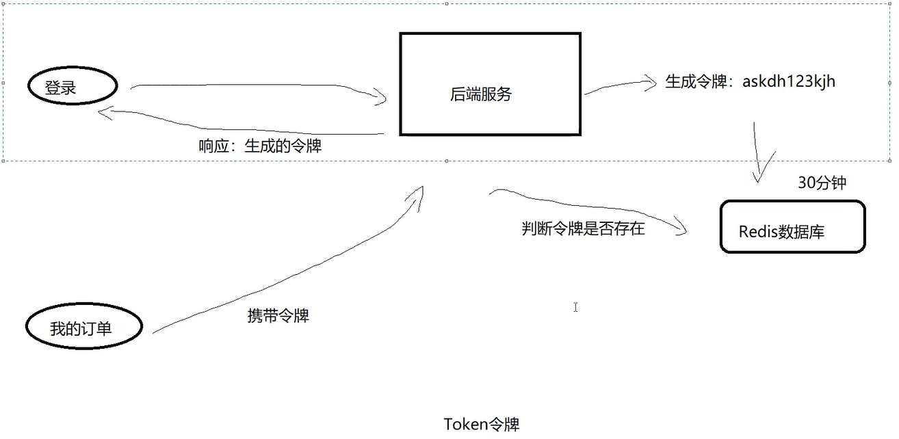

### 1.1.1 后端的逻辑处理

第一次登录存到redis , 返回到前端

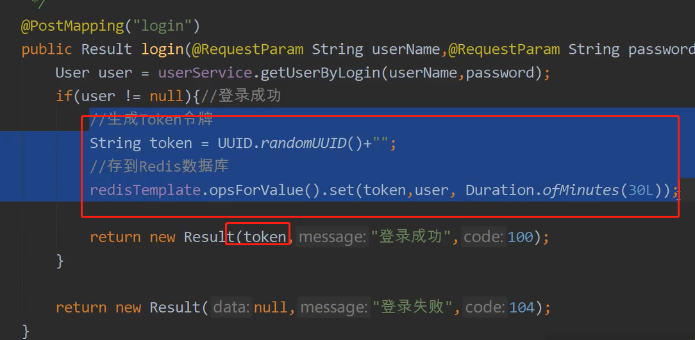

前端请求  过滤器过滤中书写

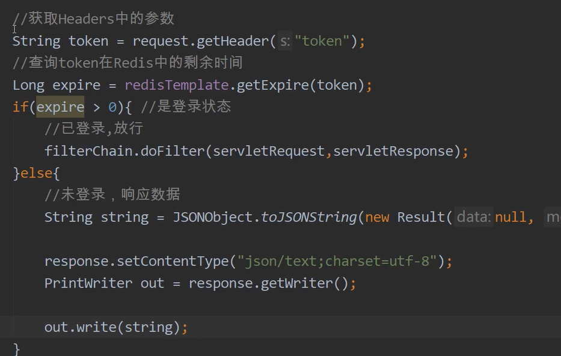

使用psotman测试  需要在请求头加上token

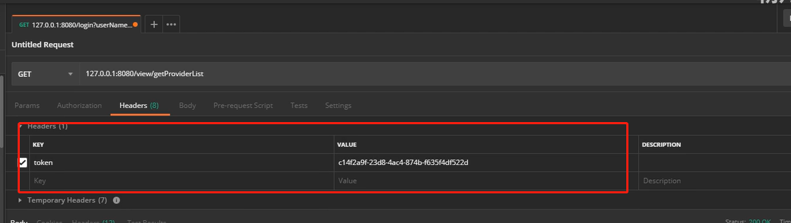

每次通过token 验证,之后刷新token的时间  ,不能让用户在使用过程中 退出登录

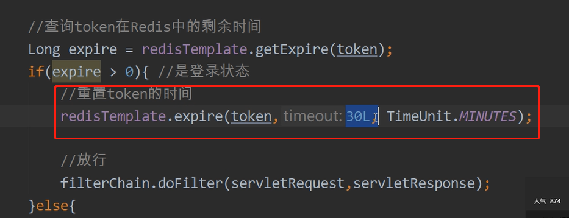

### 1.1.2  前端的逻辑处理  localstroage  

永久存储 除非删除

登录后 存储 token

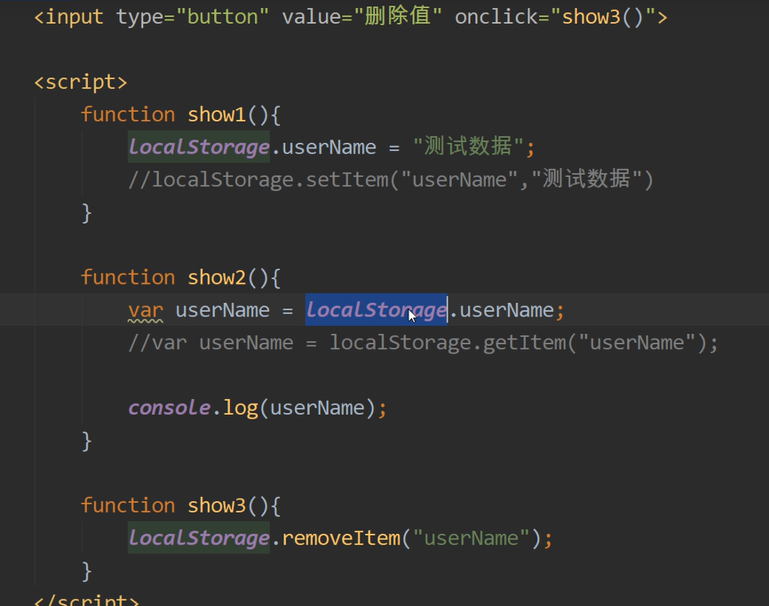

需要token的请求 封装了公共方法, 请求头 headers 携带token,使用时自带token

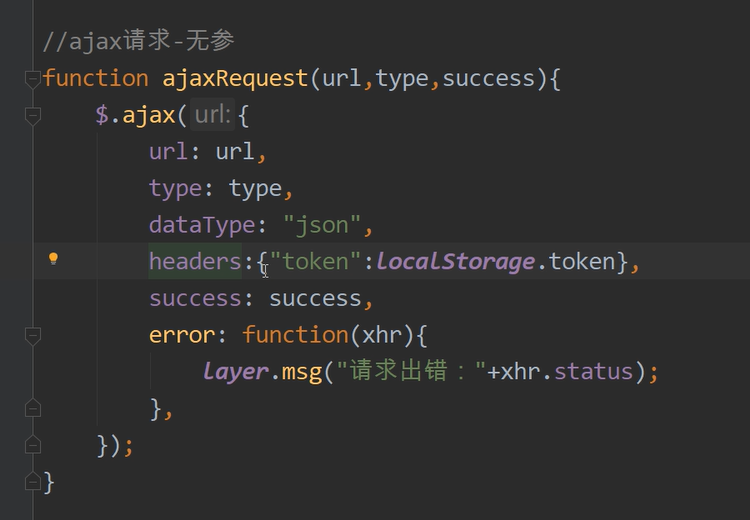

报错的话可以看看过滤器  允许跨域的请求 加上token

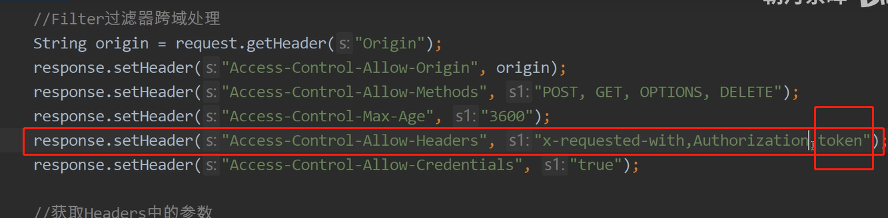

### 1.1.3  退出登录  删除redis 中的token

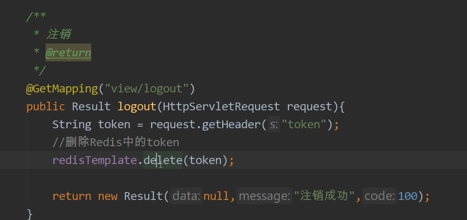

测试注销功能

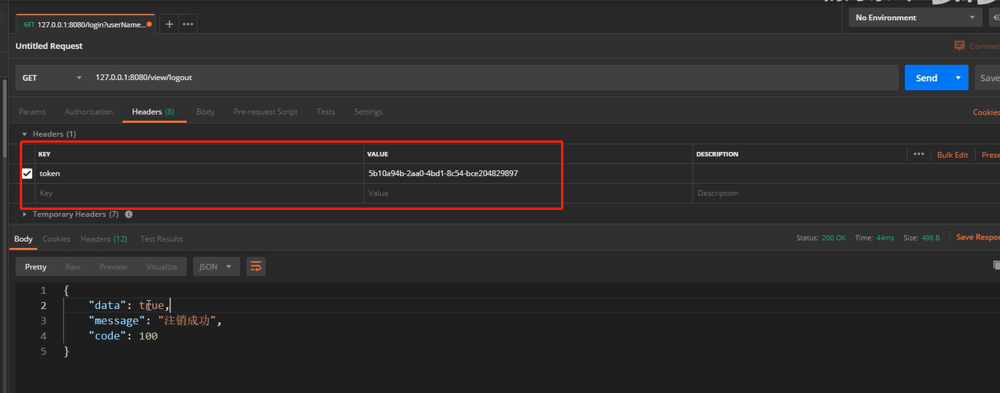

### 1.1.4  删除 前端 localstroage  的 token

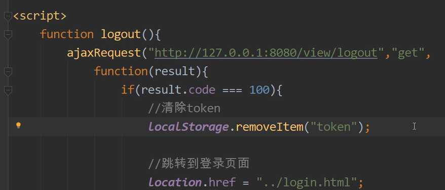

## 1.2  商城案例

前端用户登陆 传递手机号和验证码

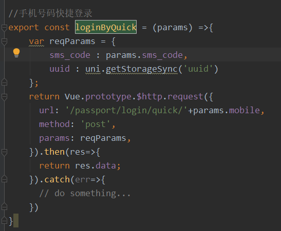

调用后台的方法 最终生成token 存入缓存

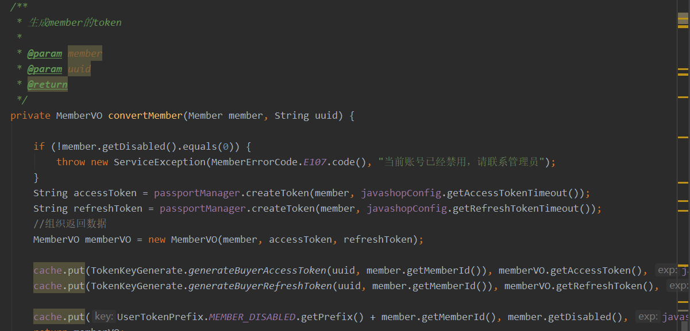

将携带token 的会员信息返回前端

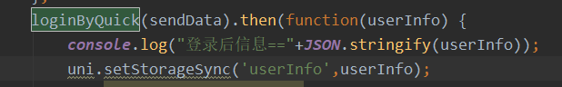

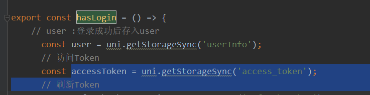

需要使用时候判断

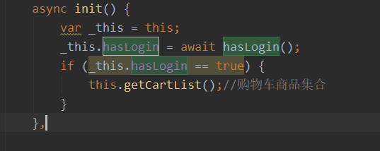