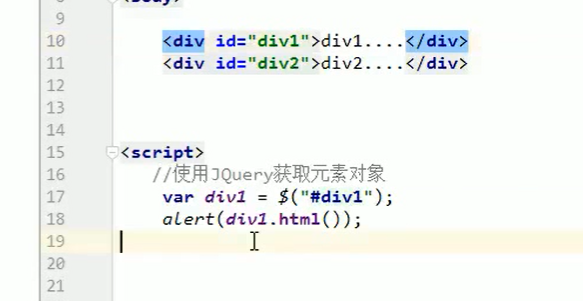
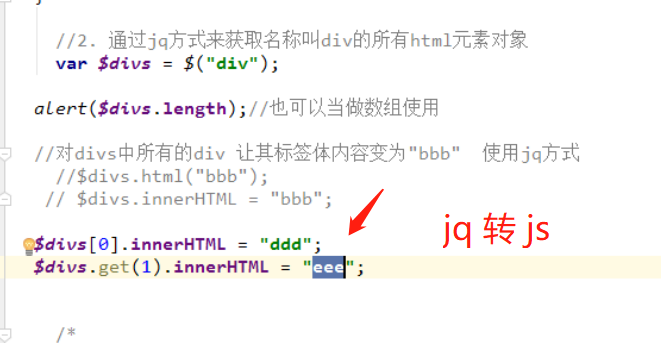
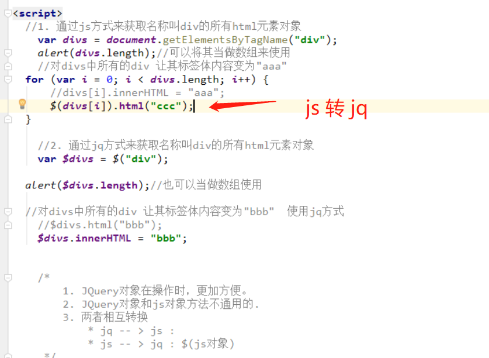

<h1 align = "center">JQuery 基础</h1>

# 1. JQuery 基础

## 1.1  概念和下载地址

==下载地址== https://jquery.com/

==历史版本==  https://releases.jquery.com/

```
1. 概念： 一个JavaScript框架。简化JS开发
	* jQuery是一个快速、简洁的JavaScript框架，是继Prototype之后又一个优秀的JavaScript代码库（或JavaScript框架）。jQuery设计的宗旨	是“write Less，Do More”，即倡导写更少的代码，做更多的事情。它封装JavaScript常用的功能代码，提供一种简便的JavaScript设计模式，优	化HTML文档操作、事件处理、动画设计和Ajax交互。
	
	* JavaScript框架：本质上就是一些js文件，封装了js的原生代码而已
```

## 1.2  快速入门

```
2. 快速入门
	1. 步骤：
		1. 下载JQuery
			* 目前jQuery有三个大版本：
				1.x：兼容ie678,使用最为广泛的，官方只做BUG维护，
					 功能不再新增。因此一般项目来说，使用1.x版本就可以了，
					 最终版本：1.12.4 (2016年5月20日)
				2.x：不兼容ie678，很少有人使用，官方只做BUG维护，
					 功能不再新增。如果不考虑兼容低版本的浏览器可以使用2.x，
					 最终版本：2.2.4 (2016年5月20日)
				3.x：不兼容ie678，只支持最新的浏览器。除非特殊要求，
					 一般不会使用3.x版本的，很多老的jQuery插件不支持这个版本。
					 目前该版本是官方主要更新维护的版本。最新版本：3.2.1（2017年3月20日）
			* jquery-xxx.js 与 jquery-xxx.min.js区别：
				1. jquery-xxx.js：开发版本。给程序员看的，有良好的缩进和注释。体积大一些
				2. jquery-xxx.min.js：生产版本。程序中使用，没有缩进。体积小一些。程序加载更快

		2. 导入JQuery的js文件：导入min.js文件
		3. 使用
			var div1 = $("#div1");
			alert(div1.html());
			
			* jquery 用 html() 获取元素内容  js 用 innerHtml() 获取内容
```



## 1.3  JQuery对象和JS对象区别与转换

```
3. JQuery对象和JS对象区别与转换
	1. JQuery对象在操作时，更加方便。
    2. JQuery对象和js对象方法不通用的.
    3. 两者相互转换
        * jq -- > js : jq对象[索引] 或者 jq对象.get(索引)
        * js -- > jq : $(js对象)
```





## 1.4  选择器 

```
选择器：筛选具有相似特征的元素(标签)
```

### 1.4.1  基本操作学习

```
1. 基本操作学习：
		1. 事件绑定
			//1.获取b1按钮
            $("#b1").click(function(){
                alert("abc");
            });
		2. 入口函数
			 $(function () {
	           
   			 });
			 window.onload  和 $(function) 区别
                 * window.onload 只能定义一次,如果定义多次，后边的会将前边的覆盖掉
                 * $(function)可以定义多次的。
		3. 样式控制：css方法
			 // $("#div1").css("background-color","red");
      		$("#div1").css("backgroundColor","pink");  //单个属性
      		$("#div1").css({"height":"200px","width" : "200px", "background-color":"yellow"}) //多个属性
```

### 1.4.2  选择器分类

#### 1.4.2.1  基本选择器

```
1. 基本选择器
			1. 标签选择器（元素选择器）
				* 语法： $("html标签名") 获得所有匹配标签名称的元素
			2. id选择器 
				* 语法： $("#id的属性值") 获得与指定id属性值匹配的元素
			3. 类选择器
				* 语法： $(".class的属性值") 获得与指定的class属性值匹配的元素
			4. 并集选择器：
				* 语法： $("选择器1,选择器2....") 获取多个选择器选中的所有元素
```

案列

```javascript
<!DOCTYPE HTML PUBLIC "-//W3C//DTD HTML 4.01 Transitional//EN">
<html>
  <head>
    <title>基本选择器</title>
    <meta http-equiv="content-type" content="text/html; charset=UTF-8">
	<script  src="../js/jquery-3.3.1.min.js"></script>
	<style type="text/css">
		 	div,span{
			    width: 180px;
			    height: 180px;
			    margin: 20px;
			    background: #9999CC;
			    border: #000 1px solid;
				float:left;
			    font-size: 17px;
			    font-family:Roman;
			}
			
			div .mini{
			    width: 50px;
			    height: 50px;
			    background: #CC66FF;
			    border: #000 1px solid;
			    font-size: 12px;
			    font-family:Roman;
			}
			
			div .mini01{
			    width: 50px;
			    height: 50px;
			    background: #CC66FF;
			    border: #000 1px solid;
			    font-size: 12px;
			    font-family:Roman;
			}
			
			
			
	 </style>
	<script type="text/javascript">
		$(function () {
            // <input type="button" value="改变 id 为 one 的元素的背景色为 红色"  id="b1"/>
			$("#b1").click(function () {
				$("#one").css("backgroundColor","pink");
            });

            // <input type="button" value=" 改变元素名为 <div> 的所有元素的背景色为 红色"  id="b2"/>
            $("#b2").click(function () {
                $("div").css("backgroundColor","pink");
            });

            // <input type="button" value=" 改变 class 为 mini 的所有元素的背景色为 红色"  id="b3"/>
            $("#b3").click(function () {
                $(".mini").css("backgroundColor","pink");
            });
            // <input type="button" value=" 改变所有的<span>元素和 id 为 two 的元素的背景色为红色"  id="b4"/>
            $("#b4").click(function () {
                $("span,#two").css("backgroundColor","pink");
            });
        });

	</script>
   
	</head>
	 
	<body>
				
		 <input type="button" value="保存"  class="mini" name="ok"  class="mini" />
		 <input type="button" value="改变 id 为 one 的元素的背景色为 红色"  id="b1"/>
		 <input type="button" value=" 改变元素名为 <div> 的所有元素的背景色为 红色"  id="b2"/>
		 <input type="button" value=" 改变 class 为 mini 的所有元素的背景色为 红色"  id="b3"/>
		 <input type="button" value=" 改变所有的<span>元素和 id 为 two 的元素的背景色为红色"  id="b4"/>
		
 
		 <h1>有一种奇迹叫坚持</h1>
		 <h2>自信源于努力</h2>
		 
	   <div id="one">
	    	 id为one       
		 </div>
		
		 <div id="two" class="mini" >
	    	   id为two   class是 mini 
		       <div  class="mini" >class是 mini</div>
		 </div>
		
		 <div class="one" >
		 	    class是 one 
		       <div  class="mini" >class是 mini</div>
			   <div  class="mini" >class是 mini</div>
		 </div>
		 <div class="one" >
		 	  class是 one 
		       <div  class="mini01" >class是 mini01</div>
			   <div  class="mini" >class是 mini</div>
		</div>
		

		<span class="spanone">class为spanone的span元素</span>
		<span class="mini">class为mini的span元素</span>
		

		<input type="text" value="zhang" id="username" name="username">
	
	</body>
	
	
	
</html>
```


#### 1.4.2.2  层级选择器

```
2. 层级选择器
			1. 后代选择器
				* 语法： $("A B ") 选择A元素内部的所有B元素 (包含孙子辈的子元素)		
			2. 子选择器
				* 语法： $("A > B") 选择A元素内部的所有B子元素
```

案列 

```javascript
<!DOCTYPE HTML PUBLIC "-//W3C//DTD HTML 4.01 Transitional//EN">
<html>
  <head>
    <title>层次选择器</title>
    <meta http-equiv="content-type" content="text/html; charset=UTF-8">
	<script  src="../js/jquery-3.3.1.min.js"></script>
	<style type="text/css">
		 	div,span{
			    width: 180px;
			    height: 180px;
			    margin: 20px;
			    background: #9999CC;
			    border: #000 1px solid;
				float:left;
			    font-size: 17px;
			    font-family:Roman;
			}
			
			div .mini{
			    width: 50px;
			    height: 50px;
			    background: #CC66FF;
			    border: #000 1px solid;
			    font-size: 12px;
			    font-family:Roman;
			}
			
			div .mini01{
			    width: 50px;
			    height: 50px;
			    background: #CC66FF;
			    border: #000 1px solid;
			    font-size: 12px;
			    font-family:Roman;
			}
			
	 </style>
    <script type="text/javascript">
		$(function () {
            // <input type="button" value=" 改变 <body> 内所有 <div> 的背景色为红色"  id="b1"/>
			$("#b1").click(function () {
				$("body div").css("backgroundColor","pink");
            });
            // <input type="button" value=" 改变 <body> 内子 <div> 的背景色为 红色"  id="b2"/>
            $("#b2").click(function () {
                $("body > div").css("backgroundColor","pink");
            });

        });

	</script>
   
	</head>
	 
	<body>
				
		 <input type="button" value="保存"  class="mini" name="ok"  class="mini" />
		 <input type="button" value=" 改变 <body> 内所有 <div> 的背景色为红色"  id="b1"/>
		 <input type="button" value=" 改变 <body> 内子 <div> 的背景色为 红色"  id="b2"/>
		
 
		 <h1>有一种奇迹叫坚持</h1>
		 <h2>自信源于努力</h2>
		 
	     <div id="one">
	    	 id为one  
		     
		 </div>
		
		 <div id="two" class="mini" >
	    	   id为two   class是 mini 
		       <div  class="mini" >class是 mini</div>
		</div>
		
		 <div class="one" >
		 	    class是 one 
		       <div  class="mini" >class是 mini</div>
			   <div  class="mini" >class是 mini</div>
		 </div>
		 <div class="one">
		 	  class是 one 
		       <div  class="mini01" >class是 mini01</div>
			   <div  class="mini" >class是 mini</div>
		</div>
		
		
		<span class="spanone">    span
		</span>
		
	</body>
	
	
</html>
```


#### 1.4.2.3  属性选择器

```
3. 属性选择器
			1. 属性名称选择器 
				* 语法： $("A[属性名]") 包含指定属性的选择器
			2. 属性选择器
				* 语法： $("A[属性名='值']") 包含指定属性等于指定值的选择器
			3. 复合属性选择器
				* 语法： $("A[属性名='值'][]...") 包含多个属性条件的选择器
```

案列

```
<!DOCTYPE HTML PUBLIC "-//W3C//DTD HTML 4.01 Transitional//EN">
<html>
  <head>
    <title>属性过滤选择器</title>
    <meta http-equiv="content-type" content="text/html; charset=UTF-8">
	<script  src="../js/jquery-3.3.1.min.js"></script>
	<style type="text/css">
		 	div,span{
			    width: 180px;
			    height: 180px;
			    margin: 20px;
			    background: #9999CC;
			    border: #000 1px solid;
				float:left;
			    font-size: 17px;
			    font-family:Roman;
			}
			
			div .mini{
			    width: 50px;
			    height: 50px;
			    background: #CC66FF;
			    border: #000 1px solid;
			    font-size: 12px;
			    font-family:Roman;
			}
			
			div .mini01{
			    width: 50px;
			    height: 50px;
			    background: #CC66FF;
			    border: #000 1px solid;
			    font-size: 12px;
			    font-family:Roman;
			}
			
			
			div.visible{
				display:none;
			}
	 </style>
	 <script type="text/javascript">
		$(function () {
			// <input type="button" value=" 含有属性title 的div元素背景色为红色"  id="b1"/>
			$("#b1").click(function () {
				$("div[title]").css("backgroundColor","pink");
            });
			// <input type="button" value=" 属性title值等于test的div元素背景色为红色"  id="b2"/>
            $("#b2").click(function () {
                $("div[title='test']").css("backgroundColor","pink");
            });
			// <input type="button" value=" 属性title值不等于test的div元素(没有属性title的也将被选中)背景色为红色"  id="b3"/>
            $("#b3").click(function () {
                $("div[title!='test']").css("backgroundColor","pink");
            });
			// <input type="button" value=" 属性title值 以te开始 的div元素背景色为红色"  id="b4"/>
            $("#b4").click(function () {
                $("div[title^='te']").css("backgroundColor","pink");
            });
			// <input type="button" value=" 属性title值 以est结束 的div元素背景色为红色"  id="b5"/>
            $("#b5").click(function () {
                $("div[title$='est']").css("backgroundColor","pink");
            });
			// <input type="button" value="属性title值 含有es的div元素背景色为红色"  id="b6"/>
            $("#b6").click(function () {
                $("div[title*='es']").css("backgroundColor","pink");
            });
			// <input type="button" value="选取有属性id的div元素，然后在结果中选取属性title值含有“es”的 div 元素背景色为红色"  id="b7"/>
            $("#b7").click(function () {
                $("div[id][title*='es']").css("backgroundColor","pink");
            });

        });
		
		
	</script>
   
	 
	</head>
	 
	<body>
				
		 <input type="button" value="保存"  class="mini" name="ok"  class="mini" />
		 <input type="button" value=" 含有属性title 的div元素背景色为红色"  id="b1"/>
		 <input type="button" value=" 属性title值等于test的div元素背景色为红色"  id="b2"/>
		 <input type="button" value=" 属性title值不等于test的div元素(没有属性title的也将被选中)背景色为红色"  id="b3"/>
		 <input type="button" value=" 属性title值 以te开始 的div元素背景色为红色"  id="b4"/>
		 <input type="button" value=" 属性title值 以est结束 的div元素背景色为红色"  id="b5"/>
		 <input type="button" value="属性title值 含有es的div元素背景色为红色"  id="b6"/>
		 <input type="button" value="选取有属性id的div元素，然后在结果中选取属性title值含有“es”的 div 元素背景色为红色"  id="b7"/>
		 
		 
	   <div id="one">
	    	 id为one   div  
		 </div>
		
		 <div id="two" class="mini"  title="test">
	    	   id为two   class是 mini  div  title="test"
		       <div  class="mini" >class是 mini</div>
		</div>
		
		 <div class="visible" >
		 	    class是 one 
		       <div  class="mini" >class是 mini</div>
			   <div  class="mini" >class是 mini</div>
		 </div>
		 <div class="one" title="test02">
		 	  class是 one    title="test02"
		       <div  class="mini01" >class是 mini01</div>
			   <div  class="mini" style="margin-top:0px;">class是 mini</div>
		</div>
		
		
		<div class="visible" >
		 	  这是隐藏的
		</div>
		
		<div class="one">
			
		</div>
		
		<div id="mover" >
		 	  动画
		</div>
		
		<input type="text" value="zhang" id="username" name="username">
	</body>
		 
</html>
```


#### 1.4.2.4  过滤选择器

```
4. 过滤选择器
			1. 首元素选择器 
				* 语法： :first 获得选择的元素中的第一个元素
			2. 尾元素选择器 
				* 语法： :last 获得选择的元素中的最后一个元素
			3. 非元素选择器
				* 语法： :not(selector) 不包括指定内容的元素
			4. 偶数选择器
				* 语法： :even 偶数，从 0 开始计数
			5. 奇数选择器
				* 语法： :odd 奇数，从 0 开始计数
			6. 等于索引选择器
				* 语法： :eq(index) 指定索引元素
			7. 大于索引选择器 
				* 语法： :gt(index) 大于指定索引元素
			8. 小于索引选择器 
				* 语法： :lt(index) 小于指定索引元素
			9. 标题选择器
				* 语法： :header 获得标题（h1~h6）元素，固定写法
```

案列

```
<!DOCTYPE HTML PUBLIC "-//W3C//DTD HTML 4.01 Transitional//EN">
<html>
  <head>
    <title>基本过滤选择器</title>
    <meta http-equiv="content-type" content="text/html; charset=UTF-8">
	<script  src="../js/jquery-3.3.1.min.js"></script>
	<style type="text/css">
		 	div,span{
			    width: 180px;
			    height: 180px;
			    margin: 20px;
			    background: #9999CC;
			    border: #000 1px solid;
				float:left;
			    font-size: 17px;
			    font-family:Roman;
			}
			
			div .mini{
			    width: 50px;
			    height: 50px;
			    background: #CC66FF;
			    border: #000 1px solid;
			    font-size: 12px;
			    font-family:Roman;
			}
			
			div .mini01{
			    width: 50px;
			    height: 50px;
			    background: #CC66FF;
			    border: #000 1px solid;
			    font-size: 12px;
			    font-family:Roman;
			}
	 </style>
	<script type="text/javascript">

		$(function () {
            // <input type="button" value=" 改变第一个 div 元素的背景色为 红色"  id="b1"/>
			$("#b1").click(function () {
				$("div:first").css("backgroundColor","pink");
            });
            // <input type="button" value=" 改变最后一个 div 元素的背景色为 红色"  id="b2"/>
            $("#b2").click(function () {
                $("div:last").css("backgroundColor","pink");
            });
            // <input type="button" value=" 改变class不为 one 的所有 div 元素的背景色为 红色"  id="b3"/>
            $("#b3").click(function () {
                $("div:not(.one)").css("backgroundColor","pink");
            });
            // <input type="button" value=" 改变索引值为偶数的 div 元素的背景色为 红色"  id="b4"/>
            $("#b4").click(function () {
                $("div:even").css("backgroundColor","pink");
            });


            // <input type="button" value=" 改变索引值为奇数的 div 元素的背景色为 红色"  id="b5"/>
            $("#b5").click(function () {
                $("div:odd").css("backgroundColor","pink");
            });
            // <input type="button" value=" 改变索引值为大于 3 的 div 元素的背景色为 红色"  id="b6"/>
            $("#b6").click(function () {
                $("div:gt(3)").css("backgroundColor","pink");
            });
            // <input type="button" value=" 改变索引值为等于 3 的 div 元素的背景色为 红色"  id="b7"/>
            $("#b7").click(function () {
                $("div:eq(3)").css("backgroundColor","pink");
            });
            // <input type="button" value=" 改变索引值为小于 3 的 div 元素的背景色为 红色"  id="b8"/>
            $("#b8").click(function () {
                $("div:lt(3)").css("backgroundColor","pink");
            });
            // <input type="button" value=" 改变所有的标题元素的背景色为 红色"  id="b9"/>
            $("#b9").click(function () {
                $(":header").css("backgroundColor","pink");
            });

        });


	</script>
	</head>
	 
	<body>
				
		 <input type="button" value="保存"  class="mini" name="ok"  class="mini" />
		 <input type="button" value=" 改变第一个 div 元素的背景色为 红色"  id="b1"/>
		 <input type="button" value=" 改变最后一个 div 元素的背景色为 红色"  id="b2"/>
		 <input type="button" value=" 改变class不为 one 的所有 div 元素的背景色为 红色"  id="b3"/>
		 <input type="button" value=" 改变索引值为偶数的 div 元素的背景色为 红色"  id="b4"/>
		 <input type="button" value=" 改变索引值为奇数的 div 元素的背景色为 红色"  id="b5"/>
		 <input type="button" value=" 改变索引值为大于 3 的 div 元素的背景色为 红色"  id="b6"/>
		 <input type="button" value=" 改变索引值为等于 3 的 div 元素的背景色为 红色"  id="b7"/>
		 <input type="button" value=" 改变索引值为小于 3 的 div 元素的背景色为 红色"  id="b8"/>
		 <input type="button" value=" 改变所有的标题元素的背景色为 红色"  id="b9"/>
		 
		
		 <h1>有一种奇迹叫坚持</h1>
		 <h2>自信源于努力</h2>
	     <div id="one">
	    	 id为one  
		     
		 </div>
		
		 <div id="two" class="mini" >
	    	   id为two   class是 mini 
		       <div  class="mini" >class是 mini</div>
		</div>
		
		 <div class="one" >
		 	    class是 one 
		       <div  class="mini" >class是 mini</div>
			   <div  class="mini" >class是 mini</div>
		 </div>
		 <div class="one" >
		 	  class是 one 
		       <div  class="mini01" >class是 mini01</div>
			   <div  class="mini" >class是 mini</div>
		</div>
		
		
		
	</body>
</html>
```


#### 1.4.2.5  表单过滤选择器

```
5. 表单过滤选择器
			1. 可用元素选择器 
				* 语法： :enabled 获得可用元素
			2. 不可用元素选择器 
				* 语法： :disabled 获得不可用元素
			3. 选中选择器 
				* 语法： :checked 获得单选/复选框选中的元素
			4. 选中选择器 
				* 语法： :selected 获得下拉框选中的元素
```

案列

```
<!DOCTYPE HTML PUBLIC "-//W3C//DTD HTML 4.01 Transitional//EN">
<html>
  <head>
    <title>表单属性过滤选择器</title>
    <meta http-equiv="content-type" content="text/html; charset=UTF-8">
	<script  src="../js/jquery-3.3.1.min.js"></script>
	<style type="text/css">
		 	div,span{
			    width: 180px;
			    height: 180px;
			    margin: 20px;
			    background: #9999CC;
			    border: #000 1px solid;
				float:left;
			    font-size: 17px;
			    font-family:Roman;
			}
			
			div .mini{
			    width: 50px;
			    height: 50px;
			    background: #CC66FF;
			    border: #000 1px solid;
			    font-size: 12px;
			    font-family:Roman;
			}
			
			div .mini01{
			    width: 50px;
			    height: 50px;
			    background: #CC66FF;
			    border: #000 1px solid;
			    font-size: 12px;
			    font-family:Roman;
			}
			#job{
				margin: 20px;
			}
			#edu{
				margin-top:-70px;
			}
			
	 </style>
    <script type="text/javascript">
	
		$(function () {
			// <input type="button" value=" 利用 jQuery 对象的 val() 方法改变表单内可用 <input> 元素的值"  id="b1"/>
			$("#b1").click(function () {
				$("input[type='text']:enabled").val("aaa");
            });
			// <input type="button" value=" 利用 jQuery 对象的 val() 方法改变表单内不可用 <input> 元素的值"  id="b2"/>
            $("#b2").click(function () {
                $("input[type='text']:disabled").val("aaa");
            });
			// <input type="button" value=" 利用 jQuery 对象的 length 属性获取复选框选中的个数"  id="b3"/>
            $("#b3").click(function () {
                alert($("input[type='checkbox']:checked").length);
            });
			// <input type="button" value=" 利用 jQuery 对象的 length 属性获取下拉框选中的个数"  id="b4"/>
            $("#b4").click(function () {
                alert($("#job > option:selected").length);
            });

        });
	
	
	</script>
	</head>
	 
	<body>
				
		 <input type="button" value="保存"  class="mini" name="ok"  class="mini" />
		 <input type="button" value=" 利用 jQuery 对象的 val() 方法改变表单内可用 <input> 元素的值"  id="b1"/>
		 <input type="button" value=" 利用 jQuery 对象的 val() 方法改变表单内不可用 <input> 元素的值"  id="b2"/>
		 <input type="button" value=" 利用 jQuery 对象的 length 属性获取复选框选中的个数"  id="b3"/>
		 <input type="button" value=" 利用 jQuery 对象的 length 属性获取下拉框选中的个数"  id="b4"/>
 
 		<br><br>
 		
         <input type="text" value="不可用值1" disabled="disabled"> 
		 <input type="text" value="可用值1" >
		 <input type="text" value="不可用值2" disabled="disabled">
		 <input type="text" value="可用值2" >
		 
		 <br><br>
		 <input type="checkbox" name="items" value="美容" >美容
		 <input type="checkbox" name="items" value="IT" >IT
		 <input type="checkbox" name="items" value="金融" >金融
		 <input type="checkbox" name="items" value="管理" >管理
		 
		 <br><br>
		 
		  <input type="radio" name="sex" value="男" >男
		  <input type="radio" name="sex" value="女" >女
		  
         <br><br>
		 
		  <select name="job" id="job" multiple="multiple" size=4>
          	<option>程序员</option>
			<option>中级程序员</option>
			<option>高级程序员</option>
			<option>系统分析师</option>
          </select>
		    
          <select name="edu" id="edu">
          	<option>本科</option>
			<option>博士</option>
			<option>硕士</option>
			<option>大专</option>
          </select>
	   
	  		
	  	<br/>
	  		
		 <div id="two" class="mini" >
	    	   id为two   class是 mini  div
		       <div  class="mini" >class是 mini</div>
		</div>
		
		 <div class="one" >
		 	    class是 one 
		       <div  class="mini" >class是 mini</div>
			   <div  class="mini" >class是 mini</div>
		 </div>
		 <div class="one" >
		 	  class是 one 
		       <div  class="mini01" >class是 mini01</div>
			   <div  class="mini" >class是 mini</div>
		</div>
		
	</body>
</html>
```

## 1.5  DOM操作

### 1.5.1 内容操作

```
1. 内容操作
		1. html(): 获取/设置元素的标签体内容   <a><font>内容</font></a>  --> <font>内容</font>
		2. text(): 获取/设置元素的标签体纯文本内容   <a><font>内容</font></a> --> 内容
		3. val()： 获取/设置元素的value属性值
```

### 1.5.2 属性操作

```
2. 属性操作
		1. 通用属性操作
			1. attr(): 获取/设置元素的属性
			2. removeAttr():删除属性
			3. prop():获取/设置元素的属性
			4. removeProp():删除属性

			* attr和prop区别？
				1. 如果操作的是元素的固有属性，则建议使用prop
				2. 如果操作的是元素自定义的属性，则建议使用attr
		2. 对class属性操作
			1. addClass():添加class属性值
			2. removeClass():删除class属性值
			3. toggleClass():切换class属性
				* toggleClass("one"): 
					* 判断如果元素对象上存在class="one"，则将属性值one删除掉。  如果元素对象上不存在class="one"，则添加
			4. css():
```

1. 通用属性操作 案列

```
<!DOCTYPE HTML PUBLIC "-//W3C//DTD HTML 4.01 Transitional//EN">
<html>
  <head>
    <title>获取属性</title>
    <meta http-equiv="content-type" content="text/html; charset=UTF-8">
	<script  src="../js/jquery-3.3.1.min.js"></script>
	
	
	<style type="text/css">
		 	div,span{
			    width: 140px;
			    height: 140px;
			    margin: 20px;
			    background: #9999CC;
			    border: #000 1px solid;
				float:left;
			    font-size: 17px;
			    font-family:Roman;
			}
			
			div.mini{
			    width: 30px;
			    height: 30px;
			    background: #CC66FF;
			    border: #000 1px solid;
			    font-size: 12px;
			    font-family:Roman;
			}
			
			div.visible{
				display:none;
			}
	 </style>
    
	<script type="text/javascript">
		$(function () {
            //获取北京节点的name属性值
			var name = $("#bj").attr("name");
			//alert(name);
            //设置北京节点的name属性的值为dabeijing
            $("#bj").attr("name","dabeijing");
            //新增北京节点的discription属性 属性值是didu
            $("#bj").attr("discription","didu");
            //删除北京节点的name属性并检验name属性是否存在
            $("#bj").removeAttr("name");
            //获得hobby的的选中状态
			var checked = $("#hobby").prop("checked");
			alert(checked);

            //var checked = $("#hobby").attr("checked"); //获取不到，弹出undefined

        });

		
	</script>
	
	
	</head>
	 
	<body>
				
		 <ul>
		 	 <li id="bj" name="beijing" xxx="yyy">北京</li>
			 <li id="tj" name="tianjin">天津</li>
		 </ul>
		 <input type="checkbox" id="hobby"/>
		 
		
	</body>  
</html>
```

2. 对class属性操作的案列 

```
<!DOCTYPE HTML PUBLIC "-//W3C//DTD HTML 4.01 Transitional//EN">
<html>
  <head>
    <title>样式操作</title>
    <meta http-equiv="content-type" content="text/html; charset=UTF-8">
	<script  src="../js/jquery-3.3.1.min.js"></script>
	<style type="text/css">
		   .one{
			    width: 200px;
			    height: 140px;
			    margin: 20px;
			    background: red;
			    border: #000 1px solid;
				float:left;
			    font-size: 17px;
			    font-family:Roman;
			}
		
		 	div,span{
			    width: 140px;
			    height: 140px;
			    margin: 20px;
			    background: #9999CC;
			    border: #000 1px solid;
				float:left;
			    font-size: 17px;
			    font-family:Roman;
			}
			
			div .mini{
			    width: 40px;
			    height: 40px;
			    background: #CC66FF;
			    border: #000 1px solid;
			    font-size: 12px;
			    font-family:Roman;
			}
			div .mini01{
			    width: 40px;
			    height: 40px;
			    background: #CC66FF;
			    border: #000 1px solid;
			    font-size: 12px;
			    font-family:Roman;
			}
			
			/*待用的样式*/
			.second{
				width: 300px;
			    height: 340px;
			    margin: 20px;
			    background: yellow;
			    border: pink 3px dotted;
				float:left;
			    font-size: 22px;
			    font-family:Roman;
			}
			
			
	 </style>
    <script type="text/javascript">

		$(function () {
            //<input type="button" value="采用属性增加样式(改变id=one的样式)"  id="b1"/>
			$("#b1").click(function () {
				$("#one").prop("class","second");
            });
            //<input type="button" value=" addClass"  id="b2"/>
            $("#b2").click(function () {
                $("#one").addClass("second");
            });
            //<input type="button" value="removeClass"  id="b3"/>
            $("#b3").click(function () {
                $("#one").removeClass("second");
            });
            //<input type="button" value=" 切换样式"  id="b4"/>
            $("#b4").click(function () {
                $("#one").toggleClass("second");
            });
            //<input type="button" value=" 通过css()获得id为one背景颜色"  id="b5"/>
            $("#b5").click(function () {
                var backgroundColor = $("#one").css("backgroundColor");
                alert(backgroundColor);

            });
            //<input type="button" value=" 通过css()设置id为one背景颜色为绿色"  id="b6"/>
            $("#b6").click(function () {
                 $("#one").css("backgroundColor","green");

            });

        });

		 
		 
	
	</script>
   
	</head>
	 
	<body>
				
		 <input type="button" value="保存"  class="mini" name="ok"  class="mini" />
		 <input type="button" value="采用属性增加样式(改变id=one的样式)"  id="b1"/>
		 <input type="button" value=" addClass"  id="b2"/>
		 <input type="button" value="removeClass"  id="b3"/>
		 <input type="button" value=" 切换样式"  id="b4"/>
		 <input type="button" value=" 通过css()获得id为one背景颜色"  id="b5"/>
 		 <input type="button" value=" 通过css()设置id为one背景颜色为绿色"  id="b6"/>
 
		 <h1>有一种奇迹叫坚持</h1>
		 <h2>自信源于努力</h2>
		 
	     <div id="one">
	    	 id为one 
		 </div>
		
		 <div id="two" class="mini" >
	    	   id为two   class是 mini 
		       <div  class="mini" >class是 mini</div>
		</div>
		
		 <div class="one" >
		 	    class是 one 
		       <div  class="mini" >class是 mini</div>
			   <div  class="mini" >class是 mini</div>
		 </div>
		 
		 <div class="one" >
		 	  class是 one 
		       <div  class="mini01" >class是 mini01</div>
			   <div  class="mini" >class是 mini</div>
		</div>
		
		

		<span class="spanone">    span
		</span>
		
	</body>

</html>
```


### 1.5.3  CRUD操作

```
3. CRUD操作:
		1. append():父元素将子元素追加到末尾
			* 对象1.append(对象2): 将对象2添加到对象1元素内部，并且在末尾
		2. prepend():父元素将子元素追加到开头
			* 对象1.prepend(对象2):将对象2添加到对象1元素内部，并且在开头
		3. appendTo():
			* 对象1.appendTo(对象2):将对象1添加到对象2内部，并且在末尾
		4. prependTo()：
			* 对象1.prependTo(对象2):将对象1添加到对象2内部，并且在开头
		5. after():添加元素到元素后边
			* 对象1.after(对象2)： 将对象2添加到对象1后边。对象1和对象2是兄弟关系
		6. before():添加元素到元素前边
			* 对象1.before(对象2)： 将对象2添加到对象1前边。对象1和对象2是兄弟关系
		7. insertAfter()
			* 对象1.insertAfter(对象2)：将对象2添加到对象1前边。对象1和对象2是兄弟关系
		8. insertBefore()
			* 对象1.insertBefore(对象2)： 将对象2添加到对象1后边。对象1和对象2是兄弟关系

		9. remove():移除元素
			* 对象.remove():将对象删除掉
		10. empty():清空元素的所有后代元素。
			* 对象.empty():将对象的后代元素全部清空，但是保留当前对象以及其属性节点	
	
```

案列 1

```
<!DOCTYPE HTML PUBLIC "-//W3C//DTD HTML 4.01 Transitional//EN">
<html>
  <head>
    <title>内部插入脚本</title>
    <meta http-equiv="content-type" content="text/html; charset=UTF-8">
	<script  src="../js/jquery-3.3.1.min.js"></script>
	<style type="text/css">
		 	div,span{
			    width: 140px;
			    height: 140px;
			    margin: 20px;
			    background: #9999CC;
			    border: #000 1px solid;
				float:left;
			    font-size: 17px;
			    font-family:Roman;
			}
			
			div .mini{
			    width: 30px;
			    height: 30px;
			    background: #CC66FF;
			    border: #000 1px solid;
			    font-size: 12px;
			    font-family:Roman;
			}
			
			div.visible{
				display:none;
			}
	 </style>
	 <script type="text/javascript">

		 $(function () {
             // <input type="button" value="将反恐放置到city的后面"  id="b1"/>

			 $("#b1").click(function () {
				 //append
				 //$("#city").append($("#fk"));
				 //appendTo
                 $("#fk").appendTo($("#city"));
             });
             // <input type="button" value="将反恐放置到city的最前面"  id="b2"/>
             $("#b2").click(function () {
                 //prepend
                 //$("#city").prepend($("#fk"));
                 //prependTo
                 $("#fk").prependTo($("#city"));
             });
             // <input type="button" value="将反恐插入到天津后面"  id="b3"/>
             $("#b3").click(function () {
                 //after
				 //$("#tj").after($("#fk"));
                 //insertAfter
                 $("#fk").insertAfter($("#tj"));

             });
             // <input type="button" value="将反恐插入到天津前面"  id="b4"/>
             $("#b4").click(function () {
                 //before
                 //$("#tj").before($("#fk"));
                 //insertBefore
                 $("#fk").insertBefore($("#tj"));

             });
         });


		
	</script>
	 
	 
	</head>
	 
	<body>

		<input type="button" value="将反恐放置到city的后面"  id="b1"/>
		<input type="button" value="将反恐放置到city的最前面"  id="b2"/>
		<input type="button" value="将反恐插入到天津后面"  id="b3"/>
		<input type="button" value="将反恐插入到天津前面"  id="b4"/>
		 <ul id="city">
		 	 <li id="bj" name="beijing">北京</li>
			 <li id="tj" name="tianjin">天津</li>
			 <li id="cq" name="chongqing">重庆</li>
		 </ul>
		 
		 
		  <ul id="love">
		 	 <li id="fk" name="fankong">反恐</li>
			 <li id="xj" name="xingji">星际</li>
		 </ul>
		
		<div id="foo1">Hello1</div> 
       
	</body>
	
	
   
</html>
```

案列 2 

```
<!DOCTYPE HTML PUBLIC "-//W3C//DTD HTML 4.01 Transitional//EN">
<html>
  <head>
    <title>删除节点</title>
    <meta http-equiv="content-type" content="text/html; charset=UTF-8">
	<script  src="../js/jquery-3.3.1.min.js"></script>
	<style type="text/css">
		 	div,span{
			    width: 140px;
			    height: 140px;
			    margin: 20px;
			    background: #9999CC;
			    border: #000 1px solid;
				float:left;
			    font-size: 17px;
			    font-family:Roman;
			}
			
			div.mini{
			    width: 30px;
			    height: 30px;
			    background: #CC66FF;
			    border: #000 1px solid;
			    font-size: 12px;
			    font-family:Roman;
			}
			
			div.visible{
				display:none;
			}
	 </style>
    <script type="text/javascript">
	$(function () {
        // <input type="button" value="删除<li id='bj' name='beijing'>北京</li>"  id="b1"/>
		$("#b1").click(function () {
			$("#bj").remove();
        });
        // <input type="button" value="删除city所有的li节点   清空元素中的所有后代节点(不包含属性节点)"  id="b2"/>
        $("#b2").click(function () {
            $("#city").empty();
        });
    });

	
	   
	   
	
	</script>
	</head>
	 
	<body>
	<input type="button" value="删除<li id='bj' name='beijing'>北京</li>"  id="b1"/>
	<input type="button" value="删除所有的子节点   清空元素中的所有后代节点(不包含属性节点)"  id="b2"/>

		 <ul id="city">
		 	 <li id="bj" name="beijing">北京</li>
			 <li id="tj" name="tianjin">天津</li>
			 <li id="cq" name="chongqing">重庆</li>
		 </ul>
		 <p class="hello">Hello</p> how are <p>you?</p> 
	</body>  
</html>
```

