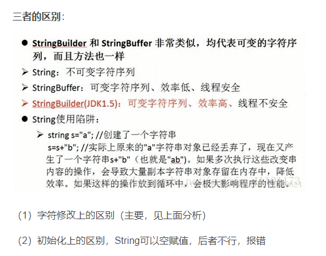

# list 遍历时怎么删除一个不报错

使用迭代器删除不会报错

```
Iterator<Integer> iterator = arrayList.iterator();
 while (iterator.hasNext()) {
     Integer integer = iterator.next();
     if (integer.intValue() == 5) {
          iterator.remove();
     }
 }
```

# string stringbuffer  stringbuilder 区别



# hashmap  hashtable 什么区别

https://blog.csdn.net/xuhuaabc/article/details/91475761


mybatis 遍历list 怎么写