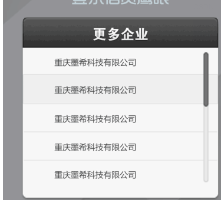

# HTML

## 1. html如何写出带有滚动条的弹出框？



```html
<html>
<head>
<meta charset="utf-8" />
<title></title>
<style>
ul{
	height: 80px;
	width: 120px;
	list-style-type: none;
	overflow:auto;
}
</style>
</head>
<body>
	<ul>
		<li>公司1</li>
		<li>公司2</li>
		<li>公司3</li>
		<li>公司4</li>
		<li>公司5</li>
		<li>公司6</li>
	</ul>
</body>
</html>
```

## 2. echarts

### 2.1 [echarts官网](https://echarts.apache.org/zh/option.html#title)

### 2.2  代码  生成图表  表格隔行换色

```
<!doctype html>
<html>

<head>
    <meta charset="utf-8">
    <title></title>
    <meta name="viewport" content="width=device-width,initial-scale=1.0,maximum-scale=1.0, user-scalable=0;">
    <link href="../../css/mui.css" rel="stylesheet" />
    <script src="https://cdn.staticfile.org/echarts/4.3.0/echarts.min.js"></script>

</head>

<body>
<header class="mui-bar mui-bar-nav">
    <h1 class="mui-title" id="title">智慧养老</h1>
</header>
<div class="mui-content">


    <div class="demo">
        <input type="text" id="dateSelectorOne" style="margin-bottom: 0;"  placeholder="请输入老人身份证号查询">
        <button type="button" onclick="searchInfo()">查询</button>
    </div>


    <!--<div class="acc-info">
        <p class="acc-info-title">减分项目</p>

    </div>-->

    <div id="main" style="width: 100%;height:350px;"></div>

    <div class="split-line"></div>

    <div class="unbound">尚未绑定的老人统计</div>
    <table id="content" style="margin-left: 36px"></table>

    <div class="prompt">注：本数据为每月1日凌晨更新数据</div>
    <div class="split-line"></div>

    <div class="unbound">老人养老服务评价统计</div>

    <table id="evaluation" style="margin-left: 36px"></table>


</div>
<style>
    body{
        background-color: #f5f5f5;
    }
    .mui-bar-nav ~ .mui-content{
        padding-top: 40px;
    }
    .acc-info,.acc-consume,.demo{
        width: 94%;
        margin: 10px 3%;
        background-color: white;
        border-radius: 6px;
        padding: 20px 20px;
    }
    .demo >button {
        width: 18%;
        background-color: #00c599;
        color: #fff;
        border: 0;
        height: 40px;
        padding: 0 15px;
        border-radius: 3px;
        font-size: 14px;
        float: right;
    }
    #dateSelectorOne{
        width: 80%;
    }
    .policy-title{
        font-size: 16px;
        color: red;
        font-weight: bold;
        text-align: center;
        padding-top: 6px;
    }
    .policy-content{
        font-size: 16px;
        font-weight: bold;
        color: #8f8f94;
    }
    .policy-content-flex{
        font-size: 16px;
        font-weight: bold;
        color: #8f8f94;
        display: flex;
        flex-direction: row;
        justify-content: space-between;
    }
    .exam-topic{
        display: flex;
        justify-content: space-between;
        font-size: 14px;
        font-weight: bold;
        color: #8f8f94;
        height: 30px;
    }
    .consulting-service{
        font-size: 14px;
        font-weight: bold;
        color: #8f8f94;
    }
    .policy-sign{
        font-size: 16px;
        font-weight: bold;
        color: red;
    }
    .mui-bar{
        box-shadow: 0 0 1px rgba(255, 245, 245, .85);
        background-color:#fafafa;
    }
    .mui-bar h1,.mui-bar a{
        color: #000000;
    }
    .mui-bar-nav ~ .mui-content{
        padding-top: 40px;
    }

    .acc-info,.acc-consume{
        width: 94%;
        margin: 10px 3%;
        background-color: white;
        border-radius: 6px;
        padding: 20px 20px;
    }

    .acc-info-title{
        color: rgb(91,215,233);
        font-size: 20px;
        font-weight: bold;
    }
    .acc-info-content {
        padding-top: 10px;
    }
    .float-right{
        float: right;
    }
    .acc-info-content p img{
        width: 20px;
        height: 20px;
        margin-right: 10px;
        position: relative;
        top: 5px;
    }
    .acc-info-content p,.acc-info-content p span{
        height: 30px;
        line-height: 30px;
        font-size: 18px;
        margin-left: 10px;
        color: #999;
    }
    .form-text{
        text-align: center;
        width: 150px;
    }
    .form-text-two{
        text-align: center;
        width: 75px;
    }
    .unbound{
        font-size: 20px;
        font-weight: bold;
        margin: 10px;
        text-align: center;
    }
    .split-line{
        border: 1px solid black;
        width: 355px;
        margin-left: 10px;
        margin-bottom: 10px;
    }
    .prompt{
        font-size: 14px;
        color: red;
        padding: 20px 20px 5px 20px;
    }
</style>
<script src="../../js/jquery-3.3.1.min.js"></script>
<script src="../../js/request.js"></script>
<script type="text/javascript">

    var areaList = [
        {name:"玄武区",point:5},
        {name:"江宁区",point:2},
        {name:"鼓楼区",point:4},
        {name:"栖霞区",point:6},
        {name:"江北新区",point:15},
        {name:"南京市",point:50}
    ];
    var evaluationList = [
                {name:"玄武区",praise:5,average:3,bad:4},
                {name:"江宁区",praise:2,average:3,bad:4},
                {name:"鼓楼区",praise:4,average:3,bad:4},
                {name:"栖霞区",praise:6,average:3,bad:4},
                {name:"江北新区",praise:15,average:3,bad:4},
                {name:"南京市",praise:50,average:3,bad:4}
                ]
    window.onload = function() {
        var html =""
        html += '<tr style="background-color: #007AFF">\n' +
            '         <td class="form-text">区域</td>\n' +
            '            <td class="form-text">得分</td>\n' +
            '        </tr>'

        for (var i = 0;i<areaList.length;i++){
            console.log("区域",areaList[i])
            html +='<tr>'+
                        '<td class="form-text">'+areaList[i].name+'</td>'+
                        '<td class="form-text" >'+areaList[i].point+'</td>'+
                    '</tr>'


        }
        $("#content").html(html)
        var content = document.getElementById('content');
        var rows = content.rows.length;
        for(var i=0;i<rows;i++) {
            if (i % 2 == 0 && i>0) {
                content.rows[i].style.backgroundColor = "#fff";
            }
            if (i % 2 == 1 && i>0) {
                content.rows[i].style.backgroundColor =  'rgb(238,238,238)';
            }
        }

        var  evaluationHtml = "";
        evaluationHtml += '<tr style="background-color: #007AFF">\n' +
            '         <td class="form-text-two">区域</td>\n' +
            '         <td class="form-text-two">好评</td>\n' +
            '         <td class="form-text-two">中评</td>\n' +
            '         <td class="form-text-two">差评</td>\n' +
            '        </tr>'

        for (var i = 0;i<evaluationList.length;i++){
            console.log("区域",evaluationList[i])
            evaluationHtml +='<tr>'+
                '<td class="form-text-two">'+evaluationList[i].name+'</td>'+
                '<td class="form-text-two" >'+evaluationList[i].praise+'</td>'+
                '<td class="form-text-two" >'+evaluationList[i].average+'</td>'+
                '<td class="form-text-two" >'+evaluationList[i].bad+'</td>'+
                '</tr>'
        }

        $("#evaluation").html(evaluationHtml)
        var evaluationContent = document.getElementById('evaluation');
        var evaluationRows = evaluationContent.rows.length;
        for(var i=0;i<evaluationRows;i++) {
            if (i % 2 == 0 && i>0) {
                evaluationContent.rows[i].style.backgroundColor = "#fff";
            }
            if (i % 2 == 1 && i>0) {
                evaluationContent.rows[i].style.backgroundColor =  'rgb(238,238,238)';
            }
        }

    }
    // 基于准备好的dom，初始化echarts实例
    var myChart = echarts.init(document.getElementById('main'));


    // 指定图表的配置项和数据
    var option = {
        title: {
            text: '已绑定老人信息统计',
            left: "center",
            textStyle: {
                fontSize: 20
            },
        },
        tooltip: {},
        grid: {
            width: "80%",
            left: "15%"
        },
        legend: {
                //可设定图例在左、右、居中
        },
        xAxis: {
            axisLine: {
                //坐标轴轴线相关设置
                lineStyle: {
                    color: '#262571'
                }
            },
            axisLabel: {//坐标轴刻度标签的相关设置
                textStyle: {//x轴字体样式设置
                    color: '#CFD4EB',
                    fontSize:15
                }
            },
            axisTick: {
                //y轴刻度相关设置
                show: false
            },
            /*splitLine: {//坐标轴在 grid 区域中的分隔线相关设置
                lineStyle: {//线的样式设置
                    color: '#262571'
                }
            }*/

        },
        yAxis: {data: ["一月","二月","三月","四月","五月","六月"],
            axisLine: {//坐标轴轴线相关设置

                lineStyle: {
                    color: '#262571'//y轴线颜色设置
                }
            },
            axisLabel: {// 坐标轴刻度标签的相关设置
                show: true,//控制显隐
                textStyle: {
                    color: '#6FCEFF',//y轴字体颜色
                    fontSize: 15 //
                }
            },
        },
        series: [{
            name: '',
            type: 'bar',
            barWidth: 20, //柱图宽度
            data: [5,
                {
                    value: 20,
                    itemStyle: {
                        color: 'blue'
                    }},
                {
                    value: 36,
                    itemStyle: {
                        color: 'yellow'
                    }},
                10, 10, 20],
            axisLabel: {
                show: true,
                textStyle: {
                    color: "#109cad",
                    fontSize:15
                }
            },
            axisTick: {
                //y轴刻度相关设置
                show: false
            },
        }],
    };

    // 使用刚指定的配置项和数据显示图表。
    myChart.setOption(option);

    searchInfo = function () {
        var date = $("#dateSelectorOne").val();
        alert(date)
    }
</script>
</body>

</html>

```

## 3.  Vconsole 前端调试工具

```
vConsole 前端调试
<script src="https://cdn.bootcdn.net/ajax/libs/vConsole/3.3.4/vconsole.min.js"></script>
		<script>
			var vConsole =new VConsole();
			console.log('Hello world');
		</script>
```

