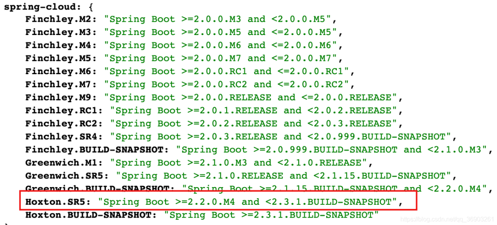
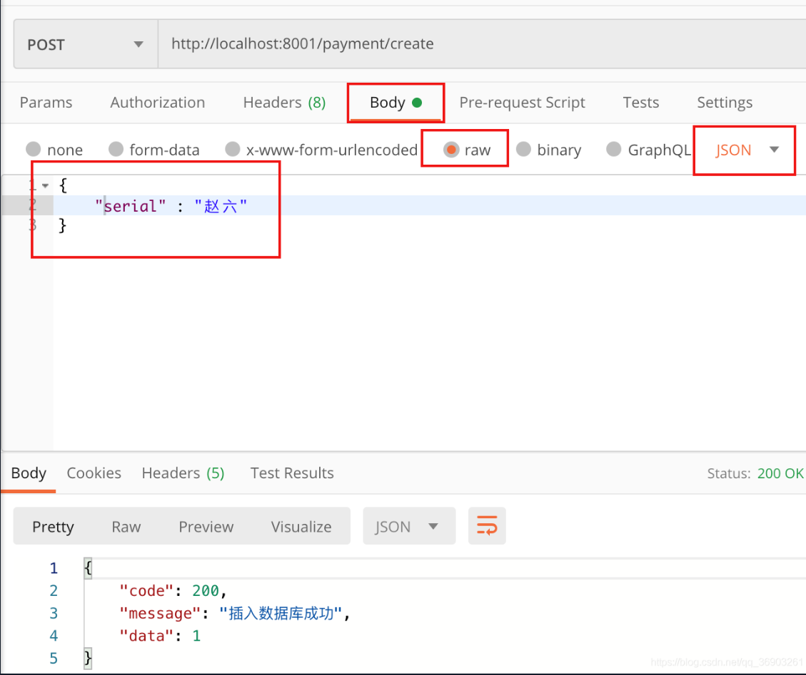

<h1 align = "center">SpringCloud(H版&Alibaba)技术（1-4基础入门，创建项目）</h1>


# 1、SpringCloud简介

springcloud官方文档（Hoxton SR5）：https://cloud.spring.io/spring-cloud-static/Hoxton.SR5/reference/htmlsingle/
springcloud中文文档：https://www.springcloud.cc/
springcloud中国社区文档：http://docs.springcloud.cn/
https://www.bookstack.cn/read/spring-cloud-docs/docs-index.md


# 2、springcloud与springboot版本的对应关系

官方对应关系：http://start.spring.io/actuator/info



# 3、关于Cloud各种组件的停更/升级/替换

由于升级和停更引发的技术变更：（圈起来的是阳哥推荐的技术)


# 4、微服务架构编码构建

编程风格：约定 > 配置 > 编码

## 4.1 创建微服务cloud整体聚合父工程Project步骤

### 4.1.1 New Project


### 4.1.2 聚合总父工程名字


### 4.1.3 Maven选版本


### 4.1.4 开启自动导入


### 4.1.5 字符编码


### 4.1.6 注解生效激活


### 4.1.7 java编译版本选8


### 4.1.8 File Type过滤


### 4.1.9 父工程的pom

删除src目录，并在pom中添加

```
<packaging>pom</packaging>
```


然后把`<packaging>pom</packaging>`下的都用下面这些替换了。

```
  <!--统一管理jar包版本-->
  <properties>
    <project.build.sourceEncoding>UTF-8</project.build.sourceEncoding>
    <maven.compiler.source>1.8</maven.compiler.source>
    <maven.compiler.target>1.8</maven.compiler.target>
    <junit.version>4.12</junit.version>
    <lombok.version>1.18.10</lombok.version>
    <log4j.version>1.2.17</log4j.version>
    <mysql.version>8.0.18</mysql.version>
    <druid.version>1.1.20</druid.version>
    <mybatis.spring.boot.version>1.3.2</mybatis.spring.boot.version>
  </properties>

  <!--子模块继承之后，提供作用：锁定版本+子module不用写groupId和version-->
  <dependencyManagement>
    <dependencies>
      <!--spring boot 2.2.2-->
      <dependency>
        <groupId>org.springframework.boot</groupId>
        <artifactId>spring-boot-dependencies</artifactId>
        <version>2.2.2.RELEASE</version>
        <type>pom</type>
        <scope>import</scope>
      </dependency>
      <!--spring cloud Hoxton.SR1-->
      <dependency>
        <groupId>org.springframework.cloud</groupId>
        <artifactId>spring-cloud-dependencies</artifactId>
        <version>Hoxton.SR1</version>
        <type>pom</type>
        <scope>import</scope>
      </dependency>
      <!--spring cloud alibaba-->
      <dependency>
        <groupId>com.alibaba.cloud</groupId>
        <artifactId>spring-cloud-alibaba-dependencies</artifactId>
        <version>2.1.0.RELEASE</version>
        <type>pom</type>
        <scope>import</scope>
      </dependency>
      <!--mysql-->
      <dependency>
        <groupId>mysql</groupId>
        <artifactId>mysql-connector-java</artifactId>
        <version>${mysql.version}</version>
        <scope>runtime</scope>
      </dependency>
      <!-- druid-->
      <dependency>
        <groupId>com.alibaba</groupId>
        <artifactId>druid-spring-boot-starter</artifactId>
        <version>${druid.version}</version>
      </dependency>

      <!--mybatis-->
      <dependency>
        <groupId>org.mybatis.spring.boot</groupId>
        <artifactId>mybatis-spring-boot-starter</artifactId>
        <version>${mybatis.spring.boot.version}</version>
      </dependency>
      <!--junit-->
      <dependency>
        <groupId>junit</groupId>
        <artifactId>junit</artifactId>
        <version>${junit.version}</version>
      </dependency>
      <!--log4j-->
      <dependency>
        <groupId>log4j</groupId>
        <artifactId>log4j</artifactId>
        <version>${log4j.version}</version>
      </dependency>
    </dependencies>

  </dependencyManagement>

  <build>
    <plugins>
      <plugin>
        <groupId>org.springframework.boot</groupId>
        <artifactId>spring-boot-maven-plugin</artifactId>
        <configuration>
          <fork>true</fork>
          <addResources>true</addResources>
        </configuration>
      </plugin>
    </plugins>
  </build>

</project>
```

maven中dependencyManagement标签：


maven中跳过单元测试


父工程创建完成后执行`mvn:install`将父工程发布到仓库方便子工程继承。

## 4.2 Rest微服务工程构建

最开始的订单模块


步骤：

1. 建module
2. 改pom
3. 写yml
4. 主启动
5. 业务类
6. 测试

### 4.2.1 微服务提供者支付module模块cloud-provider-payment8001

#### 4.2.1.1 新建模块


子项目名：cloud-provider-payment8001


调整一下父项目pom文件


#### 4.2.1.2 在pom添加依赖

```java
    <dependencies>
        <dependency>
            <groupId>org.springframework.boot</groupId>
            <artifactId>spring-boot-starter-web</artifactId>
        </dependency>
        <dependency>
            <groupId>org.springframework.boot</groupId>
            <artifactId>spring-boot-starter-actuator</artifactId>
        </dependency>
        <dependency>
            <groupId>org.mybatis.spring.boot</groupId>
            <artifactId>mybatis-spring-boot-starter</artifactId>
        </dependency>
        <dependency>
            <groupId>com.alibaba</groupId>
            <artifactId>druid-spring-boot-starter</artifactId>
            <version>1.1.20</version>
            <!--子工程写了版本号，就使用子工程的版本号，如果没写版本,找父工程中规定的版本号-->
        </dependency>
        <!--mysql-connector-java-->
        <dependency>
            <groupId>mysql</groupId>
            <artifactId>mysql-connector-java</artifactId>
        </dependency>
        <!--jdbc-->
        <dependency>
            <groupId>org.springframework.boot</groupId>
            <artifactId>spring-boot-starter-jdbc</artifactId>
        </dependency>
        <!--热部署-->
        <dependency>
            <groupId>org.springframework.boot</groupId>
            <artifactId>spring-boot-devtools</artifactId>
            <scope>runtime</scope>
            <optional>true</optional>
        </dependency>
        <dependency>
            <groupId>org.projectlombok</groupId>
            <artifactId>lombok</artifactId>
            <optional>true</optional>
        </dependency>
        <dependency>
            <groupId>org.springframework.boot</groupId>
            <artifactId>spring-boot-starter-test</artifactId>
            <scope>test</scope>
        </dependency>
    </dependencies>
```

#### 4.2.1.3 写yml

在resources目录下新建application.yml配置文件

```java
#微服务建议一定要写服务端口号和微服务名称
server:
  #端口号
  port: 8001

spring:
  application:
    #微服务名称
    name: cloud-payment-service
  #数据库配置
  datasource:
    type: com.alibaba.druid.pool.DruidDataSource
    #mysql5.x的没有cj
    driver-class-name: com.mysql.cj.jdbc.Driver
    #记得先创建数据库  db2020 是数据库名称
    url: jdbc:mysql://localhost:3306/db2020?useUnicode=true&characterEncoding=utf-8&useSSL=false
    username: root
    password: 123456

#mybatis配置
mybatis:
  mapper-locations: classpath:mapper/*.xml
  type-aliases-package: com.angenin.springcloud.entities  #所有Entity别名类所在包
```

#### 4.2.1.4 主启动

在java包下创建主启动类com.angenin.springcloud.PaymentMain8001

```
@SpringBootApplication
public class PaymentMain8001 {
    public static void main(String[] args) {
        SpringApplication.run(PaymentMain8001.class, args);
    }
}
```

#### 4.2.1.5 业务类

##### 4.2.1.5.1 建表SQL

```mysql
CREATE TABLE `payment`(
	`id` BIGINT(20) NOT NULL AUTO_INCREMENT COMMENT 'ID',
	`serial` VARCHAR(200) DEFAULT '',
	PRIMARY KEY(`id`)
)ENGINE=INNODB AUTO_INCREMENT=1 DEFAULT CHARSET=utf8;

INSERT INTO payment(`serial`)VALUES("张三");
```

##### 4.2.1.5.2 entities

在springcloud包下新建实体类entities.Payment

```java
//这三个注解是lombok的，除了导入依赖，idea还需要安装插件（具体操作问度娘）
@Data   //set/get方法
@AllArgsConstructor //有参构造器
@NoArgsConstructor  //无参构造器
public class Payment implements Serializable {
    private long id;
    private String serial;
}
```

在entities包下新建CommonResult（json封装体，传给前端的）

```java
//返回给前端的通用json数据串
@Data   //set/get方法
@AllArgsConstructor //有参构造器
@NoArgsConstructor  //无参构造器
public class CommonResult<T> {
    private Integer code;
    private String message;
    private T data; //泛型，对应类型的json数据

    //自定义两个参数的构造方法
    public CommonResult(Integer code, String message){
        this(code, message, null);
    }
}
```

##### 4.2.1.5.3 dao

在springcloud包下新建Dao.PaymentDao接口

```java
@Mapper
public interface PaymentDao {

    //增
    int create(Payment payment);

    //改     加上@Param注解，mapper中就可以采用#{}的方式把@Param注解括号内的参数进行引用
    Payment getPaymentById(@Param("id") Long id);
    
    //这里用增和改进行演示，有兴趣的可以自己加其他的方法
}
```

##### 4.2.1.5.4 mapper

在resources目录下新建mapper目录，然后新建PaymentMapper.xml

```java
<?xml version="1.0" encoding="UTF-8" ?>
<!DOCTYPE mapper PUBLIC "-//mybatis.org//DTD Mapper 3.0//EN" "http://mybatis.org/dtd/mybatis-3-mapper.dtd">

<mapper namespace="com.angenin.springcloud.Dao.PaymentDao">

    <resultMap id="BaseResultMap" type="com.angenin.springcloud.entities.Payment">
        <id column="id" property="id" jdbcType="BIGINT"/>
        <id column="serial" property="serial" jdbcType="VARCHAR"/>
    </resultMap>
    

    <!--  增  -->
    <!--  Payment标红了不用管，因为我们已经在yml文件中指定了Payment的位置了  -->
    <insert id="create" parameterType="Payment" useGeneratedKeys="true" keyProperty="id">
        insert into payment(serial)values(#{serial});
    </insert>

    <!--  改  -->
    <!--返回用resultMap，防止命名不规范-->
    <select id="getPaymentById" parameterType="Long" resultMap="BaseResultMap">
        select * from payment where id=#{id};
    </select>
</mapper>
```

##### 4.2.1.5.5 service

在springcloud包下新建service.PaymentService接口

```java
public interface PaymentService {

    int create(Payment payment);

    Payment getPaymentById(@Param("id") Long id);

}
```

在service包下新建impl.PaymentServiceIpml实现类

```java
@Service
public class PaymentServiceIpml implements PaymentService {

    @Resource   //@Autowired也可以
    private PaymentDao paymentDao;

    public int create(Payment payment){
        return paymentDao.create(payment);
    }

    public Payment getPaymentById(Long id){
        return paymentDao.getPaymentById(id);
    }

}
```

##### 4.2.1.5.6 controller

在springcloud包下新建controller.PaymentController

```java
@RestController
@Slf4j  //日志
public class PaymentController {

    @Resource
    private PaymentService paymentService;

    //前后端分离，所以不能直接返回对象，数据要先经过CommonResult封装再返回
    @PostMapping("/payment/create")
    public CommonResult create(@RequestBody Payment payment){
        int result = paymentService.create(payment);
        log.info("******插入的数据为：" + payment);
        log.info("******插入结果：" + result);

        if(result > 0){
            //插入成功
            return new CommonResult(200, "插入数据库成功", result);
        }else{
            return new CommonResult(444, "插入数据库失败");
        }
    }


    @GetMapping("/payment/get/{id}")
    public CommonResult getPaymentById(@PathVariable("id") Long id){
        Payment payment = paymentService.getPaymentById(id);
        log.info("******查询结果：" + payment);

        if(payment != null){
            //查询成功
            return new CommonResult(200, "查询成功", payment);
        }else{
            return new CommonResult(444, "没有对应记录，查询ID：" + id);
        }
    }

}
```

#### 4.2.1.6 测试

启动项目


浏览器输入`http://localhost:8001/payment/get/1`，查询成功。


因为浏览器一般不支持直接发送post请求，所以，需要使用工具进行测试。（我这里用的是Postman）
重新测试查询，没问题。


输入`http://localhost:8001/payment/create`发送post请求，往数据库中插入一条数据，需要把数据写到body中。




### 4.2.2 热部署Devtools（只能在开发阶段使用）

1. 在cloud-provider-payment8001项目中添加热部署依赖（已经在导入了，所以看看就行了，记一下步骤）

```
    <!--热部署-->
    <dependency>
        <groupId>org.springframework.boot</groupId>
        <artifactId>spring-boot-devtools</artifactId>
        <scope>runtime</scope>
        <optional>true</optional>
    </dependency>
```

2. 添加一个插件到父类总工程的pom.xml里（这一步之前也已经做了）

```
  <build>
    <plugins>
      <plugin>
        <groupId>org.springframework.boot</groupId>
        <artifactId>spring-boot-maven-plugin</artifactId>
        <configuration>
          <fork>true</fork>
          <addResources>true</addResources>
        </configuration>
      </plugin>
    </plugins>
  </build>
```

3. 开启自动编译的选项


4. 热注册开启
   组合键`Shift+Ctrl+Alt+/`（Mac系统的把Ctrl换成command键），选中Registry…


5. 重启IDEA

开完之后感觉有点卡，虽然能自动部署，但是代码提示变慢了，等以后换了电脑再玩自动热部署，现在就不开了。
把第四步打上的勾去掉（原本打上的就不用去掉了），然后重启idea就可以了。
不使用自动热部署，也可以使用热部署，按这个绿色的锤子，重新启动，只编译改了的文件，所以比重启快一些。


### 4.2.3 微服务消费者订单module模块 cloud-consumer-order80

#### 4.2.3.1 新建模块


cloud-consumer-order80


#### 4.2.3.2 改pom

往pom中添加：

```
    <dependencies>
        <dependency>
            <groupId>org.springframework.boot</groupId>
            <artifactId>spring-boot-starter-web</artifactId>
        </dependency>
        <dependency>
            <groupId>org.springframework.boot</groupId>
            <artifactId>spring-boot-starter-actuator</artifactId>
        </dependency>
        <!--热部署-->
        <dependency>
            <groupId>org.springframework.boot</groupId>
            <artifactId>spring-boot-devtools</artifactId>
            <scope>runtime</scope>
            <optional>true</optional>
        </dependency>
        <dependency>
            <groupId>org.projectlombok</groupId>
            <artifactId>lombok</artifactId>
            <optional>true</optional>
        </dependency>
        <dependency>
            <groupId>org.springframework.boot</groupId>
            <artifactId>spring-boot-starter-test</artifactId>
            <scope>test</scope>
        </dependency>
    </dependencies>
</project>
```

#### 4.2.3.3 写yml

在resources目录下新建application.yml文件

```
#访问一个网站时，默认是80端口，给用户80端口，用户就可以不用加端口直接访问页面
server:
  port: 80
```

#### 4.2.3.4 主启动

com.angenin.springcloud.OrderMain80

```
@SpringBootApplication
public class OrderMain80 {
    public static void main(String[] args) {
        SpringApplication.run(OrderMain80.class, args);
    }
}
```

#### 4.2.3.5 写业务

1. 复制cloud-provider-payment8001项目里的entities（里面2个实体类）到本项目（cloud-consumer-order80）的springcloud包下。（在后面的工程重构，阳哥会把实体类抽取出来）

2. 在springcloud包下新建config.ApplicationContextConfig

```
@Configuration
public class ApplicationContextConfig {

    //往容器中添加一个RestTemplate
    //RestTemplate提供了多种便捷访问远程http访问的方法
    @Bean
    public RestTemplate restTemplate(){
        return new RestTemplate();
    }

}
```

3. 在springcloud包下新建controller.OrderController

```
@RestController
@Slf4j
public class OrderController {

    public static final String PAYMENT_URL = "http://localhost:8001";

    @Resource
    private RestTemplate restTemplate;

    //因为浏览器只支持get请求，为了方便这里就用get
    @GetMapping("/consumer/payment/create")
    public CommonResult<Payment> create(Payment payment){
        log.info("********插入的数据：" + payment);
        //postForObject分别有三个参数：请求地址，请求参数，返回的对象类型
        return restTemplate.postForObject(PAYMENT_URL + "/payment/create", payment, CommonResult.class);
    }

    @GetMapping("/consumer/payment/get/{id}")
    public CommonResult<Payment> getPayment(@PathVariable("id") Long id){
        log.info("********查询的id：" + id);
        //getForObject两个参数：请求地址，返回的对象类型
        return restTemplate.getForObject(PAYMENT_URL + "/payment/get/" + id, CommonResult.class);
    }
}
```

#### 4.2.3.6 测试

启动两个项目进行测试，两个都启动后，右下角会弹出个services提示，点击show。
然后会把运行的项目合并在一起显示


在浏览器中输入`http://localhost/consumer/payment/get/1`成功查询到数据。


在浏览器中输入 `http://localhost/consumer/payment/create?serial=王五` 插入一条数据。


### 4.2.4 工程重构

观察问题：系统中有重复部分，重构

#### 4.2.4.1 新建新工程：cloud-api-commons


#### 4.2.4.2 改pom

添加依赖：

```
   <dependencies>
       <dependency>
           <groupId>org.springframework.boot</groupId>
           <artifactId>spring-boot-devtools</artifactId>
           <scope>runtime</scope>
           <optional>true</optional>
       </dependency>
       <dependency>
           <groupId>org.projectlombok</groupId>
           <artifactId>lombok</artifactId>
           <optional>true</optional>
       </dependency>
       <!--   一个Java工具包     -->
       <dependency>
           <groupId>cn.hutool</groupId>
           <artifactId>hutool-all</artifactId>
           <version>5.1.0</version>
       </dependency>
   </dependencies>
```

#### 4.2.4.3 拷贝entities到本项目中

（路径需要一样，先在本项目中建包，然后在拷贝)

#### 4.2.4.4 对本项目进行打包


#### 4.2.4.5 删除另外两个项目的entities包

#### 4.2.4.6 然后给两个项目引入打包后项目的坐标

```
       <!-- 引用自己定义的api通用包，可以使用Payment支付Entity -->
       <dependency>
           <groupId>com.angenin.springcloud</groupId>
           <artifactId>cloud-api-commons</artifactId>
           <version>${project.version}</version>
       </dependency>
```

运行8001会报错, 修改这里


#### 4.2.4.7 重新测试

http://localhost/consumer/payment/get/1


http://localhost/consumer/payment/create?serial=赵六


#### 4.2.4.8  补充说明调用其他服务公共实例类

提供者: 提供通用的实体类对象


使用者: 引入坐标 使用他的实体类对象

