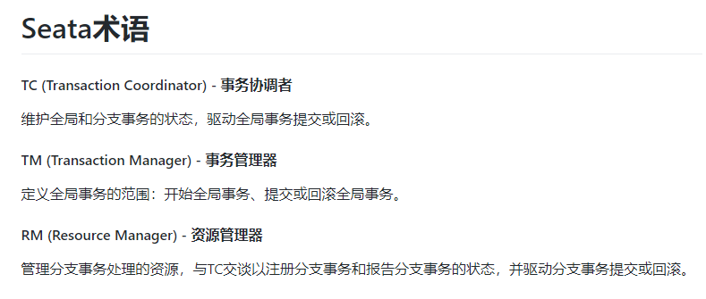
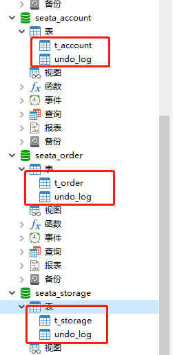

<h1 align = "center">SpringCloud(H版&Alibaba)技术（20高级部分，处理分布式事务【Seata】）</h1>

# 二十、SpringCloud Alibaba Seata处理分布式事务


## 20.1 分布式事务问题


### 20.1.1 Seate 简介

1. 是什么


官网：http://seata.io/zh-cn/


2. 能干嘛





3. 使用


## 20.2 Seata-Server安装

### 20.2.1  windows 下安装


2. 下载：https://github.com/seata/seata/releases

   

   

3. 修改配置文件


修改service模块    


4. 建数据库

   


5. 建表


6. 修改配置文件

   

   


7. 启动nacos


8. 启动seata


9. 注意事项 

   数据库建库建表
   *mysql8的同学需要修改file.conf的驱动配置store.db.driver-class-name；并lib目录下删除mysql5驱动，添加mysql8驱动。*


### 20.2.2 docker下载安装

#### 20.2.2.1 mysql5.6

```
#启动数据库容器（注意，我这里数据库暴露的是3305端口）
docker start 数据库容器ID
#docker run -p 3305:3306 --name mysql5.6 -e MYSQL_ROOT_PASSWORD=123456 -d mysql:5.6

#进入mysql5.6容器
docker exec -it 容器ID /bin/bash

#进入mysql
mysql -uroot -p123456  --default-character-set=utf8

#创建seata数据库
create database seata character set utf8;
use seata;

#创建seata数据库需要的表（三张表）
CREATE TABLE IF NOT EXISTS `global_table`
(
    `xid`                       VARCHAR(128) NOT NULL,
    `transaction_id`            BIGINT,
    `status`                    TINYINT      NOT NULL,
    `application_id`            VARCHAR(32),
    `transaction_service_group` VARCHAR(32),
    `transaction_name`          VARCHAR(128),
    `timeout`                   INT,
    `begin_time`                BIGINT,
    `application_data`          VARCHAR(2000),
    `gmt_create`                DATETIME,
    `gmt_modified`              DATETIME,
    PRIMARY KEY (`xid`),
    KEY `idx_gmt_modified_status` (`gmt_modified`, `status`),
    KEY `idx_transaction_id` (`transaction_id`)
) ENGINE = InnoDB
  DEFAULT CHARSET = utf8;

CREATE TABLE IF NOT EXISTS `branch_table`
(
    `branch_id`         BIGINT       NOT NULL,
    `xid`               VARCHAR(128) NOT NULL,
    `transaction_id`    BIGINT,
    `resource_group_id` VARCHAR(32),
    `resource_id`       VARCHAR(256),
    `branch_type`       VARCHAR(8),
    `status`            TINYINT,
    `client_id`         VARCHAR(64),
    `application_data`  VARCHAR(2000),
    `gmt_create`        DATETIME(6),
    `gmt_modified`      DATETIME(6),
    PRIMARY KEY (`branch_id`),
    KEY `idx_xid` (`xid`)
) ENGINE = InnoDB
  DEFAULT CHARSET = utf8;

CREATE TABLE IF NOT EXISTS `lock_table`
(
    `row_key`        VARCHAR(128) NOT NULL,
    `xid`            VARCHAR(96),
    `transaction_id` BIGINT,
    `branch_id`      BIGINT       NOT NULL,
    `resource_id`    VARCHAR(256),
    `table_name`     VARCHAR(32),
    `pk`             VARCHAR(36),
    `gmt_create`     DATETIME,
    `gmt_modified`   DATETIME,
    PRIMARY KEY (`row_key`),
    KEY `idx_branch_id` (`branch_id`)
) ENGINE = InnoDB
  DEFAULT CHARSET = utf8;

#因为之前已经弄过了nacos的持久化，已建了nacos_config数据库了，所以这里就不再赘述。

#退出数据库
exit

#退出容器
exit
```

#### 20.2.2.2  nacos1.3

```
#启动nacos
docker start nacos容器ID
#docker run --env MODE=standalone --name mynacos -d -p 8848:8848 -e MYSQL_SERVICE_HOST=10.211.55.26  -e MYSQL_SERVICE_PORT=3305  -e MYSQL_SERVICE_DB_NAME=nacos_config  -e MYSQL_SERVICE_USER=root  -e MYSQL_SERVICE_PASSWORD=123456  -e SPRING_DATASOURCE_PLATFORM=mysql  -e MYSQL_DATABASE_NUM=1 nacos/nacos-server
```

#### 20.2.2.3  seata

```
#拉取seata镜像（此时最新版为1.2）
docker pull seataio/seata-server

#运行seata
docker run --name myseata -d -h 10.211.55.26 -p 8091:8091 seataio/seata-server

#进入seata容器
docker exec -it 容器ID /bin/bash
cd resources
#因为容器没有装vim，所以我们要先安装vim
apt-get update
apt-get install vim
#备份文件
cp file.conf file.conf.bk
cp registry.conf registry.conf.bk

#修改file.conf文件（看下图）
vim file.conf
#seata1.2的file.conf里没有service模块，store的mode支持了redis
#mysql8的同学需要修改file.conf的驱动配置store.db.driver-class-name；并lib目录下删除mysql5驱动，添加mysql8驱动。
#按esc键然后:wq!退出

#修改文件（看下图）
vim registry.conf
#按esc键然后:wq!退出

#退出容器
exit

#重启容器
docker restart seata容器ID
```

#### 20.2.2.4  file.conf

```
#service {
#  vgroupMapping.my_test_tx_group = "fsp_tx_group"
#  default.grouplist = "10.211.55.26:8091"
#  enableDegrade = false
#  disableGlobalTransaction = false
#}
```


```
jdbc:mysql://10.211.55.26:3305/seata_order?useUnicode=true&characterEncoding=UTF-8&useSSL=false&serverTimezone=GMT%2B8
```


#### 20.2.2.5  registry.conf


`http://10.211.55.26:8848/nacos`，到nacos后台看seata是否成功注册进nacos。


查看注册进nacos的seata信息是否正确。


## 20.3 订单/库存/账户业务数据库准备


### 20.3 .1 windows 环境

1. 先启动nacos  后启动seata  


2. 业务说明


3. 创建数据库


本机数据库创建

```
#order
create database seata_order;
#storage
create database seata_storage;
#account
create database seata_account;
```


4. 3个库创建对应业务表


t_order 表

```
CREATE TABLE t_order(
`id` BIGINT(11) NOT NULL AUTO_INCREMENT PRIMARY KEY,
`user_id` BIGINT(11) DEFAULT NULL COMMENT '用户id',
`product_id` BIGINT(11)DEFAULT NULL COMMENT '产品id',
`count` INT(11) DEFAULT NULL COMMENT '数量',
`money` DECIMAL(11,0) DEFAULT NULL COMMENT '金额',
`status` INT(1) DEFAULT NULL COMMENT '订单状态: 0:创建中; 1:已完结'
)ENGINE=INNODB AUTO_INCREMENT=7 DEFAULT CHARSET=utf8;

select * from t_order;
```

t_storage 表

```
CREATE TABLE t_storage(
`id` BIGINT(11) NOT NULL AUTO_INCREMENT PRIMARY KEY,
`product_id` BIGINT(11) DEFAULT NULL COMMENT '产品id',
`total` INT(11) DEFAULT NULL COMMENT '总库存',
`used` INT(11) DEFAULT NULL COMMENT '已用库存',
`residue` INT(11) DEFAULT NULL COMMENT '剩余库存'
)ENGINE=INNODB AUTO_INCREMENT=2 DEFAULT CHARSET=utf8;

INSERT INTO t_storage(`id`,`product_id`,`total`,`used`,`residue`)VALUES('1','1','100','0','100');

SELECT * FROM t_storage;
```

t_account 表

```
CREATE TABLE t_account(
`id` BIGINT(11) NOT NULL AUTO_INCREMENT PRIMARY KEY COMMENT 'id',
`user_id` BIGINT(11) DEFAULT NULL COMMENT '用户id',
`total` DECIMAL(10,0) DEFAULT NULL COMMENT '总额度',
`used` DECIMAL(10,0) DEFAULT NULL COMMENT '已用余额',
`residue` DECIMAL(10,0) DEFAULT '0' COMMENT '剩余可用额度'
)ENGINE=INNODB AUTO_INCREMENT=2 DEFAULT CHARSET=utf8;

INSERT INTO t_account(`id`,`user_id`,`total`,`used`,`residue`)VALUES('1','1','1000','0','1000');

SELECT * FROM t_account;
```


5. 按照上面3个库建立==各自对应==回滚日志表


每个库都要建一个

```
drop table `undo_log`;
CREATE TABLE `undo_log` (
  `id` bigint(20) NOT NULL AUTO_INCREMENT,
  `branch_id` bigint(20) NOT NULL,
  `xid` varchar(100) NOT NULL,
  `context` varchar(128) NOT NULL,
  `rollback_info` longblob NOT NULL,
  `log_status` int(11) NOT NULL,
  `log_created` datetime NOT NULL,
  `log_modified` datetime NOT NULL,
  `ext` varchar(100) DEFAULT NULL,
  PRIMARY KEY (`id`),
  UNIQUE KEY `ux_undo_log` (`xid`,`branch_id`)
) ENGINE=InnoDB AUTO_INCREMENT=1 DEFAULT CHARSET=utf8;
```




### 20.3 .2docker 环境

```
#进入mysql5.6容器
docker exec -it 容器ID /bin/bash

#进入mysql
mysql -uroot -p123456  --default-character-set=utf8

#创建业务数据库和对应的业务表

#order
create database seata_order;

use seata_order;

CREATE TABLE t_order(
`id` BIGINT(11) NOT NULL AUTO_INCREMENT PRIMARY KEY,
`user_id` BIGINT(11) DEFAULT NULL COMMENT '用户id',
`product_id` BIGINT(11)DEFAULT NULL COMMENT '产品id',
`count` INT(11) DEFAULT NULL COMMENT '数量',
`money` DECIMAL(11,0) DEFAULT NULL COMMENT '金额',
`status` INT(1) DEFAULT NULL COMMENT '订单状态: 0:创建中; 1:已完结'
)ENGINE=INNODB AUTO_INCREMENT=7 DEFAULT CHARSET=utf8;

select * from t_order;

CREATE TABLE IF NOT EXISTS `undo_log`
(
    `branch_id`     BIGINT(20)   NOT NULL COMMENT 'branch transaction id',
    `xid`           VARCHAR(100) NOT NULL COMMENT 'global transaction id',
    `context`       VARCHAR(128) NOT NULL COMMENT 'undo_log context,such as serialization',
    `rollback_info` LONGBLOB     NOT NULL COMMENT 'rollback info',
    `log_status`    INT(11)      NOT NULL COMMENT '0:normal status,1:defense status',
    `log_created`   DATETIME(6)  NOT NULL COMMENT 'create datetime',
    `log_modified`  DATETIME(6)  NOT NULL COMMENT 'modify datetime',
    UNIQUE KEY `ux_undo_log` (`xid`, `branch_id`)
) ENGINE = InnoDB
  AUTO_INCREMENT = 1
  DEFAULT CHARSET = utf8 COMMENT ='AT transaction mode undo table';


#storage
create database seata_storage;

use seata_storage;

CREATE TABLE t_storage(
`id` BIGINT(11) NOT NULL AUTO_INCREMENT PRIMARY KEY,
`product_id` BIGINT(11) DEFAULT NULL COMMENT '产品id',
`total` INT(11) DEFAULT NULL COMMENT '总库存',
`used` INT(11) DEFAULT NULL COMMENT '已用库存',
`residue` INT(11) DEFAULT NULL COMMENT '剩余库存'
)ENGINE=INNODB AUTO_INCREMENT=2 DEFAULT CHARSET=utf8;

INSERT INTO t_storage(`id`,`product_id`,`total`,`used`,`residue`)VALUES('1','1','100','0','100');

SELECT * FROM t_storage;

CREATE TABLE IF NOT EXISTS `undo_log`
(
    `branch_id`     BIGINT(20)   NOT NULL COMMENT 'branch transaction id',
    `xid`           VARCHAR(100) NOT NULL COMMENT 'global transaction id',
    `context`       VARCHAR(128) NOT NULL COMMENT 'undo_log context,such as serialization',
    `rollback_info` LONGBLOB     NOT NULL COMMENT 'rollback info',
    `log_status`    INT(11)      NOT NULL COMMENT '0:normal status,1:defense status',
    `log_created`   DATETIME(6)  NOT NULL COMMENT 'create datetime',
    `log_modified`  DATETIME(6)  NOT NULL COMMENT 'modify datetime',
    UNIQUE KEY `ux_undo_log` (`xid`, `branch_id`)
) ENGINE = InnoDB
  AUTO_INCREMENT = 1
  DEFAULT CHARSET = utf8 COMMENT ='AT transaction mode undo table';


#account
create database seata_account;

use seata_account;

CREATE TABLE t_account(
`id` BIGINT(11) NOT NULL AUTO_INCREMENT PRIMARY KEY COMMENT 'id',
`user_id` BIGINT(11) DEFAULT NULL COMMENT '用户id',
`total` DECIMAL(10,0) DEFAULT NULL COMMENT '总额度',
`used` DECIMAL(10,0) DEFAULT NULL COMMENT '已用余额',
`residue` DECIMAL(10,0) DEFAULT '0' COMMENT '剩余可用额度'
)ENGINE=INNODB AUTO_INCREMENT=2 DEFAULT CHARSET=utf8;

INSERT INTO t_account(`id`,`user_id`,`total`,`used`,`residue`)VALUES('1','1','1000','0','1000');

SELECT * FROM t_account;

CREATE TABLE IF NOT EXISTS `undo_log`
(
    `branch_id`     BIGINT(20)   NOT NULL COMMENT 'branch transaction id',
    `xid`           VARCHAR(100) NOT NULL COMMENT 'global transaction id',
    `context`       VARCHAR(128) NOT NULL COMMENT 'undo_log context,such as serialization',
    `rollback_info` LONGBLOB     NOT NULL COMMENT 'rollback info',
    `log_status`    INT(11)      NOT NULL COMMENT '0:normal status,1:defense status',
    `log_created`   DATETIME(6)  NOT NULL COMMENT 'create datetime',
    `log_modified`  DATETIME(6)  NOT NULL COMMENT 'modify datetime',
    UNIQUE KEY `ux_undo_log` (`xid`, `branch_id`)
) ENGINE = InnoDB
  AUTO_INCREMENT = 1
  DEFAULT CHARSET = utf8 COMMENT ='AT transaction mode undo table';


#退出mysql
exit

#退出容器
exit
```


## 20.4 订单/库存/账户业务微服务准备


### 20.4.1 订单模块


1. 新建模块 seata-order-service2001

2. pom

   

```
<dependencies>
        <!-- nacos -->
        <dependency>
            <groupId>com.alibaba.cloud</groupId>
            <artifactId>spring-cloud-starter-alibaba-nacos-discovery</artifactId>
        </dependency>
        <!-- seata-->
        <dependency>
            <groupId>com.alibaba.cloud</groupId>
            <artifactId>spring-cloud-starter-alibaba-seata</artifactId>
            <exclusions>
                <exclusion>
                    <groupId>io.seata</groupId>
                    <artifactId>seata-all</artifactId>
                </exclusion>
            </exclusions>
        </dependency>
        <dependency>
            <groupId>io.seata</groupId>
            <artifactId>seata-all</artifactId>
            <version>0.9.0</version>
        </dependency>
        <dependency>
            <groupId>org.springframework.cloud</groupId>
            <artifactId>spring-cloud-starter-openfeign</artifactId>
        </dependency>
        <dependency>
            <groupId>org.mybatis.spring.boot</groupId>
            <artifactId>mybatis-spring-boot-starter</artifactId>
        </dependency>
        <dependency>
            <groupId>com.alibaba</groupId>
            <artifactId>druid-spring-boot-starter</artifactId>
        </dependency>
        <dependency>
            <groupId>mysql</groupId>
            <artifactId>mysql-connector-java</artifactId>
        </dependency>
        <!--jdbc-->
        <dependency>
            <groupId>org.springframework.boot</groupId>
            <artifactId>spring-boot-starter-jdbc</artifactId>
        </dependency>
        <dependency>
            <groupId>org.springframework.boot</groupId>
            <artifactId>spring-boot-starter-web</artifactId>
        </dependency>
        <dependency>
            <groupId>org.springframework.boot</groupId>
            <artifactId>spring-boot-starter-actuator</artifactId>
        </dependency>
        <dependency>
            <groupId>org.projectlombok</groupId>
            <artifactId>lombok</artifactId>
            <optional>true</optional>
        </dependency>
        <dependency>
            <groupId>org.springframework.boot</groupId>
            <artifactId>spring-boot-starter-test</artifactId>
            <scope>test</scope>
        </dependency>
    </dependencies>
```

3. application.yml

```
server:
  port: 2001

spring:
  application:
    name: seata-order-service
  cloud:
    alibaba:
      seata:
        # 自定义事务组名称需要与seata-server中的对应
        tx-service-group: my_test_tx_group #因为seata的file.conf文件中没有service模块，事务组名默认为my_test_tx_group
        #service要与tx-service-group对齐，vgroupMapping和grouplist在service的下一级，my_test_tx_group在再下一级
        #service:
        #  vgroupMapping:
            #要和tx-service-group的值一致
        #    my_test_tx_group: default
        #  grouplist:
            # seata seaver的 地址配置，此处可以集群配置是个数组
        #    default: localhost:8091
    nacos:
      discovery:
        server-addr: localhost:8848  #nacos
  datasource:
    # 当前数据源操作类型
    type: com.alibaba.druid.pool.DruidDataSource
    # mysql驱动类
    driver-class-name: com.mysql.cj.jdbc.Driver
    url: jdbc:mysql://localhost:3306/seata_order?useUnicode=true&characterEncoding=UTF-8&useSSL=false&serverTimezone=GMT%2B8
    username: root
    password: root
feign:
  hystrix:
    enabled: false
logging:
  level:
    io:
      seata: info

mybatis:
  mapperLocations: classpath*:mapper/*.xml
```

4. file.conf

```
transport {
  # tcp udt unix-domain-socket
  type = "TCP"
  #NIO NATIVE
  server = "NIO"
  #enable heartbeat
  heartbeat = true
  #thread factory for netty
  thread-factory {
    boss-thread-prefix = "NettyBoss"
    worker-thread-prefix = "NettyServerNIOWorker"
    server-executor-thread-prefix = "NettyServerBizHandler"
    share-boss-worker = false
    client-selector-thread-prefix = "NettyClientSelector"
    client-selector-thread-size = 1
    client-worker-thread-prefix = "NettyClientWorkerThread"
    # netty boss thread size,will not be used for UDT
    boss-thread-size = 1
    #auto default pin or 8
    worker-thread-size = 8
  }
  shutdown {
    # when destroy server, wait seconds
    wait = 3
  }
  serialization = "seata"
  compressor = "none"
}
service {
  #vgroup->rgroup
  vgroup_mapping.my_test_tx_group = "default"
  #only support single node
  default.grouplist = "127.0.0.1:8091"
  #degrade current not support
  enableDegrade = false
  #disable
  disable = false
  #unit ms,s,m,h,d represents milliseconds, seconds, minutes, hours, days, default permanent
  max.commit.retry.timeout = "-1"
  max.rollback.retry.timeout = "-1"
}

client {
  async.commit.buffer.limit = 10000
  lock {
    retry.internal = 10
    retry.times = 30
  }
  report.retry.count = 5
  tm.commit.retry.count = 1
  tm.rollback.retry.count = 1
}

## transaction log store
store {
  ## store mode: file、db
  mode = "db"

  ## file store
  file {
    dir = "sessionStore"

    # branch session size , if exceeded first try compress lockkey, still exceeded throws exceptions
    max-branch-session-size = 16384
    # globe session size , if exceeded throws exceptions
    max-global-session-size = 512
    # file buffer size , if exceeded allocate new buffer
    file-write-buffer-cache-size = 16384
    # when recover batch read size
    session.reload.read_size = 100
    # async, sync
    flush-disk-mode = async
  }

  ## database store
  db {
    ## the implement of javax.sql.DataSource, such as DruidDataSource(druid)/BasicDataSource(dbcp) etc.
    datasource = "dbcp"
    ## mysql/oracle/h2/oceanbase etc.
    db-type = "mysql"
    driver-class-name = "com.mysql.jdbc.Driver"
    url = "jdbc:mysql://127.0.0.1:3306/seata"
    user = "root"
    password = "root"
    min-conn = 1
    max-conn = 3
    global.table = "global_table"
    branch.table = "branch_table"
    lock-table = "lock_table"
    query-limit = 100
  }
}
lock {
  ## the lock store mode: local、remote
  mode = "remote"

  local {
    ## store locks in user's database
  }

  remote {
    ## store locks in the seata's server
  }
}
recovery {
  #schedule committing retry period in milliseconds
  committing-retry-period = 1000
  #schedule asyn committing retry period in milliseconds
  asyn-committing-retry-period = 1000
  #schedule rollbacking retry period in milliseconds
  rollbacking-retry-period = 1000
  #schedule timeout retry period in milliseconds
  timeout-retry-period = 1000
}

transaction {
  undo.data.validation = true
  undo.log.serialization = "jackson"
  undo.log.save.days = 7
  #schedule delete expired undo_log in milliseconds
  undo.log.delete.period = 86400000
  undo.log.table = "undo_log"
}

## metrics settings
metrics {
  enabled = false
  registry-type = "compact"
  # multi exporters use comma divided
  exporter-list = "prometheus"
  exporter-prometheus-port = 9898
}

support {
  ## spring
  spring {
    # auto proxy the DataSource bean
    datasource.autoproxy = false
  }
}
```

5. registry.conf

```
registry {
  # file 、nacos 、eureka、redis、zk、consul、etcd3、sofa
  type = "nacos"

  nacos {
    serverAddr = "localhost:8848"
    namespace = ""
    cluster = "default"
  }
  eureka {
    serviceUrl = "http://localhost:8761/eureka"
    application = "default"
    weight = "1"
  }
  redis {
    serverAddr = "localhost:6379"
    db = "0"
  }
  zk {
    cluster = "default"
    serverAddr = "127.0.0.1:2181"
    session.timeout = 6000
    connect.timeout = 2000
  }
  consul {
    cluster = "default"
    serverAddr = "127.0.0.1:8500"
  }
  etcd3 {
    cluster = "default"
    serverAddr = "http://localhost:2379"
  }
  sofa {
    serverAddr = "127.0.0.1:9603"
    application = "default"
    region = "DEFAULT_ZONE"
    datacenter = "DefaultDataCenter"
    cluster = "default"
    group = "SEATA_GROUP"
    addressWaitTime = "3000"
  }
  file {
    name = "file.conf"
  }
}

config {
  # file、nacos 、apollo、zk、consul、etcd3
  type = "file"

  nacos {
    serverAddr = "localhost"
    namespace = ""
  }
  consul {
    serverAddr = "127.0.0.1:8500"
  }
  apollo {
    app.id = "seata-server"
    apollo.meta = "http://192.168.1.204:8801"
  }
  zk {
    serverAddr = "127.0.0.1:2181"
    session.timeout = 6000
    connect.timeout = 2000
  }
  etcd3 {
    serverAddr = "http://localhost:2379"
  }
  file {
    name = "file.conf"
  }
}
```

6. domain
   CommonResult
   
   

```
@Data
@AllArgsConstructor
@NoArgsConstructor
public class CommonResult<T> {
    private Integer code;
    private String message;
    private T data;

    public CommonResult(Integer code, String message) {
        this(code, message, null);
    }
}
```

​	Order

```
@Data
@AllArgsConstructor
@NoArgsConstructor
public class Order {

    private Long id;

    private Long userId;

    private Long productId;

    private Integer count;

    private BigDecimal money;

    private Integer status; // 订单状态 0：创建中 1：已完结
}
```

7. dao

```
@Mapper
public interface OrderDao {

    //1 新建订单
    int create(Order order);

    //2 修改订单状态,从0改为1
    int update(@Param("userId") Long userId, @Param("status") Integer status);

}
```

8. mapper
   OrderMapper.xml

```xml
<?xml version="1.0" encoding="UTF-8" ?>
<!DOCTYPE mapper PUBLIC "-//mybatis.org//DTD Mapper 3.0//EN"
        "http://mybatis.org/dtd/mybatis-3-mapper.dtd">
<mapper namespace="com.angenin.springcloud.alibaba.dao.OrderDao">

    <resultMap id="BaseResultMap" type="com.angenin.springcloud.alibaba.domain.Order">
        <id column="id" property="id" jdbcType="BIGINT"/>
        <result column="user_id" property="userId" jdbcType="BIGINT"/>
        <result column="product_id" property="productId" jdbcType="BIGINT"/>
        <result column="count" property="count" jdbcType="INTEGER"/>
        <result column="money" property="money" jdbcType="DECIMAL"/>
        <result column="status" property="status" jdbcType="INTEGER"/>
    </resultMap>

    <insert id="create" parameterType="com.angenin.springcloud.alibaba.domain.Order"
            useGeneratedKeys="true" keyProperty="id">
        insert into t_order(`user_id`, `product_id`, `count`, `money`, `status`)
            values(#{userId}, #{productId}, #{count}, #{money}, 0);
    </insert>
    <update id="update" parameterType="com.angenin.springcloud.alibaba.domain.Order">
        update t_order set `status` = 1
            where `user_id` = #{userId} and `status` = #{status};
    </update>
</mapper>
```

9. service
   StorageService

```
@FeignClient(value = "seata-storage-service")
public interface StorageService {

    //减库存
    @PostMapping(value = "/storage/decrease")
    CommonResult decrease(@RequestParam("productId") Long productId, @RequestParam("count") Integer count);
}
```

AccountService

```
@FeignClient(value = "seata-account-service")
public interface AccountService {

    @PostMapping(value = "/account/decrease")
    CommonResult decrease(@RequestParam("userId") Long userId, @RequestParam("money") BigDecimal money);
}
```

OrderService

```
public interface OrderService {

    void create(Order order);

}
```

10. impl
    OderServiceImpl

```
@Slf4j
@Service
public class OderServiceImpl implements OrderService {

    @Resource
    private OrderDao orderDao;
    @Resource
    private StorageService storageService;
    @Resource
    private AccountService accountService;

    @Override
    public void create(Order order) {
        //1. 新建订单
        log.info("-------> 开始新建订单");
        orderDao.create(order);

        //2. 扣减库存
        log.info("-------> 订单微服务开始调用库存，做扣减count");
        storageService.decrease(order.getProductId(), order.getCount());
        log.info("-------> 订单微服务开始调用库存，做扣减完成");

        //3. 扣减账号余额
        log.info("-------> 订单微服务开始调用账号，做扣减money");
        accountService.decrease(order.getUserId(), order.getMoney());
        log.info("-------> 订单微服务开始调用账号，做扣减完成");

        //4. 修改订单状态，1代表已完成
        log.info("-------> 修改订单状态");
        orderDao.update(order.getUserId(), 0);
        log.info("-------> 修改订单状态完成");

        log.info("-------> 新建订单完成");
    }
}
```

11. controller
    OrderController

```
@RestController
public class OrderController {

    @Resource
    private OrderService orderService;

    @GetMapping("/order/create")
    public CommonResult create(Order order){
        orderService.create(order);
        return new CommonResult(200, "订单创建成功!");
    }
}
```

12. config
    MybatisConfig

```
@MapperScan("com.angenin.springcloud.alibaba.dao")
@Configuration
public class MybatisConfig {
}
```

DataSourceProxyConfig

```
import com.alibaba.druid.pool.DruidDataSource;
import io.seata.rm.datasource.DataSourceProxy;
import org.apache.ibatis.session.SqlSessionFactory;
import org.mybatis.spring.SqlSessionFactoryBean;
import org.springframework.beans.factory.annotation.Value;
import org.springframework.boot.context.properties.ConfigurationProperties;
import org.springframework.context.annotation.Bean;
import org.springframework.context.annotation.Configuration;
import org.springframework.core.io.support.PathMatchingResourcePatternResolver;
import org.springframework.core.io.support.ResourcePatternResolver;

import javax.sql.DataSource;

//使用Seata对数据源进行代理
@Configuration
public class DataSourceProxyConfig {

    @Value("${mybatis.mapperLocations}")
    private String mapperLocations;

    @Bean
    @ConfigurationProperties(prefix = "spring.datasource")
    public DataSource druidDataSource() {
        return new DruidDataSource();
    }

    @Bean
    public DataSourceProxy dataSourceProxy(DataSource druidDataSource) {
        return new DataSourceProxy(druidDataSource);
    }

    @Bean
    public SqlSessionFactory sqlSessionFactoryBean(DataSourceProxy dataSourceProxy) throws Exception {
        SqlSessionFactoryBean bean = new SqlSessionFactoryBean();
        bean.setDataSource(dataSourceProxy);
        ResourcePatternResolver resolver = new PathMatchingResourcePatternResolver();
        bean.setMapperLocations(resolver.getResources(mapperLocations));
        return bean.getObject();
    }
}
```

13. 主启动类

```
@SpringBootApplication(exclude = DataSourceAutoConfiguration.class) //取消数据源的自动创建
@EnableDiscoveryClient
@EnableFeignClients
public class SeataOrderMain2001 {

    public static void main(String[] args) {
        SpringApplication.run(SeataOrderMain2001.class,args);
    }
}
```

14. 启动2001


官方列举的常见问题：https://seata.io/zh-cn/docs/overview/faq.html


### 20.4.2 库存模块


1. 新建模块 seata-storage-service2002
2. pom

```
<dependencies>
        <!-- nacos -->
        <dependency>
            <groupId>com.alibaba.cloud</groupId>
            <artifactId>spring-cloud-starter-alibaba-nacos-discovery</artifactId>
        </dependency>
        <!-- seata-->
        <dependency>
            <groupId>com.alibaba.cloud</groupId>
            <artifactId>spring-cloud-starter-alibaba-seata</artifactId>
            <exclusions>
                <exclusion>
                    <groupId>io.seata</groupId>
                    <artifactId>seata-all</artifactId>
                </exclusion>
            </exclusions>
        </dependency>
        <dependency>
            <groupId>io.seata</groupId>
            <artifactId>seata-all</artifactId>
            <version>0.9.0</version>
        </dependency>
        <dependency>
            <groupId>org.springframework.cloud</groupId>
            <artifactId>spring-cloud-starter-openfeign</artifactId>
        </dependency>
        <dependency>
            <groupId>org.mybatis.spring.boot</groupId>
            <artifactId>mybatis-spring-boot-starter</artifactId>
        </dependency>
        <dependency>
            <groupId>com.alibaba</groupId>
            <artifactId>druid-spring-boot-starter</artifactId>
        </dependency>
        <dependency>
            <groupId>mysql</groupId>
            <artifactId>mysql-connector-java</artifactId>
        </dependency>
        <!--jdbc-->
        <dependency>
            <groupId>org.springframework.boot</groupId>
            <artifactId>spring-boot-starter-jdbc</artifactId>
        </dependency>
        <dependency>
            <groupId>org.springframework.boot</groupId>
            <artifactId>spring-boot-starter-web</artifactId>
        </dependency>
        <dependency>
            <groupId>org.springframework.boot</groupId>
            <artifactId>spring-boot-starter-actuator</artifactId>
        </dependency>
        <dependency>
            <groupId>org.projectlombok</groupId>
            <artifactId>lombok</artifactId>
            <optional>true</optional>
        </dependency>
        <dependency>
            <groupId>org.springframework.boot</groupId>
            <artifactId>spring-boot-starter-test</artifactId>
            <scope>test</scope>
        </dependency>
    </dependencies>
```

3. yml

```
server:
  port: 2002

spring:
  application:
    name: seata-storage-service
  cloud:
    alibaba:
      seata:
        # 自定义事务组名称需要与seata-server中的对应
        tx-service-group: my_test_tx_group #因为seata的file.conf文件中没有service模块，事务组名默认为my_test_tx_group
        #service要与tx-service-group对齐，vgroupMapping和grouplist在service的下一级，my_test_tx_group在再下一级
        #service:
        #  vgroupMapping:
            #要和tx-service-group的值一致
        #    my_test_tx_group: default
        #  grouplist:
            # seata seaver的 地址配置，此处可以集群配置是个数组
        #    default: localhost:8091
    nacos:
      discovery:
        server-addr: localhost:8848  #nacos
  datasource:
    # 当前数据源操作类型
    type: com.alibaba.druid.pool.DruidDataSource
    # mysql驱动类
    driver-class-name: com.mysql.cj.jdbc.Driver
    url: jdbc:mysql://localhost:3306/seata_storage?useUnicode=true&characterEncoding=UTF-8&useSSL=false&serverTimezone=GMT%2B8
    username: root
    password: root
feign:
  hystrix:
    enabled: false
logging:
  level:
    io:
      seata: info

mybatis:
  mapperLocations: classpath*:mapper/*.xml
```

4. file.conf

```
transport {
  # tcp udt unix-domain-socket
  type = "TCP"
  #NIO NATIVE
  server = "NIO"
  #enable heartbeat
  heartbeat = true
  #thread factory for netty
  thread-factory {
    boss-thread-prefix = "NettyBoss"
    worker-thread-prefix = "NettyServerNIOWorker"
    server-executor-thread-prefix = "NettyServerBizHandler"
    share-boss-worker = false
    client-selector-thread-prefix = "NettyClientSelector"
    client-selector-thread-size = 1
    client-worker-thread-prefix = "NettyClientWorkerThread"
    # netty boss thread size,will not be used for UDT
    boss-thread-size = 1
    #auto default pin or 8
    worker-thread-size = 8
  }
  shutdown {
    # when destroy server, wait seconds
    wait = 3
  }
  serialization = "seata"
  compressor = "none"
}
service {
  #vgroup->rgroup
  vgroup_mapping.my_test_tx_group = "default"
  #only support single node
  default.grouplist = "127.0.0.1:8091"
  #degrade current not support
  enableDegrade = false
  #disable
  disable = false
  #unit ms,s,m,h,d represents milliseconds, seconds, minutes, hours, days, default permanent
  max.commit.retry.timeout = "-1"
  max.rollback.retry.timeout = "-1"
}

client {
  async.commit.buffer.limit = 10000
  lock {
    retry.internal = 10
    retry.times = 30
  }
  report.retry.count = 5
  tm.commit.retry.count = 1
  tm.rollback.retry.count = 1
}

## transaction log store
store {
  ## store mode: file、db
  mode = "db"

  ## file store
  file {
    dir = "sessionStore"

    # branch session size , if exceeded first try compress lockkey, still exceeded throws exceptions
    max-branch-session-size = 16384
    # globe session size , if exceeded throws exceptions
    max-global-session-size = 512
    # file buffer size , if exceeded allocate new buffer
    file-write-buffer-cache-size = 16384
    # when recover batch read size
    session.reload.read_size = 100
    # async, sync
    flush-disk-mode = async
  }

  ## database store
  db {
    ## the implement of javax.sql.DataSource, such as DruidDataSource(druid)/BasicDataSource(dbcp) etc.
    datasource = "dbcp"
    ## mysql/oracle/h2/oceanbase etc.
    db-type = "mysql"
    driver-class-name = "com.mysql.jdbc.Driver"
    url = "jdbc:mysql://127.0.0.1:3306/seata"
    user = "root"
    password = "root"
    min-conn = 1
    max-conn = 3
    global.table = "global_table"
    branch.table = "branch_table"
    lock-table = "lock_table"
    query-limit = 100
  }
}
lock {
  ## the lock store mode: local、remote
  mode = "remote"

  local {
    ## store locks in user's database
  }

  remote {
    ## store locks in the seata's server
  }
}
recovery {
  #schedule committing retry period in milliseconds
  committing-retry-period = 1000
  #schedule asyn committing retry period in milliseconds
  asyn-committing-retry-period = 1000
  #schedule rollbacking retry period in milliseconds
  rollbacking-retry-period = 1000
  #schedule timeout retry period in milliseconds
  timeout-retry-period = 1000
}

transaction {
  undo.data.validation = true
  undo.log.serialization = "jackson"
  undo.log.save.days = 7
  #schedule delete expired undo_log in milliseconds
  undo.log.delete.period = 86400000
  undo.log.table = "undo_log"
}

## metrics settings
metrics {
  enabled = false
  registry-type = "compact"
  # multi exporters use comma divided
  exporter-list = "prometheus"
  exporter-prometheus-port = 9898
}

support {
  ## spring
  spring {
    # auto proxy the DataSource bean
    datasource.autoproxy = false
  }
}
```

5. registry.conf

```
registry {
  # file 、nacos 、eureka、redis、zk、consul、etcd3、sofa
  type = "nacos"

  nacos {
    serverAddr = "localhost:8848"
    namespace = ""
    cluster = "default"
  }
  eureka {
    serviceUrl = "http://localhost:8761/eureka"
    application = "default"
    weight = "1"
  }
  redis {
    serverAddr = "localhost:6379"
    db = "0"
  }
  zk {
    cluster = "default"
    serverAddr = "127.0.0.1:2181"
    session.timeout = 6000
    connect.timeout = 2000
  }
  consul {
    cluster = "default"
    serverAddr = "127.0.0.1:8500"
  }
  etcd3 {
    cluster = "default"
    serverAddr = "http://localhost:2379"
  }
  sofa {
    serverAddr = "127.0.0.1:9603"
    application = "default"
    region = "DEFAULT_ZONE"
    datacenter = "DefaultDataCenter"
    cluster = "default"
    group = "SEATA_GROUP"
    addressWaitTime = "3000"
  }
  file {
    name = "file.conf"
  }
}

config {
  # file、nacos 、apollo、zk、consul、etcd3
  type = "file"

  nacos {
    serverAddr = "localhost"
    namespace = ""
  }
  consul {
    serverAddr = "127.0.0.1:8500"
  }
  apollo {
    app.id = "seata-server"
    apollo.meta = "http://192.168.1.204:8801"
  }
  zk {
    serverAddr = "127.0.0.1:2181"
    session.timeout = 6000
    connect.timeout = 2000
  }
  etcd3 {
    serverAddr = "http://localhost:2379"
  }
  file {
    name = "file.conf"
  }
}
```

6. domain
   CommonResult

```
@Data
@AllArgsConstructor
@NoArgsConstructor
public class CommonResult<T> {
    private Integer code;
    private String message;
    private T data;

    public CommonResult(Integer code, String message) {
        this(code, message, null);
    }
}
```

Storage

```
@Data
@AllArgsConstructor
@NoArgsConstructor
public class Storage {

    private Long id;

    private Long productId;

    private Integer total;

    private Integer used;

    private Integer residue;
}
```

7. dao

```
@Mapper
public interface StorageDao {

    void decrease(@Param("productId") Long productId, @Param("count") Integer count);

}
```

8. mapper
   StorageMapper.xml

```
<?xml version="1.0" encoding="UTF-8" ?>
<!DOCTYPE mapper PUBLIC "-//mybatis.org//DTD Mapper 3.0//EN"
        "http://mybatis.org/dtd/mybatis-3-mapper.dtd">
<mapper namespace="com.angenin.springcloud.alibaba.dao.StorageDao">

    <resultMap id="BaseResultMap" type="com.angenin.springcloud.alibaba.domain.Storage">
        <id column="id" property="id" jdbcType="BIGINT"/>
        <result column="product_id" property="productId" jdbcType="BIGINT"/>
        <result column="total" property="total" jdbcType="INTEGER"/>
        <result column="used" property="used" jdbcType="INTEGER"/>
        <result column="residue" property="residue" jdbcType="INTEGER"/>
    </resultMap>

    <update id="decrease">
        update t_storage
        set used = used + #{count}, residue = residue - #{count}
        where product_id= #{productId};
    </update>

</mapper>
```

9. service
   StorageService

```
public interface StorageService {

    void decrease(Long productId, Integer count);

}
```

10. impl
    StorageServiceImpl

```
@Service
public class StorageServiceImpl implements StorageService {

    private static final Logger LOGGER = LoggerFactory.getLogger(StorageServiceImpl.class);

    @Resource
    private StorageDao storageDao;

    @Override
    public void decrease(Long productId, Integer count) {
        LOGGER.info("----> StorageService中扣减库存");
        storageDao.decrease(productId, count);
        LOGGER.info("----> StorageService中扣减库存完成");
    }
}
```

11. controller
    StorageController

```
@RestController
public class StorageController {

    @Resource
    private StorageService storageService;

	@RequestMapping("/storage/decrease")
	public CommonResult decrease(@RequestParam("productId") Long productId, @RequestParam("count") Integer count){
        storageService.decrease(productId, count);
        return new CommonResult(200, "扣减库存成功!");
    }

}
```

12. config
    MyBatisConfig

```
@Configuration
@MapperScan({"com.angenin.springcloud.alibaba.dao"})
public class MyBatisConfig {
}
```

DataSourceProxyConfig

```
import com.alibaba.druid.pool.DruidDataSource;
import io.seata.rm.datasource.DataSourceProxy;
import org.apache.ibatis.session.SqlSessionFactory;
import org.mybatis.spring.SqlSessionFactoryBean;
import org.springframework.beans.factory.annotation.Value;
import org.springframework.boot.context.properties.ConfigurationProperties;
import org.springframework.context.annotation.Bean;
import org.springframework.context.annotation.Configuration;
import org.springframework.core.io.support.PathMatchingResourcePatternResolver;
import org.springframework.core.io.support.ResourcePatternResolver;

import javax.sql.DataSource;

//使用Seata对数据源进行代理
@Configuration
public class DataSourceProxyConfig {

    @Value("${mybatis.mapperLocations}")
    private String mapperLocations;

    @Bean
    @ConfigurationProperties(prefix = "spring.datasource")
    public DataSource druidDataSource() {
        return new DruidDataSource();
    }

    @Bean
    public DataSourceProxy dataSourceProxy(DataSource druidDataSource) {
        return new DataSourceProxy(druidDataSource);
    }

    @Bean
    public SqlSessionFactory sqlSessionFactoryBean(DataSourceProxy dataSourceProxy) throws Exception {
        SqlSessionFactoryBean bean = new SqlSessionFactoryBean();
        bean.setDataSource(dataSourceProxy);
        ResourcePatternResolver resolver = new PathMatchingResourcePatternResolver();
        bean.setMapperLocations(resolver.getResources(mapperLocations));
        return bean.getObject();
    }
}
```

13. 主启动类

```
@SpringBootApplication(exclude = DataSourceAutoConfiguration.class)
@EnableFeignClients
@EnableDiscoveryClient
public class SeataStorageMain2002 {

    public static void main(String[] args) {
        SpringApplication.run(SeataStorageMain2002.class,args);
    }
}
```

14. 启动2002


### 20.4.3 账户模块


1. 新建模块 seata-account-service2003
2. pom

```
<dependencies>
        <!-- nacos -->
        <dependency>
            <groupId>com.alibaba.cloud</groupId>
            <artifactId>spring-cloud-starter-alibaba-nacos-discovery</artifactId>
        </dependency>
        <!-- seata-->
        <dependency>
            <groupId>com.alibaba.cloud</groupId>
            <artifactId>spring-cloud-starter-alibaba-seata</artifactId>
            <exclusions>
                <exclusion>
                    <groupId>io.seata</groupId>
                    <artifactId>seata-all</artifactId>
                </exclusion>
            </exclusions>
        </dependency>
        <dependency>
            <groupId>io.seata</groupId>
            <artifactId>seata-all</artifactId>
            <version>0.9.0</version>
        </dependency>
        <dependency>
            <groupId>org.springframework.cloud</groupId>
            <artifactId>spring-cloud-starter-openfeign</artifactId>
        </dependency>
        <dependency>
            <groupId>org.mybatis.spring.boot</groupId>
            <artifactId>mybatis-spring-boot-starter</artifactId>
        </dependency>
        <dependency>
            <groupId>com.alibaba</groupId>
            <artifactId>druid-spring-boot-starter</artifactId>
        </dependency>
        <dependency>
            <groupId>mysql</groupId>
            <artifactId>mysql-connector-java</artifactId>
        </dependency>
        <!--jdbc-->
        <dependency>
            <groupId>org.springframework.boot</groupId>
            <artifactId>spring-boot-starter-jdbc</artifactId>
        </dependency>
        <dependency>
            <groupId>org.springframework.boot</groupId>
            <artifactId>spring-boot-starter-web</artifactId>
        </dependency>
        <dependency>
            <groupId>org.springframework.boot</groupId>
            <artifactId>spring-boot-starter-actuator</artifactId>
        </dependency>
        <dependency>
            <groupId>org.projectlombok</groupId>
            <artifactId>lombok</artifactId>
            <optional>true</optional>
        </dependency>
        <dependency>
            <groupId>org.springframework.boot</groupId>
            <artifactId>spring-boot-starter-test</artifactId>
            <scope>test</scope>
        </dependency>
    </dependencies>
```

3. yml

```
server:
  port: 2003

spring:
  application:
    name: seata-account-service
  cloud:
    alibaba:
      seata:
        # 自定义事务组名称需要与seata-server中的对应
        tx-service-group: my_test_tx_group #因为seata的file.conf文件中没有service模块，事务组名默认为my_test_tx_group
        #service要与tx-service-group对齐，vgroupMapping和grouplist在service的下一级，my_test_tx_group在再下一级
        #service:
        #  vgroupMapping:
            #要和tx-service-group的值一致
        #    my_test_tx_group: default
        #  grouplist:
            # seata seaver的 地址配置，此处可以集群配置是个数组
        #    default: localhost:8091
    nacos:
      discovery:
        server-addr: localhost:8848  #nacos
  datasource:
    # 当前数据源操作类型
    type: com.alibaba.druid.pool.DruidDataSource
    # mysql驱动类
    driver-class-name: com.mysql.cj.jdbc.Driver
    url: jdbc:mysql://localhost:3306/seata_account?useUnicode=true&characterEncoding=UTF-8&useSSL=false&serverTimezone=GMT%2B8
    username: root
    password: root
feign:
  hystrix:
    enabled: false
logging:
  level:
    io:
      seata: info

mybatis:
  mapperLocations: classpath*:mapper/*.xml
```

4. file.conf

```
transport {
  # tcp udt unix-domain-socket
  type = "TCP"
  #NIO NATIVE
  server = "NIO"
  #enable heartbeat
  heartbeat = true
  #thread factory for netty
  thread-factory {
    boss-thread-prefix = "NettyBoss"
    worker-thread-prefix = "NettyServerNIOWorker"
    server-executor-thread-prefix = "NettyServerBizHandler"
    share-boss-worker = false
    client-selector-thread-prefix = "NettyClientSelector"
    client-selector-thread-size = 1
    client-worker-thread-prefix = "NettyClientWorkerThread"
    # netty boss thread size,will not be used for UDT
    boss-thread-size = 1
    #auto default pin or 8
    worker-thread-size = 8
  }
  shutdown {
    # when destroy server, wait seconds
    wait = 3
  }
  serialization = "seata"
  compressor = "none"
}
service {
  #vgroup->rgroup
  vgroup_mapping.my_test_tx_group = "default"
  #only support single node
  default.grouplist = "127.0.0.1:8091"
  #degrade current not support
  enableDegrade = false
  #disable
  disable = false
  #unit ms,s,m,h,d represents milliseconds, seconds, minutes, hours, days, default permanent
  max.commit.retry.timeout = "-1"
  max.rollback.retry.timeout = "-1"
}

client {
  async.commit.buffer.limit = 10000
  lock {
    retry.internal = 10
    retry.times = 30
  }
  report.retry.count = 5
  tm.commit.retry.count = 1
  tm.rollback.retry.count = 1
}

## transaction log store
store {
  ## store mode: file、db
  mode = "db"

  ## file store
  file {
    dir = "sessionStore"

    # branch session size , if exceeded first try compress lockkey, still exceeded throws exceptions
    max-branch-session-size = 16384
    # globe session size , if exceeded throws exceptions
    max-global-session-size = 512
    # file buffer size , if exceeded allocate new buffer
    file-write-buffer-cache-size = 16384
    # when recover batch read size
    session.reload.read_size = 100
    # async, sync
    flush-disk-mode = async
  }

  ## database store
  db {
    ## the implement of javax.sql.DataSource, such as DruidDataSource(druid)/BasicDataSource(dbcp) etc.
    datasource = "dbcp"
    ## mysql/oracle/h2/oceanbase etc.
    db-type = "mysql"
    driver-class-name = "com.mysql.jdbc.Driver"
    url = "jdbc:mysql://127.0.0.1:3306/seata"
    user = "root"
    password = "root"
    min-conn = 1
    max-conn = 3
    global.table = "global_table"
    branch.table = "branch_table"
    lock-table = "lock_table"
    query-limit = 100
  }
}
lock {
  ## the lock store mode: local、remote
  mode = "remote"

  local {
    ## store locks in user's database
  }

  remote {
    ## store locks in the seata's server
  }
}
recovery {
  #schedule committing retry period in milliseconds
  committing-retry-period = 1000
  #schedule asyn committing retry period in milliseconds
  asyn-committing-retry-period = 1000
  #schedule rollbacking retry period in milliseconds
  rollbacking-retry-period = 1000
  #schedule timeout retry period in milliseconds
  timeout-retry-period = 1000
}

transaction {
  undo.data.validation = true
  undo.log.serialization = "jackson"
  undo.log.save.days = 7
  #schedule delete expired undo_log in milliseconds
  undo.log.delete.period = 86400000
  undo.log.table = "undo_log"
}

## metrics settings
metrics {
  enabled = false
  registry-type = "compact"
  # multi exporters use comma divided
  exporter-list = "prometheus"
  exporter-prometheus-port = 9898
}

support {
  ## spring
  spring {
    # auto proxy the DataSource bean
    datasource.autoproxy = false
  }
}
```

5. registry.conf

```
registry {
  # file 、nacos 、eureka、redis、zk、consul、etcd3、sofa
  type = "nacos"

  nacos {
    serverAddr = "localhost:8848"
    namespace = ""
    cluster = "default"
  }
  eureka {
    serviceUrl = "http://localhost:8761/eureka"
    application = "default"
    weight = "1"
  }
  redis {
    serverAddr = "localhost:6379"
    db = "0"
  }
  zk {
    cluster = "default"
    serverAddr = "127.0.0.1:2181"
    session.timeout = 6000
    connect.timeout = 2000
  }
  consul {
    cluster = "default"
    serverAddr = "127.0.0.1:8500"
  }
  etcd3 {
    cluster = "default"
    serverAddr = "http://localhost:2379"
  }
  sofa {
    serverAddr = "127.0.0.1:9603"
    application = "default"
    region = "DEFAULT_ZONE"
    datacenter = "DefaultDataCenter"
    cluster = "default"
    group = "SEATA_GROUP"
    addressWaitTime = "3000"
  }
  file {
    name = "file.conf"
  }
}

config {
  # file、nacos 、apollo、zk、consul、etcd3
  type = "file"

  nacos {
    serverAddr = "localhost"
    namespace = ""
  }
  consul {
    serverAddr = "127.0.0.1:8500"
  }
  apollo {
    app.id = "seata-server"
    apollo.meta = "http://192.168.1.204:8801"
  }
  zk {
    serverAddr = "127.0.0.1:2181"
    session.timeout = 6000
    connect.timeout = 2000
  }
  etcd3 {
    serverAddr = "http://localhost:2379"
  }
  file {
    name = "file.conf"
  }
}

```

6. domain
   CommonResult

```
@Data
@AllArgsConstructor
@NoArgsConstructor
public class CommonResult<T> {
    private Integer code;
    private String message;
    private T data;

    public CommonResult(Integer code, String message) {
        this(code, message, null);
    }
}
```

Account

```
@Data
@AllArgsConstructor
@NoArgsConstructor
public class Account {

    private Long id;

    private Long userId;

    private BigDecimal total;

    private BigDecimal used;

    private BigDecimal  residue;
}
```

7. dao
   AccountDao

```
@Mapper
public interface AccountDao {

    void decrease(@Param("userId") Long userId, @Param("money") BigDecimal money);

}
```

8. mapper
   AccountMapper.xml

```
<?xml version="1.0" encoding="UTF-8" ?>
<!DOCTYPE mapper PUBLIC "-//mybatis.org//DTD Mapper 3.0//EN"
        "http://mybatis.org/dtd/mybatis-3-mapper.dtd">
<mapper namespace="com.angenin.springcloud.alibaba.dao.AccountDao">

    <resultMap id="BaseResultMap" type="com.angenin.springcloud.alibaba.domain.Account">
        <id column="id" property="id" jdbcType="BIGINT"/>
        <result column="user_id" property="userId" jdbcType="BIGINT"/>
        <result column="total" property="total" jdbcType="DECIMAL"/>
        <result column="used" property="used" jdbcType="DECIMAL"/>
        <result column="residue" property="residue" jdbcType="DECIMAL"/>
    </resultMap>

    <update id="decrease">
        update t_account
        set used = used + #{money}, residue = residue - #{money}
        where user_id = #{userId};
    </update>
</mapper>
```

9. service
   AccountService

```
public interface AccountService {

    void decrease(Long userId, BigDecimal money);

}
```

10. impl
    AccountServiceImpl

```
@Service
public class AccountServiceImpl implements AccountService {

    private static final Logger LOGGER = LoggerFactory.getLogger(AccountServiceImpl.class);

    @Resource
    private AccountDao accountDao;

    @Override
    public void decrease(Long userId, BigDecimal money) {
        LOGGER.info("---> AccountService中扣减账户余额");
        accountDao.decrease(userId, money);
        LOGGER.info("---> AccountService中扣减账户余额完成");
    }
}
```

11. controller
    AccountController

```
@RestController
public class AccountController {

    @Resource
    private AccountService accountService;

    @RequestMapping("/account/decrease")
    public CommonResult decrease(@RequestParam("userId") Long userId, @RequestParam("money") BigDecimal money){
        accountService.decrease(userId, money);
        return new CommonResult(200, "扣减库存成功!");
    }

}
```

12. config
    MyBatisConfig

```
@MapperScan("com.angenin.springcloud.alibaba.dao")
@Configuration
public class MybatisConfig {
}
```

DataSourceProxyConfig

```
import com.alibaba.druid.pool.DruidDataSource;
import io.seata.rm.datasource.DataSourceProxy;
import org.apache.ibatis.session.SqlSessionFactory;
import org.mybatis.spring.SqlSessionFactoryBean;
import org.springframework.beans.factory.annotation.Value;
import org.springframework.boot.context.properties.ConfigurationProperties;
import org.springframework.context.annotation.Bean;
import org.springframework.context.annotation.Configuration;
import org.springframework.core.io.support.PathMatchingResourcePatternResolver;
import org.springframework.core.io.support.ResourcePatternResolver;

import javax.sql.DataSource;

//使用Seata对数据源进行代理
@Configuration
public class DataSourceProxyConfig {

    @Value("${mybatis.mapperLocations}")
    private String mapperLocations;

    @Bean
    @ConfigurationProperties(prefix = "spring.datasource")
    public DataSource druidDataSource() {
        return new DruidDataSource();
    }

    @Bean
    public DataSourceProxy dataSourceProxy(DataSource druidDataSource) {
        return new DataSourceProxy(druidDataSource);
    }

    @Bean
    public SqlSessionFactory sqlSessionFactoryBean(DataSourceProxy dataSourceProxy) throws Exception {
        SqlSessionFactoryBean bean = new SqlSessionFactoryBean();
        bean.setDataSource(dataSourceProxy);
        ResourcePatternResolver resolver = new PathMatchingResourcePatternResolver();
        bean.setMapperLocations(resolver.getResources(mapperLocations));
        return bean.getObject();
    }
}
```

13. 主启动类
    SeataAccountMain2003

```
@SpringBootApplication(exclude = DataSourceAutoConfiguration.class)
@EnableFeignClients
@EnableDiscoveryClient
public class SeataAccountMain2003 {

    public static void main(String[] args) {
        SpringApplication.run(SeataAccountMain2003.class,args);
    }
}
```

14. 启动2003


## 20.5 Test


### 20.5.1 正常下单

启动2001，2002，2003

在浏览器输入：`http://localhost:2001/order/create?userId=1&productId=1&count=10&money=10`


### 20.5.2 超时异常


1. 停止2003。
2. 在2003的 AccountServiceImpl 里的 decrease 中添加

```
        //模拟超时异常，暂停20秒
        try {
            TimeUnit.SECONDS.sleep(20);
        } catch (InterruptedException e) {
            e.printStackTrace();
        }
```


3. 重新启动2003。

4. 刷新页面`http://localhost:2001/order/create?userId=1&productId=1&count=10&money=10`


超时异常后，order添加了订单，而且storage的库存和account的余额都发生了变化。
因为feign调用时间默认是1秒，超过1秒就不等待，直接返回超时异常，但是account在20秒后还是会去扣余额，而且没有回滚，所以order添加了订单，storage的库存也发生了变化。
而且feign有超时重试机制，所以可能会多次扣款。


6. 停止2001。

7. 在2001的 OderServiceImpl 里的create方法上加上：

```
    //name随便命名，只要不重复即可
 	//rollbackFor = Exception.class表示出现所有异常都回滚
    //rollbackFor表示哪些需要回滚
    //noRollbackFor表示哪些不需要回滚
    @GlobalTransactional(name = "fsp-create-order", rollbackFor = Exception.class)
```


8. 重启2001。

9. 刷新页面`http://localhost:2001/order/create?userId=1&productId=1&count=10&money=10`


==订单没有添加，storage和account也没变化，回滚成功==


## 20.6 补充


### 20.6.1 Seata


==0.9 版本不支持集群==


### 20.6.2 TC/TM/RM三组件


### 20.6.3  分布式事务的执行流程


seata文档：http://seata.io/zh-cn/docs/overview/what-is-seata.html


1. 一阶段加载


2. 二阶段提交


3. 二阶段回滚


那后置数据和数据库比较，一样的话，就可以回滚到前置数据


4. 补充


