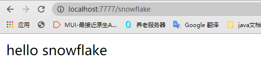

<h1 align = "center">SpringCloud(H版&Alibaba)技术（21高级部分，雪花算法【snowflake】）</h1>

# 二十一、雪花算法

## 21.1 集群高并发情况下如何保证分布式唯一全局Id生成?

### 21.1.1 问题


### 21.1.2 ID生成规则部分硬性要求


1. 


2. 


3. 


4. 


5. 


### 21.1.3  ID号生成系统的可用性要求


1. 


2. 


3. 


## 21.2一般通用方案


### 21.2.1 UUID


#### 21.2.1.1 是什么


#### 21.2.1.2  But


### 21.2.2 数据库自增主键


#### 21.2.2.1 单机


#### 21.2.2.2  集群分布式


### 21.2.3 基于Redis生成全局id策略


## 21.3 snowflake（雪花算法）


### 21.3.1 概述


### 21.3.2 结构


### 21.3.3 源码

#### 21.3.3.1  twitter的雪花算法：

https://github.com/twitter-archive/snowflake


#### 21.3.3.2  GitHub上java版的雪花算法：

https://github.com/beyondfengyu/SnowFlake/blob/master/SnowFlake.java
https://github.com/souyunku/SnowFlake/blob/master/SnowFlake.java


#### 21.3.3.3  java版雪花算法

```
public class SnowflakeIdWorker {
 // ==============================Fields==================
    /** 开始时间截 (2019-08-06) */
    private final long twepoch = 1565020800000L;
 
    /** 机器id所占的位数 */
    private final long workerIdBits = 5L;
 
    /** 数据标识id所占的位数 */
    private final long datacenterIdBits = 5L;
 
    /** 支持的最大机器id，结果是31 (这个移位算法可以很快的计算出几位二进制数所能表示的最大十进制数) */
    private final long maxWorkerId = -1L ^ (-1L << workerIdBits);
 
    /** 支持的最大数据标识id，结果是31 */
    private final long maxDatacenterId = -1L ^ (-1L << datacenterIdBits);
 
    /** 序列在id中占的位数 */
    private final long sequenceBits = 12L;
 
    /** 机器ID向左移12位 */
    private final long workerIdShift = sequenceBits;
 
    /** 数据标识id向左移17位(12+5) */
    private final long datacenterIdShift = sequenceBits + workerIdBits;
 
    /** 时间截向左移22位(5+5+12) */
    private final long timestampLeftShift = sequenceBits + workerIdBits + datacenterIdBits;
 
    /** 生成序列的掩码，这里为4095 (0b111111111111=0xfff=4095) */
    private final long sequenceMask = -1L ^ (-1L << sequenceBits);
 
    /** 工作机器ID(0~31) */
    private long workerId;
 
    /** 数据中心ID(0~31) */
    private long datacenterId;
 
    /** 毫秒内序列(0~4095) */
    private long sequence = 0L;
 
    /** 上次生成ID的时间截 */
    private long lastTimestamp = -1L;
 
     //==============================Constructors====================
    /**
     * 构造函数
     * @param workerId 工作ID (0~31)
     * @param datacenterId 数据中心ID (0~31)
     */
    public SnowflakeIdWorker(long workerId, long datacenterId) {
        if (workerId > maxWorkerId || workerId < 0) {
            throw new IllegalArgumentException(String.format("worker Id can't be greater than %d or less than 0", maxWorkerId));
        }
        if (datacenterId > maxDatacenterId || datacenterId < 0) {
            throw new IllegalArgumentException(String.format("datacenter Id can't be greater than %d or less than 0", maxDatacenterId));
        }
        this.workerId = workerId;
        this.datacenterId = datacenterId;
    }
 
    // ==============================Methods=================================
    /**
     * 获得下一个ID (该方法是线程安全的)
     * @return SnowflakeId
     */
    public synchronized long nextId() {
        long timestamp = timeGen();
 
        //如果当前时间小于上一次ID生成的时间戳，说明系统时钟回退过这个时候应当抛出异常
        if (timestamp < lastTimestamp) {
            throw new RuntimeException(
                    String.format("Clock moved backwards.  Refusing to generate id for %d milliseconds", lastTimestamp - timestamp));
        }
 
        //如果是同一时间生成的，则进行毫秒内序列
        if (lastTimestamp == timestamp) {
            sequence = (sequence + 1) & sequenceMask;
            //毫秒内序列溢出
            if (sequence == 0) {
                //阻塞到下一个毫秒,获得新的时间戳
                timestamp = tilNextMillis(lastTimestamp);
            }
        }
        //时间戳改变，毫秒内序列重置
        else {
            sequence = 0L;
        }
 
        //上次生成ID的时间截
        lastTimestamp = timestamp;
 
        //移位并通过或运算拼到一起组成64位的ID
        return ((timestamp - twepoch) << timestampLeftShift) //
                | (datacenterId << datacenterIdShift) //
                | (workerId << workerIdShift) //
                | sequence;
    }
 
    /**
     * 阻塞到下一个毫秒，直到获得新的时间戳
     * @param lastTimestamp 上次生成ID的时间截
     * @return 当前时间戳
     */
    protected long tilNextMillis(long lastTimestamp) {
        long timestamp = timeGen();
        while (timestamp <= lastTimestamp) {
            timestamp = timeGen();
        }
        return timestamp;
    }
 
    /**
     * 返回以毫秒为单位的当前时间
     * @return 当前时间(毫秒)
     */
    protected long timeGen() {
        return System.currentTimeMillis();
    }
 
    //==============================Test=============================================
    /** 测试 */
    public static void main(String[] args) {
        SnowflakeIdWorker idWorker = new SnowflakeIdWorker(0, 0);
        for (int i = 0; i < 10; i++) {
            long id = idWorker.nextId();
            System.out.println(Long.toBinaryString(id));
            System.out.println(id);
        }
    }
}
```


### 21.3.4 工程落地经验

#### 21.3.4.1 糊涂工具包


GitHub：https://github.com/looly/hutool
官网：https://www.hutool.cn/

```
    <dependencies>
        <!--hutool 引入糊涂工具包（图片验证码实现），测试雪花算法-->
        <dependency>
            <groupId>cn.hutool</groupId>
            <artifactId>hutool-captcha</artifactId>
            <version>5.3.8</version>
        </dependency>
    </dependencies>
```

```
    <dependencies>
        <!--hutool 糊涂工具包（全家桶）-->
        <dependency>
            <groupId>cn.hutool</groupId>
            <artifactId>hutool-all</artifactId>
            <version>5.3.8</version>
        </dependency>
    </dependencies>
```

#### 21.3.4.2  springboot 整合雪花算法

1. 新建项目 snowflake
2. pom

```
<dependencies>
    <!--hutool 引入糊涂工具包，测试雪花算法-->
    <dependency>
        <groupId>cn.hutool</groupId>
        <artifactId>hutool-captcha</artifactId>
        <version>5.3.8</version>
    </dependency>
    <dependency>
        <groupId>org.springframework.boot</groupId>
        <artifactId>spring-boot-starter-web</artifactId>
    </dependency>
    <dependency>
        <groupId>org.springframework.boot</groupId>
        <artifactId>spring-boot-starter-actuator</artifactId>
    </dependency>
    <dependency>
        <groupId>org.projectlombok</groupId>
        <artifactId>lombok</artifactId>
        <optional>true</optional>
    </dependency>
    <dependency>
        <groupId>org.springframework.boot</groupId>
        <artifactId>spring-boot-starter-test</artifactId>
        <scope>test</scope>
    </dependency>
</dependencies>
```

3. yml

```
server:
  port: 7777
```

4. util
   IdGeneratorSnowflake

```
@Slf4j
@Component
public class IdGeneratorSnowflake {

    private long workerId = 0;  //第几号机房
    private long datacenterId = 1;  //第几号机器
    private Snowflake snowflake = IdUtil.createSnowflake(workerId, datacenterId);

    @PostConstruct  //构造后开始执行，加载初始化工作
    public void init(){
        try{
            //获取本机的ip地址编码
            workerId = NetUtil.ipv4ToLong(NetUtil.getLocalhostStr());
            log.info("当前机器的workerId: " + workerId);
        }catch (Exception e){
            e.printStackTrace();
            log.warn("当前机器的workerId获取失败 ----> " + e);
            workerId = NetUtil.getLocalhostStr().hashCode();
        }
    }

    public synchronized long snowflakeId(){
        return snowflake.nextId();
    }

    public synchronized long snowflakeId(long workerId, long datacenterId){
        Snowflake snowflake = IdUtil.createSnowflake(workerId, datacenterId);
        return snowflake.nextId();
    }

    //测试
    public static void main(String[] args) {
        System.out.println(new IdGeneratorSnowflake().snowflakeId());   //1277896081711169536
    }
}
```

5. service
   OrderService

```
@Service
public class OrderService {

    @Autowired
    private IdGeneratorSnowflake idGenerator;

    public String getIDBySnowFlake() {
        //新建线程池（5个线程）
        ExecutorService threadPool = Executors.newFixedThreadPool(5);

        for (int i = 1; i <= 20; i++) {
            threadPool.submit(() -> {
                System.out.println(idGenerator.snowflakeId());
            });
        }

        threadPool.shutdown();

        return "hello snowflake";
    }
}
```

6. controller
   OrderController

```
@RestController
public class OrderController {

    @Autowired
    private OrderService orderService;

    @RequestMapping("/snowflake")
    public String index(){
        return orderService.getIDBySnowFlake();
    }

}
```

7. 主启动类
   MainApp

```
@SpringBootApplication
public class MainApp {
    public static void main(String[] args) {
        SpringApplication.run(MainApp.class, args);
    }
}
```

8. 启动项目，浏览器输入`http://localhost:7777/snowflake`



 


#### 21.3.4..3 优缺点


##### 21.3.4..3.1 解决时钟回拨问题

