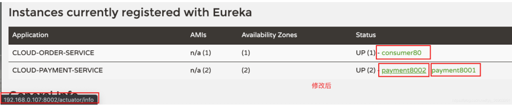

<h1 align = "center">SpringCloud(H版&Alibaba)技术（5-7初级部分，注册中心【Eureka、Zookeeper和Consul】）</h1>

# 5、Eureka服务注册与发现

## 5.1 Eureka基础知识

### 5.1.1 服务治理


### 5.1.2 服务注册


 


### 5.1.3 Eureka两组件


## 5.2 单机Eureka构建步骤

### 5.2.1 生成eurekaServer端服务注册中心

#### 5.2.1.1 建module

cloud-eureka-server7001

#### 5.2.1.2 改pom

server端依赖对比：


在pom中添加

```
  <dependencies>
      <!-- eureka-server -->
      <dependency>
          <groupId>org.springframework.cloud</groupId>
          <artifactId>spring-cloud-starter-netflix-eureka-server</artifactId>
      </dependency>
      <!-- 引用自己定义的api通用包，可以使用Payment支付Entity -->
      <dependency>
          <groupId>com.angenin.springcloud</groupId>
          <artifactId>cloud-api-commons</artifactId>
          <version>${project.version}</version>
      </dependency>
      <dependency>
          <groupId>org.springframework.boot</groupId>
          <artifactId>spring-boot-starter-web</artifactId>
      </dependency>
      <!--监控-->
      <dependency>
          <groupId>org.springframework.boot</groupId>
          <artifactId>spring-boot-starter-actuator</artifactId>
      </dependency>
      <!-- 一般通用配置 -->
      <dependency>
          <groupId>org.springframework.boot</groupId>
          <artifactId>spring-boot-devtools</artifactId>
          <scope>runtime</scope>
          <optional>true</optional>
      </dependency>
      <dependency>
          <groupId>org.projectlombok</groupId>
          <artifactId>lombok</artifactId>
          <optional>true</optional>
      </dependency>
      <dependency>
          <groupId>org.springframework.boot</groupId>
          <artifactId>spring-boot-starter-test</artifactId>
          <scope>test</scope>
      </dependency>
  </dependencies>
```

#### 5.2.1.3 写yml

在resources目录下新建 application.yml 文件

```
server:
  port: 7001

eureka:
  instance:
    hostname: localhost  #eureka服务端的实例名称
  client:
    #false表示不向注册中心注册自己（想注册也可以，不过没必要）
    register-with-eureka: false
    #false表示自己端就是注册中心，职责就是维护服务实例，并不需要去检索服务
    fetch-registry: false
    service-url:
      #设置与eurekaServer交互的地址查询服务和注册服务都需要依赖这个地址
      defaultZone: http://${eureka.instance.hostname}:${server.port}/eureka/
```

#### 5.2.1.4 主启动

在java包下新建 com.angenin.springcloud.EurekaMain7001

```
@EnableEurekaServer //表示此项目是eureka的服务注册中心
@SpringBootApplication
public class EurekaMain7001 {
    public static void main(String[] args) {
        SpringApplication.run(EurekaMain7001.class, args);
    }
}
```

#### 5.2.1.5 测试

启动项目，在浏览器输入`http://localhost:7001/` 


### 5.2.2 将EurekaClient端8001注册进EurekaServer成为服务提供者provider

client端  新旧版本对比依赖对比


#### 5.2.2.1 引入依赖

```
 <!-- eureka-client -->
 <dependency>
     <groupId>org.springframework.cloud</groupId>
     <artifactId>spring-cloud-starter-netflix-eureka-client</artifactId>
 </dependency>
```

#### 5.2.2.2 在yml文件中添加

```
eureka:
  client:
    #true表示向注册中心注册自己，默认为true
    register-with-eureka: true
    #是否从EurekaServer抓取已有的注册信息，默认为true。单节点无所谓，集群必须设置为true才能配合ribbon使用负载均衡
    fetch-registry: true
    service-url:
      defaultZone: http://localhost:7001/eureka
```

#### 5.2.2.3  注解配置

在主配置类上加上`@EnableEurekaClient`注解，表示这个项目是eureka的客户端


#### 5.2.2.4 项目启动

启动项目，然后刷新页面，成功注册进注册中心


在yml文件中application.name就是注册进注册中心时的应用名。


### 5.2.3 将EurekaClient端80注册进EurekaServer成为服务消费者consumer

#### 5.2.3.1 引入依赖

```
 <!-- eureka-client -->
 <dependency>
     <groupId>org.springframework.cloud</groupId>
     <artifactId>spring-cloud-starter-netflix-eureka-client</artifactId>
 </dependency>
```

#### 5.2.3.2 在yml文件中添加

```
spring:
  application:
    name: cloud-order-service

eureka:
  client:
    register-with-eureka: true
    fetch-registry: true
    service-url:
      defaultZone: http://localhost:7001/eureka
```

#### 5.2.3.3  注解配置

在主配置类上加上`@EnableEurekaClient`注解


#### 5.2.3.4 项目启动

启动项目，刷新页面


#### 5.2.3.5 测试

http://localhost/consumer/payment/get/1


## 5.3 集群Eureka构建步骤

### 5.3.1 原理说明


搭建Eureka注册中心集群，实现负载均衡+故障容错。

Eureka集群：**相互注册，相互守望**。


### 5.3.2 构建eurekaServer集群环境

1. 参照 cloud-eureka-server7001 新建 cloud-eureka-server7002 和 cloud-eureka-server7003 

2. Windows系统的兄弟就跟着老师修改hosts文件,   
   
    C:\Windows\System32\drivers\etc

   
   
   因为我的是mac系统的，接下来写的步骤是mac的 
   打开终端，输入sudo vim /etc/hosts来修改hosts文件。（权限不够需要加上sudo并输入密码）
   在最后一行加入：

   ```
127.0.0.1       eureka7001.com
   127.0.0.1       eureka7002.com
   127.0.0.1		eureka7003.com
   ```
   
   然后`:wq!`保存退出。
   
3. 修改7001的yml文件

   ```
   eureka:
     instance:
       hostname: eureka7001.com  #eureka服务端的实例名称
     client:
       register-with-eureka: false
       fetch-registry: false
       service-url:
   #      单机
   #      defaultZone: http://${eureka.instance.hostname}:${server.port}/eureka/
         #集群版  相互注册，相互守望
         defaultZone: http://eureka7002.com:7002/eureka/, http://eureka7003.com:7003/eureka/ 
         
         
   #    defaultZone是固定写法，如果想自定义，需要按以下写法才行：
   #    region: eureka-server
   #    availability-zones:
   #      eureka-server: server1,server2
   #    service-url:
   #      server1: http://eureka7002.com:7002/eureka/
   #      server2: http://eureka7003.com:7003/eureka/
   ```

4. 修改7002的yml文件

   ```
   eureka:
     instance:
       hostname: eureka7002.com  #eureka服务端的实例名称
     client:
       register-with-eureka: false
       fetch-registry: false
       service-url:
          
   ```

5. 修改7003的yml文件

   ```
   eureka:
     instance:
       hostname: eureka7003.com  #eureka服务端的实例名称
     client:
       register-with-eureka: false
       fetch-registry: false
       service-url:
         #集群版  相互注册，相互守望
         defaultZone: http://eureka7001.com:7001/eureka/, http://eureka7002.com:7002/eureka/ #相互注册，相互守望
   ```

6. 然后启动这三个项目

   http://eureka7001.com:7001/


http://eureka7002.com:7002/


http://eureka7003.com:7003/


### 5.3.3 将支付服务8001和订单服务80微服务发布到集群配置中

把两个项目的yml文件中的defaultZone改为：

```
 #集群版
defaultZone: http://eureka7001.com:7001/eureka,http://eureka7002.com:7002/eureka,http://eureka7003.com:7003/eureka
```

启动5个项目进行测试：（先启动集群，再启动8001，最后启动80）
集群后台截图：


### 5.3.4 构建支付服务提供者集群环境

1. 按照8001新建8002（只多建了一个提供者，建多了怕电脑受不了）。（除了要yml文件中需要改端口号和主配置类，其他直接复制8001的，yml文件中的应用名不需要改，因为是集群，所以应用名需要一致）

2. 分别在所有的提供者的 PaymentController 中加入：（这个@Value是spring的注解）


3. 代码  参考

```
package com.angenin.springcloud.controller;


import com.angenin.springcloud.entities.CommonResult;
import com.angenin.springcloud.entities.Payment;
import com.angenin.springcloud.service.PaymentService;
import lombok.extern.slf4j.Slf4j;
import org.springframework.beans.factory.annotation.Value;
import org.springframework.web.bind.annotation.*;

import javax.annotation.Resource;

@RestController
@Slf4j  //日志
public class PaymentController {

    @Resource
    private PaymentService paymentService;

    @Value("${server.port}")
    private String serverPort;

    //前后端分离，所以不能直接返回对象，数据要先经过CommonResult封装再返回
    // @RequestBody 接收前端传来的json
    //  @RequestParam() 接收url 上传来的参数
    @PostMapping("/payment/create")
    public CommonResult create(@RequestBody Payment payment){
        int result = paymentService.create(payment);
        log.info("******插入的数据是: " + payment);
        log.info("******插入的结果是: " + result);
        if (result > 0) {
            return new CommonResult(200, "插入数据库成功, serverPort: +" + serverPort,payment);
        }else {
            return new CommonResult(444, "插入数据失败");
        }
    }

    @GetMapping("/payment/get/{id}")
    // @PathVariable 可以将URL中占位符参数 {id} 绑定到处理器类的方法形参中 @PathVariable("id")
    public CommonResult getPaymentById(@PathVariable("id") Long id){
        Payment payment = paymentService.getPaymentById(id);
        log.info("******查询结果是: " + payment );

        if (payment != null){
            return new CommonResult(200 , "查询成功 serverPort: +" + serverPort,payment);
        }else {
            return new CommonResult(444,"没有对应记录,查询id: " + id,null);
        }
    }
}
```

4. 修改消费者的OrderController，把写死的url改为服务名称：

```
public static final String PAYMENT_URL = "http://CLOUD-PAYMENT-SERVICE";
```

5. 然后在消费者的ApplicationContextConfig里的restTemplate方法上加上`@LoadBalanced`，开启负载均衡功能

   

6. 启动eurekaServer集群，启动提供者集群，启动消费者 

*如果启动提供者后出现，这个错误：`Public Key Retrieval is not allowed`*
*请在yml文件中的  datasource.datasource.url 后加上`&allowPublicKeyRetrieval=true`即可解决。*


另外两个eurekaserver也一样，就不截图。
在浏览器中输入`http://localhost/consumer/payment/get/1`，多次刷新可以看到，提供服务的应用在不同的切换，实现负载均衡的效果。


## 5.4 actuator微服务信息完善

修改三个微服务的yml文件：

 服务提供者: 8001 8002  	消费者: 80    

```
#######8001#######
# client:	
#	 ...	instance要和client对齐
  instance:
    instance-id: payment8001
    prefer-ip-address: true   #访问路径可以显示ip地址

#######8002#######
  instance:
    instance-id: payment8002   #修改显示的主机名
    prefer-ip-address: true   #访问路径可以显示ip地址
    
#######80#######
  instance:
    instance-id: consumer80   #修改显示的主机名
    prefer-ip-address: true   #访问路径可以显示ip地址
```


修改前：


修改后：



## 5.5 服务发现 Discovery

对于注册进eureka里面的微服务，可以通过服务发现来获得该服务的信息。

### 5.5.1 修改提供者集群的controller

1. 在主配置类上加上`@EnableDiscoveryClient` 注解，启用发现客户端

2. 在两个提供者的 PaymentController 中加入：

```

    @Resource
    private DiscoveryClient discoveryClient;	//springframework的DiscoveryClient（不要导错包了）
    

    @GetMapping("/payment/discovery")
    public Object discovery(){
        //获取服务列表的信息
        List<String> services = discoveryClient.getServices();
        for (String element : services) {
            log.info("*******element：" + element);
        }

        //获取CLOUD-PAYMENT-SERVICE服务的所有具体实例
        List<ServiceInstance> instances = discoveryClient.getInstances("CLOUD-PAYMENT-SERVICE");
        for (ServiceInstance instance : instances) {
            //getServiceId服务器id getHost主机名称 getPort端口号  getUri地址
            log.info(instance.getServiceId() + "\t" + instance.getHost() + "\t" + instance.getPort() + "\t" + instance.getUri());
        }

        return this.discoveryClient;
    }

}
```

### 5.5.2 测试

对8001进行测试，在浏览器输入：`http://localhost:8001/payment/discovery`  

对8002进行测试，在浏览器输入：`http://localhost:8002/payment/discovery`  


## 5.6 Eureka自我保护

### 5.6.1 概述


### 5.6.2 导致原因


*只有在一定时间内丢失大量服务的心跳才开启自我保护模式。*

### 5.6.3 禁止自我保护

先把 cloud-eureka-server7001 和c loud-provider-payment8001 都切回单机版测试禁止自我保护。

cloud-eureka-server7001的yml文件：

```
#  client
#  	...		server与client对齐
  server:
    #关闭自我保护，默认为true
    enable-self-preservation: false
    #心跳的间隔时间，单位毫秒
    eviction-interval-timer-in-ms: 2000
```

cloud-provider-payment8001的yml文件：

```
    #Eureka客户端向服务端发送心跳的时间间隔，单位秒（默认30秒）
    lease-renewal-interval-in-seconds: 1
    #Eureka服务端在收到最后一次心跳后等待的时间上限，单位秒（默认90秒），超时剔除服务
    lease-expiration-duration-in-seconds: 2
```


启动注册中心和提供者：


然后关闭提供者（模拟网络延时），提供者直接被剔除。


# 6. Zookeeper服务注册与发现

## 6.1 注册中心Zookeeper


关闭linux的防火墙

```
systemctl stop firewalld
systemctl status firewalld
```


使用docker启动Zookeeper：（docker的操作可以看这篇：[Docker基础入门学习笔记](https://blog.csdn.net/qq_36903261/article/details/105870268)）

用的 这台虚拟机


```
#拉取Zookeeper镜像
docker pull zookeeper

#启动Zookeeper
docker run --name zk01 -p 2181:2181 --restart always -d zookeeper
```

服务节点是临时节点还是持久节点 ?

zookeeper也是有心跳机制，在一定时间能如果一直没心跳返回，Zookeeper就会把服务节点剔除掉。所以在Zookeeper上的服务节点是临时节点。

## 6.2 服务提供者

为了区分，中间空个8003。

1. 新建工程 cloud-provider-payment8004

2. pom   (引入的zookeeper 会让log4j包冲突 ,所以忽略了它)

```
<dependencies>
        <!--因为接下来不会用到数据库，所以不导入数据库相关的依赖（防止没配置而报错）-->

        <!--替换掉eureka依赖，其他直接复制8001-->
        <!--SpringBoot整合Zookeeper客户端-->
        <dependency>
            <groupId>org.springframework.cloud</groupId>
            <artifactId>spring-cloud-starter-zookeeper-discovery</artifactId>
            <!--先排除自带的zookeeper3.5.3-->
            <exclusions>
                <exclusion>
                    <groupId>org.apache.zookeeper</groupId>
                    <artifactId>zookeeper</artifactId>
                </exclusion>
            </exclusions>
        </dependency>

        <!--添加zookeeper3.4.9版本（引入对应版本的依赖）-->
        <dependency>
            <groupId>org.apache.zookeeper</groupId>
            <artifactId>zookeeper</artifactId>
            <version>3.4.9</version>
            <exclusions>
                <exclusion>
                    <groupId>org.slf4j</groupId>
                    <artifactId>slf4j-log4j12</artifactId>
                </exclusion>
            </exclusions>
        </dependency>


        <!-- 引用自己定义的api通用包，可以使用Payment支付Entity -->
        <dependency>
            <groupId>com.angenin.springcloud</groupId>
            <artifactId>cloud-api-commons</artifactId>
            <version>${project.version}</version>
        </dependency>
        <dependency>
            <groupId>org.springframework.boot</groupId>
            <artifactId>spring-boot-starter-web</artifactId>
        </dependency>
        <dependency>
            <groupId>org.springframework.boot</groupId>
            <artifactId>spring-boot-starter-actuator</artifactId>
        </dependency>
        <dependency>
            <groupId>org.mybatis.spring.boot</groupId>
            <artifactId>mybatis-spring-boot-starter</artifactId>
        </dependency>
        <dependency>
            <groupId>com.alibaba</groupId>
            <artifactId>druid-spring-boot-starter</artifactId>
            <version>1.1.20</version>
            <!--子工程写了版本号，就使用子工程的版本号，如果没写版本,找父工程中规定的版本号-->
        </dependency>
        <!--mysql-connector-java-->
        <dependency>
            <groupId>mysql</groupId>
            <artifactId>mysql-connector-java</artifactId>
        </dependency>
        <!--jdbc-->
        <dependency>
            <groupId>org.springframework.boot</groupId>
            <artifactId>spring-boot-starter-jdbc</artifactId>
        </dependency>
        <!--热部署-->
        <dependency>
            <groupId>org.springframework.boot</groupId>
            <artifactId>spring-boot-devtools</artifactId>
            <scope>runtime</scope>
            <optional>true</optional>
        </dependency>
        <dependency>
            <groupId>org.projectlombok</groupId>
            <artifactId>lombok</artifactId>
            <optional>true</optional>
        </dependency>
        <dependency>
            <groupId>org.springframework.boot</groupId>
            <artifactId>spring-boot-starter-test</artifactId>
            <scope>test</scope>
        </dependency>
    </dependencies>
```

3. yml

```
#微服务建议一定要写服务端口号和微服务名称
server:
  #端口号
  port: 8004

spring:
  application:
    #微服务名称
    name: cloud-provider-payment
  #数据库配置
  datasource:
    type: com.alibaba.druid.pool.DruidDataSource
    #mysql5.x的没有cj
    driver-class-name: com.mysql.cj.jdbc.Driver
    #记得先创建数据库
    url: jdbc:mysql://localhost:3306/springcloud2021?useUnicode=true&characterEncoding=utf-8&serverTimezone=GMT%2B8
    username: root
    password: root
  cloud:
    zookeeper:
      connect-string: 192.168.101.130:2181 #linux的ip加暴露的端口号

#mybatis配置
mybatis:
  # resources 下面的mapper
  mapper-locations: classpath:mapper/*.xml
  type-aliases-package: com.angenin.springcloud.com.angenin.springcloud.entities  #所有Entity别名类所在包


```

4. 主启动类   PaymentMain8004

```
@EnableDiscoveryClient	//该注解用于向使用consul或者Zookeeper作为注册中心时注册服务
@SpringBootApplication
public class PaymentMain8004 {
    public static void main(String[] args) {
        SpringApplication.run(PaymentMain8004.class, args);
    }
}
```

5. controller

新建  controller.PaymentController 

```
@Slf4j
@RestController
public class PaymentController {

    @Value("${server.port}")        //获取端口号
    private String serverPort;

    @RequestMapping("/payment/zk")
    public String paymentzk(){
        return "springcloud with zookeeper：" + serverPort + "\t" + UUID.randomUUID().toString();
    }

}
```

6. Zookeeper容器

默认已经帮我们启动了服务端和客户端，如果想进去容器的话，使用下面的命令。

参考文档  https://blog.csdn.net/qq_39440507/article/details/112852968

```
#查看正在运行的容器（查看Zookeeper容器的id）
docker ps

#进入zookeeper容器
docker exec -it 容器ID /bin/bash

# 运行zookeeper客户端 ：在容器bin文件夹下
cd bin/
ls
zkCli.sh     ( 注意C是大写)

# 查看
ls /
ls /services

#测试 参考下面图片
ls /services/
ls /services/cloud-payment-service
ls /services/cloud-payment-service/693b9c3a-faac-434e-a5ce-136e3b133877
get /services/cloud-payment-service/693b9c3a-faac-434e-a5ce-136e3b133877

#退出容器（或者按快捷键ctrl+P+Q退出）
exit
#启动容器
docker start 容器ID
#关闭容器
docker stop 容器ID
```


7. 启动8004项目，浏览器输入`http://localhost:8004/payment/zk`


8. 进入Zookeeper容器（成功注册进注册中心  就是第六步的内容）


https://tool.lu/json/


## 6.3 服务消费者

1. 新建消费者模块 cloud-consumerzk-order80 

2. pom和yml直接复制8004。（yml中端口号改为 80，应用名改为 cloud-consumer-order ，其他都相同）

   yml 内容

   ```
   #微服务建议一定要写服务端口号和微服务名称
   server:
     #端口号
     port: 80
   
   spring:
     application:
       #微服务名称
       name: cloud-consumer-order
     #数据库配置
     datasource:
       type: com.alibaba.druid.pool.DruidDataSource
       #mysql5.x的没有cj
       driver-class-name: com.mysql.cj.jdbc.Driver
       #记得先创建数据库
       url: jdbc:mysql://localhost:3306/springcloud2021?useUnicode=true&characterEncoding=utf-8&serverTimezone=GMT%2B8
       username: root
       password: root
     cloud:
       zookeeper:
         connect-string: 192.168.101.130:2181 #linux的ip加暴露的端口号
   
   #mybatis配置
   mybatis:
     # resources 下面的mapper
     mapper-locations: classpath:mapper/*.xml
     type-aliases-package: com.angenin.springcloud.com.angenin.springcloud.entities  #所有Entity别名类所在包
   ```

3. 主启动类 。 名称 order80ZK（其他与8004相同）

4. 在springcloud包下新建 config.ApplicationContextConfig

   ```
   @Configuration
   public class ApplicationContextConfig {
   
       @Bean
       @LoadBalanced   //负载均衡
       public RestTemplate restTemplate(){
           return new RestTemplate();
       }
   
   }
   ```

5. 新建 controller.OrderZKController

   ```
   @RestController
   @Slf4j
   public class OrderZKController {
   
       public static final String INVOKE_URL = "http://cloud-provider-payment";
   
       @Resource
       private RestTemplate restTemplate;
   
       @RequestMapping("/consumer/payment/zk")
       public String paymentInfo(){
           String result = restTemplate.getForObject(INVOKE_URL + "/payment/zk", String.class);
           return result;
       }
   
   }
   ```

6. 启动项目 查看容器变化

   

`http://localhost/consumer/payment/zk


# 7. Consul服务注册与发现

Consul官网：https://www.consul.io/
Consul中文文档：https://www.springcloud.cc/spring-cloud-consul.html

## 7.1 简介

Consul是一种服务网格解决方案，提供具有服务发现，配置和分段功能的全功能控制平面。这些功能中的每一个都可以根据需要单独使用，也可以一起使用以构建完整的服务网格。Consul需要一个数据平面，并支持代理和本机集成模型。Consul附带了一个简单的内置代理，因此一切都可以直接使用，还支持Envoy等第三方代理集成。


## 7.2 主要特点

1. 服务发现：Consul的客户端可以注册服务，例如 api或mysql，其他客户端可以使用Consul来发现给定服务的提供者。使用DNS或HTTP，应用程序可以轻松找到它们依赖的服务。

2. 健康检测：领事客户端可以提供任意数量的运行状况检查，这些检查可以与给定服务（“ Web服务器是否返回200 OK”）或本地节点（“内存利用率低于90％”）相关。操作员可以使用此信息来监视群集的运行状况，服务发现组件可以使用此信息将流量从不正常的主机发送出去。

3. KV存储：应用程序可以将Consul的分层键/值存储用于多种目的，包括动态配置，功能标记，协调，领导者选举等。简单的HTTP API使其易于使用。

4. 安全的服务通信：领事可以为服务生成并分发TLS证书，以建立相互TLS连接。 意图 可用于定义允许哪些服务进行通信。可以使用可以实时更改的意图轻松管理服务分段，而不必使用复杂的网络拓扑和静态防火墙规则。

5. 多数据中心：Consul开箱即用地支持多个数据中心。这意味着Consul的用户不必担心会构建其他抽象层以扩展到多个区域。
   

Consul旨在对DevOps社区和应用程序开发人员友好，使其非常适合现代，灵活的基础架构。

## 7.3 在docker上安装启动consul

```
#拉取consul镜像
docker pull consul

#启动consul
docker run -d  -p 8500:8500/tcp --name myConsul  consul agent -server -ui -bootstrap-expect=1 -client=0.0.0.0
```

然后在浏览器输入`http://http://192.168.101.130/:8500`（linux的IP地址加上冒号8500）


## 7.4 服务提供者

1. 新建服务提供者 cloud-provider-consul-payment8006 
2. pom复制8004。（用下面的依赖替换Zookeeper的依赖）

```
 <!--SpringCloud consul-server-->
  <dependency>
      <groupId>org.springframework.cloud</groupId>
      <artifactId>spring-cloud-starter-consul-discovery</artifactId>
  </dependency>
```

3. yml

```
server:
  port: 8006


spring:
  application:
    name: consul-provider-payment
  #数据库配置
  datasource:
    type: com.alibaba.druid.pool.DruidDataSource
    #mysql5.x的没有cj
    driver-class-name: com.mysql.cj.jdbc.Driver
    #记得先创建数据库
    url: jdbc:mysql://localhost:3306/springcloud2021?useUnicode=true&characterEncoding=utf-8&serverTimezone=GMT%2B8
    username: root
    password: root
  cloud:
    consul:
      host: 192.168.101.130  #用linux的ip地址（consul在本机就填localhost）
      port: 8500
      discovery:
        service-name: ${spring.application.name}
        heartbeat:
          enabled: true

#mybatis配置
mybatis:
  # resources 下面的mapper
  mapper-locations: classpath:mapper/*.xml
  type-aliases-package: com.angenin.springcloud.com.angenin.springcloud.entities  #所有Entity别名类所在包
```

这里和视频里面不同,视频有问题


4. 主启动类（与8004相同）

5. 新建 controller 包， 下面创建  PaymentController 

```
@RestController
@Slf4j
public class PaymentController {

    @Value("${server.port}")        //获取端口号
    private String serverPort;

    @RequestMapping("/payment/consul")
    public String paymentConsul(){
        return "springcloud with zookeeper：" + serverPort + "\t" + UUID.randomUUID().toString();
    }

}
```

6. 启动项目 

http://192.168.101.130:8500/ui/dc1/services


http://localhost:8006/payment/consul


## 7.5 服务消费者

1. 新建模块 cloud-consumer-consul-order80

2. pom（与8006相同）

3. yml（端口号为80，应用名为 consul-consumer-order ，其他和8006相同）

4. 主启动类  ConsulOrder80（与8006相同）

5. config（和zk的消费者相同）

6. controller.OrderConsulController

   ```
   @RestController
   @Slf4j
   public class OrderConsulController {
   
       public static final String INVOKE_URL = "http://consul-provider-payment";
   
       @Resource
       private RestTemplate restTemplate;
   
       @RequestMapping("/consumer/payment/consul")
       public String paymentInfo(){
           String result = restTemplate.getForObject(INVOKE_URL + "/payment/consul", String.class);
           return result;
       }
   
   }
   ```

7. 启动项目


http://localhost/consumer/payment/consul


## 7.6  三者的异同点(总结)


```
CAP：（只能二选一）
A：可用性
C：一致性
P：分区容错性（微服务架构必须保证有P）
```


