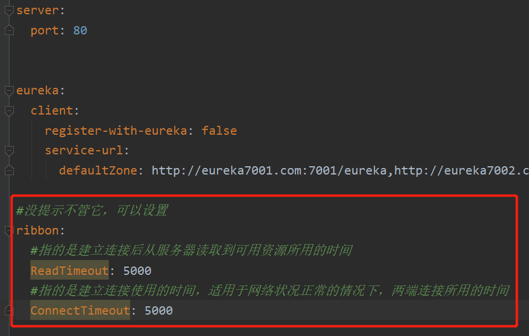
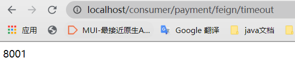
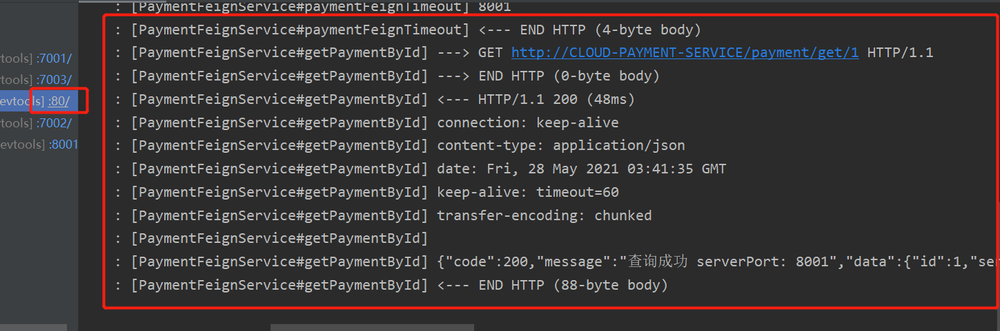

<h1 align = "center">SpringCloud(H版&Alibaba)技术（8-9初级部分，服务调用【Ribbon与OpenFeign】）</h1>

# 8. Ribbon负载均衡服务调用

恢复eureka集群环境，以便接下来的练习。

## 8.1 简介


### 8.1.1 负载均衡


## 8.2 Ribbon（负载均衡+RestTemplate调用）

Ribbon是客户端（消费者）负载均衡的工具。 


### 8.2.1 pom

```
  <!--Ribbon的依赖-->
  <dependency>
      <groupId>org.springframework.cloud</groupId>
      <artifactId>spring-cloud-starter-netflix-ribbon</artifactId>
 </dependency>
```

之前用的新版 eureka依赖以及集成了Ribbon依赖，所以可以不引用。

```
<!--新版的eureka依赖-->
<dependency>
            <groupId>org.springframework.cloud</groupId>
            <artifactId>spring-cloud-starter-netflix-eureka-client</artifactId>
</dependency>
```


### 8.2.2 RestTemplate

@LoadBalanced注解给RestTemplate开启负载均衡的能力。

官方文档：https://docs.spring.io/spring-framework/docs/5.2.2.RELEASE/javadoc-api/org/springframework/web/client/RestTemplate.html


#### 8.2.2.1 getForObject/getForEntity方法


##### 8.2.2.1.1 测试getForEntity方法

在消费者cloud-consumer-order80的 OrderController方法中添加：

```
  @GetMapping("/consumer/payment/get/{id}")
    public CommonResult<Payment>  getPayment(@PathVariable("id") Long id){
        log.info("********查询的id: " + id);
        //getForObject两个参数：请求地址，返回的对象类型
        return restTemplate.getForObject(PAYMENT_URL + "/payment/get/"  + id ,CommonResult.class);
    }

    @GetMapping("/consumer/payment/getEntity/{id}")
    public CommonResult<Payment> getPayment2(@PathVariable("id") Long id){
        log.info("********查询的id: " + id);
        //getForObject两个参数：请求地址，返回的对象类型
        ResponseEntity<CommonResult> entity = restTemplate.getForEntity(PAYMENT_URL + "/payment/get/" + id, CommonResult.class);
        //getStatusCode获取状态码，is2xxSuccessful如果是状态码是2xx
        if (entity.getStatusCode().is2xxSuccessful()){
            // 返回 body
            log.info("********查询的getStatusCodeValue " + entity.getStatusCodeValue());
            return  entity.getBody();
        }else {
            return  new CommonResult<>(444 , "操作失败");
        }
    }
```

然后启动eureka集群，提供者集群，消费者。
在浏览器输入http://localhost/consumer/payment/getEntity/1


#### 8.2.2.2 postForObject/postForEntity方法

```
 @GetMapping("/consumer/payment/createEntity")
    public CommonResult<Payment> create2(Payment payment){
        log.info("*******插入的数据: " + payment);
        //postForEntity分别有三个参数：请求地址，请求参数，返回的对象类型
        ResponseEntity<CommonResult> postForEntity = restTemplate.postForEntity(PAYMENT_URL + "/payment/create", payment, CommonResult.class);
        if (postForEntity.getStatusCode().is2xxSuccessful()){
            log.info("********getStatusCode "  + postForEntity.getStatusCode());
            return postForEntity.getBody();
        }else {
            return  new CommonResult<>(444, "操作失败");
        }
    }
```

输入`http://localhost//consumer/payment/createEntity?serial=田七`，插入一条数据。


## 8.3 Ribbon核心组件IRUle

IRUle接口的实现类：


*默认为RoundRobinRule轮询。*

### 8.3.1 替换


Ribbon的自定义配置类不可以放在@ComponentScan所扫描的当前包下以及子包下，否则这个自定义配置类就会被所有的Ribbon客户端共享，达不到为指定的Ribbon定制配置，而@SpringBootApplication注解里就有@ComponentScan注解，所以不可以放在主启动类所在的包下。（因为Ribbon是客户端（消费者）这边的，所以Ribbon的自定义配置类是在客户端（消费者）添加，不需要在提供者或注册中心添加）


1. 所以Ribbon的自定义配置类不能放在springcloud包下，要在angenin包下再新建一个 myrule 包。


2. 在此包下新建 MySelfRule 自定义配置类

```
@Configuration
public class MySelfRule {

    @Bean
    public IRule myRule(){
        return new RandomRule();    //负载均衡机制改为随机
    }

}
```

3. 在主启动类上添加 @RibbonClient(name = "CLOUD-PAYMENT-SERVICE", configuration = MySelfRule.class)
   name为指定的服务名（服务名必须与注册中心显示的服务名大小写一致）
   configuration为指定服务使用自定义配置（自定义负载均衡机制）


4. 启动eurekaserver集群，提供者集群，消费者。

5. 浏览器输入`http://localhost/consumer/payment/get/1`，多次刷新实现负载均衡为随机。

## 8.4 Ribbon负载均衡——轮询算法

### 8.4.1 RoundRobinRule原理


取余

### 8.4.2 RoundRobinRule源码

RoundRobinRule的核心为choose方法：

```
public class RoundRobinRule extends AbstractLoadBalancerRule {
	//AtomicInteger原子整形类
    private AtomicInteger nextServerCyclicCounter;
	...
    public RoundRobinRule() {
    	//此时nextServerCyclicCounter是一个原子整形类，并且value为0
        nextServerCyclicCounter = new AtomicInteger(0);
    }
	...
	//ILoadBalancer选择的负载均衡机制，这里lb为轮询
    public Server choose(ILoadBalancer lb, Object key) {
    	//如果传入的lb没有负载均衡，为空
        if (lb == null) {
            log.warn("no load balancer");
            return null;
        }

        Server server = null;
        int count = 0;
        //还没选到执行的server，并且选择的次数没超过10次，进行选择server
        while (server == null && count++ < 10) {
        	//lb.getReachableServers获取所有状态是up的服务实例
            List<Server> reachableServers = lb.getReachableServers();
            //lb.getAllServers获取所有服务实例
            List<Server> allServers = lb.getAllServers();
            //状态为up的服务实例的数量
            int upCount = reachableServers.size();
            //所有服务实例的数量
            int serverCount = allServers.size();
			
			//如果up的服务实例数量为0或者服务实例为0，打印日志log.warn并返回server=null
            if ((upCount == 0) || (serverCount == 0)) {
                log.warn("No up servers available from load balancer: " + lb);
                return null;
            }
			
			//获取到接下来server的下标
            int nextServerIndex = incrementAndGetModulo(serverCount);
            //获取下一个server
            server = allServers.get(nextServerIndex);

			//如果
            if (server == null) {
                //线程让步，线程会让出CPU执行权，让自己或者其它的线程运行。（让步后，CPU的执行权也有可能又是当前线程）
                Thread.yield();
                //进入下次循环
                continue;
            }
			
			//获取的server还活着并且还能工作，则返回该server
            if (server.isAlive() && (server.isReadyToServe())) {
                return (server);
            }

            //否则server改为空
            server = null;
        }

		//选择次数超过10次，打印日志log.warn并返回server=null
        if (count >= 10) {
            log.warn("No available alive servers after 10 tries from load balancer: "
                    + lb);
        }
        return server;
    }


    private int incrementAndGetModulo(int modulo) {
    	//CAS加自旋锁
    	//CAS（Conmpare And Swap）：是用于实现多线程同步的原子指令。CAS机制当中使用了3个基本操作数：内存地址V，旧的预期值A，要修改的新值B。更新一个变量的时候，只有当变量的预期值A和内存地址V当中的实际值相同时，才会将内存地址V对应的值修改为B。
    	//自旋锁：是指当一个线程在获取锁的时候，如果锁已经被其它线程获取，那么该线程将循环等待，然后不断的判断锁是否能够被成功获取，直到获取到锁才会退出循环。 
        for (;;) {
        	//获取value，即0
            int current = nextServerCyclicCounter.get();
            //取余，为1
            int next = (current + 1) % modulo;
            //进行CAS判断，如果此时在value的内存地址中，如果value和current相同，则为true，返回next的值，否则就一直循环，直到结果为true
            if (nextServerCyclicCounter.compareAndSet(current, next))
                return next;
        }
    }
    ...
}
```

AtomicInteger的compareAndSet方法：

```
public class AtomicInteger extends Number implements java.io.Serializable {
	...
    public final boolean compareAndSet(int expect, int update) {
        return unsafe.compareAndSwapInt(this, valueOffset, expect, update);
    }
    ...
}
```

### 8.4.3 手写一个轮询自定义配置类

#### 8.4.3.1 8001和8002微服务改造

在8001和8002的PaymentController中加上这个方法，用于测试我们的自定义轮询:

```
    @GetMapping("/payment/lb")
    public String getPaymentLB(){
        return serverPort;
    }
```

#### 8.4.3.2 80订单微服务改造


1. 去掉 ApplicationContextConfig 里 restTemplate 方法上的 @LoadBalanced 注解。
2. 在springcloud包下新建 lb.ILoadBalancer 接口（自定义负载均衡机制（面向接口））

```
public interface ILoadBalancer {

    //传入具体实例的集合，返回选中的实例
    ServiceInstance instances(List<ServiceInstance> serviceInstance);

}
```

3. 在lb包下新建自定义 ILoadBalancer 接口的实现类 MyLB

```
@Component  //加入容器
public class MyLB implements ILoadBalancer {

    //新建一个原子整形类
    private AtomicInteger atomicInteger = new AtomicInteger(0);

    //
    public final int getAndIncrement(){
        int current;
        int next;
        do{
            current = this.atomicInteger.get();
            //如果current是最大值，重新计算，否则加1（防止越界）
            next = current >= Integer.MAX_VALUE ? 0 : current + 1;

        //进行CAS判断，如果不为true，进行自旋
        }while (!this.atomicInteger.compareAndSet(current, next));
        System.out.println("****第几次访问，次数next：" + next);

        return next;
    }

    @Override
    public ServiceInstance instances(List<ServiceInstance> serviceInstance) {
        //非空判断
        if(serviceInstance.size() <= 0){
            return null;
        }
        //进行取余
        int index = getAndIncrement() % serviceInstance.size();
        //返回选中的服务实例
        return serviceInstance.get(index);
    }
}
```

4. 在OrderController添加：

```
    @Resource
    private ILoadBalancer iLoadBalancer;
    @Resource
    private DiscoveryClient discoveryClient;
	
    @GetMapping("/consumer/payment/lb")
    public String getPaymentLB(){
        //获取CLOUD-PAYMENT-SERVICE服务的所有具体实例
        List<ServiceInstance> instances = discoveryClient.getInstances("CLOUD-PAYMENT-SERVICE");
        if(instances == null || instances.size() <= 0){
            return null;
        }

        ServiceInstance serviceInstance = iLoadBalancer.instances(instances);
        URI uri = serviceInstance.getUri();
        System.out.println(uri);

        return restTemplate.getForObject(uri + "/payment/lb", String.class);
    }
```

5. 启动server集群，提供者集群，80消费者，然后在浏览器中输入`http://localhost/consumer/payment/lb`，多次刷新，实现自定义轮询。


# 9 OpenFeign服务接口调用

## 9.1 简介

官网文档：https://cloud.spring.io/spring-cloud-static/Hoxton.SR1/reference/htmlsingle/#spring-cloud-openfeign


Feign是一个声明式的web服务客户端，让编写web服务客户端变得非常容易，只需创建一个接口并在接口上添加注解即可。


Feign与OpenFeign的区别


## 9.2 OpenFeign的使用（也是在消费者端）


1. 新建模块 cloud-consumer-feign-order80

2. pom

```
<dependencies>
    <!-- openfeign -->
    <dependency>
        <groupId>org.springframework.cloud</groupId>
        <artifactId>spring-cloud-starter-openfeign</artifactId>
    </dependency>
    <!-- eureka-client -->
    <dependency>
        <groupId>org.springframework.cloud</groupId>
        <artifactId>spring-cloud-starter-netflix-eureka-client</artifactId>
    </dependency>
    <!-- 引用自己定义的api通用包，可以使用Payment支付Entity -->
    <dependency>
        <groupId>com.angenin.springcloud</groupId>
        <artifactId>cloud-api-commons</artifactId>
        <version>${project.version}</version>
    </dependency>
    <dependency>
        <groupId>org.springframework.boot</groupId>
        <artifactId>spring-boot-starter-web</artifactId>
    </dependency>
    <dependency>
        <groupId>org.springframework.boot</groupId>
        <artifactId>spring-boot-starter-actuator</artifactId>
    </dependency>
    <!--热部署-->
    <dependency>
        <groupId>org.springframework.boot</groupId>
        <artifactId>spring-boot-devtools</artifactId>
        <scope>runtime</scope>
        <optional>true</optional>
    </dependency>
    <dependency>
        <groupId>org.projectlombok</groupId>
        <artifactId>lombok</artifactId>
        <optional>true</optional>
    </dependency>
    <dependency>
        <groupId>org.springframework.boot</groupId>
        <artifactId>spring-boot-starter-test</artifactId>
        <scope>test</scope>
    </dependency>
</dependencies>
```

3. yml

```
server:
  port: 80


eureka:
  client:
    register-with-eureka: false
    service-url:
      defaultZone: http://eureka7001.com:7001/eureka,http://eureka7002.com:7002/eureka,http://eureka7003.com:7003/eureka
```

4. 主启动类

```
@EnableFeignClients //激活feign
@SpringBootApplication
public class OrderFeignMain80 {

    public static void main(String[] args) {
        SpringApplication.run(OrderFeignMain80.class, args);
    }

}
```

5. 在springcloud包下新建 service.PaymentFeignService 接口
   *（业务逻辑接口+@FeignClient配置调用provider服务。）*

新建 PaymentFeignService 接口并新增注解 @FeignClient

```
//Feign封装了Ribbon和RestTemplate，实现负载均衡和发送请求
@Component
@FeignClient(value = "CLOUD-PAYMENT-SERVICE")    //作为feign的接口，找CLOUD-PAYMENT-SERVICE服务
public interface PaymentFeignService {

    //直接复制8001的方法
    @GetMapping("/payment/get/{id}")
    public CommonResult getPaymentById(@PathVariable("id") Long id);

}
```

6. 在springcloud包下新建 controller.OrderFeignController

```
@Slf4j
@RestController
public class OrderFeignController {

    @Resource
    private PaymentFeignService paymentFeignService;

    @GetMapping("/consumer/payment/get/{id}")
    public CommonResult<Payment> getPaymentById(@PathVariable("id") Long id){
        return paymentFeignService.getPaymentById(id);
    }

}
```

7. 按照顺序启动项目（server集群，提供者集群，消费者），然后在浏览器输入`http://localhost/consumer/payment/get/1`，成功查询到数据，并且有负载均衡（轮询）。

   


总结：


## 9.3 OpenFeign超时控制

提供者在处理服务时用了3秒，提供者认为花3秒是正常，而消费者只愿意等1秒，1秒后，提供者会没返回数据，消费者就会造成超时调用报错。
所以需要双方约定好时间，不使用默认的。

### 9.3.1 模拟超时出错的情况


1. 在8001的 PaymentController 里添加：（模拟服务处理时间长）

```
    @GetMapping("/payment/feign/timeout")
    public String paymentFeignTimeout(){
        try {
            TimeUnit.SECONDS.sleep(3);
        } catch (InterruptedException e) {
            e.printStackTrace();
        }
        return serverPort;
    }
```

2. 在80的 PaymentFeignService 中添加：

```
@GetMapping("/payment/feign/timeout")
public String paymentFeignTimeout();
```

3. 然后在80的 OrderFeignController 中添加：

```
    @GetMapping("/consumer/payment/feign/timeout")
    public String paymentFeignTimeout(){
        //openFeign-ribbon，客户端一般默认等待1秒
        return paymentFeignService.paymentFeignTimeout();
    }
```

4. 启动server集群，提供者8001，消费者80

   8001 可以正常访问

http://localhost:8001/payment/feign/timeout     


 ` http://localhost/consumer/payment/feign/timeout `
三秒后报错。


5. 在80的yml中添加：

   ```
   #没提示不管它，可以设置
   ribbon:
     #指的是建立连接后从服务器读取到可用资源所用的时间
     ReadTimeout: 5000
     #指的是建立连接使用的时间，适用于网络状况正常的情况下，两端连接所用的时间
     ConnectTimeout: 5000
   ```

   

   

6. 重新访问`http://localhost/consumer/payment/feign/timeout`，3秒后显示。




## 9.4 OpenFeign日志打印功能


### 9.4.1 日志级别


### 9.4.2 步骤

1. 配置日志bean
   在80的springcloud包下新建class文件  config.FeignConfig 

```
import feign.Logger;	//不要导错包

@Configuration
public class FeignConfig {

    @Bean
    Logger.Level feignLoggerLevel(){
        //打印最详细的日志
        return Logger.Level.FULL;
    }

}
```

2. 在80的yml文件中添加：

```
#开启日志的feign客户端
logging:
  level:
    #feign日志以什么级别监控哪个接口
    com.angenin.springcloud.service.PaymentFeignService: debug	#写你们自己的包名
```


3. 启动项目，`http://localhost/consumer/payment/get/1`

   

   

   80 控制台

   


