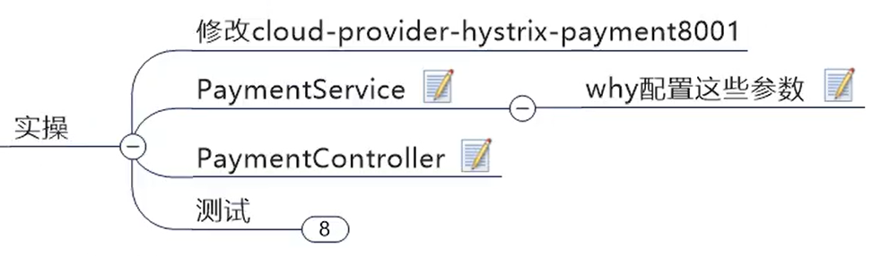

<h1 align = "center">SpringCloud(H版&Alibaba)技术（10初级部分，断路器【Hystrix】）</h1>

# 10. Hystrix断路器


## 10.1 简介


功能：**服务降级**，**服务熔断**，**接近实时的监控**，限流，隔离等。


## 10.2 Hystrix重要概念

### 10.2.1 服务降级（fallback）

提供者和消费者都可以进行服务降级。（一般都是放在客户端（消费者））


### 10.2.2 服务熔断（break）


### 10.2.3 服务限流（flowlimit） 


## 10.3 Hystrix案例

#### 10.3.1 构建

把7001改为单机版，方便后面进行案例测试。

1. 新建项目 cloud-provider-hystrix-payment8001

2. pom

```
<dependencies>
    <!-- hystrix-->
    <dependency>
        <groupId>org.springframework.cloud</groupId>
        <artifactId>spring-cloud-starter-netflix-hystrix</artifactId>
    </dependency>
    <!-- 引用自己定义的api通用包，可以使用Payment支付Entity -->
    <dependency>
        <groupId>com.angenin.springcloud</groupId>
        <artifactId>cloud-api-commons</artifactId>
        <version>${project.version}</version>
    </dependency>
    <dependency>
        <groupId>org.springframework.boot</groupId>
        <artifactId>spring-boot-starter-web</artifactId>
    </dependency>
    <!--监控-->
    <dependency>
        <groupId>org.springframework.boot</groupId>
        <artifactId>spring-boot-starter-actuator</artifactId>
    </dependency>
    <!--eureka client-->
    <dependency>
        <groupId>org.springframework.cloud</groupId>
        <artifactId>spring-cloud-starter-netflix-eureka-client</artifactId>
    </dependency>
    <!--热部署-->
    <dependency>
        <groupId>org.springframework.boot</groupId>
        <artifactId>spring-boot-devtools</artifactId>
        <scope>runtime</scope>
        <optional>true</optional>
    </dependency>
    <!--   一个Java工具包     -->
    <dependency>
        <groupId>cn.hutool</groupId>
        <artifactId>hutool-all</artifactId>
        <version>5.1.0</version>
    </dependency>
    <dependency>
        <groupId>org.projectlombok</groupId>
        <artifactId>lombok</artifactId>
        <optional>true</optional>
    </dependency>
    <dependency>
        <groupId>org.springframework.boot</groupId>
        <artifactId>spring-boot-starter-test</artifactId>
        <scope>test</scope>
    </dependency>
</dependencies>
```

3. yml

```
server:
  port: 8001


spring:
  application:
    name: cloud-provider-hystrix-payment
	

eureka:
  client:
    register-with-eureka: true
    fetch-registry: true
    service-url:
      #单机版
      defaultZone: http://localhost:7001/eureka
      #集群版
#      defaultZone: http://eureka7001.com:7001/eureka,http://eureka7002.com:7002/eureka,http://eureka7003.com:7003/eureka
```

4. 主启动类

```
@EnableEurekaClient
@SpringBootApplication
public class PaymentHystrixMain8001 {

    public static void main(String[] args) {
        SpringApplication.run(PaymentHystrixMain8001.class, args);
    }

}
```

5.  springcloud下面新建 service.PaymentService

```
@Service
public class PaymentService {

    //正常访问方法
    public String paymentInfo_OK(Integer id){
        return "线程池：" + Thread.currentThread().getName() + "\tpaymentInfo_OK，id：" + id;
    }


    //超时访问方法
    public String paymentInfo_TimeOut(Integer id){
        int timeNumber = 3;
        try {
            TimeUnit.SECONDS.sleep(timeNumber);
        } catch (InterruptedException e) {
            e.printStackTrace();
        }
        return "线程池：" + Thread.currentThread().getName() +
                "\tpaymentInfo_TimeOut，id：" + id + "，耗时：" + timeNumber + "秒";
    }

}
```

6.  controller.PaymentController

```
import com.angenin.springcloud.service.PaymentService;
import lombok.extern.slf4j.Slf4j;
import org.springframework.beans.factory.annotation.Value;
import org.springframework.web.bind.annotation.GetMapping;
import org.springframework.web.bind.annotation.PathVariable;
import org.springframework.web.bind.annotation.RestController;

import javax.annotation.Resource;

@Slf4j
@RestController
public class PaymentController {

    @Resource
    PaymentService paymentService;

    @Value("${server.port}")    //spring的@Value注解
    private String ServerPort;

    @GetMapping("/payment/hystrix/ok/{id}")
    public String paymentInfo_OK(@PathVariable("id") Integer id){
        String result = paymentService.paymentInfo_OK(id);
        log.info("******result：" + result);
        return result;
    }

    @GetMapping("/payment/hystrix/timeout/{id}")
    public String paymentInfo_TimeOut(@PathVariable("id") Integer id){
        String result = paymentService.paymentInfo_TimeOut(id);
        log.info("******result：" + result);
        return result;
    }

}
```

7. 启动7001和8001

http://localhost:8001/payment/hystrix/ok/1


http://localhost:8001/payment/hystrix/timeout/1


#### 10.3.2 高并发测试


##### 10.3.2.1 安装JMeter

JMeter下载地址：http://jmeter.apache.org/download_jmeter.cgi

下载tgz和zip都可以：


进入解压后的目录的bin目录，找到 jmeter.properties 文件，修改语言 zh_CN 


从终端进入bin目录，鼠标双击“**bin**”目录下的“**jmeter.bat**”文件  运行 jmeter，修改成中文版。


##### 10.3.2.2 进行高并发测试

先添加线程组


添加 http 请求


测试超时接口 `http://localhost:8001/payment/hystrix/timeout/1`


然后去访问 `http://localhost:8001/payment/hystrix/ok/1`，访问速度变慢了。


##### 10.3.2.3 新建80


1. 新建 cloud-consumer-feign-hystrix-order80

2. pom

```
<dependencies>
    <!-- openfeign -->
    <dependency>
        <groupId>org.springframework.cloud</groupId>
        <artifactId>spring-cloud-starter-openfeign</artifactId>
    </dependency>
    <!--   hystrix     -->
    <dependency>
        <groupId>org.springframework.cloud</groupId>
        <artifactId>spring-cloud-starter-netflix-hystrix</artifactId>
    </dependency>
    <!--eureka client-->
    <dependency>
        <groupId>org.springframework.cloud</groupId>
        <artifactId>spring-cloud-starter-netflix-eureka-client</artifactId>
    </dependency>
    <!-- 引用自己定义的api通用包，可以使用Payment支付Entity -->
    <dependency>
        <groupId>com.angenin.springcloud</groupId>
        <artifactId>cloud-api-commons</artifactId>
        <version>${project.version}</version>
    </dependency>
    <dependency>
        <groupId>org.springframework.boot</groupId>
        <artifactId>spring-boot-starter-web</artifactId>
    </dependency>
    <dependency>
        <groupId>org.springframework.boot</groupId>
        <artifactId>spring-boot-starter-actuator</artifactId>
    </dependency>
    <!--热部署-->
    <dependency>
        <groupId>org.springframework.boot</groupId>
        <artifactId>spring-boot-devtools</artifactId>
        <scope>runtime</scope>
        <optional>true</optional>
    </dependency>
    <dependency>
        <groupId>org.projectlombok</groupId>
        <artifactId>lombok</artifactId>
        <optional>true</optional>
    </dependency>
    <dependency>
        <groupId>org.springframework.boot</groupId>
        <artifactId>spring-boot-starter-test</artifactId>
        <scope>test</scope>
    </dependency>
</dependencies>
```

3. yml

```
server:
  port: 80


eureka:
  client:
    register-with-eureka: false
    service-url:
      defaultZone: http://localhost:7001/eureka

#需要加上，否则会报错
ribbon:
  ReadTimeout: 4000
  ConnectTimeout: 4000
```

4. 主启动类  com.angenin.springcloud.OrderHystrixMain80

```
@EnableEurekaClient
@EnableFeignClients
@SpringBootApplication
public class OrderHystrixMain80 {

    public static void main(String[] args) {
        SpringApplication.run(OrderHystrixMain80.class, args);
    }

}
```

5. service.PaymentHystrixService

```
@Component
@FeignClient(value = "CLOUD-PROVIDER-HYSTRIX-PAYMENT")
public interface PaymentHystrixService {

    @GetMapping("/payment/hystrix/ok/{id}")
    public String paymentInfo_OK(@PathVariable("id") Integer id);
    
    @GetMapping("/payment/hystrix/timeout/{id}")
    public String paymentInfo_TimeOut(@PathVariable("id") Integer id);
}
```

6. controller.OrderHystrixController

```
@Slf4j
@RestController
public class OrderHystrixController {

    @Resource
    private PaymentHystrixService paymentHystrixService;


    @GetMapping("/consumer/payment/hystrix/ok/{id}")
    public String paymentInfo_OK(@PathVariable("id") Integer id){
        String result = paymentHystrixService.paymentInfo_OK(id);
        return result;
    }

    @GetMapping("/consumer/payment/hystrix/timeout/{id}")
    public String paymentInfo_TimeOut(@PathVariable("id") Integer id){
        String result = paymentHystrixService.paymentInfo_TimeOut(id);
        return result;
    }

}
```

7. 启动80，进行测试

http://localhost/consumer/payment/hystrix/ok/1


http://localhost/consumer/payment/hystrix/timeout/1


8. 启动 jmeter，然后再进行测试


#### 10.3.2.4 故障现象、导致原因以及解决

现象：


解决：


### 10.3.3 服务降级

工作中，服务降级一般放在客户端，但是这里 客户端 和 服务端 我们都演示


#### 10.3.3.1 提供者

1. 修改8001中PaymentService的 paymentInfo_TimeOut 方法，并添加 paymentInfo_TimeOutHandler 方法：

```
    @HystrixCommand(fallbackMethod = "paymentInfo_TimeOutHandler", commandProperties = {
            //设置自身超时调用时间的峰值为3秒，峰值内可以正常运行，超过了需要有兜底的方法处理，服务降级fallback
            @HystrixProperty(name = "execution.isolation.thread.timeoutInMilliseconds", value = "3000")
    })
    public String paymentInfo_TimeOut(Integer id){
        int timeNumber = 5;
        //int i = 1 / 0;
        try {
            TimeUnit.SECONDS.sleep(timeNumber);
        } catch (InterruptedException e) {
            e.printStackTrace();
        }
        return "线程池：" + Thread.currentThread().getName() +
                "\tpaymentInfo_TimeOut，id：" + id + "，耗时：" + timeNumber + "秒";
    }
    public String paymentInfo_TimeOutHandler(Integer id){
        return "8001提供者，线程池：" + Thread.currentThread().getName() + 
                "\tpaymentInfo_TimeOutHandler系统繁忙，请稍后再试，id：" + id;
    }
```

2. 然后在8001的主启动类上添加`@EnableCircuitBreaker`注解，启用断路器。

3. 启动7001和8001，测试8001的fallback，`http://localhost:8001/payment/hystrix/timeout/1`成功进入fallback方法。（并且fallback方法是用Hystrix的线程池）


4. 去掉sleep，改为 1 / 0，测试方法运行异常，`http://localhost:8001/payment/hystrix/timeout/1`，也可以进入fallback方法。


#### 10.3.3.2 消费者


1. 在80的yml中添加：

```
feign:
  hystrix:
    enabled: true
```

2. 在主启动类添加 `@EnableHystrix` 注解。

3. 修改 OrderHystrixController 的 paymentInfo_TimeOut 方法，并添加 paymentTimeOutFallbackMethod 方法：

```
    @HystrixCommand(fallbackMethod = "paymentTimeOutFallbackMethod", commandProperties = {
            @HystrixProperty(name = "execution.isolation.thread.timeoutInMilliseconds", value = "1500")
    })
    @GetMapping("/consumer/payment/hystrix/timeout/{id}")
    public String paymentInfo_TimeOut(@PathVariable("id") Integer id){

        //模拟报错 , 直接进入 paymentTimeOutFallbackMethod
        // int i = 10 / 0;

        String result = paymentHystrixService.paymentInfo_TimeOut(id);
        return result;
    }

    public String paymentTimeOutFallbackMethod(@PathVariable("id") Integer id){
        return "消费者80，支付系统繁忙";
    }
```

此时的 80 


此时的8001 是正常的


4. 启动7001，8001，80，`http://localhost/consumer/payment/hystrix/timeout/1`（如果是提供者那边出问题，并且消费者设置了fallback，会优先进入消费者的fallback）


5. 在中添加`int i = 1 / 0;`，运行异常也会进入80的fallback方法。


#### 10.3.3.3 目前的问题和解决办法


##### 10.3.3.3.1 代码膨胀的解决办法

解决办法：设置全局fallback方法。


1. 在80的OrderHystrixController中添加全局fallback方法：

```
    //全局fallback方法，不能有传参
    public String payment_Global_FallbackMethod(){
        return "Global异常处理信息，请稍后再试！";
    }
```

2. 并在 OrderHystrixController 类上加上`@DefaultProperties(defaultFallback = "payment_Global_FallbackMethod")` ，设置全局fallback方法。

3. 把paymentInfo_TimeOut方法的@HystrixCommand

```
//    @HystrixCommand(fallbackMethod = "paymentTimeOutFallbackMethod", commandProperties = {
//            @HystrixProperty(name = "execution.isolation.thread.timeoutInMilliseconds", value = "1500")
//    })
    @HystrixCommand
```

4. 进行测试，`http://localhost/consumer/payment/hystrix/timeout/1`


##### 10.3.3.3.2 混乱的解决办法


#### 10.3.3.4模拟宕机场景

1. 在80的service包下新建 PaymentFallbackService 类，实现 PaymentHystrixService 接口

```
//统一为接口里面的方法进行异常处理
@Component
public class PaymentFallbackService implements PaymentHystrixService {
    @Override
    public String paymentInfo_OK(Integer id) {
        return "----PaymentFallbackService\t fallback-paymentInfo_OK----";
    }

    @Override
    public String paymentInfo_TimeOut(Integer id) {
        return "----PaymentFallbackService\t fallback-paymentInfo_TimeOut----";
    }
}
```

2. 要在yml中加上：（我们在之前就加上了）

   ```
   feign:
     hystrix:
       enabled: true
   ```

3. 然后给 PaymentHystrixService 接口的 @FeignClient 注解加上`fallback = PaymentFallbackService.class`属性，用于出错进行fallback处理。

   

   

4. 启动7001，8001，80，然后先访问``，成功访问  http://localhost/consumer/payment/hystrix/ok/1

   

   

5. 然后关掉8001，模拟提供者宕机，刷新页面

   


### 10.3.4 服务熔断


#### 10.3.4.1 实操



1. 在8001的 PaymentService中 添加

```
	// ---- 服务熔断
	@HystrixCommand(fallbackMethod = "paymentCircuitBreaker_fallback",commandProperties = {
        @HystrixProperty(name = "circuitBreaker.enabled", value = "true"),                      //开启断路器
        @HystrixProperty(name = "circuitBreaker.requestVolumeThreshold", value = "10"),         //请求总数阈值（默认20）
        @HystrixProperty(name = "circuitBreaker.sleepWindowInMilliseconds", value = "10000"),   //休眠时间窗口期（休眠多久进入半开模式（单位毫秒，默认5秒））
        @HystrixProperty(name = "circuitBreaker.errorThresholdPercentage", value = "60"),       //请求次数的错误率达到多少跳闸（百分率%，默认50%）
})
    public String paymentCircuitBreaker(@PathVariable("id") Integer id) {
        if(id < 0){
            throw  new RuntimeException("****id 不能为负数");
        }
        String serialNumber = IdUtil.simpleUUID();

        return  Thread.currentThread().getName() + "\t" + "调用成功，流水号：" + serialNumber;
    }
    public String paymentCircuitBreaker_fallback(@PathVariable("id") Integer id){
        return "id 不能为负数,请稍后再试， id: " + id;
    }
```

2. 在8001的PaymentController中添加

```
@GetMapping("/payment/circuit/{id}")
public String paymentCircuitBreaker(@PathVariable("id") Integer id){
    String result = paymentService.paymentCircuitBreaker(id);
    log.info("******result：" + result);
    return result;
}
```

3. 启动7001和8001

` http://localhost:8001/payment/circuit/1 `（输入正确可以调用）


` http://localhost:8001/payment/circuit/-1 `（输入超过6次进入熔断）


熔断10秒内就算是正确的请求也返回错误信息。


10秒后进入半开模式，对请求进行处理，此时如果是正确的请求，那么就关闭熔断，否则再次进入熔断，10秒后再次开启半开模式，对请求进行处理，直到半开模式处理到正确请求。


#### 10.3.4.2 总结

https://martinfowler.com/bliki/CircuitBreaker.html


我的总结：如果请求次数的错误率超过指定值，开启熔断，经过一段时间后，变为半开模式，然后放进一个请求进行处理，如果请求处理成功，关闭熔断；如果还是报错，继续进入熔断，再经过一段时间后，变为半开模式，再进行对下一个请求进行处理，一直在熔断，半开模式来回切换，直到请求成功，关闭熔断。


官网断路器流程图：


整理之后的官网断路器流程图:


断路器在什么情况下开始起作用：

https://github.comNetflix/Hystrix/wiki/How-it-Works


总体来说，根据上面的配置理解，就是在10000毫秒内，请求次数超过了10次,并且错误率超过了60% ，才会触发服务熔断机制


断路器开启或关闭的条件：


断路器打开之后：


如果你要深入研究， 他所有的部分配置如下，下面还有跟多,不方便截图


### 10.3.5 服务限流


## 10.3 Hystrix工作流程

https://github.com/Netflix/Hystrix/wiki/How-it-Works


官方图例：


## 10.4 服务监控HystrixDashboard

### 10.4.1 简介


### 10.4.2 仪表盘9001


1. 新建模块 cloud-consumer-hystrix-dashboard9001

2. pom

```
<dependencies>
    <!--   hystrix仪表盘图形化     -->
    <dependency>
        <groupId>org.springframework.cloud</groupId>
        <artifactId>spring-cloud-starter-netflix-hystrix-dashboard</artifactId>
    </dependency>
    <dependency>
        <groupId>com.angenin.springcloud</groupId>
        <artifactId>cloud-api-commons</artifactId>
        <version>${project.version}</version>
    </dependency>
    <dependency>
        <groupId>org.springframework.boot</groupId>
        <artifactId>spring-boot-starter-web</artifactId>
    </dependency>
    <dependency>
        <groupId>org.springframework.boot</groupId>
        <artifactId>spring-boot-starter-actuator</artifactId>
    </dependency>
    <!--热部署-->
    <dependency>
        <groupId>org.springframework.boot</groupId>
        <artifactId>spring-boot-devtools</artifactId>
        <scope>runtime</scope>
        <optional>true</optional>
    </dependency>
    <dependency>
        <groupId>org.projectlombok</groupId>
        <artifactId>lombok</artifactId>
        <optional>true</optional>
    </dependency>
    <dependency>
        <groupId>org.springframework.boot</groupId>
        <artifactId>spring-boot-starter-test</artifactId>
        <scope>test</scope>
    </dependency>
</dependencies>
```

3. yml

```
server:
  port: 9001
```

4. 主启动类

```
@EnableHystrixDashboard //启用Hystrix仪表板
@SpringBootApplication
public class HystrixDashboard9001 {

    public static void main(String[] args) {
        SpringApplication.run(HystrixDashboard9001.class, args);
    }

}
```

5. 启动9001，在浏览器中输入` http://localhost:9001/hystrix `


### 10.4.3 断路器演示（服务监控 hystrixDashboard ）

注意：所有微服务提供者都需要在pom中引入监控依赖。(之前所有的配置都有引入)

```
<dependency>
    <groupId>org.springframework.boot</groupId>
    <artifactId>spring-boot-starter-actuator</artifactId>
</dependency>
```

修改8001,否者会有以下的错误


在8001的主启动类中添加：

```
   /**
    * 此配置是为了服务监控而配置，与服务容错本身无关，springcloud升级后的坑
    * ServletRegistrationBean因为SpringBoot的默认路径不是 “/hystrix.stream"
    * 只要在自己的项目里配置上下的servlet就可以了
    */
   @Bean
   public ServletRegistrationBean getServlet() {
       HystrixMetricsStreamServlet streamServlet = new HystrixMetricsStreamServlet() ;
       ServletRegistrationBean registrationBean = new ServletRegistrationBean(streamServlet);
       registrationBean.setLoadOnStartup(1);
       registrationBean.addUrlMappings("/hystrix.stream");
       registrationBean.setName("HystrixMetricsStreamServlet");
       return  registrationBean;
   }
```


#### 10.4.3.1 监控测试

启动 9001，7001，8001

1. 9001监控8001

   http://localhost:8001/hystrix.stream


这个Loading...是一直在等待负载均衡的提供方要去消费服务，即访问负载均衡服务器，去调用客户端，如果有数据响应则监控界面就会有图形数据展示


2. 在浏览器输入`http://localhost:8001/payment/circuit/1`和`http://localhost:8001/payment/circuit/-1`


多次输入`http://localhost:8001/payment/circuit/-1`错误的访问。


稍微等一会，然后输入正确的访问`http://localhost:8001/payment/circuit/1`，就会熔断就会关闭。


7色：


1圈：


1线：


整图说明1：


整图说明2：


搞懂一个才能看懂复杂的

