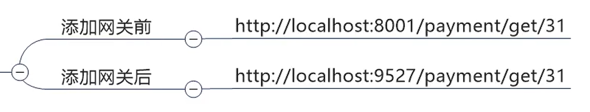
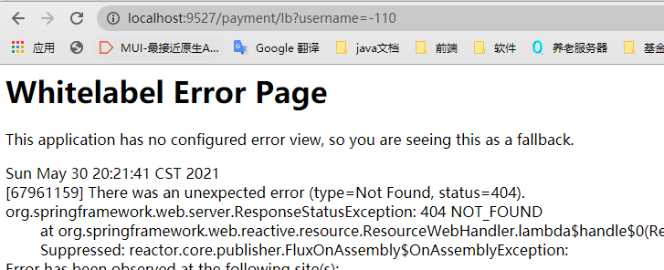
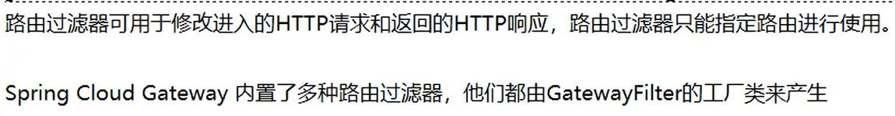

<h1 align = "center">SpringCloud(H版&Alibaba)技术（11-12初级部分，网关【Gateway】）</h1>

# 11. zuul路由网关

zuul核心人员走了两个，zuul2的研发过久，spring公司等不及，自己研发的Gateway网关。

zuul路由网管，阳哥没讲，跳过，没笔记。
https://github.com/Netflix/zuul/wiki


# 12. Gateway新一代网关

https://cloud.spring.io/spring-cloud-static/spring-cloud-gateway/2.2.1.RELEASE/reference/html/


## 12.1 简介


WebFlux是什么?


## 12.2 三大核心概念

### 12.2.1 Route（路由）


### 12.2.2 Predicate（断言）


### 12.2.3 Filter（过滤）


### 12.3.4 总体


## 12.3 Gateway工作流程

官网总结


## 12.4 入门配置

1. 新建模块 cloud-gateway-gateway9527

2. pom

```
<dependencies>
    <!--gateway-->
    <dependency>
        <groupId>org.springframework.cloud</groupId>
        <artifactId>spring-cloud-starter-gateway</artifactId>
    </dependency>
    <!-- 引用自己定义的api通用包，可以使用Payment支付Entity -->
    <dependency>
        <groupId>com.angenin.springcloud</groupId>
        <artifactId>cloud-api-commons</artifactId>
        <version>${project.version}</version>
    </dependency>
    <!--eureka client(通过微服务名实现动态路由)-->
    <dependency>
        <groupId>org.springframework.cloud</groupId>
        <artifactId>spring-cloud-starter-netflix-eureka-client</artifactId>
    </dependency>
    <!--热部署-->
    <dependency>
        <groupId>org.springframework.boot</groupId>
        <artifactId>spring-boot-devtools</artifactId>
        <scope>runtime</scope>
        <optional>true</optional>
    </dependency>
    <dependency>
        <groupId>org.projectlombok</groupId>
        <artifactId>lombok</artifactId>
        <optional>true</optional>
    </dependency>
    <dependency>
        <groupId>org.springframework.boot</groupId>
        <artifactId>spring-boot-starter-test</artifactId>
        <scope>test</scope>
    </dependency>
</dependencies>
```

3. yml

```
server:
  port: 9527

spring:
  application:
    name: cloud-gateway

eureka:
  instance:
    hostname: cloud-gateway-service
  client:
    fetch-registry: true
    register-with-eureka: true
    service-url:
      defaultZone: http://eureka7001.com:7001/eureka/
```

4. 主启动类GatewayMain9527

```
@SpringBootApplication
@EnableEurekaClient
public class GatewayMain9527 {
    public static void main(String[] args) {
        SpringApplication.run(GatewayMain9527.class, args);
    }
}
```

5. 修改yml文件

   9527网关如何映射图

   

如何配置图:


配置代码

```
server:
  port: 9527

spring:
  application:
    name: cloud-gateway
  cloud:
    gateway:
      routes:
        - id: payment_route # 路由的id,没有规定规则但要求唯一,建议配合服务名
          #匹配后提供服务的路由地址
          uri: http://localhost:8001
          predicates:
            - Path=/payment/get/** # 断言，路径相匹配的进行路由

        - id: payment_route2
          uri: http://localhost:8001
          predicates:
            - Path=/payment/lb/** #断言,路径相匹配的进行路由

eureka:
  instance:
    hostname: cloud-gateway-service
  client:
    fetch-registry: true
    register-with-eureka: true
    service-url:
      defaultZone: http://eureka7001.com:7001/eureka/
```

6. 测试，启动7001，cloud-provider-payment8001，9527





http://localhost:8001/payment/get/1


http://localhost:9527/payment/get/1


http://localhost:9527/payment/lb


访问说明图


### 12.4.1 Gateway网关路由的两种配置方式


1. 在配置文件中配置  ( 上面的案列就是， yml 配置更加简单方便 )
   在配置文件yml中配置 


2. 在配置类中配置
   代码中注入RouteLocator的Bean


官网案列


新建 config.GatewayConfig


```
@Configuration
public class GatewayConfig {

    @Bean
    public RouteLocator customRouteLocator(RouteLocatorBuilder routeLocatorBuilder){
        RouteLocatorBuilder.Builder routes = routeLocatorBuilder.routes();

        routes.route("path_route_angenin",  //id
                r -> r.path("/guonei")  //访问 http://localhost:9527/guonei
                        .uri("http://news.baidu.com/guonei"));  //就会转发到 http://news.baidu.com/guonei

        routes.route("path_route_angenin2",  //id
                r -> r.path("/guoji")  //访问 http://localhost:9527/guoji
                        .uri("http://news.baidu.com/guoji"));  //就会转发到 http://news.baidu.com/guonji

        return routes.build();
    }

//    @Bean
//    public RouteLocator customRouteLocator2(RouteLocatorBuilder routeLocatorBuilder){
//        RouteLocatorBuilder.Builder routes = routeLocatorBuilder.routes();
//
//        routes.route("path_route_angenin2",  //id
//                r -> r.path("/guoji")  //访问 http://localhost:9527/guoji
//                        .uri("http://news.baidu.com/guoji"));  //就会转发到 http://news.baidu.com/guonji
//
//        return routes.build();
//    }

}
```

测试，启动7001，8001，9527

`http://localhost:9527/guonei`


`http://localhost:9527/guoji `


## 12.5 通过微服务名实现动态路由


修改yml文件


```
spring:
  application:
    name: cloud-gateway
  cloud:
    gateway:
      discovery:
        locator:
          enabled: true  #开启从注册中心动态创建路由的功能，利用微服务名称进行路由(默认false)
      routes:
        - id: payment_route #路由的id,没有规定规则但要求唯一,建议配合服务名
#          uri: http://localhost:8001  #匹配后提供服务的路由地址
          uri: lb://cloud-payment-service
          predicates:
            - Path=/payment/get/** #断言，路径相匹配的进行路由

        - id: payment_route2
#          uri: http://localhost:8001
          uri: lb://cloud-payment-service
          predicates:
            - Path=/payment/lb/** #断言,路径相匹配的进行路由
```

enabled默认false： ( 上述配置文件中已经修改为 true )


测试，启动 7001，8001，8002，9527   (一定要重启9527 热部署重启配置没有生效)

` http://localhost:9527/payment/lb `

第一次访问


第二次访问


## 12.6 Predicate的使用


官网：https://cloud.spring.io/spring-cloud-static/spring-cloud-gateway/2.2.1.RELEASE/reference/html/#gateway-request-predicates-factories


常用的Route Predicate


### 12.6.1  After/Before/Between

新建测试类 T2

```
public class T2 {

    public static void main(String[] args) {
    	//获取当前时间串
        ZonedDateTime now = ZonedDateTime.now();
        System.out.println(now);
        //2020-06-17T11:53:40.325+08:00[Asia/Shanghai]
    }

}
```

然后在 yml 中的`predicates:`加上


测试，启动7001，8001，8002，9527
`http://localhost:9527/payment/lb`

用刚才获取的时间可以访问


时间往后写一小时

```
			#指定时间后才能访问（After）时间往后写一小时
            - After=2021-05-30T20:49:21.520+08:00[Asia/Shanghai]
```

`http://localhost:9527/payment/lb`


Before和Between作用一样：

```
#指定时间前才能访问（Before）
- Before=2020-06-17T11:53:40.325+08:00[Asia/Shanghai]
#指定时间内才能访问（Between）
- Between=2020-06-17T11:53:40.325+08:00[Asia/Shanghai],2020-06-17T12:53:40.325+08:00[Asia/Shanghai]
```


### 12.6.2 Cookie


在yml中的`predicates:`加上（记得把after的时间改成已经过去的时间，时间没到访问不了）

```
 - Cookie=username,angenin   #带Cookie，并且username的值为angenin
```

1. 不带cookie访问
   
   
   
   
   
   打开终端，输入`curl http://localhost:9527/payment/lb`（直接访问失败）


2. 带cookie访问
   输入`curl http://localhost:9527/payment/lb --cookie "username=angenin"`


### 12.6.3 Header


注释掉其他两个，加上Header

```
#            - After=2020-06-17T12:53:40.325+08:00[Asia/Shanghai]
#            - Cookie=username,angenin   #带Cookie，username的值为angenin
            - Header=X-Request-Id, \d+   #请求头要有 X-Request-Id属性并且值为整数的正则表达式
```

重启9527，然后在终端输入`  curl http://localhost:9527/payment/lb -H "X-Request-Id:123" `


### 12.6.4 Host


加上：

```
            - Host=**.angenin.com	#Host: xxx.angenin.com 请求是Host必须有**.angenin.com
```

重启9527
  `  curl http://localhost:9527/payment/lb -H "Host: www.angenin.com" `  


### 12.6.5 Method


```
            - Method=GET	#只允许get请求访问
```


### 12.6.6 Path


```
			#访问的url地址有 /payment/lb/ 才能访问
			- Path=/payment/lb/**	
```

已经用过了，这里不进行演示。


### 12.6.7 Query


```
            - Query=username, \d+   #url请求地址必须带上username参数，并且值必须为整数
```

http://localhost:9527/payment/lb?username=110


http://localhost:9527/payment/lb?username=-110




http://localhost:9527/payment/lb


### 12.6.8 总结


 

## 12.7 Filter的使用

是什么




GatewayFilter（31种）
Global Filter（10种）

这里以`AddRequestParameter`为代表。


### 12.7.1 自定义过滤器


1. 在 com.angenin.springcloud  下面新建 filter.MyLogGateWayFilter

```
@Component
@Slf4j
public class MyLogGateWayFilter implements GlobalFilter, Ordered {


    @Override
    public Mono<Void> filter(ServerWebExchange exchange, GatewayFilterChain chain) {
        log.info("**************come in MyLogGateWayFilter：" + new Date());
        //获取request中的uname参数
        String uname = exchange.getRequest().getQueryParams().getFirst("uname");

        if(uname == null){
            log.info("*******用户名为null，非法用户！！");
            //设置响应，不被接受
            exchange.getResponse().setStatusCode(HttpStatus.NOT_ACCEPTABLE);

            return exchange.getResponse().setComplete();
        }

        //返回chain.filter(exchange)，放行
        return chain.filter(exchange);
    }

    @Override
    public int getOrder() {
        //返回值是过滤器的优先级，越小优先级越高（最小-2147483648，最大2147483648）
        return 0;
    }
}
```

2. 启动7001，8001，8002，9527    (如果有问题，可能是上面的 Predicate 配置导致的，建议去看下)
   
   `http://localhost:9527/payment/lb?uname=111`


http://localhost:9527/payment/lb?xxx=111

