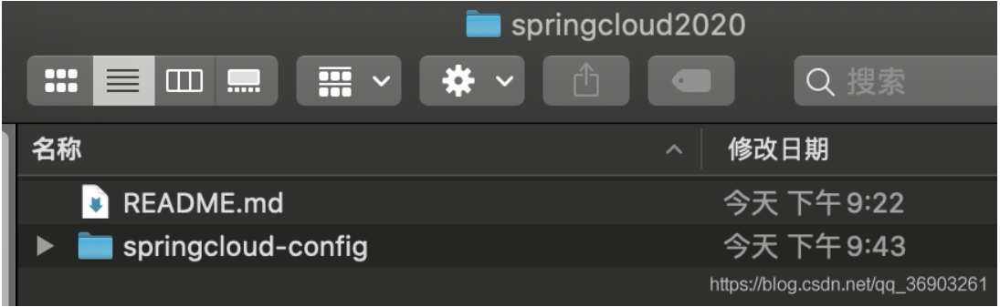
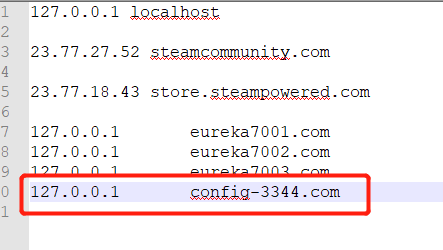
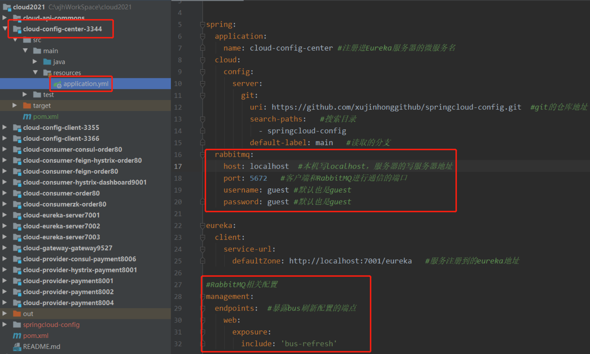

<h1 align = "center">SpringCloud(H版&Alibaba)技术（13-14初级部分，服务配置【Config】与消息总线【Bus】）</h1>

# 13 SpringCloud Config分布式配置中


## 13.1 Config服务端配置与测试


1. 在GitHub上新建一个名为 springcloud-config 的新Repository（需要是public的仓库，private的访问不了）


创建后，点击复制，然后黏贴到终端（可以先新建一个springcloud2020目录，等下用来clone到本地的存放目录）。（需要在本地安装好git）


此时，这个springcloud2020就是我们本地的一个新的git仓库了（git init）。


创建 myorder文件夹


创建视频中的yml文件  config-dev.yml


2. clone到本地，复制地址，然后终端进入springcloud2020文件夹里，输入`git clone 你们的仓库地址`





3. 新建模块 cloud-config-center-3344

4. pom

```
<dependencies>
    <!--config server-->
    <dependency>
        <groupId>org.springframework.cloud</groupId>
        <artifactId>spring-cloud-config-server</artifactId>
    </dependency>
    <!--eureka client(通过微服务名实现动态路由)-->
    <dependency>
        <groupId>org.springframework.cloud</groupId>
        <artifactId>spring-cloud-starter-netflix-eureka-client</artifactId>
    </dependency>
    <dependency>
        <groupId>org.springframework.boot</groupId>
        <artifactId>spring-boot-starter-web</artifactId>
    </dependency>
    <dependency>
        <groupId>org.springframework.boot</groupId>
        <artifactId>spring-boot-starter-actuator</artifactId>
    </dependency>
    <!--热部署-->
    <dependency>
        <groupId>org.springframework.boot</groupId>
        <artifactId>spring-boot-devtools</artifactId>
        <scope>runtime</scope>
        <optional>true</optional>
    </dependency>
    <dependency>
        <groupId>org.projectlombok</groupId>
        <artifactId>lombok</artifactId>
        <optional>true</optional>
    </dependency>
    <dependency>
        <groupId>org.springframework.boot</groupId>
        <artifactId>spring-boot-starter-test</artifactId>
        <scope>test</scope>
    </dependency>
</dependencies>
```

5. yml

   

```
server:
  port: 3344


spring:
  application:
    name: cloud-config-center #注册进Eureka服务器的微服务名
  cloud:
    config:
      server:
        git:
          uri: https://github.com/xujinhonggithub/springcloud-config.git  #git的仓库地址
          search-paths:   #搜索目录
            - springcloud-config
          default-label: main   #读取的分支   目前github 分支修改为 main  ,但是依赖默认分支还是master ,所以修改默认分支为main 


eureka:
  client:
    service-url:
      defaultZone: http://localhost:7001/eureka   #服务注册到的eureka地址
```

6. 主启动类

```
@EnableConfigServer
@SpringBootApplication
public class ConfigCenterMain3344 {
    
    public static void main(String[] args) {
        SpringApplication.run(ConfigCenterMain3344.class, args);
    }
    
}
```

7. 修改hosts文件，增加映射

   window 系统     C:\Windows\System32\drivers\etc     下面的 hosts 文件

   

   ```
   127.0.0.1       config-3344.com
   ```

   

   


 mac系统  终端输入`sudo vim /private/etc/hosts`，再输入本机密码，按i进入编辑模式，在最下行加入

```
127.0.0.1       config-3344.com
```


按esc键，然后输入`:wq!`强制保存退出。


8. 在 GitHub 中的配置文件加入（点击这个文件，然后点击笔形状的按钮进行编辑）

   

```
#config-dev.yml
config:
  info: "master branch,springcloud-config/config-dev.yml version=1"
  
#######################################

#config-prod.yml
config:
  info: "master branch,springcloud-config/config-prod.yml version=1"

#######################################

#config-test.yml
config:
  info: "master branch,springcloud-config/config-test.yml version=1"
```

9. 启动7001，3344，然后在浏览器输入`http://config-3344.com:3344/main/config-dev.yml`（成功获取到github上的配置文件数据）

   ==你一修改 GitHub 中的配置文件文件，3344就会自动同步修改内容==
   
   
   
   
   
   

### 13.1.1 配置的读取规则


1. 第一种     /{label}/{application}-{profiles}.yml （我们上面用的就是这一种）


http://config-3344.com:3344/main/config-test.yml


2. 第二种    /{application}-{profiles}.yml 


http://config-3344.com:3344/config-test.yml


不存在的配置文件，返回 {}

http://config-3344.com:3344/config-123.yml


3. 第三种    /{application}/{profiles}/{label}       

路径和上面的不同，从小到大


http://config-3344.com:3344/config/dev/main


## 13.2 Config客户端配置与测试


1. 新建模块  cloud-config-client-3355

2. pom

```
<dependencies>
    <!--config server-->
    <dependency>
        <groupId>org.springframework.cloud</groupId>
        <artifactId>spring-cloud-starter-config</artifactId>
    </dependency>
    <!--eureka client(通过微服务名实现动态路由)-->
    <dependency>
        <groupId>org.springframework.cloud</groupId>
        <artifactId>spring-cloud-starter-netflix-eureka-client</artifactId>
    </dependency>
    <dependency>
        <groupId>org.springframework.boot</groupId>
        <artifactId>spring-boot-starter-web</artifactId>
    </dependency>
    <dependency>
        <groupId>org.springframework.boot</groupId>
        <artifactId>spring-boot-starter-actuator</artifactId>
    </dependency>
    <!--热部署-->
    <dependency>
        <groupId>org.springframework.boot</groupId>
        <artifactId>spring-boot-devtools</artifactId>
        <scope>runtime</scope>
        <optional>true</optional>
    </dependency>
    <dependency>
        <groupId>org.projectlombok</groupId>
        <artifactId>lombok</artifactId>
        <optional>true</optional>
    </dependency>
    <dependency>
        <groupId>org.springframework.boot</groupId>
        <artifactId>spring-boot-starter-test</artifactId>
        <scope>test</scope>
    </dependency>
</dependencies>
```

3. bootstrap.yml（系统级别的配置文件）


```
server:
  port: 3355


spring:
  application:
    name: config-client
  cloud:
    config: #config客户端配置
      default-label: main   #读取的分支
      name: config    #配置文件名称       这三个综合：main分支上的config-dev.yml的配置文件
      profile: dev    #读取后缀名称       被读取到http://config-3344.com:3344/main/config/dev
      uri: http://localhost:3344  #配置中心地址
      # label: dev   #读取的分支
      # name: config    #配置文件名称       这三个综合：dev分支上的config-dev.yml的配置文件
      # profile: test    #读取后缀名称       被读取到http://config-3344.com:3344/dev/config/test
      # uri: http://localhost:3344  #配置中心地址

eureka:
  client:
    service-url:
      defaultZone: http://localhost:7001/eureka   #服务注册到的eureka地址
```

4. 主启动类

```
@EnableEurekaClient
@SpringBootApplication
public class ConfigClientMain3355 {
    
    public static void main(String[] args) {
        SpringApplication.run(ConfigClientMain3355.class, args);
    }
    
}
```

5. controller.ConfigClientController（读取GitHub的配置文件）

```
@RestController
public class ConfigClientController {

    @Value("${config.info}")	//spring的@Value注解
    private String configInfo;

    @GetMapping("/configInfo")
    public String getConfigInfo(){
        return configInfo;
    }

}
```

6. 测试，启动7001，3344，3355


3344测试，`http://config-3344.com:3344/main/config-dev.yml`


3355测试，`http://localhost:3355/configInfo`


如果是dev 分支，修改配置文件，其他也是一样的


### 13.2.1 动态刷新问题


1. 修改GitHub上的config-dev.yml文件的版本号为2。

2. 刷新`http://config-3344.com:3344/main/config-dev.yml`，版本号发生改变。


3. 刷新`http://localhost:3355/configInfo`，没有改变。


4. 重启3355，刷新`http://localhost:3355/configInfo`，读取到最新的版本号。


## 13.3 Config客户端之动态刷新


1. 往 config 客户端3355在pom中添加（上面已经加了）

```
    <dependency>
        <groupId>org.springframework.boot</groupId>
        <artifactId>spring-boot-starter-actuator</artifactId>
    </dependency>
```

2. 然后在bootstrap.yml中添加

```
#暴露监控端点
management:
  endpoints:
    web:
      exposure:
        include: "*"
```


3. 在 ConfigClientController 类上加上`@RefreshScope`注解。

4. 重启3355。

5. 修改GitHub上文件的版本号为3，然后访问3344和3355。（启动完成后再修改）
   `http://config-3344.com:3344/main/config-dev.yml`


`http://localhost:3355/configInfo`（没读取到，需要发送post请求刷新3355才能生效）


6. 打开终端，输入`curl -X POST "http://localhost:3355/actuator/refresh"`

   

cmd  直接复制


7. 刷新`http://localhost:3355/configInfo`


8. 想想还有什么问题?


# 14. SpringCloud Bus消息总线


Bus支持两种消息代理：RabbitMQ 和 Kafka。


RabbitMQ粗浅的理论和使用的[学习笔记](https://blog.csdn.net/qq_36903261/article/details/106517697)，有兴趣可以看一下。


## 14.1 Docker安装RabbitMQ

[Docker基础入门学习笔记](https://blog.csdn.net/qq_36903261/article/details/105870268)，有兴趣的可以看一下。

在linux的docker里拉取RabbitMQ镜像`docker pull rabbitmq:3.8.3-management`（management是带web的管理界面）。
5672是客户端和RabbitMQ进行通信的端口。
15672是管理界面访问web页面的端口。

运行RabbitMQ

```
docker run -d -p 5672:5672 -p 15672:15672 --name myRabbitMQ 容器id
```

在浏览器中输入`http://10.211.55.17:15672/`访问RabbitMQ的管理页面，用户名和密码默认guest。（10.211.55.17是我linux的IP地址）


## 14.2 SpringCloud Bus动态刷新全局广播


按照 3355模块 新建 3366模块  ( 直接复制，不然可能忘记 3366 application.yml 中的  暴露监控端点配置 ， 还有 ConfigClientController 文件上的注解  @RefreshScope )


利用消息总线触发一个客户端/bus/refresh而刷新所有客户端的配置：


利用消息总线触发一个服务端 ConfigServer的/bus/refresh端点,而刷新所有客户端的配置：


图二的架构显然更加适合，图一不适合的原因如下：


### 14.2.1 给服务端3344添加消息总线支持

pom添加：

```
  <!--添加消息总线RabbitMQ的支持-->
  <dependency>
     <groupId>org.springframework.cloud</groupId>
     <artifactId>spring-cloud-starter-bus-amqp</artifactId>
 </dependency>
```

yml添加：

```
  rabbitmq:
    host: 10.211.55.17  #本机写localhost，服务器的写服务器地址
    port: 5672   #客户端和RabbitMQ进行通信的端口
    username: guest #默认也是guest
    password: guest #默认也是guest


#RabbitMQ相关配置
management:
  endpoints:  #暴露bus刷新配置的端点
    web:
      exposure:
        include: 'bus-refresh'
```




### 14.2.2 给客户端3355和3366添加消息总线支持

pom添加：

```
  <!--添加消息总线RabbitMQ的支持-->
  <dependency>
      <groupId>org.springframework.cloud</groupId>
      <artifactId>spring-cloud-starter-bus-amqp</artifactId>
  </dependency>
```

yml添加：

```
  rabbitmq:
    host: 10.211.55.17  #本机写localhost，服务器的写服务器地址
    port: 5672   #客户端和RabbitMQ进行通信的端口
    username: guest #默认也是guest
    password: guest #默认也是guest
```

spring的下一级，不要写错了。


### 14.2.3 测试


1. 启动7001，3344，3355，3366。
2. 修改GitHub上文件的版本号。
3. 在终端输入：curl -X POST "http://localhost:3344/actuator/bus-refresh"


4. 在浏览器输入

http://localhost:3355/configInfo


http://localhost:3366/configInfo


项目先不停止，下面要用。


## 14.3 SpringCloud Bus动态刷新定点通知


1. 修改GitHub的文件版本号。
2. 在终端输入：`curl -X POST "http://localhost:3344/actuator/bus-refresh/config-client:3355"`
   多加了服务名:端口号即可定点通知。

http://locahost:3355/configInfo


http://localhost:3366/configInfo


总结：

