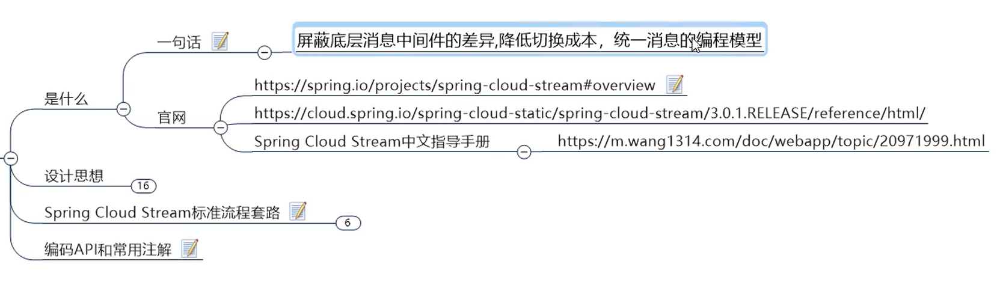
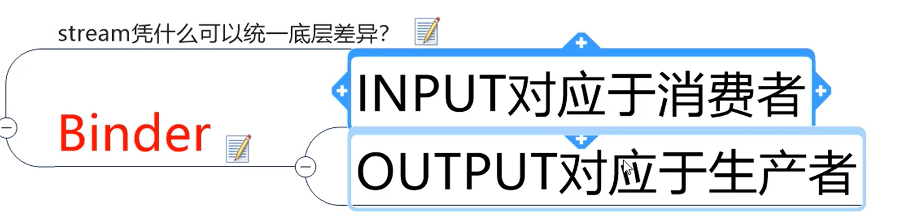
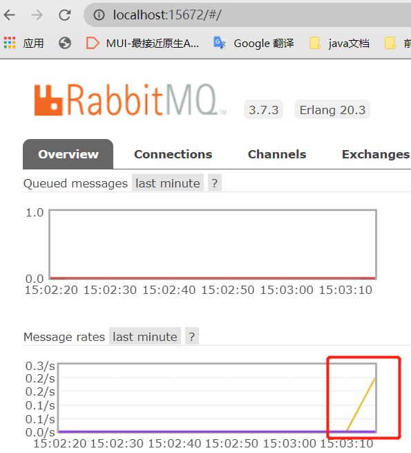
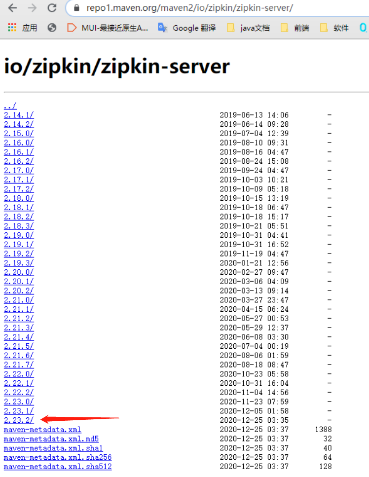

<h1 align = "center">SpringCloud(H版&Alibaba)技术（15-16初级部分，消息驱动【Stream】与分布式请求链路追踪【Sleuth】）</h1>

# 15. SpringCloud Stream消息驱动

## 15.1 消费驱动概述

### 15.1.1 是什么





官网：https://spring.io/projects/spring-cloud-stream#overview


API：https://cloud.spring.io/spring-cloud-static/spring-cloud-stream/3.0.1.RELEASE/reference/html/

中文指导手册：https://m.wang1314.com/doc/webapp/topic/20971999.html

 


### 15.1.2 设计思想


标准MQ：


为什么用Cloud Stream？





### 15.1.3 Spring Cloud Stream标准流程套路


 


 


### 15.1.4 编码API和常用注解


## 15.2 案例说明


## 15.3 消息驱动之生产者

1. 新建模块 cloud-stream-rabbitmq-provider8801

2. pom

   ```
   <dependencies>
       <!--stream rabbit -->
       <dependency>
           <groupId>org.springframework.cloud</groupId>
           <artifactId>spring-cloud-starter-stream-rabbit</artifactId>
       </dependency>
       <!--eureka client-->
       <dependency>
           <groupId>org.springframework.cloud</groupId>
           <artifactId>spring-cloud-starter-netflix-eureka-client</artifactId>
       </dependency>
       <dependency>
           <groupId>org.springframework.boot</groupId>
           <artifactId>spring-boot-starter-web</artifactId>
       </dependency>
       <!--监控-->
       <dependency>
           <groupId>org.springframework.boot</groupId>
           <artifactId>spring-boot-starter-actuator</artifactId>
       </dependency>
       <!--热部署-->
       <dependency>
           <groupId>org.springframework.boot</groupId>
           <artifactId>spring-boot-devtools</artifactId>
           <scope>runtime</scope>
           <optional>true</optional>
       </dependency>
       <dependency>
           <groupId>org.projectlombok</groupId>
           <artifactId>lombok</artifactId>
           <optional>true</optional>
       </dependency>
       <dependency>
           <groupId>org.springframework.boot</groupId>
           <artifactId>spring-boot-starter-test</artifactId>
           <scope>test</scope>
       </dependency>
   </dependencies>
   ```

   3. yml


```
server:
  port: 8801

spring:
  application:
    name: cloud-stream-provider
  cloud:
    stream:
      binders: #在此处配置要绑定的rabbitmq的服务信息
        defaultRabbit: #表示定义的名称，用于binding整合
          type: rabbit #消息组件类型
          environment: #设置rabbitmq的相关环境配置
            spring:
              rabbitmq:
                host: localhost  #RabbitMQ在本机的用localhost，在服务器的用服务器的ip地址
                port: 5672     # 15672是插件的端口，在SpringBoot的配置文件中，应该使用5672
                username: guest
                password: guest
      bindings: #服务的整合处理
        output: #这个名字是一个通道的名称
          destination: studyExchange #表示要使用的Exchange名称定义
          content-type: application/json #设置消息类型，本次为json，本文要设置为“text/plain”
          binder: defaultRabbit #设置要绑定的消息服务的具体设置（爆红不影响使用，位置没错）

eureka:
  client:
    service-url:
      defaultZone: http://localhost:7001/eureka
  instance:
    lease-renewal-interval-in-seconds: 2 #设置心跳的时间间隔（默认是30S)
    lease-expiration-duration-in-seconds: 5 #如果超过5S间隔就注销节点 默认是90s
    instance-id: send-8801.com #在信息列表时显示主机名称
    prefer-ip-address: true #访问的路径变为IP地址
```

4. 主启动类

   ```
   @SpringBootApplication
   public class StreamMQMain8801 {
   
       public static void main(String[] args) {
           SpringApplication.run(StreamMQMain8801.class, args);
       }
   
   }
   ```

5. 业务类

   

 新建 service.IMessageProvider 接口

```
public interface IMessageProvider {
    public String send();
}
```

在service下新建 impl.IMessageProviderImpl 实现类

```
import com.angenin.springcloud.service.IMessageProvider;
import org.springframework.cloud.stream.annotation.EnableBinding;
import org.springframework.cloud.stream.messaging.Source;
import org.springframework.integration.support.MessageBuilder;
import org.springframework.messaging.MessageChannel;
import javax.annotation.Resource;
import java.util.UUID;

@EnableBinding(Source.class)    //定义消息的推送管道（Source是spring的）
public class IMessageProviderImpl implements IMessageProvider {

    @Resource
    private MessageChannel output;  //消息发送管道

    @Override
    public String send() {
        String serial = UUID.randomUUID().toString();
        output.send(MessageBuilder.withPayload(serial).build());     //MessageBuilder是spring的integration.support.MessageBuilder
        System.out.println("*******serial: " + serial);
        return null;
    }
}
```

新建 controller.SendMessageController

```
@RestController
public class SendMessageController {

    @Resource
    private IMessageProvider iMessageProvider;

    @GetMapping("/sendMessage")
    public String sendMessage(){
        return iMessageProvider.send();
    }

}
```

6. 测试

   启动7001，RabbitMQ，启动8801

   然后在RabbitMQ后台可以看到新生成的交换机（在yml`定义的）

`http://localhost:15672/#/exchanges`


然后在浏览器输入：`http://localhost:8801/sendMessage`，多次刷新，后台打印的数据：


RabbitMQ后台：




## 15.4 消息驱动之消费者

1. 新建模块  cloud-stream-rabbitmq-consumer8802
2. pom

```
<dependencies>
    <!--stream rabbit -->
    <dependency>
        <groupId>org.springframework.cloud</groupId>
        <artifactId>spring-cloud-starter-stream-rabbit</artifactId>
    </dependency>
    <!--eureka client-->
    <dependency>
        <groupId>org.springframework.cloud</groupId>
        <artifactId>spring-cloud-starter-netflix-eureka-client</artifactId>
    </dependency>
    <dependency>
        <groupId>org.springframework.boot</groupId>
        <artifactId>spring-boot-starter-web</artifactId>
    </dependency>
    <!--监控-->
    <dependency>
        <groupId>org.springframework.boot</groupId>
        <artifactId>spring-boot-starter-actuator</artifactId>
    </dependency>
    <!--热部署-->
    <dependency>
        <groupId>org.springframework.boot</groupId>
        <artifactId>spring-boot-devtools</artifactId>
        <scope>runtime</scope>
        <optional>true</optional>
    </dependency>
    <dependency>
        <groupId>org.projectlombok</groupId>
        <artifactId>lombok</artifactId>
        <optional>true</optional>
    </dependency>
    <dependency>
        <groupId>org.springframework.boot</groupId>
        <artifactId>spring-boot-starter-test</artifactId>
        <scope>test</scope>
    </dependency>
</dependencies>
```

3. yml

   ```
   server:
     port: 8802
   
   spring:
     application:
       name: cloud-stream-consumer
     cloud:
       stream:
         binders: #在此处配置要绑定的rabbitmq的服务信息
           defaultRabbit: #表示定义的名称，用于binding整合
             type: rabbit #消息组件类型
             environment: #设置rabbitmq的相关环境配置
               spring:
                 rabbitmq:
                   host: localhost  #RabbitMQ在本机的用 localhost，在服务器的用服务器的ip地址
                   port: 5672
                   username: guest
                   password: guest
         bindings: #服务的整合处理
           input: #这个名字是一个通道的名称
             destination: studyExchange #表示要使用的Exchange名称定义
             content-type: application/json #设置消息类型，本次为json，本文要设置为“text/plain”
             binder: defaultRabbit #设置要绑定的消息服务的具体设置（爆红不影响使用，位置没错）
   
   eureka:
     client:
       service-url:
         defaultZone: http://localhost:7001/eureka
     instance:
       lease-renewal-interval-in-seconds: 2 #设置心跳的时间间隔（默认是30S)
       lease-expiration-duration-in-seconds: 5 #如果超过5S间隔就注销节点 默认是90s
       instance-id: receive-8802.com #在信息列表时显示主机名称
       prefer-ip-address: true #访问的路径变为IP地址
   ```

4. 主启动类

```
@SpringBootApplication
public class StreamMQMain8802 {

    public static void main(String[] args) {
        SpringApplication.run(StreamMQMain8802.class, args);
    }

}
```

5. 新建  controller.ReceiveMessageListenerController

```
import org.springframework.beans.factory.annotation.Value;
import org.springframework.cloud.stream.annotation.EnableBinding;
import org.springframework.cloud.stream.annotation.StreamListener;
import org.springframework.cloud.stream.messaging.Sink;
import org.springframework.messaging.Message;
import org.springframework.stereotype.Controller;


@EnableBinding(Sink.class)
@Controller
public class ReceiveMessageListenerController {

    @Value("${server.port}")
    private String serverPort;

    @StreamListener(Sink.INPUT) //监听
    public void input(Message<String> message){
        System.out.println("消费者1号------>收到的消息：" + message.getPayload() + "\t port：" + serverPort);
    }

}
```

6. 测试

启动 7001，8801，8802

`http://localhost:8801/sendMessage`（8801发送消息）


8802接收到消息


## 15.5 分组消费与持久化


按照8802，新建8803。


### 15.5.1 消费


8801发送后，8802和8803都能接收到数据（重复消费）；正常情况下应该是有一个消费者消费了8801的消息后，另外的其他消费者就不能消费。这里要把8802和8803看成一个集群，如果8802和8803都接收到了，就都会去做业务，然后本来8801只想让这个集群来做一次消费的，就会变成每个消费者都来消费一次。这是因为8802和8803不是在同一个组（队列）里，不同组可以重复消费，而同一个组里，只有一个消费者能消费，所以需要对消费者进行分组，把所有相同的消费者分到一个组里。（主题会给每个队列发送消息，而每个队列只有一个消费者可以获得消息（同组广播，不同组轮询））


### 15.5.2 分组(队列)


#### 15.5.2.1 设置不同分组


修改8802的yml

```
group: angeninA
```


修改8803的yml

```
group: angeninA
```


结论：


#### 15.5.2.2 设置相同分组


修改8803的yml中group为 angeninA，然后重启8003。


### 15.5.3 持久化


1. 停掉8802和8803，去掉8802的`group: angeninA`。

2. 然后8801发送4条消息。

   


3. 启动8802，8802并没有去拿取消息。（因为8802去掉了`group: angeninA`，所以启动后会再新建一个队列）


4. 启动8803，启动后获取到8801的消息。（因为8803没删除`group: angeninA`，angeninA队列是在8801发送消息前存在的，所以当8803停机后再启动，就可以获取到停机时8801发送的信息（如果此时同组（队列）里有别的消费者，那么消息会被别的消费者消费掉））


# 16. SpringCloud Sleuth分布式请求链路追踪


https://github.com/spring-cloud/spring-cloud-sleuth

https://cloud.spring.io/spring-cloud-sleuth/reference/html/


## 16.1 搭建链路监控步骤


下载jar包：https://repo1.maven.org/maven2/io/zipkin/zipkin-server/




下载完后，终端jar包的目录里，然后输入：`java -jar zipkin-server-2.23.2-exec.jar`运行。


浏览器输入：`http://localhost:9411/zipkin/`


### 16.1.1 原理


### 16.1.2 服务提供者 cloud-provider-payment8001

1. 在pom中添加：

```
   <!--包含了sleuth+zipkin-->
   <dependency>
       <groupId>org.springframework.cloud</groupId>
       <artifactId>spring-cloud-starter-zipkin</artifactId>
   </dependency>
```

2. 在yml中添加：

```
  zipkin:
    base-url: http://localhost:9411
  sleuth:
    sampler:
      probability: 1  #采样率值介于0到1之间，1则表示全部采集（一般不为1，不然高并发性能会有影响）
```


3. 在PaymentController中添加：

```
   @GetMapping("/payment/zipkin")
   public String paymentZipkin(){
       return "paymentZipkin...";
   }
```

### 16.1.3 服务消费者 cloud-consumer-order80

1. 在pom中添加（和提供者一样）
2. 在yml中添加（和提供者一样）
3. 在 OrderController  中添加：

```
    @GetMapping("/consumer/payment/zipkin")
    public String paymentZipkin(){
        String result = restTemplate.getForObject("http://localhost:8001" + "/payment/zipkin", String.class);
        return result;
    }
```

### 16.1.4 测试

启动7001，8001，80。

浏览器输入：`http://localhost/consumer/payment/zipkin`


