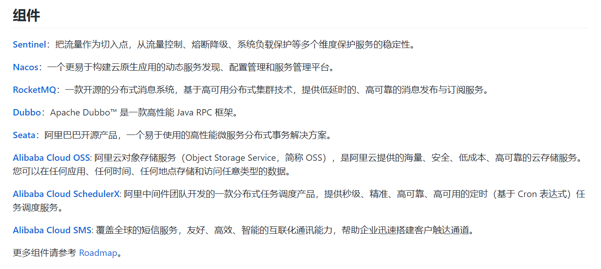
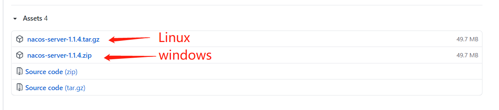
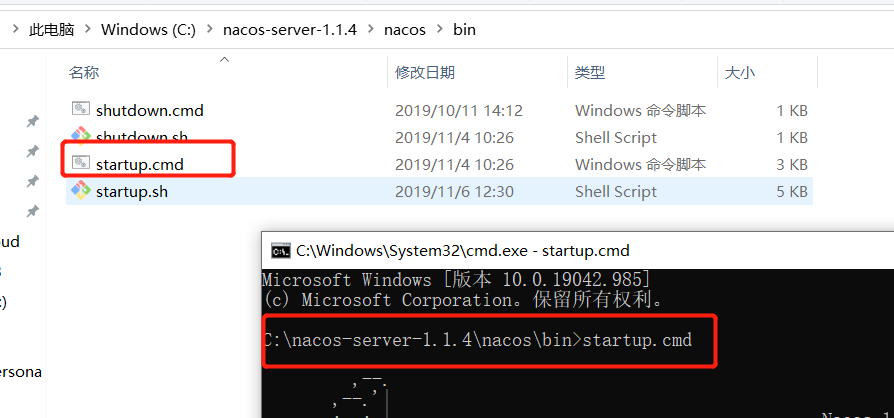
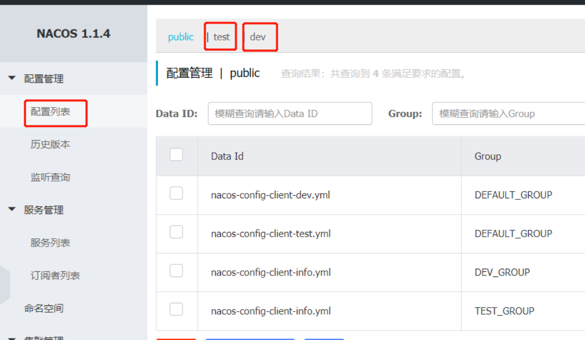
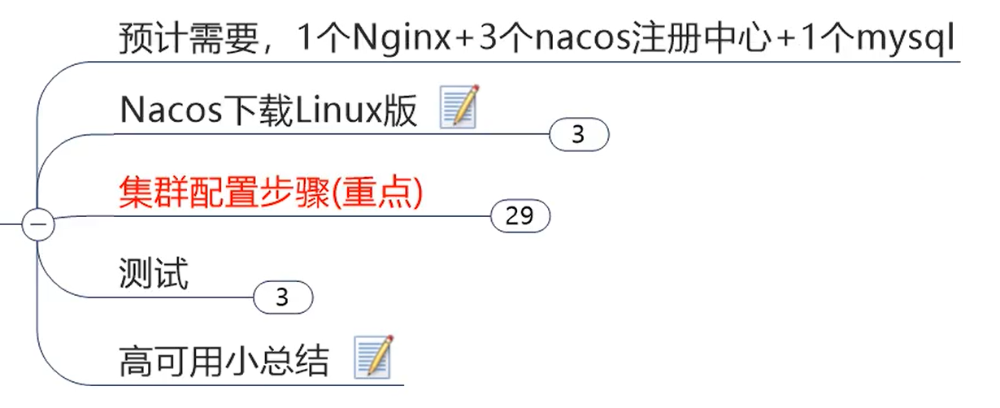
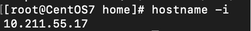
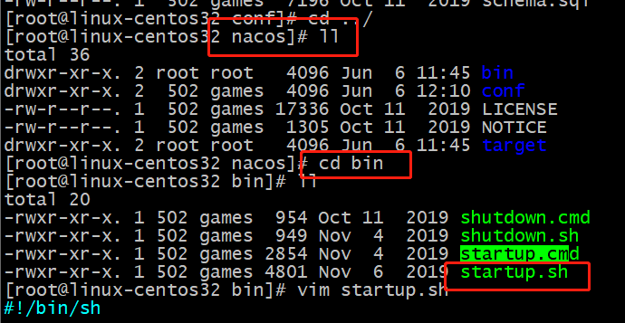

<h1 align = "center">SpringCloud(H版&Alibaba)技术（17-18高级部分，服务注册和配置中心【Nacos】）</h1>

# 17. SpringCloud Alibaba入门简介


## 17.1 Spring Alibaba简介

Spring官网：https://spring.io/projects/spring-cloud-alibaba
GitHub：https://github.com/alibaba/spring-cloud-alibaba
GitHub中文文档：https://github.com/alibaba/spring-cloud-alibaba/blob/master/README-zh.md
Spring Cloud Alibaba参考文档：https://spring-cloud-alibaba-group.github.io/github-pages/greenwich/spring-cloud-alibaba.html





SpringCloud Alibaba的依赖：（已经在父工程的pom中引入了）

```
<dependencyManagement>
    <dependencies>
        <dependency>
            <groupId>com.alibaba.cloud</groupId>
            <artifactId>spring-cloud-alibaba-dependencies</artifactId>
            <version>2.2.0.RELEASE</version>
            <type>pom</type>
            <scope>import</scope>
        </dependency>
    </dependencies>
</dependencyManagement>
```


# 18. SpringCloud Alibaba Nacos服务注册和配置中心


官网：[https://nacos.io/zh-cn/](https://nacos.io/zh-cn/)
GitHub：https://github.com/alibaba/Nacos


## 18.1 安装并运行nacos

1. 在windows 上安装


https://nacos.io/zh-cn/







在浏览器输入：`http://localhost:8848/nacos/`

账号和密码都是`nacos`


2. 在docker上安装nacos

拉取nacos镜像：

```
docker pull nacos/nacos-server
```

运行nacos：

```
docker run --env MODE=standalone --name nacos -d -p 8848:8848 nacos/nacos-server
```

在浏览器输入：`http://10.211.55.17:8848/nacos/`（10.211.55.17是我linux的IP地址）
账号和密码都是`nacos`。


## 18.2 Nacos作为服务注册中心演示

官方文档：https://spring-cloud-alibaba-group.github.io/github-pages/greenwich/spring-cloud-alibaba.html


### 18.2.1 基于Nacos的服务提供者


1. 新建模块 cloudalibaba-provider-payment9001
2. pom

```
<dependencies>
    <!--SpringCloud Alibaba nacos-->
    <dependency>
        <groupId>com.alibaba.cloud</groupId>
        <artifactId>spring-cloud-starter-alibaba-nacos-discovery</artifactId>
    </dependency>

    <dependency>
        <groupId>org.springframework.boot</groupId>
        <artifactId>spring-boot-starter-web</artifactId>
    </dependency>

    <dependency>
        <groupId>org.springframework.boot</groupId>
        <artifactId>spring-boot-starter-actuator</artifactId>
    </dependency>

    <dependency>
        <groupId>org.springframework.boot</groupId>
        <artifactId>spring-boot-devtools</artifactId>
        <scope>runtime</scope>
        <optional>true</optional>
    </dependency>
    <dependency>
        <groupId>org.projectlombok</groupId>
        <artifactId>lombok</artifactId>
        <optional>true</optional>
    </dependency>
    <dependency>
        <groupId>org.springframework.boot</groupId>
        <artifactId>spring-boot-starter-test</artifactId>
        <scope>test</scope>
    </dependency>
</dependencies>
```

3. yml

```
server:
  port: 9001


spring:
  application:
    name: nacos-payment-provider
  cloud:
    nacos:
      discovery:
        server-addr: 10.211.55.17:8848  #配置的Nacos地址（本机的写localhost:8848，服务器的写IP地址）


management:
  endpoints:
    web:
      exposure:
        include: '*'
```

4. 主启动类  com.angenin.springcloud.PaymentMain9001

```
@EnableDiscoveryClient
@SpringBootApplication
public class PaymentMain9001 {

    public static void main(String[] args) {
        SpringApplication.run(PaymentMain9001.class, args);
    }

}
```

5. 新建 controller.PaymentController

```
@RestController
public class PaymentController {

    @Value("${server.port}")
    private String serverPort;


    @GetMapping("/payment/nacos/{id}")
    public String getPayment(@PathVariable("id") Integer id){
        return "nacos registry, serverPort: " + serverPort + "\t id: " + id;
    }

}
```

6. 测试    启动9001
   


7. 参照9001新建9002，建立提供者集群。


或者可以偷懒，不用新建项目，搭建集群的时候可以使用 ( 自己本机测试 )


```
-Dserver.port=端口号
```


### 18.2.2 基于Nacos的服务消费者


1. 新建模块 cloudalibaba-consumer-nacos-order83
2. pom（nacos集成了ribbon，实现负载均衡）

```
<dependencies>
    <!--SpringCloud Alibaba nacos-->
    <dependency>
        <groupId>com.alibaba.cloud</groupId>
        <artifactId>spring-cloud-starter-alibaba-nacos-discovery</artifactId>
    </dependency>
    <!-- 引用自己定义的api通用包，可以使用Payment支付Entity -->
    <dependency>
        <groupId>com.angenin.springcloud</groupId>
        <artifactId>cloud-api-commons</artifactId>
        <version>${project.version}</version>
    </dependency>
    <dependency>
        <groupId>org.springframework.boot</groupId>
        <artifactId>spring-boot-starter-web</artifactId>
    </dependency>

    <dependency>
        <groupId>org.springframework.boot</groupId>
        <artifactId>spring-boot-starter-actuator</artifactId>
    </dependency>

    <dependency>
        <groupId>org.springframework.boot</groupId>
        <artifactId>spring-boot-devtools</artifactId>
        <scope>runtime</scope>
        <optional>true</optional>
    </dependency>
    <dependency>
        <groupId>org.projectlombok</groupId>
        <artifactId>lombok</artifactId>
        <optional>true</optional>
    </dependency>
    <dependency>
        <groupId>org.springframework.boot</groupId>
        <artifactId>spring-boot-starter-test</artifactId>
        <scope>test</scope>
    </dependency>
</dependencies>
```

3. yml

```
server:
  port: 83


spring:
  application:
    name: nacos-order-consumer
  cloud:
    nacos:
      discovery:
        server-addr: 10.211.55.17:8848  #配置的Nacos地址（本机的写localhost:8848，服务器的写IP地址）


#消费者要访问的微服务名称（成功注册进nacos的服务提供者）
service-url:
  nacos-user-service: http://nacos-payment-provider
```

4. 主启动类

```
@EnableDiscoveryClient
@SpringBootApplication
public class OrderNacosMain83 {

    public static void main(String[] args) {
        SpringApplication.run(OrderNacosMain83.class, args);
    }

}
```

5. 新建 config.ApplicationContextConfig

```
@Configuration
public class ApplicationContextConfig {

    @Bean
    @LoadBalanced
    public RestTemplate getRestTemplate(){
        return new RestTemplate();
    }

}
```

6. 新建 controller.OrderNacosController

```
import lombok.extern.slf4j.Slf4j;
import org.springframework.beans.factory.annotation.Value;
import org.springframework.web.bind.annotation.GetMapping;
import org.springframework.web.bind.annotation.PathVariable;
import org.springframework.web.bind.annotation.RestController;
import org.springframework.web.client.RestTemplate;

import javax.annotation.Resource;

@RestController
@Slf4j
public class OrderNacosController {

    @Resource
    private RestTemplate  restTemplate;

    @Value("${service-url.nacos-user-service}")
    private String serverURL;

    @GetMapping("/consumer/payment/nacos/{id}")
    private String paymentInfo(@PathVariable("id") Long id){
        return restTemplate.getForObject(serverURL + "/payment/nacos/" +id,String.class);
    }
}
```

7. 测试

启动 9001，9002，83
在浏览器输入：`http://localhost:83/consumer/payment/nacos/1`


### 18.2.3 整合Feign

#### 18.2.3.1 在消费者83

1. 在pom中导入

```
<!-- openfeign -->
<dependency>
    <groupId>org.springframework.cloud</groupId>
    <artifactId>spring-cloud-starter-openfeign</artifactId>
</dependency>
```

2. 在主启动类上加上`@EnableFeignClients`，激活feign。

3. 注释掉config配置类的`@Configuration`注解，不使用RestTemplate。
4. 新建 service.PaymentFeignService 接口

```
@Component
@FeignClient(value = "nacos-payment-provider")
public interface PaymentFeignService {

    @GetMapping("/payment/nacos/{id}")
    public String getPayment(@PathVariable("id") Integer id);

}
```

5. 注释掉 OrderNacosController 中的 restTemplate 对象和 paymentInfo 方法。


6. 在OrderNacosController中添加

```
@Resource
private PaymentFeignService paymentFeignService;

    @GetMapping("/consumer/payment/feign/nacos/{id}")
    public String paymentInfo2(@PathVariable("id") Long id){
        return restTemplate.getForObject(serverURL + "/payment/feign/nacos/" + id, String.class);
    }
```

7. 测试
   重启83。
   浏览器输入：`http://localhost:83/consumer/payment/feign/nacos/1`


### 18.2.4 服务注册中心对比

#### 18.2.4.1 Nacos全景图


#### 18.2.4.2 Nacos和CAP


#### 18.2.4.3 AP和CP的切换

A：可用性
C：一致性
P：分区容错性


*Nacos默认AP。*

切换CP：   等于号后面选择切换 AP 还是 CP


## 18.3 Nacos作为服务配置中心演示

### 18.3.1 Nacos作为配置中心——基础配置


1. 新建模块 cloudalibaba-config-nacos-client3377
2. pom

```
<dependencies>
    <!-- nacos config-->
    <dependency>
        <groupId>com.alibaba.cloud</groupId>
        <artifactId>spring-cloud-starter-alibaba-nacos-config</artifactId>
    </dependency>
    <!-- openfeign -->
    <dependency>
        <groupId>org.springframework.cloud</groupId>
        <artifactId>spring-cloud-starter-openfeign</artifactId>
    </dependency>
    <!--SpringCloud Alibaba nacos-->
    <dependency>
        <groupId>com.alibaba.cloud</groupId>
        <artifactId>spring-cloud-starter-alibaba-nacos-discovery</artifactId>
    </dependency>
    <dependency>
        <groupId>org.springframework.boot</groupId>
        <artifactId>spring-boot-starter-web</artifactId>
    </dependency>

    <dependency>
        <groupId>org.springframework.boot</groupId>
        <artifactId>spring-boot-starter-actuator</artifactId>
    </dependency>

    <dependency>
        <groupId>org.springframework.boot</groupId>
        <artifactId>spring-boot-devtools</artifactId>
        <scope>runtime</scope>
        <optional>true</optional>
    </dependency>
    <dependency>
        <groupId>org.projectlombok</groupId>
        <artifactId>lombok</artifactId>
        <optional>true</optional>
    </dependency>
    <dependency>
        <groupId>org.springframework.boot</groupId>
        <artifactId>spring-boot-starter-test</artifactId>
        <scope>test</scope>
    </dependency>
</dependencies>
```

3. yml

   

bootstrap.yml ：

```
server:
  port: 3377

spring:
  application:
    name: nacos-config-client
  cloud:
    nacos:
      discovery:
        server-addr: 10.211.55.17:8848 #Nacos服务注册中心地址（本机的写localhost）
      config:
        server-addr: 10.211.55.17:8848 #Nacos作为配置中心地址（本机的写localhost）
        file-extension: yml #指定yml格式配置
```

application.yml

```
spring:
  profiles:
    active: dev #表示开发环境
```

4. 主启动类

```
@EnableDiscoveryClient
@SpringBootApplication
public class NacosConfigClientMain3377 {

    public static void main(String[] args) {
        SpringApplication.run(NacosConfigClientMain3377.class, args);
    }

}
```

5. 新建 controller.ConfigClientController

```
@RefreshScope   //支持Nacos的动态刷新功能
@RestController
public class ConfigClientController {

    @Value("${config.info}")
    private String configInfo;


    @GetMapping("/config/info")
    public String getConfigInfo(){
        return configInfo;
    }

}
```

6. 在Nacos中添加配置信息


https://nacos.io/zh-cn/docs/quick-start-spring-cloud.html


```
#${prefix}-${spring.profile.active}.${file-extension}
# ${spring.application.name}-${spring.profile.active}.${file-extension}   格式
# nacos-config-client-dev.yml
```


7. 测试
   启动3377
   浏览器输入：`http://localhost:3377/config/info`


8. 在nacos后台修改yml文件的版本号为  2
   刷新页面，动态刷新


### 18.3.2 Nacos作为配置中心——分类配置


#### 18.3.2.1 Namespace+Group+DataID三者的关系


#### 18.3.2.2 三种方案加载配置


##### 18.3.2.2.1 DataID方案


1. 新建DataId（test）

```
config: 
    info: test nacos config center, version = 2
```


2. 修改3377的application.yml的active为`test`。


3. 启动3377。
   `http://localhost:3377/config/info`


##### 18.3.2.2.2 Group方案


Group 默认 DEFAULT_GROUP

1. 新建配置 nacos-config-client-info.yml（DEV_GROUP）

```
config: 
    info: nacos-config-client-info.yml DEV_GROUP
```


新建配置时 nacos-config-client-info.yml（TEST_GROUP）

```
config: 
    info: nacos-config-client-info.yml TEST_GROUP
```


2. bootstrap.yml的config下新增`group: TEST_GROUP`


3. 修改application.yml的active为`active: info`

4. 重启3377。
   `http://localhost:3377/config/info`


5. 修改bootstrap.yml的group为`DEV_GROUP`

6. 重启3377。


##### 18.3.2.2.3 Namespace方案


Namespace默认有一个public。（不可删除）


1. 新建dev和test的Namespace





2. 给dev命名空间新增 3个DataId，分三个Group。


3. 在bootstrap.yml的config里添加`namespace: xx`

   


4. 重启3377。
   `http://localhost:3377/config/info`


## 18.4 Nacos集群和持久化配置（重要）

https://nacos.io/zh-cn/docs/deployment.html


### 18.4.1 官网说明

官网说明：https://nacos.io/zh-cn/docs/cluster-mode-quick-start.html


翻译后如下图


### 18.4.2 Nacos持久化配置解释


数据库 地址  账号 密码 

```
spring.datasource.platform=mysql

db.num=1
db.url.0=jdbc:mysql://127.0.0.1:3306/nacos_config?characterEncoding=utf8&connectTimeout=1000&socketTimeout=3000&autoReconnect=true
db.user=root
db.password=root
```


如果使用的  docker ? 

nacos单机的持久化看这篇文章：在Docker上用Nacos1.3容器连接MySQL5.6和8.0.18容器进入持久化的具体操作
（步骤有点多，而且坑了我快一天的时间了，所以单独写在另一篇文章里，使用docker虽然启动时方便了，但是因为里面的配置已经被人改了，和官方文档不一样，想进行配置就变得不太方便。（个人吐槽））


### 18.4.3 Linux版Nacos+MySQL生产环境配置


#### 18.4.3.1 集群配置步骤

同样，因为是在docker上配置的，所以和阳哥的方式不一样，写在另一篇文章里了。
[在Docker上用3个Nacos1.3容器+一个MySQL5和8容器+一个Nginx容器进行集群的具体操作（Nacos集群版）](https://blog.csdn.net/qq_36903261/article/details/106932489)

阳哥的笔记还是会截的：



下载Linux 版的 nacos

https://github.com/alibaba/nacos/releases/tag/1.1.4


1.  Linux 服务器上 mysql 数据库配置

mysql  执行   nacos-mysql.sql 的内容  生成 nacos-config 表  ( 操作和 windows 版一样)


2. application.properties 配置

```
vim application.properties     # 最后加上下面的内容
```

```
spring.datasource.platform=mysql

db.num=1
db.url.0=jdbc:mysql://127.0.0.1:3306/nacos_config?characterEncoding=utf8&connectTimeout=1000&socketTimeout=3000&autoReconnect=true
db.user=root
db.password=root
```


单机启动 访问nacos

```
./startup.sh -m standalone
```

http://192.168.101.137:8848/nacos/#/login


3. Linux 服务器上 nacos 的集群配置 cluster.conf

先备份 ，在修改


```
hostname -i
```




4. 编辑 Nacos 的启动脚本 startup.sh，使它能够接受不同的启动端口





拉到最后


执行


```
# 查询正则运行的 nacos 数量
ps -ef |grep nacos | grep -v grep |wc -l
```


5. Nginx 的配置 由它作为负载均衡器


找到 nginx 的配置文件  nginx.conf


先备份 在修改


修改如下 然后保存


nginx 指定配置文件启动

```
# 先到它的sbin 目录
cd /usr/local/nginx/sbin
#启动nginx
./nginx -c /usr/local/nginx/nginx-1.8.0/conf/nginx.conf
#重启nginx
./nginx -s reload -c /usr/local/nginx/nginx-1.8.0/conf/nginx.conf
```


如果出现这个错误，参考以下链接

https://blog.csdn.net/yufeng_lai/article/details/88819981


如果ncaos 服务3个变2个 可以参考下面

https://blog.csdn.net/weixin_35426348/article/details/114019796?utm_medium=distribute.pc_relevant.none-task-blog-2%7Edefault%7EBlogCommendFromMachineLearnPai2%7Edefault-3.control&depth_1-utm_source=distribute.pc_relevant.none-task-blog-2%7Edefault%7EBlogCommendFromMachineLearnPai2%7Edefault-3.control


http://192.168.101.137:1111/nacos/#/login


##### 18.4.3.1.1 测试

用之前的 cloudalibaba-provider-payment9002 测试


修改9002  9001的yml文件 

參考这篇文章 (必须启动2个，以及群配置不启动2个， 就会报错 ，大坑)

https://blog.csdn.net/qq_42554719/article/details/114336354

```
#server-addr: 10.211.55.17:8848  #配置的Nacos地址（本机的写localhost:8848，服务器的写IP地址）
#改为下面这个，填自己linux的IP地址
server-addr: 192.168.101.137:1111  #nginx的地址
```


启动9002  9001 


##### 18.4.3.1.2 总结


