<h1 align = "center">SpringCloud(H版&Alibaba)技术（19高级部分，熔断与限流【Sentinel】）</h1>

# 19. SpringCloud Alibaba Sentinel 实现熔断与限流

## 19.1 简介


官网：https://github.com/alibaba/sentinel
中文版：[https://github.com/alibaba/Sentinel/wiki/%E4%BB%8B%E7%BB%8D](https://github.com/alibaba/Sentinel/wiki/介绍)


### 19.1.1 下载 (windows 环境)

下载：https://github.com/alibaba/Sentinel/releases


如何使用

文档：https://spring-cloud-alibaba-group.github.io/github-pages/greenwich/spring-cloud-alibaba.html#_spring_cloud_alibaba_sentinel

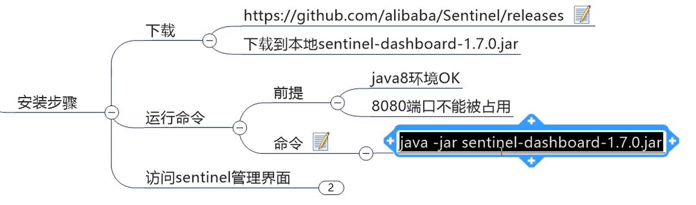


启动

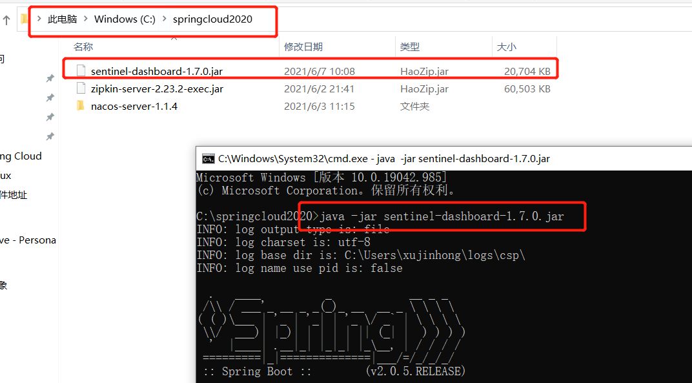


访问


登录  账号密码都是  sent


控制台使用说明：[https://github.com/alibaba/Sentinel/wiki/%E6%8E%A7%E5%88%B6%E5%8F%B0](https://github.com/alibaba/Sentinel/wiki/控制台)


### 19.1.2 docker (如果用docker)

*本来想着只有一个jar包，就不使用docker了，直接下载到本地运行，但是是真的下不动，点下载转了半天没反应，真的是服了。*

```
#拉取sentinel镜像
docker pull bladex/sentinel-dashboard

#运行sentinel（docker里的sentinel是8858端口）
docker run --name sentinel -d -p 8858:8858 bladex/sentinel-dashboard

#把nacos和mysql也启动起来
```


在浏览器输入：`http://10.211.55.26:8858/#/login`（因为linux出了点问题，重装了，所以ip也变了）


账号和密码都是`sentinel`


## 19.2 初始化演示工程


环境准备:   启动 ncaos 和 sentienl

http://localhost:8848/nacos/#/login


1. 新建模块 cloudalibaba-sentinel-service8401
2. pom

```
<dependencies>
    <!-- SpringCloud ailibaba nacos-->
    <dependency>
        <groupId>com.alibaba.cloud</groupId>
        <artifactId>spring-cloud-starter-alibaba-nacos-discovery</artifactId>
    </dependency>
    <!-- SpringCloud ailibaba sentinel-datasource-nacos 持久化需要用到-->
    <dependency>
        <groupId>com.alibaba.csp</groupId>
        <artifactId>sentinel-datasource-nacos</artifactId>
    </dependency>
    <!-- SpringCloud ailibaba sentinel-->
    <dependency>
        <groupId>com.alibaba.cloud</groupId>
        <artifactId>spring-cloud-starter-alibaba-sentinel</artifactId>
    </dependency>
    <dependency>
        <groupId>org.springframework.cloud</groupId>
        <artifactId>spring-cloud-starter-openfeign</artifactId>
    </dependency>
    <dependency>
        <groupId>org.springframework.boot</groupId>
        <artifactId>spring-boot-starter-web</artifactId>
    </dependency>
    <!--监控-->
    <dependency>
        <groupId>org.springframework.boot</groupId>
        <artifactId>spring-boot-starter-actuator</artifactId>
    </dependency>
    <!--热部署-->
    <dependency>
        <groupId>org.springframework.boot</groupId>
        <artifactId>spring-boot-devtools</artifactId>
        <scope>runtime</scope>
        <optional>true</optional>
    </dependency>
    <dependency>
        <groupId>org.projectlombok</groupId>
        <artifactId>lombok</artifactId>
        <optional>true</optional>
    </dependency>
    <dependency>
        <groupId>org.springframework.boot</groupId>
        <artifactId>spring-boot-starter-test</artifactId>
        <scope>test</scope>
    </dependency>
</dependencies>
```

3. yml

```
server:
  port: 8401

spring:
  application:
    name: cloudalibaba-sentinal-service
  cloud:
    nacos:
      discovery:
        #Nacos服务注册中心地址（改成自己的服务器ip地址，本地用 localhost‍）
        #server-addr: 192.168.101.137:8848
        server-addr: localhost:8848
    sentinel:
      transport:
        #配置Sentin dashboard地址（改成自己的服务器ip地址，本地用 localhost‍）
        #dashboard: 10.211.55.26:8080
        dashboard: localhost:8080
        # 默认8719端口，假如被占用了会自动从8719端口+1进行扫描，直到找到未被占用的 端口
        port: 8719


management:
  endpoints:
    web:
      exposure:
        include: '*'
```

4. 主启动类

```
@EnableDiscoveryClient
@SpringBootApplication
public class MainApp8401 {

    public static void main(String[] args) {
        SpringApplication.run(MainApp8401.class, args);
    }
}
```

5. controller.FlowLimitController

```
@RestController
public class FlowLimitController {

    @GetMapping("/testA")
    public String testA() {
        return "----testA";
    }

    @GetMapping("/testB")
    public String testB() {
        return "----testB";
    }

}
```

6. 测试，启动8401，然后刷新sentinel后台页面（因为sentinel采用懒加载策略，所以需要调用服务后才在后台显示）
   在浏览器分别输入，然后刷新sentinel后台页面：

   http://localhost:8401/testA
   http://localhost:8401/testB

   

   


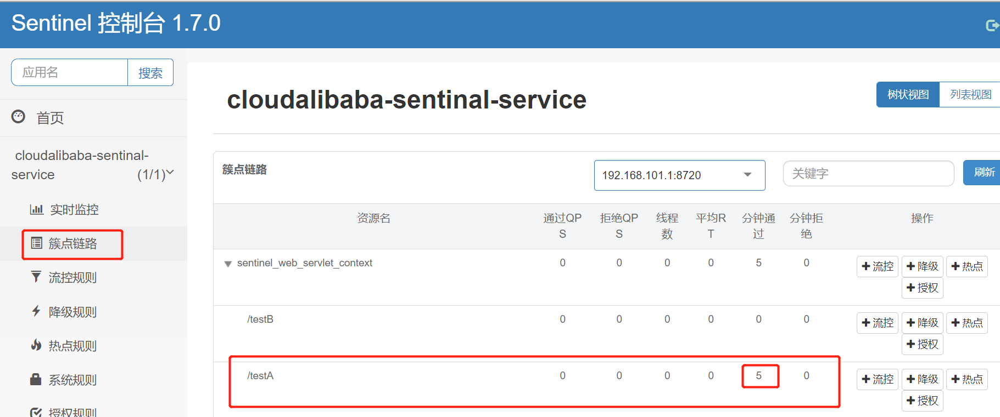


## 19.3 流控规则


流量控制./


可在流控规则处新建：


也可簇点链路处指定添加：


### 19.3.1 流控模式


#### 19.3.1.1 直接


1. QPS:


每秒请求数超过1个就会限流


2. 线程数:


开多个请求  http://localhost:8401/testA  ，一起请求，就会限流


QPS是直接挡在外面，而线程数是有多少个线程在处理，放进来后，有线程是空闲状态就对请求进行处理，都没空闲，就限流（关门打狗）。


#### 19.3.1.2 关联


A去调用B，B如果资源不足了，就限流A。


此时不管调用多少次A都不会限流，而此时超过1秒调用1次B，则会限流A。

使用Postman进行多次访问。

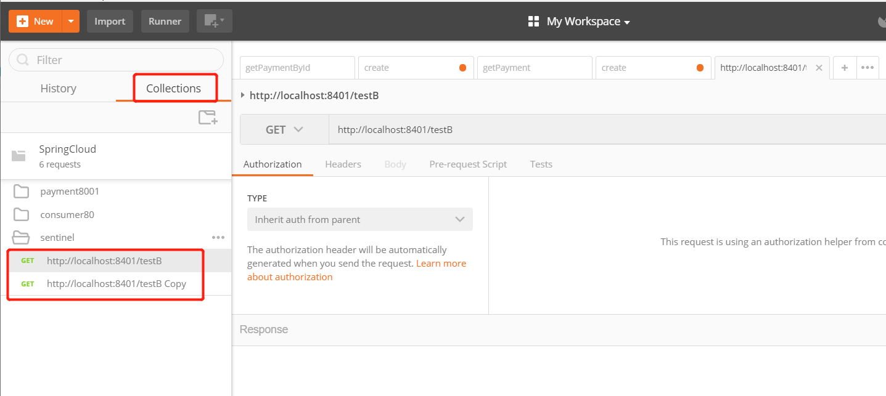


点击运行 


 20个跑完之前访问，就会发现A挂了


#### 19.3.1.3 链路

修改 FlowLimitController 如下：

```
@RestController
public class FlowLimitController {


    @GetMapping("/testA")
    public String testA() {
        return "----testA";
    }

    @GetMapping("/testB")
    public String testB() {
        FlowLimitController controller1 = new FlowLimitController();
        controller1.testA();
        return "----testB";
    }

    @GetMapping("/testC")
    public String testC() {
        FlowLimitController controller2 = new FlowLimitController();
        controller2.testA();
        return "----testC";
    }

}
```


给 testA  添加流控规则


然后重新启动8401，输入`http://localhost:8401/testA`  和 `http://localhost:8401/testB`   都可以访问正常

 


多次刷新`http://localhost:8401/testB`     testB可以正常访问   


然后刷新 `http://localhost:8401/testA`    testA访问失败+

   

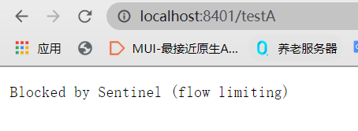


### 19.3.2 流控效果

流控效果只有QPS有，线程数没有。


#### 19.3.2.1 快速失败


#### 19.3.2.2 预热（Warm Up）


源码


对testA新增流控规则


然后输入`http://localhost:8401/testA`，不停刷新，前5秒会限流，5秒后只要每秒不超过10个请求，就不会限流。


#### 19.3.2.3 排队等待


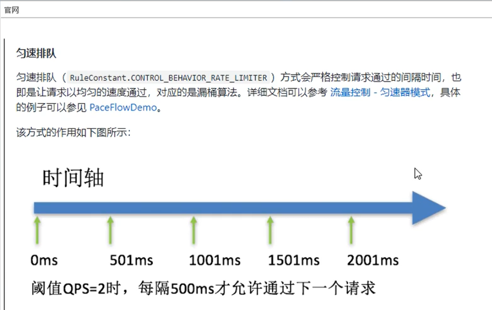


在testB方法中添加

```
        log.info(Thread.currentThread().getName() + "\t ...testB");
```


然后重启8401


postman发起的每秒10个请求进行排队，testB每秒处理一个请求。


## 19.4 降级规则


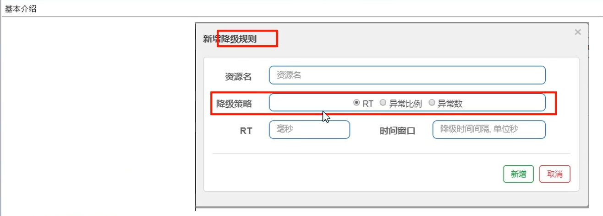


### 19.4.1 降级策略实战


#### 19.4.1.1 RT   (包含 JMeter  测试演示 )


在 FlowLimitController 中添加

```
    @GetMapping("/testD")
    public String testD() {
        try {
            TimeUnit.SECONDS.sleep(1);
        } catch (InterruptedException e) {
            e.printStackTrace();
        }
        log.info("testD 测试RT");
        return "----testD";
    }
```

启动8401，在浏览器输入`http://localhost:8401/testD`，然后在sentinel设置testD降级规则。


*请求处理完成的时间为200毫秒（阈值），超过这个时间熔断降级进入时间窗口期不处理请求，1秒后退出时间窗口期，继续处理请求。（前提是一秒请求数超过5个，如果请求数没超过5个，就算请求处理的时间超过阈值也不会熔断降级）*

然后用Jmeter进行压力测试。


#### 19.4.1.2 异常比例


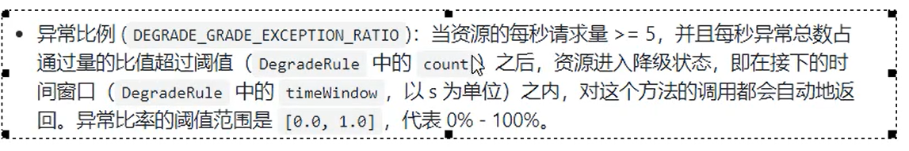


修改testD

```
    @GetMapping("/testD")
    public String testD() {
        log.info("testD 异常比例");
        int age = 10 / 0;   //百分百出错

        return "----testD";
    }
```

启动8401，浏览器输入`http://localhost:8401/testD`，然后在后台设置testD的降级规则。


*处理请求出错超过0.2（20%，阈值），熔断降级，进入时间窗口期不处理请求，3秒后退出时间窗口期继续处理请求。（前提也是每秒请求数超过5个，防止不会熔断降级）*

用Jmeter进行测试


#### 19.4.1.3 异常数 


因为是按照一分钟内的异常数对阈值进行比较，如果时间窗口小于60秒，可能会再次进入熔断状态。所以时间窗口一定要大于等于60秒。


在FlowLimitController里添加：

```
    @GetMapping("/testE")
    public String testE() {
        log.info("testE 测试异常数");
        int age = 10 / 0;
        return "----testE 测试异常数";
    }
```


启动8401，浏览器输入`http://localhost:8401/testE`，然后在后台设置testE的降级规则。


一分钟内，如果访问处理出现异常的次数超过5次，熔断降级，进入时间窗口期不处理请求

刷新6次，`http://localhost:8401/testE`


61秒后退出时间窗口期继续处理请求。恢复到开始的访问报错（时间窗口必须大于等于60秒，防止再次熔断降级）


## 19.5 热点key限流


在FlowLimitController中添加：

```
   //  value = "testHotKey"  这个是资源名称
   @GetMapping("/testHotKey")
    @SentinelResource(value = "testHotKey", blockHandler = "deal_testHotKey")
    public String testHotKey(@RequestParam(value = "p1", required = false)String p1,
                             @RequestParam(value = "p2", required = false)String p2) {
        return "----testHotKey";
    }
    
    //兜底方法
    public String deal_testHotKey(String p1, String p2, BlockException exception) {
        // sentinel的默认提示都是： Blocked by Sentinel (flow limiting)
        return "----deal_testHotKey, o(╥﹏╥)o";
    }
```


重启8401，浏览器输入`http://localhost:8401/testHotKey`，然后在后台对testHotKey进行热点规则配置。

参数索引 0  指的就是第一个参数 p1，第一个参数 p2 不会有任何影响


直接访问下面3个连接都是正常的

http://localhost:8401/testHotKey

http://localhost:8401/testHotKey?p1=1
http://localhost:8401/testHotKey?p1=1&p2=2


如果每秒的访问请求带有索引为0的参数的数量超过1，进入统计窗口期，然后调用兜底方法，1秒后退出统计窗口期，继续处理请求。


如果设置热点规则，而@SentinelResource注解里没有指明blockHandler兜底方法，就会把直接把错误页面信息打印到前台。

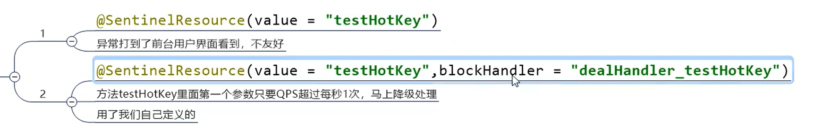


如果是第一种，去掉自定义返回接口


重启再测试，返回错误页面，用户体验不友好


### 19.5.1 参数例外项

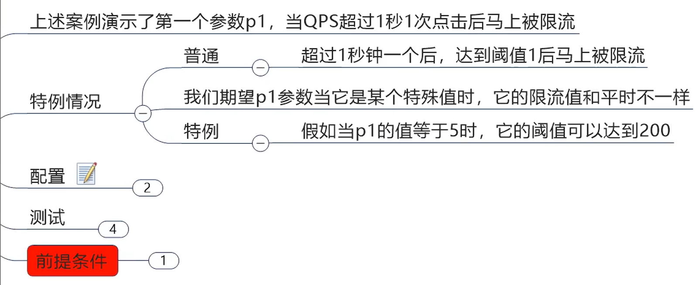


高级选项只有在热点规则里有，簇点链路无法配置高级选项。


http://localhost:8401/testHotKey?p1=1

一秒钟访问超过一个，返回降级方法


http://localhost:8401/testHotKey?p1=5

一秒钟访问超过一个，小于200个，依然可以正常访问


给testHotKey方法添加`int i = 1 / 0;`异常。
然后重新测试，发现兜底方法不适用于异常，有异常会直接打印到页面。


http://localhost:8401/testHotKey?p1=1


## 19.6 系统规则

Sentinel 系统自适应限流从整体维度对应用入口流量进行控制，结合应用的 Load、CPU 使用率、总体平均 RT、入口 QPS 和并发线程数等几个维度的监控指标，通过自适应的流控策略，让系统的入口流量和系统的负载达到一个平衡，让系统尽可能跑在最大吞吐量的同时保证系统整体的稳定性。


*针对整个系统的，每秒访问量超过1（阈值），限流。*

http://localhost:8401/testA


http://localhost:8401/testB


## 19.7  @SentinelResource


### 19.7.1 按资源名称限流+后续处理

==资源名称==

==按资源名称限流的时候，getMapping的值 和   SentinelResource的 value  要相同==


==流控时选资源名称==


1. 在pom添加

```
 <!--换成你们直接的包名-->
 <!-- 引用自己定义的api通用包，可以使用Payment支付Entity -->
 <dependency>
     <groupId>com.angenin.springcloud</groupId>
     <artifactId>cloud-api-commons</artifactId>
     <version>${project.version}</version>
 </dependency>
```


2. 新建 RateLimitController：

```
@RestController
public class RateLimitController {

    @GetMapping("/byResource")
    @SentinelResource(value = "byResource",blockHandler = "handleException")
    public CommonResult byResource() {
        return  new CommonResult(200,"按照资源名称限流测试",new Payment(2020L,"serial001"));
    }

	//兜底方法
    public CommonResult handleException(BlockException exception) {
        return  new CommonResult(444,exception.getClass().getCanonicalName() + "\t 服务不可用");
    }
}
```


3. 启动8401
   `http://localhost:8401/byResource`


4. 配置流控规则


*用资源名称行配置兜底方法才生效。*


5. 测试

多次刷新页面，执行兜底方法


6. 抛出问题，以后处理


### 19.7.2 按照URL地址限流+后续处理

==URL地址==

==按照URL地址限流，getMapping的值 和   SentinelResource的 value  可以不相同==


==流控时选URL==

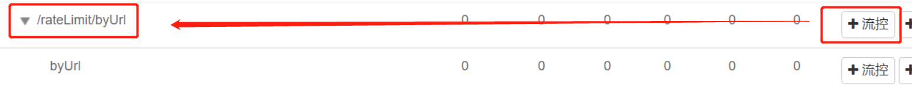


1. 在RateLimitController中添加：

```
    @GetMapping("/rateLimit/byUrl")
    @SentinelResource(value = "byUrl")	//没有兜底方法，系统就用默认的
    public CommonResult byUrl() {
        return  new CommonResult(200,"按照byUrl限流测试",new Payment(2020L,"serial002"));
    }
```

2. 启动8401
   `http://localhost:8401/rateLimit/byUrl`


3. 配置流控规则


多次刷新：

`http://localhost:8401/rateLimit/byUrl`


### 19.7.3 上面兜底方案面临的问题


### 19.7.4 客户自定义限流处理逻辑


1. 新建 myhandler.CustomerBlockHandler 自定义限流处理类：

```
public class CustomerBlockHandler {

    public static CommonResult handlerException(BlockException exception) {
        return  new CommonResult(444,"按照客户自定义限流测试，Glogal handlerException ---- 1");
    }

    public static CommonResult handlerException2(BlockException exception) {
        return  new CommonResult(444,"按照客户自定义限流测试，Glogal handlerException ---- 2");
    }
}
```


2. 在RateLimitController中添加：

```
    //CustomerBlockHandler
    @GetMapping("/rateLimit/customerBlockHandler")
    @SentinelResource(value = "customerBlockHandler",
            blockHandlerClass = CustomerBlockHandler.class, blockHandler = "handlerException2")
    public CommonResult customerBlockHandler() {
        return  new CommonResult(200,"按照客户自定义限流测试",new Payment(2020L,"serial003"));
    }
```


3. 启动8401
   `http://localhost:8401/rateLimit/customerBlockHandler`


4. 用资源名称进行配置兜底方法才生效。


5. 多次刷新： 进入兜底方法


6. 流程图解


### 19.7.5 更多注解属性说明


## 19.8 服务熔断功能


### 19.8.1 Ribbon系列

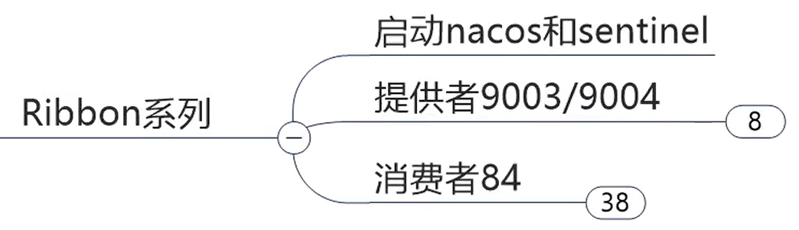


#### 19.8.1.1 新建提供者


1. 新建模块 cloudalibaba-provider-payment9003
2. pom

```
<dependencies>
    <!-- SpringCloud ailibaba nacos-->
    <dependency>
        <groupId>com.alibaba.cloud</groupId>
        <artifactId>spring-cloud-starter-alibaba-nacos-discovery</artifactId>
    </dependency>
    <!-- SpringCloud ailibaba sentinel-->
    <dependency>
        <groupId>com.alibaba.cloud</groupId>
        <artifactId>spring-cloud-starter-alibaba-sentinel</artifactId>
    </dependency>
    <!-- 引用自己定义的api通用包，可以使用Payment支付Entity -->
    <dependency>
        <groupId>com.angenin.springcloud</groupId>
        <artifactId>cloud-api-commons</artifactId>
        <version>${project.version}</version>
    </dependency>
    <dependency>
        <groupId>org.springframework.cloud</groupId>
        <artifactId>spring-cloud-starter-openfeign</artifactId>
    </dependency>
    <dependency>
        <groupId>org.springframework.boot</groupId>
        <artifactId>spring-boot-starter-web</artifactId>
    </dependency>
    <!--监控-->
    <dependency>
        <groupId>org.springframework.boot</groupId>
        <artifactId>spring-boot-starter-actuator</artifactId>
    </dependency>
    <!--热部署-->
    <dependency>
        <groupId>org.springframework.boot</groupId>
        <artifactId>spring-boot-devtools</artifactId>
        <scope>runtime</scope>
        <optional>true</optional>
    </dependency>
    <dependency>
        <groupId>org.projectlombok</groupId>
        <artifactId>lombok</artifactId>
        <optional>true</optional>
    </dependency>
    <dependency>
        <groupId>org.springframework.boot</groupId>
        <artifactId>spring-boot-starter-test</artifactId>
        <scope>test</scope>
    </dependency>
</dependencies>
```

3. yml

```
server:
  port: 9003

spring:
  application:
    name: nacos-payment-provider
  cloud:
    nacos:
      discovery:
        server-addr: localhost:8848  #nacos

management:
  endpoints:
    web:
      exposure:
        include: '*'
```

4. 主启动类

```
@SpringBootApplication
@EnableDiscoveryClient
public class PaymentMain9003 {

    public static void main(String[] args) {
        SpringApplication.run(PaymentMain9003.class,args);
    }
}
```

5. controller.PaymentController

```
@RestController
public class PaymentController {

    @Value("${server.port}")    //spring的注解
    private  String serverPort;

    public static HashMap<Long, Payment> map = new HashMap<>();
    static {
        map.put(1L,new Payment(1L,"1111"));
        map.put(2L,new Payment(2L,"2222"));
        map.put(3L,new Payment(3L,"3333"));
    }


    @GetMapping(value = "/paymentSQL/{id}")
    public CommonResult<Payment> paymentSQL(@PathVariable("id") Long id) {
        Payment payment = map.get(id);
        CommonResult<Payment> result = new CommonResult<>(200,"from mysql,serverPort: " + serverPort,payment);
        return result;
    }
}
```

6. 按照9003新建9004

7. 启动9003  9004 访问测试

http://localhost:9003/paymentSQL/1


#### 19.8.1.2 新建消费者


1. 新建模块 cloudalibaba-consumer-nacos-order84
2. pom

```
<dependencies>
    <!-- SpringCloud ailibaba nacos-->
    <dependency>
        <groupId>com.alibaba.cloud</groupId>
        <artifactId>spring-cloud-starter-alibaba-nacos-discovery</artifactId>
    </dependency>
    <!-- SpringCloud ailibaba sentinel-->
    <dependency>
        <groupId>com.alibaba.cloud</groupId>
        <artifactId>spring-cloud-starter-alibaba-sentinel</artifactId>
    </dependency>
    <!-- 引用自己定义的api通用包，可以使用Payment支付Entity -->
    <dependency>
        <groupId>com.angenin.springcloud</groupId>
        <artifactId>cloud-api-commons</artifactId>
        <version>${project.version}</version>
    </dependency>
    <dependency>
        <groupId>org.springframework.cloud</groupId>
        <artifactId>spring-cloud-starter-openfeign</artifactId>
    </dependency>
    <dependency>
        <groupId>org.springframework.boot</groupId>
        <artifactId>spring-boot-starter-web</artifactId>
    </dependency>
    <!--监控-->
    <dependency>
        <groupId>org.springframework.boot</groupId>
        <artifactId>spring-boot-starter-actuator</artifactId>
    </dependency>
    <!--热部署-->
    <dependency>
        <groupId>org.springframework.boot</groupId>
        <artifactId>spring-boot-devtools</artifactId>
        <scope>runtime</scope>
        <optional>true</optional>
    </dependency>
    <dependency>
        <groupId>org.projectlombok</groupId>
        <artifactId>lombok</artifactId>
        <optional>true</optional>
    </dependency>
    <dependency>
        <groupId>org.springframework.boot</groupId>
        <artifactId>spring-boot-starter-test</artifactId>
        <scope>test</scope>
    </dependency>
</dependencies>
```

3. yml

```
server:
  port: 84

spring:
  application:
    name: nacos-order-consumer
  cloud:
    nacos:
      discovery:
        server-addr: localhost:8848  #nacos
    sentinel:
      transport:
        dashboard: localhost:8080    #sentinel
        port: 8719

#消费者将去访问的微服务名称
server-url:
  nacos-user-service: http://nacos-payment-provider

#激活Sentinel对Feign的支持
feign:
  sentinel:
    enabled: true
```

4. 主启动类

```
@EnableDiscoveryClient
@SpringBootApplication
@EnableFeignClients
public class OrderMain84 {

    public static void main(String[] args) {
        SpringApplication.run(OrderMain84.class,args);
    }
}
```

5. config.ApplicationContextConfig

```
@Configuration
public class ApplicationContextConfig {

    @Bean
    @LoadBalanced
    public RestTemplate getRestTemplate() {
        return new RestTemplate();
    }
}
```

6. controller.CircleBreakerController

```
@RestController
@Slf4j
public class CircleBreakerController {

    public static  final  String SERVICE_URL = "http://nacos-payment-provider";

    @Resource
    private RestTemplate restTemplate;

    @RequestMapping("/consumer/fallback/{id}")
    @SentinelResource(value = "fallback")   //没有配置
    public CommonResult<Payment> fallback(@PathVariable Long id) {
        CommonResult<Payment> result = restTemplate.getForObject(
                SERVICE_URL + "/paymentSQL/" + id,CommonResult.class,id);

        if(id == 4){
            throw new IllegalArgumentException("IllegalArgument,非法参数异常...");
        }else if(result.getData() == null) {
            throw new NullPointerException("NullPointerException,该ID没有对应记录，空指针异常");
        }

        return  result;
    }
    
}
```


启动9003，9004，84
`http://localhost:84/consumer/fallback/1`

负载均衡，轮询访问


沒有任何配置，返回给用户的页面不友好

http://localhost:84/consumer/fallback/4


http://localhost:84/consumer/fallback/5


#### 19.8.1.3 只配置 fallback  （只负责业务异常）

修改84的CircleBreakerController类的fallback方法中的@SentinelResource注解，并在类中添加

```
    @SentinelResource(value = "fallback",fallback ="handlerFallback")   //只配置fallback（只负责业务异常）


    //fallback兜底
    public CommonResult handlerFallback(@PathVariable Long id,Throwable e) {
        Payment payment = new Payment(id,"null");
        return new CommonResult(444,"异常handlerFallback，exception内容： " + e.getMessage(), payment);
    }
```


重新运行
`http://localhost:84/consumer/fallback/4`


http://localhost:84/consumer/fallback/5


#### 19.8.1.4 只配置blockHandler   只负责sentinel控制台配置违规）

修改@SentinelResource注解，并在类中添加

```
 @SentinelResource(value = "fallback", blockHandler = "blockHandler")	//只配置blockHandler（只负责sentinel控制台配置违规）


    //blockHandler兜底
    public CommonResult blockHandler(@PathVariable Long id,BlockException e) {
        Payment payment = new Payment(id,"null");
        return new CommonResult(444,"blockHandler-sentinel 限流，BlockException： " + e.getMessage(), payment);
    }
```

重启项目
访问`http://localhost:84/consumer/fallback/1`，然后在sentinel后台进行配置。


http://localhost:84/consumer/fallback/5


因为没配置指定fallback兜底方法，所以会直接显示错误页面，

多次刷新，配置了blockHandler兜底方法，所以当sentinel配置违规会执行blockHandler兜底方法。


#### 19.8.1.5 配置 fallback 和 blockHandler

修改@SentinelResource注解

```
    @SentinelResource(value = "fallback", fallback ="handlerFallback", blockHandler = "blockHandler")
```

重启项目，输入`http://localhost:84/consumer/fallback/1`，然后到后台配置。


`http://localhost:84/consumer/fallback/1`多次刷新执行blockHandler兜底方法。


`http://localhost:84/consumer/fallback/5`执行fallback兜底方法。


`http://localhost:84/consumer/fallback/5`多次刷新执行blockHandler兜底方法。


==当@SentinelResource注解fallback和blockHandler都指定后，然后同时符合，优先执行blockHandler兜底方法。==


#### 19.8.1.6 忽略属性


修改@SentinelResource注解：

```
    @SentinelResource(value = "fallback", 
            fallback ="handlerFallback", 
            blockHandler = "blockHandler", 
            exceptionsToIgnore = {IllegalArgumentException.class})
    //如果出现exceptionsToIgnore中的异常，不运行fallback兜底方法。
```


http://localhost:84/consumer/fallback/4


http://localhost:84/consumer/fallback/5


### 19.8.2 Feign系列


修改84

1. pom

```
<!--前面已添加了-->
<dependency>
    <groupId>org.springframework.cloud</groupId>
    <artifactId>spring-cloud-starter-openfeign</artifactId>
</dependency>
```

2. yml

```
#前面也已经添加了
#激活Sentinel对Feign的支持
feign:
  sentinel:
    enabled: true
```

3. 主启动类上添加`@EnableFeignClients`（也已经添加了）

4. service
   PaymentService 接口

```
@FeignClient(value = "nacos-payment-provider",fallback = PaymentFallbackService.class)
public interface PaymentService {

    @GetMapping(value = "/paymentSQL/{id}")
    public CommonResult<Payment> paymentSQL(@PathVariable("id") Long id);

}
```

​		PaymentFallbackService 实现类

```
@Component
public class PaymentFallbackService implements PaymentService{
    
    @Override
    public CommonResult<Payment> paymentSQL(Long id) {
        return new CommonResult<>(444,"服务降级返回，---PaymentFallbackService",new Payment(id,"ErrorSerial"));
    }
}
```

5. controller
   CircleBreakerController 中添加

```
    //======= OpenFeign
    @Resource
    private PaymentService paymentService;

    @GetMapping(value = "/consumer/paymentSQL/{id}")
    public CommonResult< Payment > paymentSQL(@PathVariable("id") Long id){
        return paymentService.paymentSQL(id);
    }
```

6. 启动项目，`http://localhost:84/consumer/paymentSQL/1`


7. 关闭9003和9004，执行@FeignClient的fallback兜底方法PaymentFallbackService。


## 19.9 熔断限流框架对比


## 19.10 规则持久化


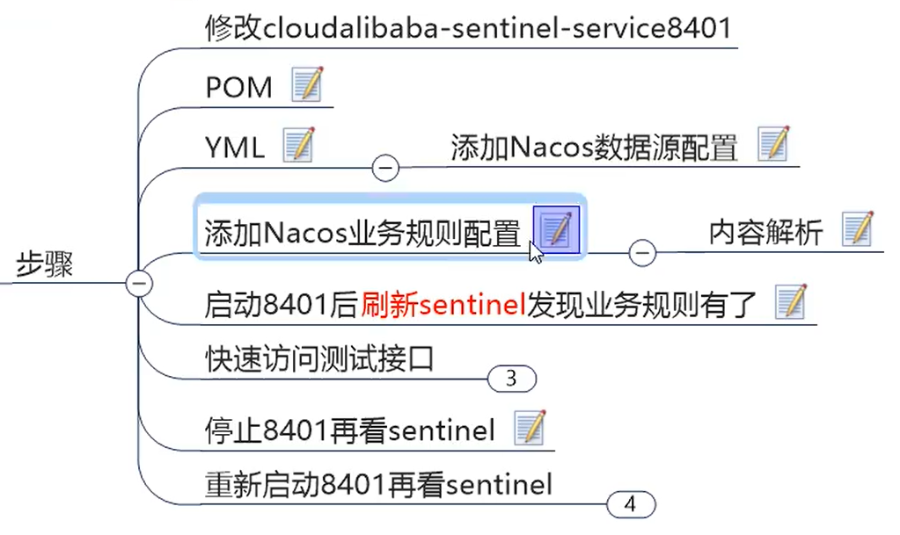


修改8401

1. pom

```
	<!--之前添加了-->
    <!-- SpringCloud ailibaba sentinel-datasource-nacos 持久化需要用到-->
    <dependency>
        <groupId>com.alibaba.csp</groupId>
        <artifactId>sentinel-datasource-nacos</artifactId>
    </dependency>
```

2. yml

```
	      datasource:
	        ds1:
	          nacos:
	            server-addr: 10.211.55.26:8848  #nacos
        		dataId: ${spring.application.name}
	            groupId: DEFAULT_GROUP  # 默认分组
            	data-type: json         # 流控规则
	            rule-type: flow

feign:
  sentinel:
    enabled: true #激活Sentinel 对Feign的支持
```


3. 在nacos后台添加配置：


```
[
    {
        "resource": "/rateLimit/byUrl",
        "limitApp": "default",
        "grade": 1,
        "count": 1,
        "strategy": 0,
        "controlBehavior": 0,
        "clusterMode": false
    }
]	
```


4. 启动8401
   `http://localhost:8401/rateLimit/byUrl`多次刷新


5. 停止8401


6. 再次启动8401，因为sentinel是懒加载模式，所以需要先访问`http://localhost:8401/rateLimit/byUrl`，然后查看sentinel后台。


多次刷新`http://localhost:8401/rateLimit/byUrl`


==实现sentinel配置的持久化==