<h1 align = "center">RabbitMQ</h1>

# 1 介绍

## 1.1 RabbitMQ

### 1.1.1  MQ介绍

MQ全称为Message Queue，即消息队列， RabbitMQ是由erlang语言开发，基于AMQP（Advanced Message Queue 高级消息队列协议）协议实现的消息队列，它是一种应用程序之间的通信方法，消息队列在分布式系统开发中应用非常广泛。

RabbitMQ官方地址：http://www.rabbitmq.com/

### 1.1.2  应用场景

开发中消息队列通常有如下应用场景：
1、任务异步处理。
将不需要同步处理的并且耗时长的操作由消息队列通知消息接收方进行异步处理。提高了应用程序的响应时间。
2、应用程序解耦合
MQ相当于一个中介，生产方通过MQ与消费方交互，它将应用程序进行解耦合。

### 1.1.3 其他消息队列

市场上还有哪些消息队列？
ActiveMQ，RabbitMQ，ZeroMQ，Kafka，MetaMQ，RocketMQ、Redis。

### 1.1.3 为什么使用RabbitMQ呢？

1、使得简单，功能强大。
2、基于AMQP协议。
3、社区活跃，文档完善。
4、高并发性能好，这主要得益于Erlang语言。
5、Spring Boot默认已集成RabbitMQ

## 1.2 其它相关知识

### 1.2.1  AMQP是什么 ？

AMQP是一套公开的消息队列协议，最早在2003年被提出，它旨在从协议层定义消息通信数据的标准格式，为的就是解决MQ市场上协议不统一的问题。RabbitMQ就是遵循AMQP标准协议开发的MQ服务。

官方：http://www.amqp.org/

### 1.2.2 JMS是什么 ？

JMS是java提供的一套消息服务API标准，其目的是为所有的java应用程序提供统一的消息通信的标准，类似java的
jdbc，只要遵循jms标准的应用程序之间都可以进行消息通信。它和AMQP有什么 不同，jms是java语言专属的消
息服务标准，它是在api层定义标准，并且只能用于java应用；而AMQP是在协议层定义的标准，是跨语言的 。

# 2 快速入门

## 2.1 RabbitMQ的工作原理

下图是RabbitMQ的基本结构：


### 2.1.1  组成部分说明

Broker：消息队列服务进程，此进程包括两个部分：Exchange和Queue。
Exchange：消息队列交换机，按一定的规则将消息路由转发到某个队列，对消息进行过虑。

Queue：消息队列，存储消息的队列，消息到达队列并转发给指定的消费方。
Producer：消息生产者，即生产方客户端，生产方客户端将消息发送到MQ。
Consumer：消息消费者，即消费方客户端，接收MQ转发的消息。

### 2.1.2 消息发布接收流程

-----发送消息-----
1、生产者和Broker建立TCP连接。
2、生产者和Broker建立通道。
3、生产者通过通道消息发送给Broker，由Exchange将消息进行转发。
4、Exchange将消息转发到指定的Queue（队列）

----接收消息-----
1、消费者和Broker建立TCP连接
2、消费者和Broker建立通道
3、消费者监听指定的Queue（队列）
4、当有消息到达Queue时Broker默认将消息推送给消费者。
5、消费者接收到消息。

## 2.2 下载安装

### 2.2.1 下载安装

RabbitMQ由Erlang语言开发，Erlang语言用于并发及分布式系统的开发，在电信领域应用广泛，OTP（Open Telecom Platform）作为Erlang语言的一部分，包含了很多基于Erlang开发的中间件及工具库，安装RabbitMQ需要安装Erlang/OTP，并保持版本匹配，如下图：

RabbitMQ的下载地址：http://www.rabbitmq.com/download.html

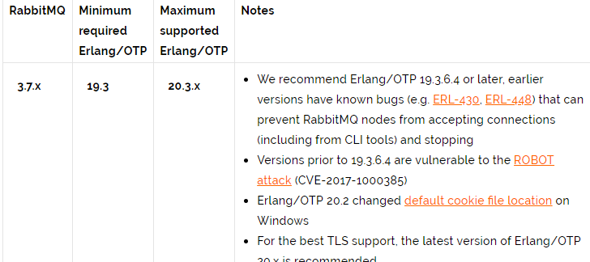

本项目使用Erlang/OTP 20.3版本和RabbitMQ3.7.3版本。

#### 2.2.1.1 下载erlang依赖

2个地址都可以

https://www.erlang.org/downloads

http://erlang.org/download

```
erlang安装完成需要配置erlang环境变量： ERLANG_HOME=D:\Program Files\erl9.3 
在path中添加 %ERLANG_HOME%\bin;
```

#### 2.2.1.2 安装RabbitMQ

https://www.rabbitmq.com/download.html

以管理员方式运行此文件，安装。

### 2.2.2 启动

安装成功后会自动创建RabbitMQ服务并且启动。

#### 2.2.2.1 从开始菜单启动RabbitMQ

完成在开始菜单找到RabbitMQ的菜单：

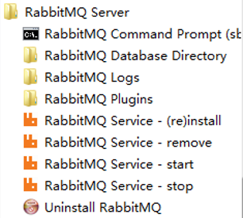

RabbitMQ Service-install :安装服务
RabbitMQ Service-remove 删除服务
RabbitMQ Service-start 启动
RabbitMQ Service-stop 启动

#### 2.2.2.2   手动启动

如果没有开始菜单，则进入安装目录下sbin目录手动启动

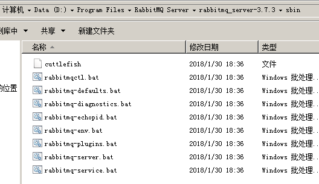

安装并运行服务

rabbitmq-service.bat install 安装服务 

rabbitmq-service.bat stop 停止服务

 rabbitmq-service.bat start 启动服务

#### 2.2.2.3 安装管理插件

安装rabbitMQ的管理插件，方便在浏览器端管理RabbitMQ
管理员身份运行 rabbitmq-plugins.bat enable rabbitmq_management

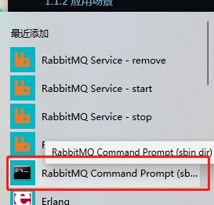

#### 2.2.2.4  启动成功 登录RabbitMQ

进入浏览器，输入：http://localhost:15672

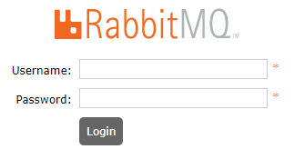

```
初始账号和密码：guest/guest
```

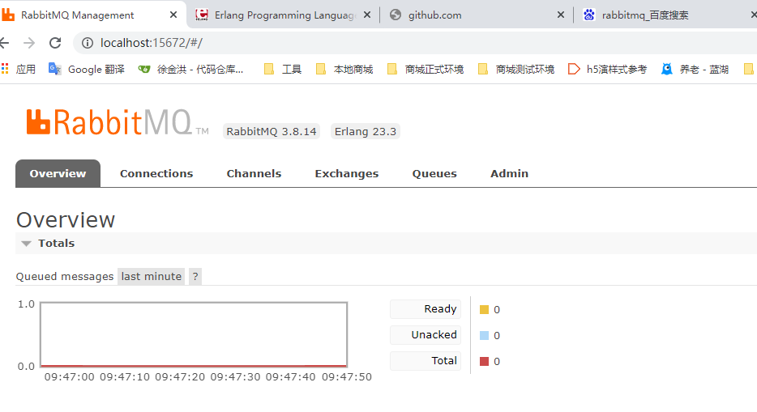

### 2.2.3 注意事项

1、安装erlang和rabbitMQ以管理员身份运行。
2、当卸载重新安装时会出现RabbitMQ服务注册失败，此时需要进入注册表清理erlang
搜索RabbitMQ、ErlSrv，将对应的项全部删除。

## 2.2 Hello World

按照官方教程(http://www.rabbitmq.com/getstarted.html)测试hello world:

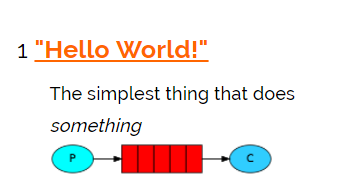

### 2.2.1搭建环境(创建maven工程)

创建生产者工程和消费者工程，分别加入RabbitMQ java client的依赖。
test-rabbitmq-producer：生产者工程
test-rabbitmq-consumer：消费者工程

```
<dependencies>
        <dependency>
            <groupId>com.rabbitmq</groupId>
            <artifactId>amqp-client</artifactId>
            <version>5.12.0</version>
        </dependency>

        <dependency>
            <groupId>org.springframework.boot</groupId>
            <artifactId>spring-boot-starter-logging</artifactId>
            <version>2.4.5</version>
        </dependency>
    </dependencies>
```

### 2.2.2 生产者

在生产者工程下的test中创建测试类如下：

```
package rabbitmq;


import com.rabbitmq.client.Channel;
import com.rabbitmq.client.Connection;
import com.rabbitmq.client.ConnectionFactory;

import java.io.IOException;
import java.util.concurrent.TimeoutException;


public class Producer1 {

    //队列
    private static final String QUEUE = "helloworld";

    public static void main(String[] args) {
        //通过连接工厂创建新的连接和mq建立连接
        ConnectionFactory connectionFactory = new ConnectionFactory();
        connectionFactory.setHost("127.0.0.1");
        connectionFactory.setPort(5672);//端口
        connectionFactory.setUsername("guest");
        connectionFactory.setPassword("guest");
        //设置虚拟机，一个mq服务可以设置多个虚拟机，每个虚拟机就相当于一个独立的mq
        connectionFactory.setVirtualHost("/");

        Connection connection = null;
        Channel channel = null;
        try {
            //建立新连接
            connection = connectionFactory.newConnection();
            //创建会话通道,生产者和mq服务所有通信都在channel通道中完成
            channel = connection.createChannel();
            //声明队列，如果队列在mq 中没有则要创建
            //参数：String queue, boolean durable, boolean exclusive, boolean autoDelete, Map<String, Object> arguments
            /**
             * 参数明细
             * 1、queue 队列名称
             * 2、durable 是否持久化，如果持久化，mq重启后队列还在
             * 3、exclusive 是否独占连接，队列只允许在该连接中访问，如果connection连接关闭队列则自动删除,如果将此参数设置true可用于临时队列的创建
             * 4、autoDelete 自动删除，队列不再使用时是否自动删除此队列，如果将此参数和exclusive参数设置为true就可以实现临时队列（队列不用了就自动删除）
             * 5、arguments 参数，可以设置一个队列的扩展参数，比如：可设置存活时间
             */
            channel.queueDeclare(QUEUE,true,false,false,null);
            //发送消息
            //参数：String exchange, String routingKey, BasicProperties props, byte[] body
            /**
             * 参数明细：
             * 1、exchange，交换机，如果不指定将使用mq的默认交换机（设置为""）
             * 2、routingKey，路由key，交换机根据路由key来将消息转发到指定的队列，如果使用默认交换机，routingKey设置为队列的名称
             * 3、props，消息的属性
             * 4、body，消息内容
             */
            //消息内容
            String message = "hello world RabbitMQ 测试程序";
            channel.basicPublish("",QUEUE,null,message.getBytes());
            System.out.println("send to mq "+message);
        } catch (Exception e) {
            e.printStackTrace();
        } finally {
            //关闭连接
            //先关闭通道
            try {
                channel.close();
            } catch (IOException e) {
                e.printStackTrace();
            } catch (TimeoutException e) {
                e.printStackTrace();
            }
            try {
                connection.close();
            } catch (IOException e) {
                e.printStackTrace();
            }
        }


    }
}
```

### 2.2.3 消费者

在消费者工程下的test中创建测试类如下：

```
package RabbitMQ;


import com.rabbitmq.client.*;

import java.io.IOException;
import java.util.concurrent.TimeoutException;

/**
 * @Auther: xjh
 * @Date: 2021/4/28 15:40
 * @Description:
 */
public class Consumer1 {

    //队列
    private static final String QUEUE = "helloworld";

    public static void main(String[] args) throws IOException, TimeoutException {
        //通过连接工厂创建新的连接和mq建立连接
        ConnectionFactory connectionFactory = new ConnectionFactory();
        connectionFactory.setHost("127.0.0.1");
        connectionFactory.setPort(5672);//端口
        connectionFactory.setUsername("guest");
        connectionFactory.setPassword("guest");
        //设置虚拟机，一个mq服务可以设置多个虚拟机，每个虚拟机就相当于一个独立的mq
        connectionFactory.setVirtualHost("/");

        //建立新连接
        Connection connection = connectionFactory.newConnection();
        //创建会话通道,生产者和mq服务所有通信都在channel通道中完成
        Channel channel = connection.createChannel();

        //监听队列
        //声明队列，如果队列在mq 中没有则要创建
        //参数：String queue, boolean durable, boolean exclusive, boolean autoDelete, Map<String, Object> arguments
        /**
         * 参数明细
         * 1、queue 队列名称
         * 2、durable 是否持久化，如果持久化，mq重启后队列还在
         * 3、exclusive 是否独占连接，队列只允许在该连接中访问，如果connection连接关闭队列则自动删除,如果将此参数设置true可用于临时队列的创建
         * 4、autoDelete 自动删除，队列不再使用时是否自动删除此队列，如果将此参数和exclusive参数设置为true就可以实现临时队列（队列不用了就自动删除）
         * 5、arguments 参数，可以设置一个队列的扩展参数，比如：可设置存活时间
         */
        channel.queueDeclare(QUEUE,true,false,false,null);

        //实现消费方法
        DefaultConsumer defaultConsumer = new DefaultConsumer(channel){

            /**
             * 当接收到消息后此方法将被调用
             * @param consumerTag  消费者标签，用来标识消费者的，在监听队列时设置channel.basicConsume
             * @param envelope 信封，通过envelope
             * @param properties 消息属性
             * @param body 消息内容
             * @throws IOException
             */
            @Override
            public void handleDelivery(String consumerTag, Envelope envelope, AMQP.BasicProperties properties, byte[] body) throws IOException {
                //交换机
                String exchange = envelope.getExchange();
                //消息id，mq在channel中用来标识消息的id，可用于确认消息已接收
                long deliveryTag = envelope.getDeliveryTag();
                //消息内容
                String message= new String(body,"utf-8");
                System.out.println("receive message:"+message);
            }
        };

        //监听队列
        //参数：String queue, boolean autoAck, Consumer callback
        /**
         * 参数明细：
         * 1、queue 队列名称
         * 2、autoAck 自动回复，当消费者接收到消息后要告诉mq消息已接收，如果将此参数设置为tru表示会自动回复mq，如果设置为false要通过编程实现回复
         * 3、callback，消费方法，当消费者接收到消息要执行的方法
         */
        channel.basicConsume(QUEUE,true,defaultConsumer);

    }
}
```

### 2.2.4 总结

1、发送端操作流程
1）创建连接
2）创建通道
3）声明队列
4）发送消息

2、接收端
1）创建连接
2）创建通道
3）声明队列
4）监听队列
5）接收消息

6）ack回复

# 3 工作模式

RabbitMQ有以下几种工作模式 ：
1、Work queues
2、Publish/Subscribe
3、Routing
4、Topics
5、Header
6、RPC

## 3.1 Work queues（工作队列模式）

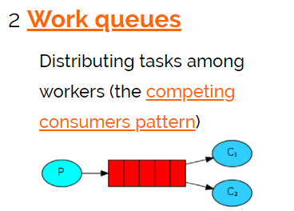

work queues 与入门程序相比，多了一个消费端，两个消费端共同消费同一个队列中的消息。
应用场景：对于 任务过重或任务较多情况使用工作队列可以提高任务处理的速度。


测试：

复制多个消费者代码 ，进行测试


1、使用入门程序，启动多个消费者。
2、生产者发送多个消息。

结果：
1、一条消息只会被一个消费者接收；
2、rabbit采用轮询的方式将消息是平均发送给消费者的；
3、消费者在处理完某条消息后，才会收到下一条消息。

## 3.2 Publish/subscribe（发布订阅模式）

### 3.2.1 工作模式


发布订阅模式：
1、每个消费者监听自己的队列。
2、生产者将消息发给broker，由交换机将消息转发到绑定此交换机的每个队列，每个绑定交换机的队	  列都将接收到消息

### 3.2.2代码

案例：
用户通知，当用户充值成功或转账完成系统通知用户，通知方式有短信、邮件多种方法 。

#### 3.2.2.1 生产者

声明Exchange_fanout_inform交换机。
声明两个队列并且绑定到此交换机，绑定时不需要指定routingkey
发送消息时不需要指定routingkey

```
package rabbitmq;

/**
 * @Auther: xjh
 * @Date: 2021/4/29 09:12
 * @Description:
 */


import com.rabbitmq.client.BuiltinExchangeType;
import com.rabbitmq.client.Channel;
import com.rabbitmq.client.Connection;
import com.rabbitmq.client.ConnectionFactory;

import java.io.IOException;
import java.util.concurrent.TimeoutException;

/**
 * @author Administrator
 * @version 1.0
 * @create 2018-06-17 18:10
 **/
public class Producer02_publish {
    //队列名称
    private static final String QUEUE_INFORM_EMAIL = "queue_inform_email";
    private static final String QUEUE_INFORM_SMS = "queue_inform_sms";
    private static final String EXCHANGE_FANOUT_INFORM="exchange_fanout_inform";

    public static void main(String[] args) {
        //通过连接工厂创建新的连接和mq建立连接
        ConnectionFactory connectionFactory = new ConnectionFactory();
        connectionFactory.setHost("127.0.0.1");
        connectionFactory.setPort(5672);//端口
        connectionFactory.setUsername("guest");
        connectionFactory.setPassword("guest");
        //设置虚拟机，一个mq服务可以设置多个虚拟机，每个虚拟机就相当于一个独立的mq
        connectionFactory.setVirtualHost("/");

        Connection connection = null;
        Channel channel = null;
        try {
            //建立新连接
            connection = connectionFactory.newConnection();
            //创建会话通道,生产者和mq服务所有通信都在channel通道中完成
            channel = connection.createChannel();
            //声明队列，如果队列在mq 中没有则要创建
            //参数：String queue, boolean durable, boolean exclusive, boolean autoDelete, Map<String, Object> arguments
            /**
             * 参数明细
             * 1、queue 队列名称
             * 2、durable 是否持久化，如果持久化，mq重启后队列还在
             * 3、exclusive 是否独占连接，队列只允许在该连接中访问，如果connection连接关闭队列则自动删除,如果将此参数设置true可用于临时队列的创建
             * 4、autoDelete 自动删除，队列不再使用时是否自动删除此队列，如果将此参数和exclusive参数设置为true就可以实现临时队列（队列不用了就自动删除）
             * 5、arguments 参数，可以设置一个队列的扩展参数，比如：可设置存活时间
             */
            channel.queueDeclare(QUEUE_INFORM_EMAIL,true,false,false,null);
            channel.queueDeclare(QUEUE_INFORM_SMS,true,false,false,null);
            //声明一个交换机
            //参数：String exchange, String type
            /**
             * 参数明细：
             * 1、交换机的名称
             * 2、交换机的类型
             * fanout：对应的rabbitmq的工作模式是 publish/subscribe
             * direct：对应的Routing	工作模式
             * topic：对应的Topics工作模式
             * headers： 对应的headers工作模式
             */
            channel.exchangeDeclare(EXCHANGE_FANOUT_INFORM, BuiltinExchangeType.FANOUT);
            //进行交换机和队列绑定
            //参数：String queue, String exchange, String routingKey
            /**
             * 参数明细：
             * 1、queue 队列名称
             * 2、exchange 交换机名称
             * 3、routingKey 路由key，作用是交换机根据路由key的值将消息转发到指定的队列中，在发布订阅模式中调协为空字符串
             */
            channel.queueBind(QUEUE_INFORM_EMAIL,EXCHANGE_FANOUT_INFORM,"");
            channel.queueBind(QUEUE_INFORM_SMS,EXCHANGE_FANOUT_INFORM,"");
            //发送消息
            //参数：String exchange, String routingKey, BasicProperties props, byte[] body
            /**
             * 参数明细：
             * 1、exchange，交换机，如果不指定将使用mq的默认交换机（设置为""）
             * 2、routingKey，路由key，交换机根据路由key来将消息转发到指定的队列，如果使用默认交换机，routingKey设置为队列的名称
             * 3、props，消息的属性
             * 4、body，消息内容
             */
            for(int i=0;i<5;i++){
                //消息内容
                String message = "send inform message to user";
                channel.basicPublish(EXCHANGE_FANOUT_INFORM,"",null,message.getBytes());
                System.out.println("send to mq "+message);
            }

        } catch (Exception e) {
            e.printStackTrace();
        } finally {
            //关闭连接
            //先关闭通道
            try {
                channel.close();
            } catch (IOException e) {
                e.printStackTrace();
            } catch (TimeoutException e) {
                e.printStackTrace();
            }
            try {
                connection.close();
            } catch (IOException e) {
                e.printStackTrace();
            }
        }


    }
}
```

#### 3.2.2.2 消费者

##### 3.2.2.2.1  邮件消费者

```
package RabbitMQ;

/**
 * @Auther: xjh
 * @Date: 2021/4/29 09:09
 * @Description:
 */


import com.rabbitmq.client.*;

import java.io.IOException;
import java.util.concurrent.TimeoutException;

public class Consumer02_subscribe_email {
    //队列名称
    private static final String QUEUE_INFORM_EMAIL = "queue_inform_email";
    private static final String EXCHANGE_FANOUT_INFORM="exchange_fanout_inform";


    public static void main(String[] args) throws IOException, TimeoutException {
        //通过连接工厂创建新的连接和mq建立连接
        ConnectionFactory connectionFactory = new ConnectionFactory();
        connectionFactory.setHost("127.0.0.1");
        connectionFactory.setPort(5672);//端口
        connectionFactory.setUsername("guest");
        connectionFactory.setPassword("guest");
        //设置虚拟机，一个mq服务可以设置多个虚拟机，每个虚拟机就相当于一个独立的mq
        connectionFactory.setVirtualHost("/");

        //建立新连接
        Connection connection = connectionFactory.newConnection();
        //创建会话通道,生产者和mq服务所有通信都在channel通道中完成
        Channel channel = connection.createChannel();

        /**
         * 参数明细
         * 1、queue 队列名称
         * 2、durable 是否持久化，如果持久化，mq重启后队列还在
         * 3、exclusive 是否独占连接，队列只允许在该连接中访问，如果connection连接关闭队列则自动删除,如果将此参数设置true可用于临时队列的创建
         * 4、autoDelete 自动删除，队列不再使用时是否自动删除此队列，如果将此参数和exclusive参数设置为true就可以实现临时队列（队列不用了就自动删除）
         * 5、arguments 参数，可以设置一个队列的扩展参数，比如：可设置存活时间
         */
        channel.queueDeclare(QUEUE_INFORM_EMAIL,true,false,false,null);
        //声明一个交换机
        //参数：String exchange, String type
        /**
         * 参数明细：
         * 1、交换机的名称
         * 2、交换机的类型
         * fanout：对应的rabbitmq的工作模式是 publish/subscribe
         * direct：对应的Routing	工作模式
         * topic：对应的Topics工作模式
         * headers： 对应的headers工作模式
         */
        channel.exchangeDeclare(EXCHANGE_FANOUT_INFORM, BuiltinExchangeType.FANOUT);
        //进行交换机和队列绑定
        //参数：String queue, String exchange, String routingKey
        /**
         * 参数明细：
         * 1、queue 队列名称
         * 2、exchange 交换机名称
         * 3、routingKey 路由key，作用是交换机根据路由key的值将消息转发到指定的队列中，在发布订阅模式中调协为空字符串
         */
        channel.queueBind(QUEUE_INFORM_EMAIL, EXCHANGE_FANOUT_INFORM, "");

        //实现消费方法
        DefaultConsumer defaultConsumer = new DefaultConsumer(channel){

            /**
             * 当接收到消息后此方法将被调用
             * @param consumerTag  消费者标签，用来标识消费者的，在监听队列时设置channel.basicConsume
             * @param envelope 信封，通过envelope
             * @param properties 消息属性
             * @param body 消息内容
             * @throws IOException
             */
            @Override
            public void handleDelivery(String consumerTag, Envelope envelope, AMQP.BasicProperties properties, byte[] body) throws IOException {
                //交换机
                String exchange = envelope.getExchange();
                //消息id，mq在channel中用来标识消息的id，可用于确认消息已接收
                long deliveryTag = envelope.getDeliveryTag();
                //消息内容
                String message= new String(body,"utf-8");
                System.out.println("receive message:"+message);
            }
        };

        //监听队列
        //参数：String queue, boolean autoAck, Consumer callback
        /**
         * 参数明细：
         * 1、queue 队列名称
         * 2、autoAck 自动回复，当消费者接收到消息后要告诉mq消息已接收，如果将此参数设置为tru表示会自动回复mq，如果设置为false要通过编程实现回复
         * 3、callback，消费方法，当消费者接收到消息要执行的方法
         */
        channel.basicConsume(QUEUE_INFORM_EMAIL,true,defaultConsumer);

    }
}
```

##### 3.2.2.2.2  短信消费者

```
package RabbitMQ;

/**
 * @Auther: xjh
 * @Date: 2021/4/29 09:11
 * @Description:
 */


import com.rabbitmq.client.*;

import java.io.IOException;
import java.util.concurrent.TimeoutException;


public class Consumer02_subscribe_sms {
    //队列名称
    private static final String QUEUE_INFORM_SMS = "queue_inform_sms";
    private static final String EXCHANGE_FANOUT_INFORM="exchange_fanout_inform";


    public static void main(String[] args) throws IOException, TimeoutException {
        //通过连接工厂创建新的连接和mq建立连接
        ConnectionFactory connectionFactory = new ConnectionFactory();
        connectionFactory.setHost("127.0.0.1");
        connectionFactory.setPort(5672);//端口
        connectionFactory.setUsername("guest");
        connectionFactory.setPassword("guest");
        //设置虚拟机，一个mq服务可以设置多个虚拟机，每个虚拟机就相当于一个独立的mq
        connectionFactory.setVirtualHost("/");

        //建立新连接
        Connection connection = connectionFactory.newConnection();
        //创建会话通道,生产者和mq服务所有通信都在channel通道中完成
        Channel channel = connection.createChannel();

        /**
         * 参数明细
         * 1、queue 队列名称
         * 2、durable 是否持久化，如果持久化，mq重启后队列还在
         * 3、exclusive 是否独占连接，队列只允许在该连接中访问，如果connection连接关闭队列则自动删除,如果将此参数设置true可用于临时队列的创建
         * 4、autoDelete 自动删除，队列不再使用时是否自动删除此队列，如果将此参数和exclusive参数设置为true就可以实现临时队列（队列不用了就自动删除）
         * 5、arguments 参数，可以设置一个队列的扩展参数，比如：可设置存活时间
         */
        channel.queueDeclare(QUEUE_INFORM_SMS,true,false,false,null);
        //声明一个交换机
        //参数：String exchange, String type
        /**
         * 参数明细：
         * 1、交换机的名称
         * 2、交换机的类型
         * fanout：对应的rabbitmq的工作模式是 publish/subscribe
         * direct：对应的Routing	工作模式
         * topic：对应的Topics工作模式
         * headers： 对应的headers工作模式
         */
        channel.exchangeDeclare(EXCHANGE_FANOUT_INFORM, BuiltinExchangeType.FANOUT);
        //进行交换机和队列绑定
        //参数：String queue, String exchange, String routingKey
        /**
         * 参数明细：
         * 1、queue 队列名称
         * 2、exchange 交换机名称
         * 3、routingKey 路由key，作用是交换机根据路由key的值将消息转发到指定的队列中，在发布订阅模式中调协为空字符串
         */
        channel.queueBind(QUEUE_INFORM_SMS, EXCHANGE_FANOUT_INFORM, "");

        //实现消费方法
        DefaultConsumer defaultConsumer = new DefaultConsumer(channel){

            /**
             * 当接收到消息后此方法将被调用
             * @param consumerTag  消费者标签，用来标识消费者的，在监听队列时设置channel.basicConsume
             * @param envelope 信封，通过envelope
             * @param properties 消息属性
             * @param body 消息内容
             * @throws IOException
             */
            @Override
            public void handleDelivery(String consumerTag, Envelope envelope, AMQP.BasicProperties properties, byte[] body) throws IOException {
                //交换机
                String exchange = envelope.getExchange();
                //消息id，mq在channel中用来标识消息的id，可用于确认消息已接收
                long deliveryTag = envelope.getDeliveryTag();
                //消息内容
                String message= new String(body,"utf-8");
                System.out.println("receive message:"+message);
            }
        };

        //监听队列
        //参数：String queue, boolean autoAck, Consumer callback
        /**
         * 参数明细：
         * 1、queue 队列名称
         * 2、autoAck 自动回复，当消费者接收到消息后要告诉mq消息已接收，如果将此参数设置为tru表示会自动回复mq，如果设置为false要通过编程实现回复
         * 3、callback，消费方法，当消费者接收到消息要执行的方法
         */
        channel.basicConsume(QUEUE_INFORM_SMS,true,defaultConsumer);

    }
}
```

### 3.2.3测试

打开RabbitMQ的管理界面，观察交换机绑定情况：

#### 3.2.3.1 交换机

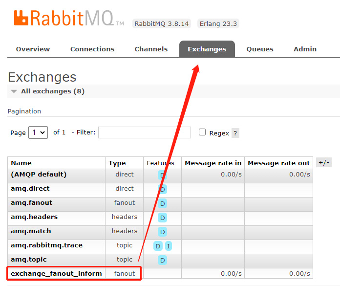

#### 3.2.3.2 队列

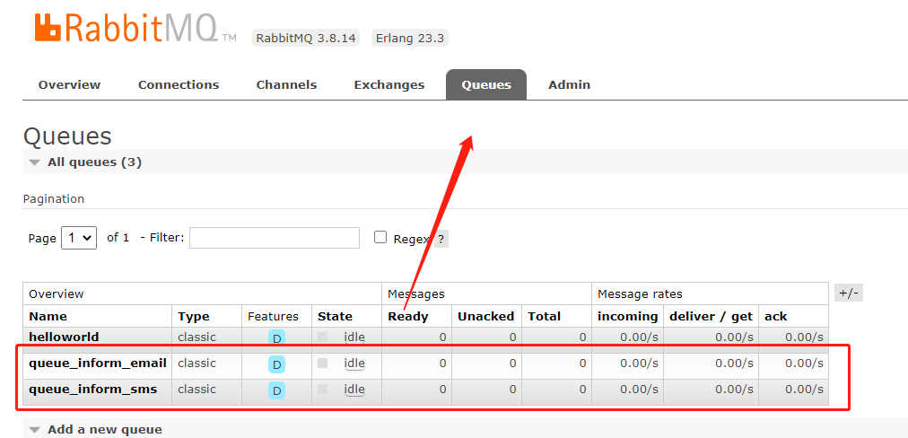

#### 3.2.3.3 连接

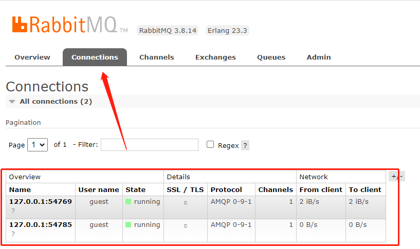

#### 3.2.3.4 通道

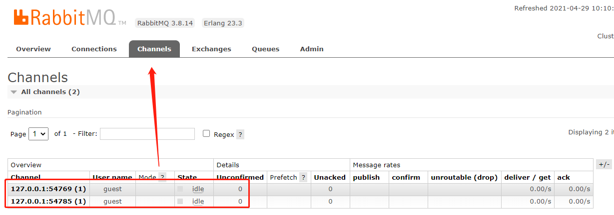

### 3.2.4 思考

```
1、publish/subscribe与work queues有什么区别。
区别：
1）work queues不用定义交换机，而publish/subscribe需要定义交换机。
2）publish/subscribe的生产方是面向交换机发送消息，work queues的生产方是面向队列发送消息(底层使用	 默认交换机)。
3）publish/subscribe需要设置队列和交换机的绑定，work queues不需要设置，实质上work queues会将队列绑定到默认的交换机 。
相同点：
所以两者实现的发布/订阅的效果是一样的，多个消费端监听同一个队列不会重复消费消息。
```

```
2、实质工作用什么 publish/subscribe还是work queues。
建议使用 publish/subscribe，发布订阅模式比工作队列模式更强大，并且发布订阅模式可以指定自己专用的交换机。
```

## 3.3 Routing(路由工作模式)

### 3.3.1 工作模式


路由模式：
1、每个消费者监听自己的队列，并且设置routingkey。
2、生产者将消息发给交换机，由交换机根据routingkey来转发消息到指定的队列。

### 3.3.2代码

#### 3.3.2.1 生产者

声明exchange_routing_inform交换机。
声明两个队列并且绑定到此交换机，绑定时需要指定routingkey
发送消息时需要指定routingkey

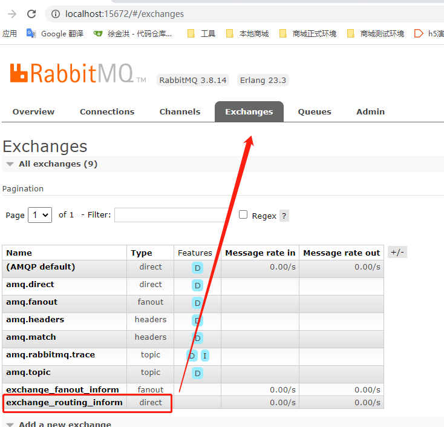

点进去查看绑定的队列

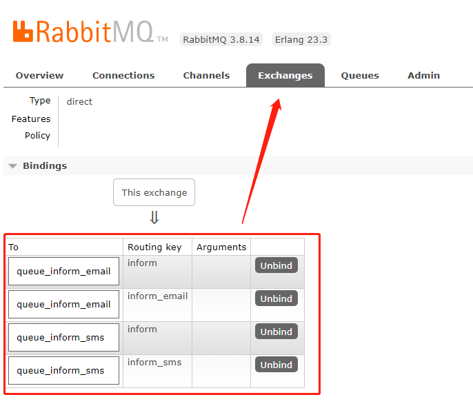

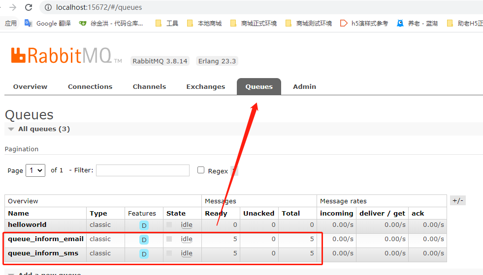

```
package rabbitmq;


import com.rabbitmq.client.BuiltinExchangeType;
import com.rabbitmq.client.Channel;
import com.rabbitmq.client.Connection;
import com.rabbitmq.client.ConnectionFactory;

import java.io.IOException;
import java.util.concurrent.TimeoutException;

/**
 * @Auther: xjh
 * @Date: 2021/4/29 10:27
 * @Description:
 */
public class Producer03_routing {
    //队列名称
    private static final String QUEUE_INFORM_EMAIL = "queue_inform_email";
    private static final String QUEUE_INFORM_SMS = "queue_inform_sms";
    private static final String EXCHANGE_ROUTING_INFORM="exchange_routing_inform";
    private static final String ROUTINGKEY_EMAIL="inform_email";
    private static final String ROUTINGKEY_SMS="inform_sms";
    public static void main(String[] args) {
        //通过连接工厂创建新的连接和mq建立连接
        ConnectionFactory connectionFactory = new ConnectionFactory();
        connectionFactory.setHost("127.0.0.1");
        connectionFactory.setPort(5672);//端口
        connectionFactory.setUsername("guest");
        connectionFactory.setPassword("guest");
        //设置虚拟机，一个mq服务可以设置多个虚拟机，每个虚拟机就相当于一个独立的mq
        connectionFactory.setVirtualHost("/");

        Connection connection = null;
        Channel channel = null;
        try {
            //建立新连接
            connection = connectionFactory.newConnection();
            //创建会话通道,生产者和mq服务所有通信都在channel通道中完成
            channel = connection.createChannel();
            //声明队列，如果队列在mq 中没有则要创建
            //参数：String queue, boolean durable, boolean exclusive, boolean autoDelete, Map<String, Object> arguments
            /**
             * 参数明细
             * 1、queue 队列名称
             * 2、durable 是否持久化，如果持久化，mq重启后队列还在
             * 3、exclusive 是否独占连接，队列只允许在该连接中访问，如果connection连接关闭队列则自动删除,如果将此参数设置true可用于临时队列的创建
             * 4、autoDelete 自动删除，队列不再使用时是否自动删除此队列，如果将此参数和exclusive参数设置为true就可以实现临时队列（队列不用了就自动删除）
             * 5、arguments 参数，可以设置一个队列的扩展参数，比如：可设置存活时间
             */
            channel.queueDeclare(QUEUE_INFORM_EMAIL,true,false,false,null);
            channel.queueDeclare(QUEUE_INFORM_SMS,true,false,false,null);
            //声明一个交换机
            //参数：String exchange, String type
            /**
             * 参数明细：
             * 1、交换机的名称
             * 2、交换机的类型
             * fanout：对应的rabbitmq的工作模式是 publish/subscribe
             * direct：对应的Routing	工作模式
             * topic：对应的Topics工作模式
             * headers： 对应的headers工作模式
             */
            channel.exchangeDeclare(EXCHANGE_ROUTING_INFORM, BuiltinExchangeType.DIRECT);
            //进行交换机和队列绑定
            //参数：String queue, String exchange, String routingKey
            /**
             * 参数明细：
             * 1、queue 队列名称
             * 2、exchange 交换机名称
             * 3、routingKey 路由key，作用是交换机根据路由key的值将消息转发到指定的队列中，在发布订阅模式中调协为空字符串
             */
            channel.queueBind(QUEUE_INFORM_EMAIL,EXCHANGE_ROUTING_INFORM,ROUTINGKEY_EMAIL);
            channel.queueBind(QUEUE_INFORM_EMAIL,EXCHANGE_ROUTING_INFORM,"inform");
            channel.queueBind(QUEUE_INFORM_SMS,EXCHANGE_ROUTING_INFORM,ROUTINGKEY_SMS);
            channel.queueBind(QUEUE_INFORM_SMS,EXCHANGE_ROUTING_INFORM,"inform");
            //发送消息
            //参数：String exchange, String routingKey, BasicProperties props, byte[] body
            /**
             * 参数明细：
             * 1、exchange，交换机，如果不指定将使用mq的默认交换机（设置为""）
             * 2、routingKey，路由key，交换机根据路由key来将消息转发到指定的队列，如果使用默认交换机，routingKey设置为队列的名称
             * 3、props，消息的属性
             * 4、body，消息内容
             */
           /* for(int i=0;i<5;i++){
                //发送消息的时候指定routingKey
                String message = "send email inform message to user";
                channel.basicPublish(EXCHANGE_ROUTING_INFORM,ROUTINGKEY_EMAIL,null,message.getBytes());
                System.out.println("send to mq "+message);
            }
            for(int i=0;i<5;i++){
                //发送消息的时候指定routingKey
                String message = "send sms inform message to user";
                channel.basicPublish(EXCHANGE_ROUTING_INFORM,ROUTINGKEY_SMS,null,message.getBytes());
                System.out.println("send to mq "+message);
            }*/
            for(int i=0;i<5;i++){
                //发送消息的时候指定routingKey
                String message = "send inform message to user";
                channel.basicPublish(EXCHANGE_ROUTING_INFORM,"inform",null,message.getBytes());
                System.out.println("send to mq "+message);
            }

        } catch (Exception e) {
            e.printStackTrace();
        } finally {
            //关闭连接
            //先关闭通道
            try {
                channel.close();
            } catch (IOException e) {
                e.printStackTrace();
            } catch (TimeoutException e) {
                e.printStackTrace();
            }
            try {
                connection.close();
            } catch (IOException e) {
                e.printStackTrace();
            }
        }


    }
}
```

#### 3.3.2.2  消费者

##### 3.3.2.2.1 邮件发送消费者

```
package RabbitMQ;

import com.rabbitmq.client.*;

import java.io.IOException;
import java.util.concurrent.TimeoutException;

/**
 * @Auther: xjh
 * @Date: 2021/4/29 10:32
 * @Description:
 */
public class Consumer03_routing_email {
    //队列名称
    private static final String QUEUE_INFORM_EMAIL = "queue_inform_email";
    private static final String EXCHANGE_ROUTING_INFORM="exchange_routing_inform";
    private static final String ROUTINGKEY_EMAIL="inform_email";

    public static void main(String[] args) throws IOException, TimeoutException {
        //通过连接工厂创建新的连接和mq建立连接
        ConnectionFactory connectionFactory = new ConnectionFactory();
        connectionFactory.setHost("127.0.0.1");
        connectionFactory.setPort(5672);//端口
        connectionFactory.setUsername("guest");
        connectionFactory.setPassword("guest");
        //设置虚拟机，一个mq服务可以设置多个虚拟机，每个虚拟机就相当于一个独立的mq
        connectionFactory.setVirtualHost("/");

        //建立新连接
        Connection connection = connectionFactory.newConnection();
        //创建会话通道,生产者和mq服务所有通信都在channel通道中完成
        Channel channel = connection.createChannel();

        /**
         * 参数明细
         * 1、queue 队列名称
         * 2、durable 是否持久化，如果持久化，mq重启后队列还在
         * 3、exclusive 是否独占连接，队列只允许在该连接中访问，如果connection连接关闭队列则自动删除,如果将此参数设置true可用于临时队列的创建
         * 4、autoDelete 自动删除，队列不再使用时是否自动删除此队列，如果将此参数和exclusive参数设置为true就可以实现临时队列（队列不用了就自动删除）
         * 5、arguments 参数，可以设置一个队列的扩展参数，比如：可设置存活时间
         */
        channel.queueDeclare(QUEUE_INFORM_EMAIL,true,false,false,null);
        //声明一个交换机
        //参数：String exchange, String type
        /**
         * 参数明细：
         * 1、交换机的名称
         * 2、交换机的类型
         * fanout：对应的rabbitmq的工作模式是 publish/subscribe
         * direct：对应的Routing	工作模式
         * topic：对应的Topics工作模式
         * headers： 对应的headers工作模式
         */
        channel.exchangeDeclare(EXCHANGE_ROUTING_INFORM, BuiltinExchangeType.DIRECT);
        //进行交换机和队列绑定
        //参数：String queue, String exchange, String routingKey
        /**
         * 参数明细：
         * 1、queue 队列名称
         * 2、exchange 交换机名称
         * 3、routingKey 路由key，作用是交换机根据路由key的值将消息转发到指定的队列中，在发布订阅模式中调协为空字符串
         */
        channel.queueBind(QUEUE_INFORM_EMAIL, EXCHANGE_ROUTING_INFORM,ROUTINGKEY_EMAIL);

        //实现消费方法
        DefaultConsumer defaultConsumer = new DefaultConsumer(channel){

            /**
             * 当接收到消息后此方法将被调用
             * @param consumerTag  消费者标签，用来标识消费者的，在监听队列时设置channel.basicConsume
             * @param envelope 信封，通过envelope
             * @param properties 消息属性
             * @param body 消息内容
             * @throws IOException
             */
            @Override
            public void handleDelivery(String consumerTag, Envelope envelope, AMQP.BasicProperties properties, byte[] body) throws IOException {
                //交换机
                String exchange = envelope.getExchange();
                //消息id，mq在channel中用来标识消息的id，可用于确认消息已接收
                long deliveryTag = envelope.getDeliveryTag();
                //消息内容
                String message= new String(body,"utf-8");
                System.out.println("receive message:"+message);
            }
        };

        //监听队列
        //参数：String queue, boolean autoAck, Consumer callback
        /**
         * 参数明细：
         * 1、queue 队列名称
         * 2、autoAck 自动回复，当消费者接收到消息后要告诉mq消息已接收，如果将此参数设置为tru表示会自动回复mq，如果设置为false要通过编程实现回复
         * 3、callback，消费方法，当消费者接收到消息要执行的方法
         */
        channel.basicConsume(QUEUE_INFORM_EMAIL,true,defaultConsumer);

    }
}
```

##### 3.3.2.2.2 短信发送消费者

```
package RabbitMQ;

import com.rabbitmq.client.*;

import java.io.IOException;
import java.util.concurrent.TimeoutException;


public class Consumer03_routing_sms {
    //队列名称
    private static final String QUEUE_INFORM_SMS = "queue_inform_sms";
    private static final String EXCHANGE_ROUTING_INFORM="exchange_routing_inform";
    private static final String ROUTINGKEY_SMS="inform_sms";

    public static void main(String[] args) throws IOException, TimeoutException {
        //通过连接工厂创建新的连接和mq建立连接
        ConnectionFactory connectionFactory = new ConnectionFactory();
        connectionFactory.setHost("127.0.0.1");
        connectionFactory.setPort(5672);//端口
        connectionFactory.setUsername("guest");
        connectionFactory.setPassword("guest");
        //设置虚拟机，一个mq服务可以设置多个虚拟机，每个虚拟机就相当于一个独立的mq
        connectionFactory.setVirtualHost("/");

        //建立新连接
        Connection connection = connectionFactory.newConnection();
        //创建会话通道,生产者和mq服务所有通信都在channel通道中完成
        Channel channel = connection.createChannel();

        /**
         * 参数明细
         * 1、queue 队列名称
         * 2、durable 是否持久化，如果持久化，mq重启后队列还在
         * 3、exclusive 是否独占连接，队列只允许在该连接中访问，如果connection连接关闭队列则自动删除,如果将此参数设置true可用于临时队列的创建
         * 4、autoDelete 自动删除，队列不再使用时是否自动删除此队列，如果将此参数和exclusive参数设置为true就可以实现临时队列（队列不用了就自动删除）
         * 5、arguments 参数，可以设置一个队列的扩展参数，比如：可设置存活时间
         */
        channel.queueDeclare(QUEUE_INFORM_SMS,true,false,false,null);
        //声明一个交换机
        //参数：String exchange, String type
        /**
         * 参数明细：
         * 1、交换机的名称
         * 2、交换机的类型
         * fanout：对应的rabbitmq的工作模式是 publish/subscribe
         * direct：对应的Routing	工作模式
         * topic：对应的Topics工作模式
         * headers： 对应的headers工作模式
         */
        channel.exchangeDeclare(EXCHANGE_ROUTING_INFORM, BuiltinExchangeType.DIRECT);
        //进行交换机和队列绑定
        //参数：String queue, String exchange, String routingKey
        /**
         * 参数明细：
         * 1、queue 队列名称
         * 2、exchange 交换机名称
         * 3、routingKey 路由key，作用是交换机根据路由key的值将消息转发到指定的队列中，在发布订阅模式中调协为空字符串
         */
        channel.queueBind(QUEUE_INFORM_SMS, EXCHANGE_ROUTING_INFORM,ROUTINGKEY_SMS);

        //实现消费方法
        DefaultConsumer defaultConsumer = new DefaultConsumer(channel){

            /**
             * 当接收到消息后此方法将被调用
             * @param consumerTag  消费者标签，用来标识消费者的，在监听队列时设置channel.basicConsume
             * @param envelope 信封，通过envelope
             * @param properties 消息属性
             * @param body 消息内容
             * @throws IOException
             */
            @Override
            public void handleDelivery(String consumerTag, Envelope envelope, AMQP.BasicProperties properties, byte[] body) throws IOException {
                //交换机
                String exchange = envelope.getExchange();
                //消息id，mq在channel中用来标识消息的id，可用于确认消息已接收
                long deliveryTag = envelope.getDeliveryTag();
                //消息内容
                String message= new String(body,"utf-8");
                System.out.println("receive message:"+message);
            }
        };

        //监听队列
        //参数：String queue, boolean autoAck, Consumer callback
        /**
         * 参数明细：
         * 1、queue 队列名称
         * 2、autoAck 自动回复，当消费者接收到消息后要告诉mq消息已接收，如果将此参数设置为tru表示会自动回复mq，如果设置为false要通过编程实现回复
         * 3、callback，消费方法，当消费者接收到消息要执行的方法
         */
        channel.basicConsume(QUEUE_INFORM_SMS,true,defaultConsumer);

    }
}
```

### 3.3.3测试

只要符合的路由都发

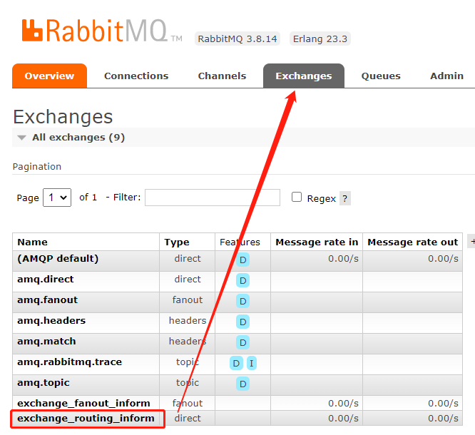

点进去查看交换机绑定的队列

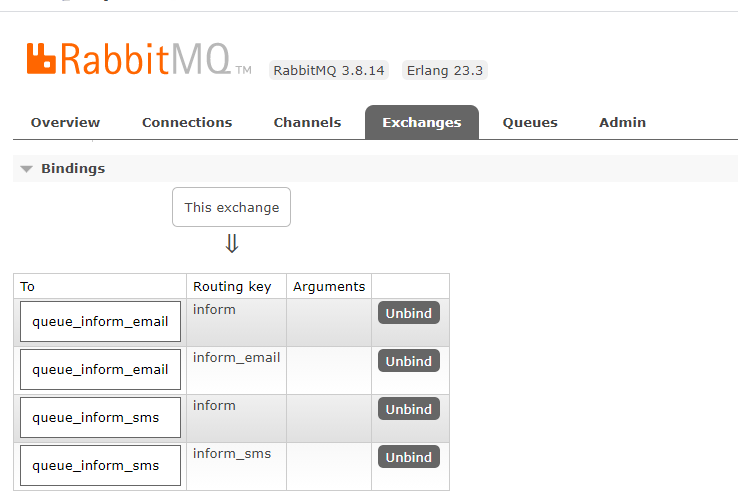

使用生产者发送若干条消息，交换机根据routingkey统配符匹配并转发消息到指定的队列。

### 3.4.4思考

1、Routing模式和Publish/subscibe有啥区别？
Routing模式要求队列在绑定交换机时要指定routingkey，消息会转发到符合routingkey的队列。

## 3.4 Topics(通配符工作模式)

### 3.4.1 工作模式


#### 3.4.1.1 通配符工作模式

1、一个交换机可以绑定多个队列，每个队列可以设置一个或多个带通配符的 routingKey。
2、生产者将消息发给交换机，交换机根据routingkey的值来匹配队列，匹配时采用通配符模式，匹配成功的消息转发到指定的队列。

#### 3.4.1.2 Topics和Routing的区别？

Topics 和 Routing 的原理基本相同，即：生产者将消息发送给交换机，交换机根据 routingKey 将消息转发给与routingKey 匹配的队列。

不同之处：routingkey的匹配方式，Routing 模式是相等，topics模式是通配符匹配。

```
符号 # ： 匹配一个或多个词， 比如 inform.# 可以匹配 inform.sms inform.email inform.email.sms
符号 * : 只能匹配一个词, 比如 inform.* 可以匹配 inform.sms inform.email
```

### 3.4.2代码

案例：
根据用户的通知设置去通知用户，设置接收Email的用户只接收Email，设置接收sms的用户只接收sms，设置两种通知类型都接收的则两种通知都有效。

#### 3.4.2.1 生产者

声明交换机，指定topic类型：

```
package rabbitmq;


import com.rabbitmq.client.BuiltinExchangeType;
import com.rabbitmq.client.Channel;
import com.rabbitmq.client.Connection;
import com.rabbitmq.client.ConnectionFactory;

import java.io.IOException;
import java.util.concurrent.TimeoutException;

/**
 * @Auther: xjh
 * @Date: 2021/4/29 14:04
 * @Description:
 */
public class Producer04_topics {
    //队列名称
    private static final String QUEUE_INFORM_EMAIL = "queue_inform_email";
    private static final String QUEUE_INFORM_SMS = "queue_inform_sms";
    private static final String EXCHANGE_TOPICS_INFORM="exchange_topics_inform";
    private static final String ROUTINGKEY_EMAIL="inform.#.email.#";
    private static final String ROUTINGKEY_SMS="inform.#.sms.#";
    public static void main(String[] args) {
        //通过连接工厂创建新的连接和mq建立连接
        ConnectionFactory connectionFactory = new ConnectionFactory();
        connectionFactory.setHost("127.0.0.1");
        connectionFactory.setPort(5672);//端口
        connectionFactory.setUsername("guest");
        connectionFactory.setPassword("guest");
        //设置虚拟机，一个mq服务可以设置多个虚拟机，每个虚拟机就相当于一个独立的mq
        connectionFactory.setVirtualHost("/");

        Connection connection = null;
        Channel channel = null;
        try {
            //建立新连接
            connection = connectionFactory.newConnection();
            //创建会话通道,生产者和mq服务所有通信都在channel通道中完成
            channel = connection.createChannel();
            //声明队列，如果队列在mq 中没有则要创建
            //参数：String queue, boolean durable, boolean exclusive, boolean autoDelete, Map<String, Object> arguments
            /**
             * 参数明细
             * 1、queue 队列名称
             * 2、durable 是否持久化，如果持久化，mq重启后队列还在
             * 3、exclusive 是否独占连接，队列只允许在该连接中访问，如果connection连接关闭队列则自动删除,如果将此参数设置true可用于临时队列的创建
             * 4、autoDelete 自动删除，队列不再使用时是否自动删除此队列，如果将此参数和exclusive参数设置为true就可以实现临时队列（队列不用了就自动删除）
             * 5、arguments 参数，可以设置一个队列的扩展参数，比如：可设置存活时间
             */
            channel.queueDeclare(QUEUE_INFORM_EMAIL,true,false,false,null);
            channel.queueDeclare(QUEUE_INFORM_SMS,true,false,false,null);
            //声明一个交换机
            //参数：String exchange, String type
            /**
             * 参数明细：
             * 1、交换机的名称
             * 2、交换机的类型
             * fanout：对应的rabbitmq的工作模式是 publish/subscribe
             * direct：对应的Routing	工作模式
             * topic：对应的Topics工作模式
             * headers： 对应的headers工作模式
             */
            channel.exchangeDeclare(EXCHANGE_TOPICS_INFORM, BuiltinExchangeType.TOPIC);
            //进行交换机和队列绑定
            //参数：String queue, String exchange, String routingKey
            /**
             * 参数明细：
             * 1、queue 队列名称
             * 2、exchange 交换机名称
             * 3、routingKey 路由key，作用是交换机根据路由key的值将消息转发到指定的队列中，在发布订阅模式中调协为空字符串
             */
            channel.queueBind(QUEUE_INFORM_EMAIL,EXCHANGE_TOPICS_INFORM,ROUTINGKEY_EMAIL);
            channel.queueBind(QUEUE_INFORM_SMS,EXCHANGE_TOPICS_INFORM,ROUTINGKEY_SMS);
            //发送消息
            //参数：String exchange, String routingKey, BasicProperties props, byte[] body
            /**
             * 参数明细：
             * 1、exchange，交换机，如果不指定将使用mq的默认交换机（设置为""）
             * 2、routingKey，路由key，交换机根据路由key来将消息转发到指定的队列，如果使用默认交换机，routingKey设置为队列的名称
             * 3、props，消息的属性
             * 4、body，消息内容
             */
            for(int i=0;i<5;i++){
                //发送消息的时候指定routingKey
                String message = "send email inform message to user";
                channel.basicPublish(EXCHANGE_TOPICS_INFORM,"inform.email",null,message.getBytes());
                System.out.println("send to mq "+message);
            }
            for(int i=0;i<5;i++){
                //发送消息的时候指定routingKey
                String message = "send sms inform message to user";
                channel.basicPublish(EXCHANGE_TOPICS_INFORM,"inform.sms",null,message.getBytes());
                System.out.println("send to mq "+message);
            }
            for(int i=0;i<5;i++){
                //发送消息的时候指定routingKey
                String message = "send sms and email inform message to user";
                channel.basicPublish(EXCHANGE_TOPICS_INFORM,"inform.sms.email",null,message.getBytes());
                System.out.println("send to mq "+message);
            }


        } catch (Exception e) {
            e.printStackTrace();
        } finally {
            //关闭连接
            //先关闭通道
            try {
                channel.close();
            } catch (IOException e) {
                e.printStackTrace();
            } catch (TimeoutException e) {
                e.printStackTrace();
            }
            try {
                connection.close();
            } catch (IOException e) {
                e.printStackTrace();
            }
        }


    }
}
```

#### 3.4.2.2 消费端

```
队列绑定交换机指定通配符：
统配符规则：
中间以“.”分隔。
符号#可以匹配多个词，符号*可以匹配一个词语。
```

##### 3.4.2.2.1 邮件发送消费者

```
package RabbitMQ;

import com.rabbitmq.client.*;
import java.io.IOException;
import java.util.concurrent.TimeoutException;

/**
 * @Auther: xjh
 * @Date: 2021/4/29 14:14
 * @Description:
 */
public class Consumer04_topics_email {
    //队列名称
    private static final String QUEUE_INFORM_EMAIL = "queue_inform_email";
    private static final String EXCHANGE_TOPICS_INFORM="exchange_topics_inform";
    private static final String ROUTINGKEY_EMAIL="inform.#.email.#";

    public static void main(String[] args) throws IOException, TimeoutException {
        //通过连接工厂创建新的连接和mq建立连接
        ConnectionFactory connectionFactory = new ConnectionFactory();
        connectionFactory.setHost("127.0.0.1");
        connectionFactory.setPort(5672);//端口
        connectionFactory.setUsername("guest");
        connectionFactory.setPassword("guest");
        //设置虚拟机，一个mq服务可以设置多个虚拟机，每个虚拟机就相当于一个独立的mq
        connectionFactory.setVirtualHost("/");

        //建立新连接
        Connection connection = connectionFactory.newConnection();
        //创建会话通道,生产者和mq服务所有通信都在channel通道中完成
        Channel channel = connection.createChannel();

        /**
         * 参数明细
         * 1、queue 队列名称
         * 2、durable 是否持久化，如果持久化，mq重启后队列还在
         * 3、exclusive 是否独占连接，队列只允许在该连接中访问，如果connection连接关闭队列则自动删除,如果将此参数设置true可用于临时队列的创建
         * 4、autoDelete 自动删除，队列不再使用时是否自动删除此队列，如果将此参数和exclusive参数设置为true就可以实现临时队列（队列不用了就自动删除）
         * 5、arguments 参数，可以设置一个队列的扩展参数，比如：可设置存活时间
         */
        channel.queueDeclare(QUEUE_INFORM_EMAIL,true,false,false,null);
        //声明一个交换机
        //参数：String exchange, String type
        /**
         * 参数明细：
         * 1、交换机的名称
         * 2、交换机的类型
         * fanout：对应的rabbitmq的工作模式是 publish/subscribe
         * direct：对应的Routing	工作模式
         * topic：对应的Topics工作模式
         * headers： 对应的headers工作模式
         */
        channel.exchangeDeclare(EXCHANGE_TOPICS_INFORM, BuiltinExchangeType.TOPIC);
        //进行交换机和队列绑定
        //参数：String queue, String exchange, String routingKey
        /**
         * 参数明细：
         * 1、queue 队列名称
         * 2、exchange 交换机名称
         * 3、routingKey 路由key，作用是交换机根据路由key的值将消息转发到指定的队列中，在发布订阅模式中调协为空字符串
         */
        channel.queueBind(QUEUE_INFORM_EMAIL, EXCHANGE_TOPICS_INFORM,ROUTINGKEY_EMAIL);

        //实现消费方法
        DefaultConsumer defaultConsumer = new DefaultConsumer(channel){

            /**
             * 当接收到消息后此方法将被调用
             * @param consumerTag  消费者标签，用来标识消费者的，在监听队列时设置channel.basicConsume
             * @param envelope 信封，通过envelope
             * @param properties 消息属性
             * @param body 消息内容
             * @throws IOException
             */
            @Override
            public void handleDelivery(String consumerTag, Envelope envelope, AMQP.BasicProperties properties, byte[] body) throws IOException {
                //交换机
                String exchange = envelope.getExchange();
                //消息id，mq在channel中用来标识消息的id，可用于确认消息已接收
                long deliveryTag = envelope.getDeliveryTag();
                //消息内容
                String message= new String(body,"utf-8");
                System.out.println("receive message:"+message);
            }
        };

        //监听队列
        //参数：String queue, boolean autoAck, Consumer callback
        /**
         * 参数明细：
         * 1、queue 队列名称
         * 2、autoAck 自动回复，当消费者接收到消息后要告诉mq消息已接收，如果将此参数设置为tru表示会自动回复mq，如果设置为false要通过编程实现回复
         * 3、callback，消费方法，当消费者接收到消息要执行的方法
         */
        channel.basicConsume(QUEUE_INFORM_EMAIL,true,defaultConsumer);

    }
}
```

##### 3.4.2.2.2 短信发送消费者

```
package RabbitMQ;

import com.rabbitmq.client.*;
import java.io.IOException;
import java.util.concurrent.TimeoutException;

/**
 * @Auther: xjh
 * @Date: 2021/4/29 14:15
 * @Description:
 */
public class Consumer04_topics_sms {
    //队列名称
    private static final String QUEUE_INFORM_SMS = "queue_inform_sms";
    private static final String EXCHANGE_TOPICS_INFORM="exchange_topics_inform";
    private static final String ROUTINGKEY_SMS="inform.#.sms.#";

    public static void main(String[] args) throws IOException, TimeoutException {
        //通过连接工厂创建新的连接和mq建立连接
        ConnectionFactory connectionFactory = new ConnectionFactory();
        connectionFactory.setHost("127.0.0.1");
        connectionFactory.setPort(5672);//端口
        connectionFactory.setUsername("guest");
        connectionFactory.setPassword("guest");
        //设置虚拟机，一个mq服务可以设置多个虚拟机，每个虚拟机就相当于一个独立的mq
        connectionFactory.setVirtualHost("/");

        //建立新连接
        Connection connection = connectionFactory.newConnection();
        //创建会话通道,生产者和mq服务所有通信都在channel通道中完成
        Channel channel = connection.createChannel();

        /**
         * 参数明细
         * 1、queue 队列名称
         * 2、durable 是否持久化，如果持久化，mq重启后队列还在
         * 3、exclusive 是否独占连接，队列只允许在该连接中访问，如果connection连接关闭队列则自动删除,如果将此参数设置true可用于临时队列的创建
         * 4、autoDelete 自动删除，队列不再使用时是否自动删除此队列，如果将此参数和exclusive参数设置为true就可以实现临时队列（队列不用了就自动删除）
         * 5、arguments 参数，可以设置一个队列的扩展参数，比如：可设置存活时间
         */
        channel.queueDeclare(QUEUE_INFORM_SMS,true,false,false,null);
        //声明一个交换机
        //参数：String exchange, String type
        /**
         * 参数明细：
         * 1、交换机的名称
         * 2、交换机的类型
         * fanout：对应的rabbitmq的工作模式是 publish/subscribe
         * direct：对应的Routing	工作模式
         * topic：对应的Topics工作模式
         * headers： 对应的headers工作模式
         */
        channel.exchangeDeclare(EXCHANGE_TOPICS_INFORM, BuiltinExchangeType.TOPIC);
        //进行交换机和队列绑定
        //参数：String queue, String exchange, String routingKey
        /**
         * 参数明细：
         * 1、queue 队列名称
         * 2、exchange 交换机名称
         * 3、routingKey 路由key，作用是交换机根据路由key的值将消息转发到指定的队列中，在发布订阅模式中调协为空字符串
         */
        channel.queueBind(QUEUE_INFORM_SMS, EXCHANGE_TOPICS_INFORM,ROUTINGKEY_SMS);

        //实现消费方法
        DefaultConsumer defaultConsumer = new DefaultConsumer(channel){

            /**
             * 当接收到消息后此方法将被调用
             * @param consumerTag  消费者标签，用来标识消费者的，在监听队列时设置channel.basicConsume
             * @param envelope 信封，通过envelope
             * @param properties 消息属性
             * @param body 消息内容
             * @throws IOException
             */
            @Override
            public void handleDelivery(String consumerTag, Envelope envelope, AMQP.BasicProperties properties, byte[] body) throws IOException {
                //交换机
                String exchange = envelope.getExchange();
                //消息id，mq在channel中用来标识消息的id，可用于确认消息已接收
                long deliveryTag = envelope.getDeliveryTag();
                //消息内容
                String message= new String(body,"utf-8");
                System.out.println("receive message:"+message);
            }
        };

        //监听队列
        //参数：String queue, boolean autoAck, Consumer callback
        /**
         * 参数明细：
         * 1、queue 队列名称
         * 2、autoAck 自动回复，当消费者接收到消息后要告诉mq消息已接收，如果将此参数设置为tru表示会自动回复mq，如果设置为false要通过编程实现回复
         * 3、callback，消费方法，当消费者接收到消息要执行的方法
         */
        channel.basicConsume(QUEUE_INFORM_SMS,true,defaultConsumer);

    }
}
```

### 3.4.3 测试

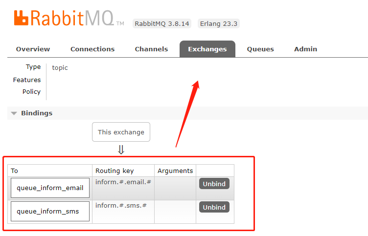

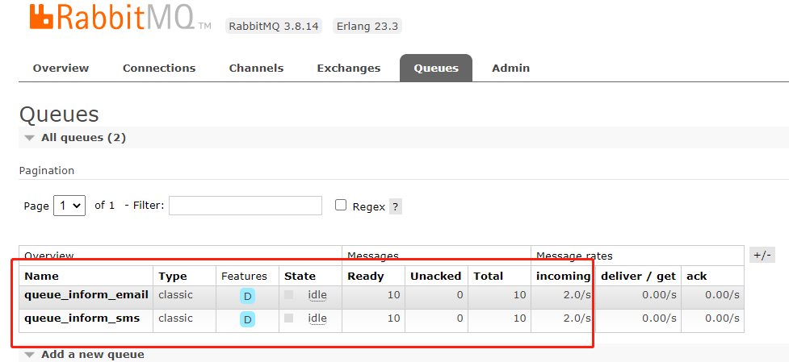

### 3.4.4思考

1、本案例的需求使用Routing工作模式能否实现？
使用Routing模式也可以实现本案例，共设置三个 routingkey，分别是email、sms、all，email队列绑定email和all，sms队列绑定sms和all，这样就可以实现上边案例的功能，实现过程比topics复杂。
Topic模式更多加强大，它可以实现Routing、publish/subscirbe模式的功能。

## 3.5 Header模式

### 3.5.1 Header工作模式

header模式与routing不同的地方在于，header模式取消routingkey，使用header中的 key/value（键值对）匹配队列。

案例：
根据用户的通知设置去通知用户，设置接收Email的用户只接收Email，设置接收sms的用户只接收sms，设置两种
通知类型都接收的则两种通知都有效。

### 3.5.2 代码

#### 3.5.2.1  生产者

队列与交换机绑定的代码与之前不同，绑定的是 map 如下：

```
Map<String, Object> headers_email = new Hashtable<String, Object>();
headers_email.put("inform_type", "email");
Map<String, Object> headers_sms = new Hashtable<String, Object>();
headers_sms.put("inform_type", "sms");
channel.queueBind(QUEUE_INFORM_EMAIL,EXCHANGE_HEADERS_INFORM,"",headers_email);
channel.queueBind(QUEUE_INFORM_SMS,EXCHANGE_HEADERS_INFORM,"",headers_sms);
```

通知：

```
String message = "email inform to user"+i;
Map<String,Object> headers = new Hashtable<String, Object>();
headers.put("inform_type", "email");//匹配email通知消费者绑定的header
//headers.put("inform_type", "sms");//匹配sms通知消费者绑定的header
AMQP.BasicProperties.Builder properties = new AMQP.BasicProperties.Builder();
properties.headers(headers);
//Email通知
channel.basicPublish(EXCHANGE_HEADERS_INFORM, "", properties.build(), message.getBytes());
```

```
package rabbitmq;

import com.rabbitmq.client.*;

import java.io.IOException;
import java.util.Hashtable;
import java.util.Map;
import java.util.concurrent.TimeoutException;

/**
 * @Auther: xjh
 * @Date: 2021/4/29 15:08
 * @Description:
 */
public class Producer05_header {
    //队列名称
    private static final String QUEUE_INFORM_EMAIL = "queue_inform_email";
    private static final String QUEUE_INFORM_SMS = "queue_inform_sms";
    private static final String EXCHANGE_HEADERS_INFORM="exchange_headers_inform";

    public static void main(String[] args) {
        //通过连接工厂创建新的连接和mq建立连接
        ConnectionFactory connectionFactory = new ConnectionFactory();
        connectionFactory.setHost("127.0.0.1");
        connectionFactory.setPort(5672);//端口
        connectionFactory.setUsername("guest");
        connectionFactory.setPassword("guest");
        //设置虚拟机，一个mq服务可以设置多个虚拟机，每个虚拟机就相当于一个独立的mq
        connectionFactory.setVirtualHost("/");

        Connection connection = null;
        Channel channel = null;
        try {
            //建立新连接
            connection = connectionFactory.newConnection();
            //创建会话通道,生产者和mq服务所有通信都在channel通道中完成
            channel = connection.createChannel();
            //声明队列，如果队列在mq 中没有则要创建
            //参数：String queue, boolean durable, boolean exclusive, boolean autoDelete, Map<String, Object> arguments
            /**
             * 参数明细
             * 1、queue 队列名称
             * 2、durable 是否持久化，如果持久化，mq重启后队列还在
             * 3、exclusive 是否独占连接，队列只允许在该连接中访问，如果connection连接关闭队列则自动删除,如果将此参数设置true可用于临时队列的创建
             * 4、autoDelete 自动删除，队列不再使用时是否自动删除此队列，如果将此参数和exclusive参数设置为true就可以实现临时队列（队列不用了就自动删除）
             * 5、arguments 参数，可以设置一个队列的扩展参数，比如：可设置存活时间
             */
            channel.queueDeclare(QUEUE_INFORM_EMAIL,true,false,false,null);
            channel.queueDeclare(QUEUE_INFORM_SMS,true,false,false,null);
            //声明一个交换机
            //参数：String exchange, String type
            /**
             * 参数明细：
             * 1、交换机的名称
             * 2、交换机的类型
             * fanout：对应的rabbitmq的工作模式是 publish/subscribe
             * direct：对应的Routing	工作模式
             * topic：对应的Topics工作模式
             * headers： 对应的headers工作模式
             */
            channel.exchangeDeclare(EXCHANGE_HEADERS_INFORM, BuiltinExchangeType.HEADERS);
            //进行交换机和队列绑定
            //参数：String queue, String exchange, String routingKey
            /**
             * 参数明细：
             * 1、queue 队列名称
             * 2、exchange 交换机名称
             * 3、routingKey 路由key，作用是交换机根据路由key的值将消息转发到指定的队列中，在发布订阅模式中调协为空字符串
             */
            Map<String, Object> headers_email = new Hashtable<String, Object>();
            headers_email.put("inform_type", "email");
            Map<String, Object> headers_sms = new Hashtable<String, Object>();
            headers_sms.put("inform_type", "sms");
            channel.queueBind(QUEUE_INFORM_EMAIL,EXCHANGE_HEADERS_INFORM,"",headers_email);
            channel.queueBind(QUEUE_INFORM_SMS,EXCHANGE_HEADERS_INFORM,"",headers_sms);

            //发送消息
            //参数：String exchange, String routingKey, BasicProperties props, byte[] body
            /**
             * 参数明细：
             * 1、exchange，交换机，如果不指定将使用mq的默认交换机（设置为""）
             * 2、routingKey，路由key，交换机根据路由key来将消息转发到指定的队列，如果使用默认交换机，routingKey设置为队列的名称
             * 3、props，消息的属性
             * 4、body，消息内容
             */
            for(int i=0;i<5;i++){
                //发送消息的时候指定routingKey
                String message = "email inform to user"+i;
                Map<String,Object> headers = new Hashtable<String, Object>();
                headers.put("inform_type", "email");//匹配email通知消费者绑定的header
                //headers.put("inform_type", "sms");//匹配sms通知消费者绑定的header
                AMQP.BasicProperties.Builder properties = new AMQP.BasicProperties.Builder();
                properties.headers(headers);
                //Email通知
                channel.basicPublish(EXCHANGE_HEADERS_INFORM, "", properties.build(), message.getBytes());
            }
        } catch (Exception e) {
            e.printStackTrace();
        } finally {
            //关闭连接
            //先关闭通道
            try {
                channel.close();
            } catch (IOException e) {
                e.printStackTrace();
            } catch (TimeoutException e) {
                e.printStackTrace();
            }
            try {
                connection.close();
            } catch (IOException e) {
                e.printStackTrace();
            }
        }


    }
}
```

#### 3.5.2.2 消费者

```
package RabbitMQ;

import com.rabbitmq.client.*;

import java.io.IOException;
import java.util.Hashtable;
import java.util.Map;
import java.util.concurrent.TimeoutException;

/**
 * @Auther: xjh
 * @Date: 2021/4/29 15:15
 * @Description:
 */
public class Consumer05_headers_email {
    //队列名称
    private static final String QUEUE_INFORM_EMAIL = "queue_inform_email";
    private static final String EXCHANGE_HEADERS_INFORM="exchange_headers_inform";


    public static void main(String[] args) throws IOException, TimeoutException {
        //通过连接工厂创建新的连接和mq建立连接
        ConnectionFactory connectionFactory = new ConnectionFactory();
        connectionFactory.setHost("127.0.0.1");
        connectionFactory.setPort(5672);//端口
        connectionFactory.setUsername("guest");
        connectionFactory.setPassword("guest");
        //设置虚拟机，一个mq服务可以设置多个虚拟机，每个虚拟机就相当于一个独立的mq
        connectionFactory.setVirtualHost("/");

        //建立新连接
        Connection connection = connectionFactory.newConnection();
        //创建会话通道,生产者和mq服务所有通信都在channel通道中完成
        Channel channel = connection.createChannel();


        /**
         * 参数明细
         * 1、queue 队列名称
         * 2、durable 是否持久化，如果持久化，mq重启后队列还在
         * 3、exclusive 是否独占连接，队列只允许在该连接中访问，如果connection连接关闭队列则自动删除,如果将此参数设置true可用于临时队列的创建
         * 4、autoDelete 自动删除，队列不再使用时是否自动删除此队列，如果将此参数和exclusive参数设置为true就可以实现临时队列（队列不用了就自动删除）
         * 5、arguments 参数，可以设置一个队列的扩展参数，比如：可设置存活时间
         */
        channel.queueDeclare(QUEUE_INFORM_EMAIL,true,false,false,null);
        //声明一个交换机
        //参数：String exchange, String type
        /**
         * 参数明细：
         * 1、交换机的名称
         * 2、交换机的类型
         * fanout：对应的rabbitmq的工作模式是 publish/subscribe
         * direct：对应的Routing	工作模式
         * topic：对应的Topics工作模式
         * headers： 对应的headers工作模式
         */
        channel.exchangeDeclare(EXCHANGE_HEADERS_INFORM, BuiltinExchangeType.HEADERS);
        //进行交换机和队列绑定
        //参数：String queue, String exchange, String routingKey
        /**
         * 参数明细：
         * 1、queue 队列名称
         * 2、exchange 交换机名称
         * 3、routingKey 路由key，作用是交换机根据路由key的值将消息转发到指定的队列中，在发布订阅模式中调协为空字符串
         */

        Map<String, Object> headers_email = new Hashtable<String, Object>();
        headers_email.put("inform_email", "email");
        //交换机和队列绑定
        channel.queueBind(QUEUE_INFORM_EMAIL,EXCHANGE_HEADERS_INFORM,"",headers_email);


        //实现消费方法
        DefaultConsumer defaultConsumer = new DefaultConsumer(channel){

            /**
             * 当接收到消息后此方法将被调用
             * @param consumerTag  消费者标签，用来标识消费者的，在监听队列时设置channel.basicConsume
             * @param envelope 信封，通过envelope
             * @param properties 消息属性
             * @param body 消息内容
             * @throws IOException
             */
            @Override
            public void handleDelivery(String consumerTag, Envelope envelope, AMQP.BasicProperties properties, byte[] body) throws IOException {
                //交换机
                String exchange = envelope.getExchange();
                //消息id，mq在channel中用来标识消息的id，可用于确认消息已接收
                long deliveryTag = envelope.getDeliveryTag();
                //消息内容
                String message= new String(body,"utf-8");
                System.out.println("receive message:"+message);
            }
        };

        //监听队列
        //参数：String queue, boolean autoAck, Consumer callback
        /**
         * 参数明细：
         * 1、queue 队列名称
         * 2、autoAck 自动回复，当消费者接收到消息后要告诉mq消息已接收，如果将此参数设置为tru表示会自动回复mq，如果设置为false要通过编程实现回复
         * 3、callback，消费方法，当消费者接收到消息要执行的方法
         */

        //指定消费队列
        channel.basicConsume(QUEUE_INFORM_EMAIL, true, defaultConsumer);
    }
}
```

### 3.5.3 测试

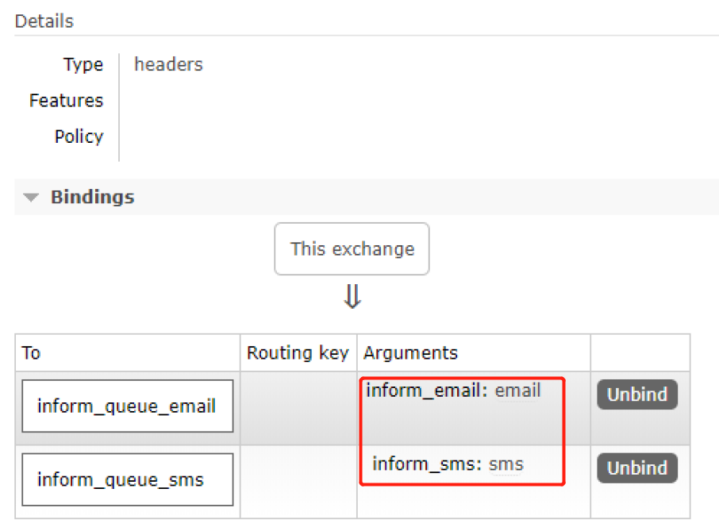

## 3.6 RPC


RPC即客户端远程调用服务端的方法 ，使用MQ可以实现RPC的异步调用，基于Direct交换机实现，流程如下：
1、客户端即是生产者就是消费者，向RPC请求队列发送RPC调用消息，同时监听RPC响应队列。
2、服务端监听RPC请求队列的消息，收到消息后执行服务端的方法，得到方法返回的结果
3、服务端将RPC方法 的结果发送到RPC响应队列
4、客户端（RPC调用方）监听RPC响应队列，接收到RPC调用结果。

# 4 Spring整合RibbitMQ

## 4.1 搭建SpringBoot环境

先新建SpringBoot 项目 可以参考springboot 笔记

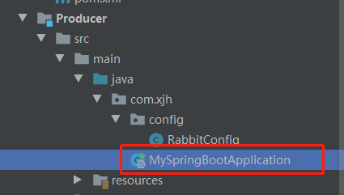

```
package com.xjh;

import org.springframework.boot.SpringApplication;
import org.springframework.boot.autoconfigure.SpringBootApplication;

/**
 * @Auther: xjh
 * @Date: 2021/4/29 16:15
 * @Description:
 */
@SpringBootApplication
public class MySpringBootApplication {

    public static void main(String[] args) {
        SpringApplication.run(MySpringBootApplication.class);
    }

}
```

我们选择基于Spring-Rabbit去操作RabbitMQ
https://github.com/spring-projects/spring-amqp
使用spring-boot-starter-amqp会自动添加spring-rabbit依赖，如下：

```
<dependencies>
        <dependency>
            <groupId>org.springframework.boot</groupId>
            <artifactId>spring-boot-starter-test</artifactId>
        </dependency>
        <dependency>
            <groupId>org.springframework.boot</groupId>
            <artifactId>spring-boot-starter-amqp</artifactId>
        </dependency>
        <dependency>
            <groupId>org.springframework.boot</groupId>
            <artifactId>spring-boot-starter-logging</artifactId>
        </dependency>

        <dependency>
            <groupId>com.alibaba</groupId>
            <artifactId>fastjson</artifactId>
            <version>1.2.67</version>
            <scope>compile</scope>
        </dependency>
</dependencies>
```

## 4.2 配置

### 4.2.1 配置application.yml

```
server:
    port: 44000
spring:
    application:
        name: Producer
    rabbitmq:
        host: 127.0.0.1
        port: 5672
        username: guest
        password: guest
        virtualHost: /
```

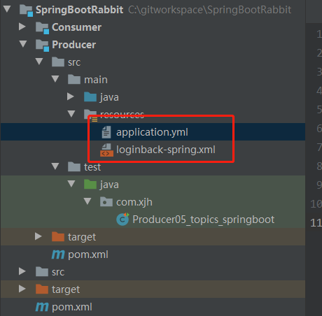

### 4.2.2 新建 loginback-spring.xml

```
<?xml version="1.0" encoding="UTF-8"?>

<configuration>
    <!--定义日志文件的存储地址,使用绝对路径-->
    <property name="LOG_HOME" value="d:/logs"/>

    <!-- Console 输出设置 -->
    <appender name="CONSOLE" class="ch.qos.logback.core.ConsoleAppender">
        <encoder>
            <!--格式化输出：%d表示日期，%thread表示线程名，%-5level：级别从左显示5个字符宽度%msg：日志消息，%n是换行符-->
            <pattern>%d{yyyy-MM-dd HH:mm:ss.SSS} [%thread] %-5level %logger{36} - %msg%n</pattern>
            <charset>utf8</charset>
        </encoder>
    </appender>

    <!-- 按照每天生成日志文件 -->
    <appender name="FILE" class="ch.qos.logback.core.rolling.RollingFileAppender">
        <rollingPolicy class="ch.qos.logback.core.rolling.TimeBasedRollingPolicy">
            <!--日志文件输出的文件名-->
            <fileNamePattern>${LOG_HOME}/xc.%d{yyyy-MM-dd}.log</fileNamePattern>
        </rollingPolicy>
        <encoder>
            <pattern>%d{yyyy-MM-dd HH:mm:ss.SSS} [%thread] %-5level %logger{36} - %msg%n</pattern>
        </encoder>
    </appender>

    <!-- 异步输出 -->
    <appender name="ASYNC" class="ch.qos.logback.classic.AsyncAppender">
        <!-- 不丢失日志.默认的,如果队列的80%已满,则会丢弃TRACT、DEBUG、INFO级别的日志 -->
        <discardingThreshold>0</discardingThreshold>
        <!-- 更改默认的队列的深度,该值会影响性能.默认值为256 -->
        <queueSize>512</queueSize>
        <!-- 添加附加的appender,最多只能添加一个 -->
        <appender-ref ref="FILE"/>
    </appender>


    <logger name="org.apache.ibatis.cache.decorators.LoggingCache" level="DEBUG" additivity="false">
        <appender-ref ref="CONSOLE"/>
    </logger>
    <logger name="org.springframework.boot" level="DEBUG"/>
    <root level="info">
        <!--<appender-ref ref="ASYNC"/>-->
        <appender-ref ref="FILE"/>
        <appender-ref ref="CONSOLE"/>
    </root>
</configuration>
```

### 4.2.3 定义RabbitConfig类，配置Exchange、Queue、及绑定交换机

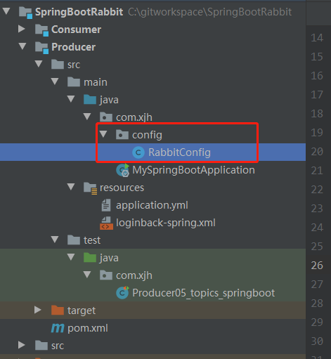

本例配置Topic交换机

```
package com.xjh.config;

/**
 * @Auther: xjh
 * @Date: 2021/4/29 16:35
 * @Description:
 */


import org.springframework.amqp.core.*;
import org.springframework.beans.factory.annotation.Qualifier;
import org.springframework.context.annotation.Bean;
import org.springframework.context.annotation.Configuration;

@Configuration
public class RabbitConfig {
    //队列名称
    public static final String QUEUE_INFORM_EMAIL = "queue_inform_email";
    public static final String QUEUE_INFORM_SMS = "queue_inform_sms";
    public static final String EXCHANGE_TOPICS_INFORM="exchange_topics_inform";
    public static final String ROUTINGKEY_EMAIL="inform.#.email.#";
    public static final String ROUTINGKEY_SMS="inform.#.sms.#";

    // 声明交换机
    @Bean(EXCHANGE_TOPICS_INFORM)
    public Exchange EXCHANGE_TOPICS_INFORM(){
        // durable(true) 持久化  mq重启后  交换机还在
        return ExchangeBuilder.topicExchange(EXCHANGE_TOPICS_INFORM).durable(true).build();
    }

    // 申明队列
    @Bean(QUEUE_INFORM_EMAIL)
    public Queue  QUEUE_INFORM_EMAIL(){
        return  new Queue(QUEUE_INFORM_EMAIL);
    }

    @Bean(QUEUE_INFORM_SMS)
    public Queue  QUEUE_INFORM_SMS(){
        return  new Queue(QUEUE_INFORM_SMS);
    }

    //ROUTINGKEY_SMS 指定routingkey
    @Bean
    public Binding Binding_QUEUE_INFORM_EMAIL(@Qualifier(QUEUE_INFORM_EMAIL) Queue queue,
                                              @Qualifier(EXCHANGE_TOPICS_INFORM) Exchange exchange){
        return BindingBuilder.bind(queue).to(exchange).with(ROUTINGKEY_EMAIL).noargs();
    }

    //ROUTINGKEY_SMS队列绑定交换机 指定routingkey
    @Bean
    public Binding Binding_ROUTINGKEY_SMS(@Qualifier(QUEUE_INFORM_SMS) Queue queue,
                                              @Qualifier(EXCHANGE_TOPICS_INFORM) Exchange exchange){
        return BindingBuilder.bind(queue).to(exchange).with(ROUTINGKEY_SMS).noargs();
    }
}
```

## 4.3 生产端

使用RarbbitTemplate发送消息

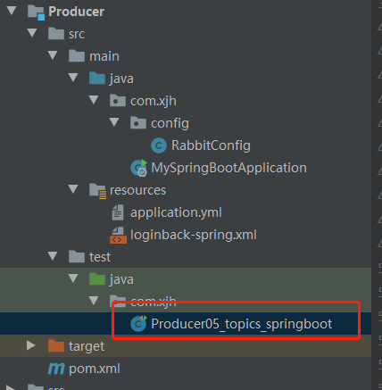

```
package com.xjh;


/**
 * @Auther: xjh
 * @Date: 2021/4/29 17:06
 * @Description:
 */


import com.alibaba.fastjson.JSON;
import com.xjh.config.RabbitConfig;


import org.junit.Test;
import org.junit.runner.RunWith;
import org.springframework.amqp.rabbit.core.RabbitTemplate;
import org.springframework.beans.factory.annotation.Autowired;
import org.springframework.boot.test.context.SpringBootTest;
import org.springframework.test.context.junit4.SpringRunner;

import java.util.HashMap;
import java.util.Map;

/**
 * @author Administrator
 * @version 1.0
 * @create 2018-06-17 19:23
 **/
@SpringBootTest
@RunWith(SpringRunner.class)
public class Producer05_topics_springboot {
    @Autowired
    RabbitTemplate rabbitTemplate;

    //使用rabbitTemplate发送消息
    @Test
    public void testSendEmail(){

        String message = "send email message to user";
        /**
         * 参数：
         * 1、交换机名称
         * 2、routingKey
         * 3、消息内容
         */
        rabbitTemplate.convertAndSend(RabbitConfig.EXCHANGE_TOPICS_INFORM,"inform.email",message);

    }

    //使用rabbitTemplate发送消息
    @Test
    public void testSendPostPage(){

        Map message = new HashMap<>();
        message.put("pageId","5a795ac7dd573c04508f3a56");
        //将消息对象转成json串
        String messageString = JSON.toJSONString(message);
        //路由key，就是站点ID
        String routingKey = "5a751fab6abb5044e0d19ea1";
        /**
         * 参数：
         * 1、交换机名称
         * 2、routingKey
         * 3、消息内容*/

        rabbitTemplate.convertAndSend(RabbitConfig.EXCHANGE_TOPICS_INFORM,"inform.sms",messageString);

    }

}
```

## 4.4消费端

### 4.4.1 创建消费端工程，添加依赖

```
<dependencies>
        <dependency>
            <groupId>org.springframework.boot</groupId>
            <artifactId>spring-boot-starter-test</artifactId>
        </dependency>
        <dependency>
            <groupId>org.springframework.boot</groupId>
            <artifactId>spring-boot-starter-amqp</artifactId>
        </dependency>
        <dependency>
            <groupId>org.springframework.boot</groupId>
            <artifactId>spring-boot-starter-logging</artifactId>
        </dependency>
</dependencies>
```

### 4.4.2 配置其他文件 和生产者的文件内容一样

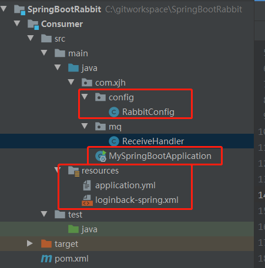


### 4.4.3使用@RabbitListener注解监听队列。

```
package com.xjh.mq;

/**
 * @Auther: xjh
 * @Date: 2021/4/29 17:36
 * @Description:
 */
import com.rabbitmq.client.Channel;

import com.xjh.config.RabbitConfig;
import org.springframework.amqp.core.Message;
import org.springframework.amqp.rabbit.annotation.RabbitListener;
import org.springframework.stereotype.Component;
@Component
public class ReceiveHandler {
    //监听email队列
    @RabbitListener(queues = {RabbitConfig.QUEUE_INFORM_EMAIL})
    public void receive_email(String msg,Message message,Channel channel){
        System.out.println(msg);
    }
    //监听sms队列
    @RabbitListener(queues = {RabbitConfig.QUEUE_INFORM_SMS})
    public void receive_sms(String msg,Message message,Channel channel){
        System.out.println(msg);
    }
}
```

## 4.5 测试

### 4.5.1 启动生产者

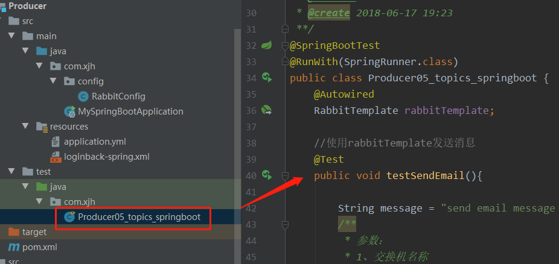

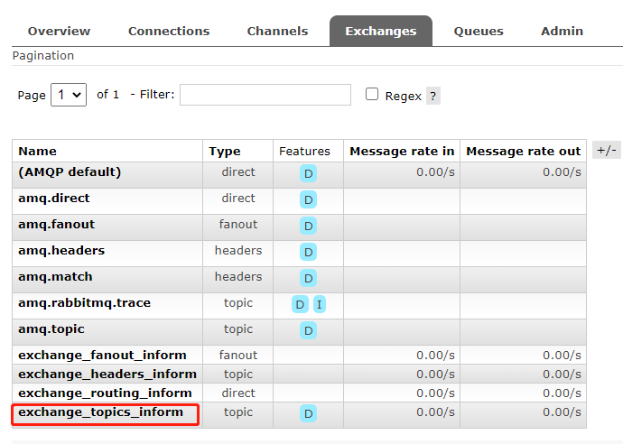

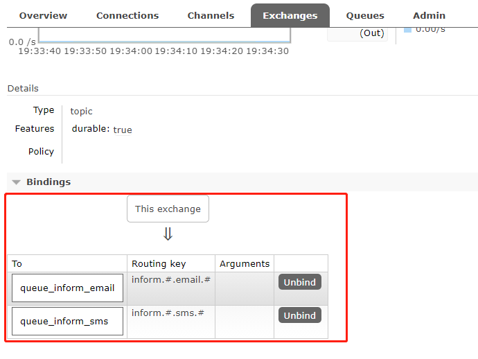

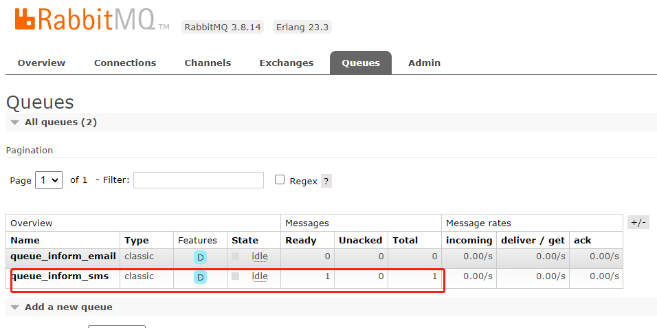

### 4.5.2 消费者

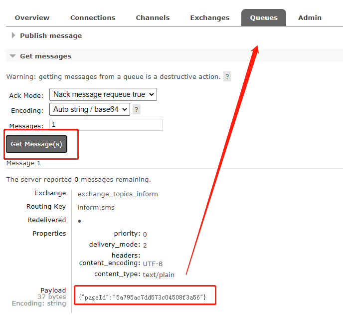

控制台打印

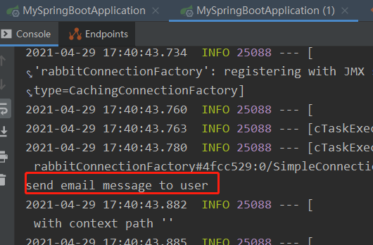