 

<h1 align = "center">FastDFS 分布式文件系统 </h1>

# 1 什么是分布式文件系统

## 1.1 技术应用场景

分布式文件系统解决了海量文件存储及传输访问的瓶颈问题，对海量视频的管理、对海量图片的管理等。

## 1.2 什么是分布式文件系统

### 1.2.1 什么是文件系统

文件系统是负责管理和存储文件的系统软件，它是操作系统和硬件驱动之间的桥梁，操作系统通过文件系统提供的接口去存取文件，用户通过操作系统访问磁盘上的文件。如下图：

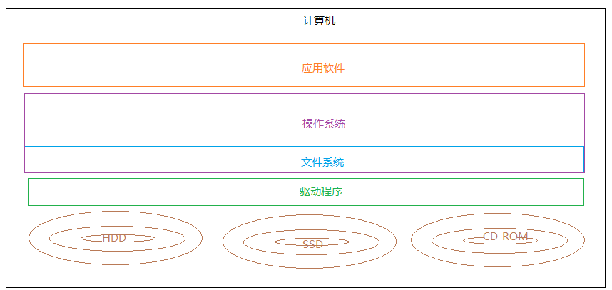

常见的文件系统：FAT16/FAT32、NTFS、HFS、UFS、APFS、XFS、Ext4等 。

### 1.2.2 什么是分布式文件系统

为什么会有分布文件系统呢？
分布式文件系统是面对互联网的需求而产生，互联网时代对海量数据如何存储？靠简单的增加硬盘的个数已经满足不了我们的要求，因为硬盘传输速度有限但是数据在急剧增长，另外我们还要要做好数据备份、数据安全等。

采用分布式文件系统可以将多个地点的文件系统通过网络连接起来，组成一个文件系统网络，结点之间通过网络进行通信，一台文件系统的存储和传输能力有限，我们让文件在多台计算机上存储，通过多台计算共同传输。如下图：

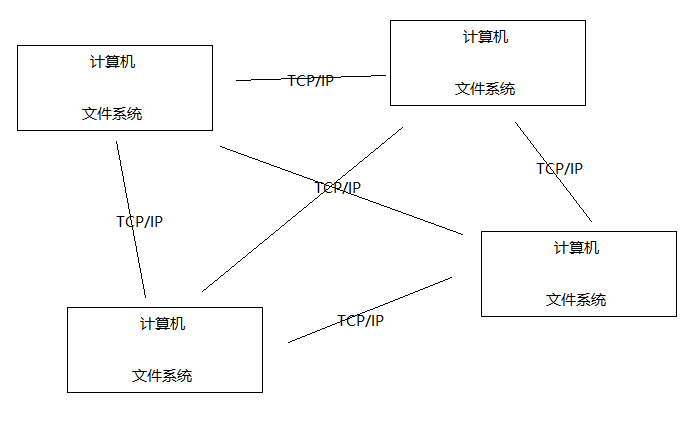

好处：
1、一台计算机的文件系统处理能力扩充到多台计算机同时处理。
2、一台计算机挂了还有另外副本计算机提供数据。
3、每台计算机可以放在不同的地域，这样用户就可以就近访问，提高访问速度。

## 1.3 主流的分布式文件系统

### 1.3.1 NFS

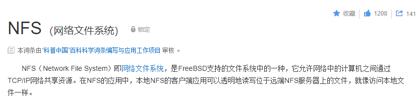

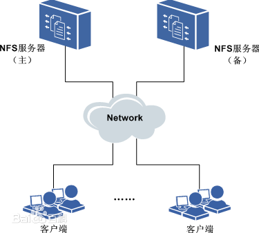

1）在客户端上映射NFS服务器的驱动器。
2）客户端通过网络访问NFS服务器的硬盘完全透明。

### 1.3.2  GFS


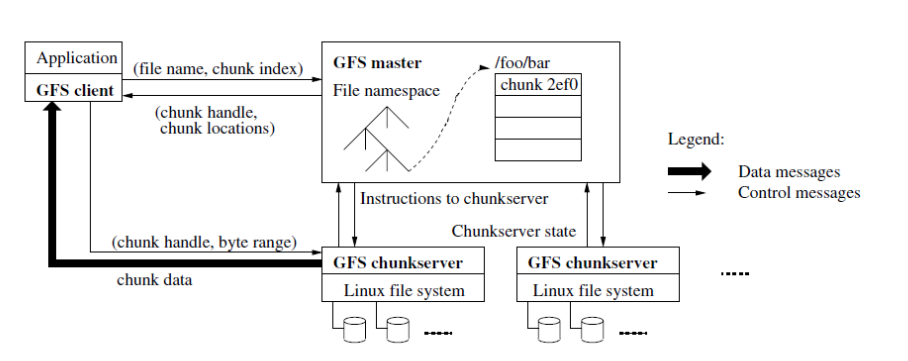

1）GFS采用主从结构，一个GFS集群由一个master和大量的chunkserver组成。

2）master存储了数据文件的元数据，一个文件被分成了若干块存储在多个chunkserver中。
3）用户从master中获取数据元信息，从chunkserver存储数据。

### 1.3.2  HDSF

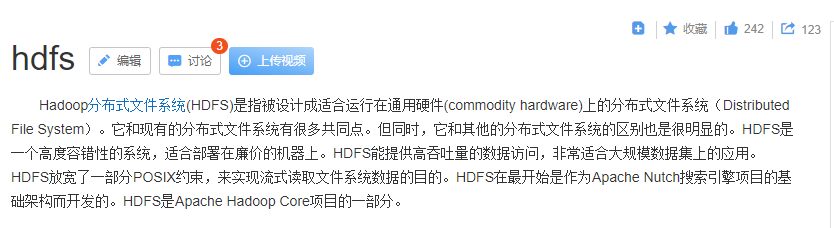

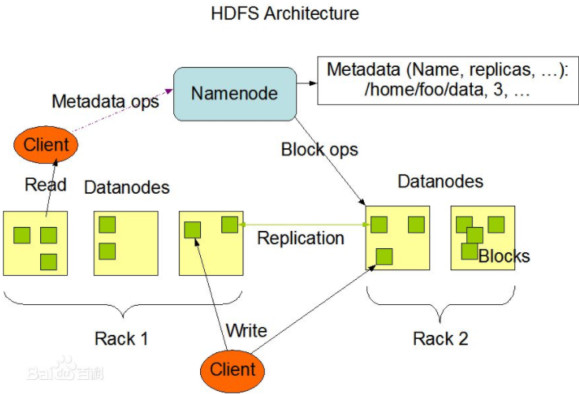

1）HDFS采用主从结构，一个HDFS集群由一个名称结点和若干数据结点组成。名称结点存储数据的元信息，一个完整的数据文件分成若干块存储在数据结点。
2）客户端从名称结点获取数据的元信息及数据分块的信息，得到信息客户端即可从数据块来存取数据。

## 1.4分布式文件服务提供商

1）阿里的OSS

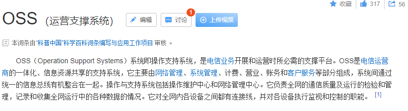

2）七牛云存储
3）百度云存储

# 2 什么是 fastDFS

## 2.1 fastDSF介绍

FastDFS是用c语言编写的一款开源的分布式文件系统，它是由淘宝资深架构师余庆编写并开源。FastDFS专为互联网量身定制，充分考虑了冗余备份、负载均衡、线性扩容等机制，并注重高可用、高性能等指标，使用FastDFS很容易搭建一套高性能的文件服务器集群提供文件上传、下载等服务。

为什么要使用fastDFS呢？

上边介绍的NFS、GFS都是通用的分布式文件系统，通用的分布式文件系统的优点的是开发体验好，但是系统复杂性高、性能一般，而专用的分布式文件系统虽然开发体验性差，但是系统复杂性低并且性能高。fastDFS非常适合存储图片等那些小文件，fastDFS不对文件进行分块，所以它就没有分块合并的开销，fastDFS网络通信采用socket，通信速度很快。

## 2.2 fastDSF工作原理

### 2.2.1 fastDSF架构

FastDFS 架构包括 Tracker server和Storage server。客户端请求Tracker server进行文件上传、下载，通过Tracker server调度最终由Storage server完成文件上传和下载。

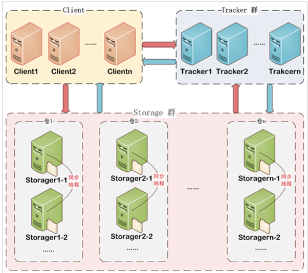

1）Tracker
Tracker Server作用是负载均衡和调度，通过Tracker server在文件上传时可以根据一些策略找到Storage server提供文件上传服务。可以将tracker称为追踪服务器或调度服务器。
FastDFS集群中的Tracker server可以有多台，Tracker server之间是相互平等关系同时提供服务，Tracker server 不存在单点故障。客户端请求Tracker server采用轮询方式，如果请求的tracker无法提供服务则换另一个tracker。

2）Storage
Storage Server作用是文件存储，客户端上传的文件最终存储在Storage服务器上，Storage server没有实现自己的文件系统而是使用操作系统的文件系统来管理文件。可以将storage称为存储服务器。

Storage集群采用了分组存储方式。storage集群由一个或多个组构成，集群存储总容量为集群中所有组的存储容量之和。一个组由一台或多台存储服务器组成，组内的Storage server之间是平等关系，不同组的Storage server 之间不会相互通信，同组内的Storage server之间会相互连接进行文件同步，从而保证同组内每个storage上的文件完全一致的。一个组的存储容量为该组内的存储服务器容量最小的那个，由此可见组内存储服务器的软硬件配置最好是一致的。

采用分组存储方式的好处是灵活、可控性较强。比如上传文件时，可以由客户端直接指定上传到的组也可以由tracker进行调度选择。一个分组的存储服务器访问压力较大时，可以在该组增加存储服务器来扩充服务能力（纵向扩容）。当系统容量不足时，可以增加组来扩充存储容量（横向扩容）。

3）Storage状态收集
Storage server会连接集群中所有的Tracker server，定时向他们报告自己的状态，包括磁盘剩余空间、文件同步状况、文件上传下载次数等统计信息。

### 2.2.2 文件上传流程


客户端上传文件后存储服务器将文件ID返回给客户端，此文件ID用于以后访问该文件的索引信息。文件索引信息包括：组名，虚拟磁盘路径，数据两级目录，文件名。


组名：文件上传后所在的storage组名称，在文件上传成功后有storage服务器返回，需要客户端自行保存。

虚拟磁盘路径：storage配置的虚拟路径，与磁盘选项store_path*对应。如果配置了store_path0则是M00，如果配置了store_path1则是M01，以此类推。

数据两级目录：storage服务器在每个虚拟磁盘路径下创建的两级目录，用于存储数据文件。

文件名：与文件上传时不同。是由存储服务器根据特定信息生成，文件名包含：源存储服务器IP地址、文件创建时间戳、文件大小、随机数和文件拓展名等信息。

### 2.2.3 文件下载流程


tracker根据请求的文件路径即文件ID 来快速定义文件。
比如请求下边的文件：


1.通过组名tracker能够很快的定位到客户端需要访问的存储服务器组是group1，并选择合适的存储服务器提供客户端访问。
2.存储服务器根据“文件存储虚拟磁盘路径”和“数据文件两级目录”可以很快定位到文件所在目录，并根据文件名找到客户端需要访问的文件。

# 3 fastDFS入门

## 3.1 fastDFS安装与配置

### 3.1.1 导入虚拟机

对fastDFS的安装过程不要求学生掌握，可以直接导入老师提供虚拟机。

1、使用Vmware打开虚拟机配置文件“CentOS 7 64 位.vmx”，提示如下图：

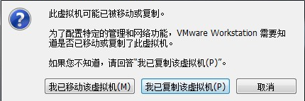

2、选择“我已复制该虚拟机”

3、启动虚拟机之前启动VMware的服务：

输入 services  查看

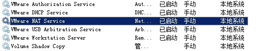

4、修改网卡的IP地址为101网段。 

192.168.101.1

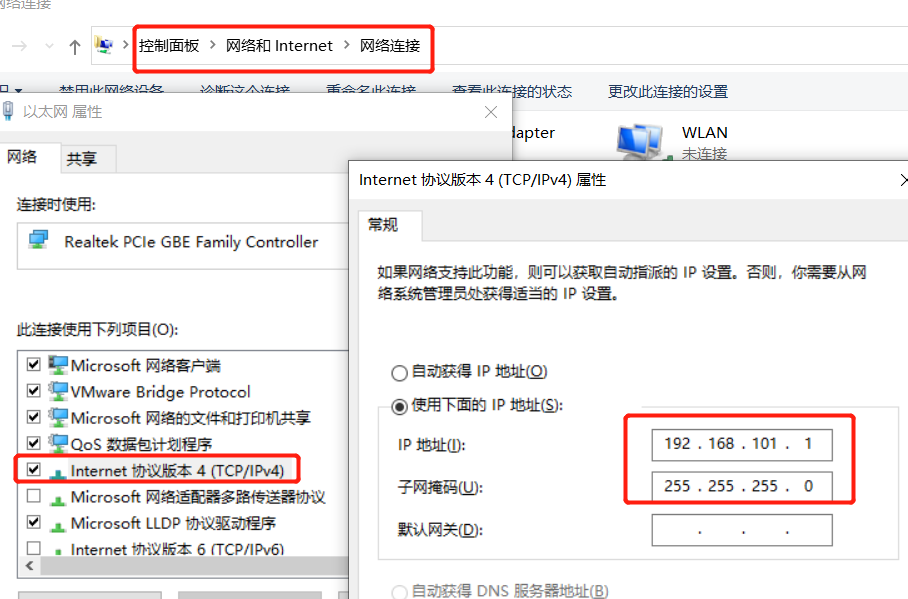

5、修改虚拟机网络配置

修改VMnet8的子网IP为101.0

192.168.101.0

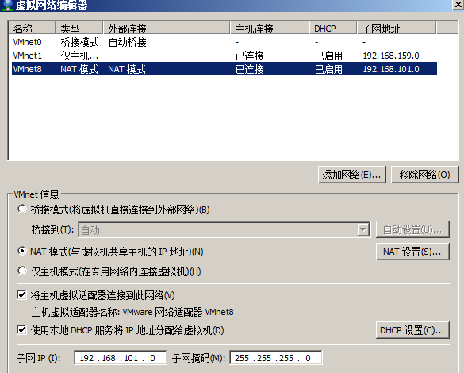

DHCP配置：

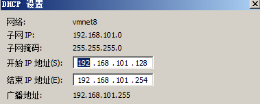

6、启动虚拟机

用户名：root
密码：centos

7、导入的虚拟机已经安装了fastDSF，直接启动fastDSF即可使用。

### 3.1.2 fastDFS安装

如果想自己尝试安装fastDSF也可以按照文档一步一步安装。
tracker和storage使用相同的安装包，

fastDFS的下载地址在：https://github.com/happyfish100/FastDFS
本教程下载安装包：FastDFS_v5.05.tar.gz
FastDFS是C语言开发，建议在linux上运行，本教程使用CentOS7作为安装环境。
安装细节请参考 “fastDFS安装教程.doc”。

### 3.1.3 Tracker配置

本小节介绍Tracker的配置文件内容。
fastDFS的配置文件目录 ：/etc/fdfs
主要的配置文件：/etc/fdfs/tracker.conf （tracker配置文件 ）；storage.conf（storage配置文件）

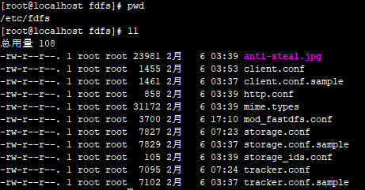

tracker.conf配置内容如下：
端口：port=22122
存储策略：store_lookup=
取值范围：0（轮询向storage存储文件）、1（指定具体的group）、2负载均衡，选择空闲的storage存储
指定具体的group：store_group= 如果store_lookup设置为1则这里必须指定一个具体的group。
tracker 基础目录：base_path=/home/fastdfs，tracker在运行时会向此目录存储storage的管理数据。

### 3.1.4 storage配置

本小节介绍storage的配置文件内容。
storage.conf配置 内容如下：
组名：group_name=group1
端口：port=23000

向tracker心跳间隔（秒）：heart_beat_interval=30
storage基础目录：base_path=/home/fastdfs
磁盘存储目录，可定义多个store_path：

store_path0=/home/fastdfs/fdfs_storage 此目录下存储上传的文件，在/home/fastdfs/fdfs_storage/data下
store_path1=...
...
上报tracker的地址：tracker_server=192.168.101.64:22122
如果有多个tracker则配置多个tracker，比如：
tracker_server=192.168.101.64:22122
tracker_server=192.168.101.65:22122
....

### 3.1.5 启动停止

fastDFS启动/停止脚本目录：

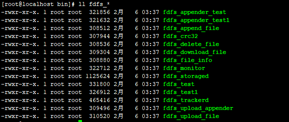

fdfs_trackerd：tracker脚本，通过此脚本对 tracker进行启动和停止
/usr/bin/fdfs_trackerd /etc/fdfs/tracker.conf restart

fdfs_storaged：storage脚本，通过此脚本对 storage进行启动和停止
/usr/bin/fdfs_storaged /etc/fdfs/storage.conf restarttypora

## 3.2 文件上传下载测试

### 3.2.1 搭建环境

这里我们使用javaApi测试文件的上传，java版本的fastdfs-client地址在：
https://github.com/happyfish100/fastdfs-client-java，参考此工程编写测试用例。

#### 3.2.1.1 创建maven工程

pom.xml

```
<parent>
<groupId>org.springframework.boot</groupId>
<artifactId>spring‐boot‐starter‐parent</artifactId>
<version>1.5.9.RELEASE</version>
</parent>
<groupId>com.xuecheng</groupId>
<artifactId>test‐fastDSF</artifactId>
<version>1.0‐SNAPSHOT</version>
<dependencies>
<dependency>
<groupId>org.springframework.boot</groupId>
<artifactId>spring‐boot‐starter‐web</artifactId>
</dependency>
<!‐‐ https://mvnrepository.com/artifact/net.oschina.zcx7878/fastdfs‐client‐java ‐‐>
<dependency>
<groupId>net.oschina.zcx7878</groupId>
<artifactId>fastdfs‐client‐java</artifactId>
<version>1.27.0.0</version>
</dependency>
<dependency>
<groupId>org.springframework.boot</groupId>
<artifactId>spring‐boot‐starter‐test</artifactId>
<scope>test</scope>
</dependency>
<dependency>
<groupId>org.apache.commons</groupId>
<artifactId>commons‐io</artifactId>
<version>1.3.2</version>
</dependency>
</dependencies>
```

#### 3.2.1.2 配置文件

在classpath:config下创建fastdfs-client.properties文件

```
fastdfs.connect_timeout_in_seconds = 5 #http连接超时时间
fastdfs.network_timeout_in_seconds = 30 #tracker与storage网络通信超时时间
fastdfs.charset = UTF‐8 #字符编码
fastdfs.tracker_servers = 192.168.101.64:22122 #tracker服务器地址，多个地址中间用英文逗号分隔
```

### 3.2.2 文件上传

```
//上传文件
@Test
public void testUpload() {
try {
ClientGlobal.initByProperties("config/fastdfs‐client.properties");
System.out.println("network_timeout=" + ClientGlobal.g_network_timeout + "ms");
System.out.println("charset=" + ClientGlobal.g_charset);
//创建客户端
TrackerClient tc = new TrackerClient();
//连接tracker Server
TrackerServer ts = tc.getConnection();
if (ts == null) {
System.out.println("getConnection return null");
return;
}
//获取一个storage server
StorageServer ss = tc.getStoreStorage(ts);
if (ss == null) {
System.out.println("getStoreStorage return null");
}
//创建一个storage存储客户端
StorageClient1 sc1 = new StorageClient1(ts, ss);
NameValuePair[] meta_list = null; //new NameValuePair[0];
String item = "C:\\Users\\admin\\Desktop\\1.png";
String fileid;
fileid = sc1.upload_file1(item, "png", meta_list);
System.out.println("Upload local file " + item + " ok, fileid=" + fileid);
} catch (Exception ex) {
ex.printStackTrace();
}
}
```

### 3.2.3 文件查询

```
//查询文件
@Test
public void testQueryFile() throws IOException, MyException {
ClientGlobal.initByProperties("config/fastdfs‐client.properties");
TrackerClient tracker = new TrackerClient();
TrackerServer trackerServer = tracker.getConnection();
StorageServer storageServer = null;
StorageClient storageClient = new StorageClient(trackerServer,
storageServer);
FileInfo fileInfo = storageClient.query_file_info("group1",
"M00/00/01/wKhlQFrKBSOAW5AWAALcAg10vf4862.png");
System.out.println(fileInfo);
}
```

### 3.2.4 文件下载

```
//下载文件
@Test
public void testDownloadFile() throws IOException, MyException {
ClientGlobal.initByProperties("config/fastdfs‐client.properties");
TrackerClient tracker = new TrackerClient();
TrackerServer trackerServer = tracker.getConnection();
StorageServer storageServer = null;
StorageClient1 storageClient1 = new StorageClient1(trackerServer,
storageServer);
byte[] result =
storageClient1.download_file1("group1/M00/00/01/wKhlQFrKBSOAW5AWAALcAg10vf4862.png");
File file = new File("d:/1.png");
FileOutputStream fileOutputStream = new FileOutputStream(file);
fileOutputStream.write(result);
fileOutputStream.close();
}
```

## 3.3 搭建图片虚拟主机

### 3.3.1 在storage上安装Nginx

在 storage server 上安装 nginx 的目的是对外通过 http 访问 storage server 上的文 件。使用 nginx 的模块FastDFS-nginx-module 的作用是通过 http 方式访问 storage 中 的文件，当 storage 本机没有要找的文件时向源storage 主机代理请求文件。

在storage上安装nginx（安装FastDFS-nginx-module模块）
参考：FastDFS安装教程.pdf 进行安装
安装完成启动storage上的nginx：

```
/usr/local/nginx/sbin/nginx ‐c /usr/local/nginx/conf/nginx‐fdfs.conf
```

### 3.3.2 配置Nginx图片服务虚拟机主机

图片服务虚拟主机的作用是负载均衡，将图片请求转发到storage server上。

1、通过图片服务虚拟主机请求图片流程图

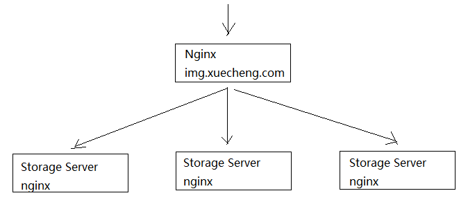

2、在nginx图片代理服务上配置图片服务器虚拟主机

```
#图片服务
upstream img_server_pool{
#server 192.168.101.64:80 weight=10;
server 192.168.101.65:80 weight=10;
}
#学成网图片服务
server {
listen 80;
server_name img.xuecheng.com;
#个人中心
location /group1 {
proxy_pass http://img_server_pool;
}
location /group2 {
proxy_pass http://img_server_pool;
}
}
```

### 3.3.3 图片服务器启动

```
1、启动tracker：/usr/bin/fdfs_trackerd /etc/fdfs/tracker.conf restart
2、启动storage：/usr/bin/fdfs_storaged /etc/fdfs/storage.conf restart
3、启动storage上的nginx：/usr/local/nginx/sbin/nginx ‐c /usr/local/nginx/conf/nginx‐fdfs.conf
4、启动图片虚拟主机 nginx
```

# 4 总结

通过本次课程的学习您要达到以下目标：

1）了解分布式文件系统的概念及应用场景
	分布式文件系统是通过网络将单机上的文件系统组成一个网络文件系统。
	分布式文件系统主要应用在大型互联网项目中，实现图片存储、音视频存储等服务。
	分布式文件系统的优点：可以快速扩容存储，提高文件访问速度。

2）理解fastDFS的工作原理
	fastDFS由tracker和storage组成，它们都可以部署集群。
	tracker负责调度，storage负责存储。

3）掌握fastDFS存取文件方法
		客户端与fastDFS采用socket协议通信，可以采用官方提供的java版本的fastDSF-client快速开发。
4）能够动手搭建一个fastDSF文件服务器