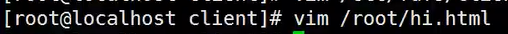
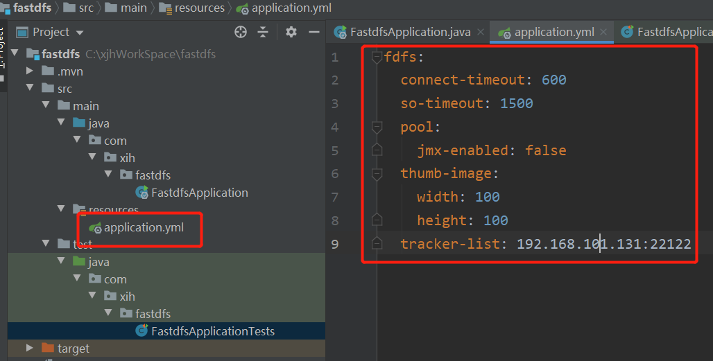
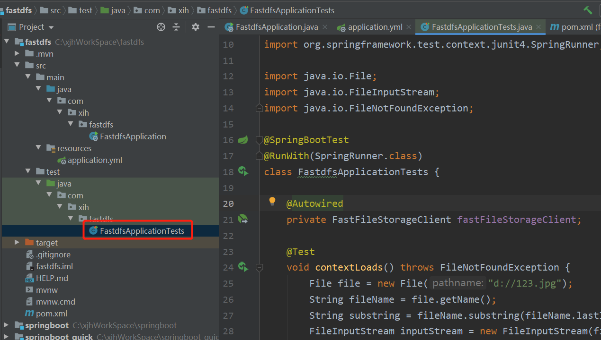
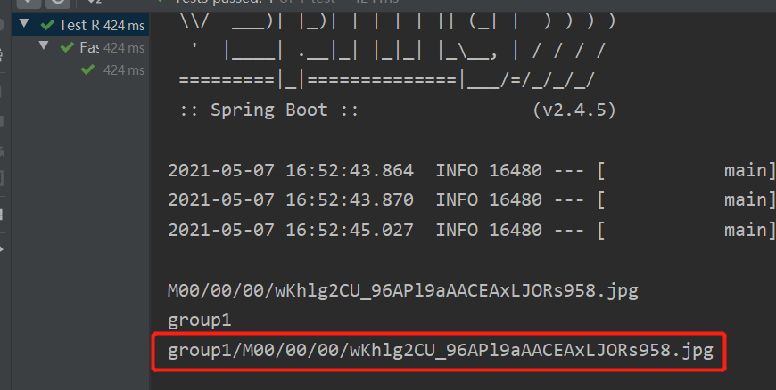
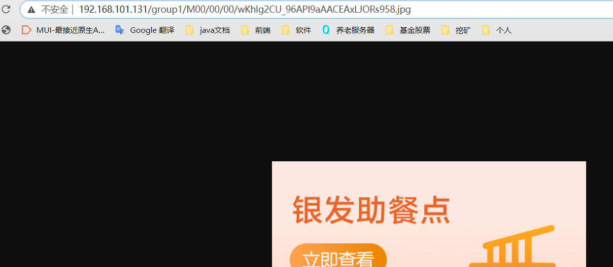

# 安装

## 1.  准备条件


## 2. 安装C/C++ 编译环境


```
yum -y install gcc gcc-c++
```

## 3.   安装 libevent 库

```
yum -y install libevent 
```


## 4.  上传安装文件到 /usr/local/fastdfs 目录下


## 5. 安装 libfastcommon

```
cd /usr/local/fastdfs
tar -zxf    libfastcommonV1.0.7.tar.gz
cd libfastcommon-1.0.7
./make.sh
./make.sh install
cp /usr/lib64/libfastcommon.so /usr/lib
```

```
这里 执行 ./make.sh 出错的话可以先执行这句
yum -y install zlib zlib-devel pcre pcre-devel gcc gcc-c++ openssl openssl-devel libevent libevent-devel perl unzip net-tools wget  
```


## 6.创建数据存储目录(这步去掉)

```
mkdir -p /usr/local/FastDFS/tracker  /usr/local/FastDFS/storage /usr/local/FastDFS/client
```

## 7. 安装 FastDFS 

```
cd /usr/local/fastdfs
tar -zxf FastDFS_v5.05.tar.gz
cd FastDFS
./make.sh
./make.sh install
cd conf
cp * /etc/fdfs
```


## 8.编辑  /etc/fdfs/tracker.conf  修改存储路径的位置

```
cd /usr/local/fastdfs/FastDFS/tracker
pwd
vim /etc/fdfs/tracker.conf
```

```
如果没有vim命令 
yum -y install vim*
```

https://blog.csdn.net/weixin_40584261/article/details/88887615


然后 按esc 键  ;

输入  :wq

## 9.启动tracker 

```
/usr/bin/fdfs_trackerd /etc/fdfs/tracker.conf 
```


自启动配置错误 虚拟机会进不去

## 10. 配置storage节点

```
vim /etc/fdfs/storage.conf

base_path=/usr/local/fastdfs/FastDFS/storage

store_path0=/usr/local/fastdfs/FastDFS/storage

tracker_server = 192.168.77.137:22122
```


## 11. 启动storage节点

```
/usr/bin/fdfs_storaged /etc/fdfs/storage.conf
```

这个过程久一点,不要中断他(如果真的太久,就是配置出了问题)


## 12. 配置测试

从编译完的FastDFS目录复制libfastclient.so 到/usr/lib目录

```
cd /usr/local/fastdfs/FastDFS/client

cp libfdfsclient.so /usr/lib
```


## 13. 修改测试配置文件

```
vim /etc/fdfs/client.conf

base_path=/usr/local/fastdfs/FastDFS/client

tracker_server=192.168.77.137:22122
```


## 14、测试上传

创建文件

```
vim /root/hi.html
```



随便写点内容保存


```
/usr/bin/fdfs_test /etc/fdfs/client.conf upload /root/hi.html

cd /usr/local/fastdfs/FastDFS/storage/data/00/00
```


这样之后内部可以访问,但是复制到外部浏览器不能访问

```
http://192.168.101.131/group1/M00/00/00/wKhlg2CU6FSAYotgAAAADJuF16M71.html
```


可能是防火墙的原因?

没有防火墙可以安装

https://blog.csdn.net/y368769/article/details/104490697/

```
yum install iptables-services
```

修改防火墙 开放端口

```
vim /etc/sysconfig/iptables
```


加上这行

```
-A INPUT -p tcp -m state --state NEW -m tcp --dport 22 -j ACCEPT
```


重启防火墙

```
service   iptables restart
```


还是不能访问 需要安装nginx

## 15.安装Nginx及插件


```
 yum install -y gcc-c++   (已安装)

 yum install -y pcre pcre-devel

 yum install -y zlib zlib-devel

 yum install -y openssl openssl-devel
```


## 16 解压 fastdfs-nginx-module_v1.16.tar.gz

```
cd /usr/local/fastdfs

tar -zxf fastdfs-nginx-module_v1.16.tar.gz
```


## 17 修改fastdfs-nginx-module/src/config配置文件

```
cd fastdfs-nginx-module

cd src/

vim config

按esc  加上%s/local\///g   看到以下
:%s/local\///g
```

第三张图有语法

```
    把CORE_INCS="$CORE_INCS /usr/local/include/fastdfs /usr/include/fastcommon/"

    修改为：CORE_INCS="$CORE_INCS /usr/include/fastdfs /usr/include/fastcommon/"


    把CORE_LIBS="$CORE_LIBS -L/usr/local/lib -lfastcommon -lfdfsclient"

    修改为：CORE_LIBS="$CORE_LIBS -L/usr/lib -lfastcommon -lfdfsclient"

实际就是把路径中的local这一层删除掉
```


## 18  复制fastdfs-nginx-module/src/mod_fastdfs.conf 到/etc/fdfs目录下并编辑

```
cp mod_fastdfs.conf /etc/fdfs/

vim /etc/fdfs/mod_fastdfs.conf

tracker_server=192.168.77.137:22122

url_have_group_name = true

storage_server_port=23000

group_name=group1

store_path0=/usr/local/fastdfs/FastDFS/storage
```


包含组名  group1


文件放在哪里?

 新建窗口  复制这个地址  手写容易出错


## 19 安装 nginx

```
cd /usr/local/fastdfs/

tar -zxf  nginx-1.8.0.tar.gz

cd nginx-1.8.0

./configure --add-module=/usr/local/fastdfs/fastdfs-nginx-module/src/

make

make install
```


查看配置的路径的地址


编译


安装


## 20 配置 nginx

```
cd /usr/local/nginx/conf

vim nginx.conf
```

```
server{
    listen     80;
    server_name     localhost;
    location /group1/M00/{
        ngx_fastdfs_module;
    }
}
```


## 21 重启 nginx

```
cd /usr/local/nginx/sbin/

./nginx

或者一步搞定
/usr/local/nginx/sbin/nginx
```


查看nginx 是否启动


测试访问


# springboot 整合 fastdfs

## 1 创建工程 


## 2. 添加依赖

```
<dependency>
            <groupId>com.github.tobato</groupId>
            <artifactId>fastdfs-client</artifactId>
            <version>1.26.7</version>
 </dependency>
```


## 3.导入配置

```
package com.xih.fastdfs;

import com.github.tobato.fastdfs.FdfsClientConfig;
import org.springframework.boot.SpringApplication;
import org.springframework.boot.autoconfigure.SpringBootApplication;
import org.springframework.context.annotation.Import;

@Import(FdfsClientConfig.class)
@SpringBootApplication
public class FastdfsApplication {

    public static void main(String[] args) {
        SpringApplication.run(FastdfsApplication.class, args);
    }

}

```


## 4. 配置 application.yml

```
fdfs:
  connect-timeout: 600
  so-timeout: 1500
  pool:
    jmx-enabled: false
  thumb-image:
    width: 100
    height: 100
  tracker-list: 192.168.101.131:22122
```



## 5.使用客户端测试



```
package com.xih.fastdfs;

import com.github.tobato.fastdfs.domain.StorePath;

import com.github.tobato.fastdfs.service.FastFileStorageClient;
import org.junit.jupiter.api.Test;
import org.junit.runner.RunWith;
import org.springframework.beans.factory.annotation.Autowired;
import org.springframework.boot.test.context.SpringBootTest;
import org.springframework.test.context.junit4.SpringRunner;

import java.io.File;
import java.io.FileInputStream;
import java.io.FileNotFoundException;

@SpringBootTest
@RunWith(SpringRunner.class)
class FastdfsApplicationTests {

    @Autowired
    private FastFileStorageClient fastFileStorageClient;

    @Test
    void contextLoads() throws FileNotFoundException {
        File file = new File("d://123.jpg");
        String fileName = file.getName();
        String substring = fileName.substring(fileName.lastIndexOf(".") + 1);
        FileInputStream inputStream = new FileInputStream(file);
        StorePath storePath = fastFileStorageClient.uploadFile(inputStream, file.length(), substring, null);

        System.out.println(storePath.getPath());
        System.out.println(storePath.getGroup());
        System.out.println(storePath.getFullPath());
    }

}

```

设置防火墙

```
vim /etc/sysconfig/iptables
```


加上这行  开放这2个端口

```
-A INPUT -p tcp -m state --state NEW -m tcp --dport 22122 -j ACCEPT
-A INPUT -p tcp -m state --state NEW -m tcp --dport 23000 -j ACCEPT
```


重启防火墙

```
service iptables restart
```


启动springboot 看打印地址



浏览器查看

```
http://192.168.101.131/group1/M00/00/00/wKhlg2CU_96APl9aAACEAxLJORs958.jpg
```



# 使用docker搭建FastDFS文件系统

参考文档

http://www.zuidaima.com/blog/4653383732808704.htm