<h1 align = "center">Docker</h1>

# 1. Docker简介

## 1.1  什么是虚拟化

在计算机中，虚拟化（英语：Virtualization）是一种资源管理技术，是将计算机的各种实体资源，如服务器、网
络、内存及存储等，予以抽象、转换后呈现出来，打破实体结构间的不可切割的障碍，使用户可以比原本的组态更
好的方式来应用这些资源。这些资源的新虚拟部份是不受现有资源的架设方式，地域或物理组态所限制。一般所指
的虚拟化资源包括计算能力和资料存储。
在实际的生产环境中，虚拟化技术主要用来解决高性能的物理硬件产能过剩和老的旧的硬件产能过低的重组重用，
透明化底层物理硬件，从而最大化的利用物理硬件对资源充分利用

## 1.2 什么是Docker

Docker 项目的目标是实现轻量级的操作系统虚拟化解决方案。 Docker 的基础是 Linux 容器（LXC）等技术。
在 LXC 的基础上 Docker 进行了进一步的封装，让用户不需要去关心容器的管理，使得操作更为简便。用户操作
Docker 的容器就像操作一个快速轻量级的虚拟机一样简单。

### 1.2.1   为什么选择Docker?

（1）上手快。
用户只需要几分钟，就可以把自己的程序“Docker化”。Docker依赖于“写时复制”（copy-on-write）模型，使修改
应用程序也非常迅速，可以说达到“随心所致，代码即改”的境界。
随后，就可以创建容器来运行应用程序了。大多数Docker容器只需要不到1秒中即可启动。由于去除了管理程
序的开销，Docker容器拥有很高的性能，同时同一台宿主机中也可以运行更多的容器，使用户尽可能的充分利用
系统资源。
（2）职责的逻辑分类
使用Docker，开发人员只需要关心容器中运行的应用程序，而运维人员只需要关心如何管理容器。Docker设计的
目的就是要加强开发人员写代码的开发环境与应用程序要部署的生产环境一致性。从而降低那种“开发时一切正
常，肯定是运维的问题（测试环境都是正常的，上线后出了问题就归结为肯定是运维的问题）”

（3）快速高效的开发生命周期
Docker的目标之一就是缩短代码从开发、测试到部署、上线运行的周期，让你的应用程序具备可移植性，易于构
建，并易于协作。（通俗一点说，Docker就像一个盒子，里面可以装很多物件，如果需要这些物件的可以直接将
该大盒子拿走，而不需要从该盒子中一件件的取。）
（4）鼓励使用面向服务的架构
Docker还鼓励面向服务的体系结构和微服务架构。Docker推荐单个容器只运行一个应用程序或进程，这样就形成
了一个分布式的应用程序模型，在这种模型下，应用程序或者服务都可以表示为一系列内部互联的容器，从而使分
布式部署应用程序，扩展或调试应用程序都变得非常简单，同时也提高了程序的内省性。（当然，可以在一个容器
中运行多个应用程序）

## 1.3 容器与虚拟机比较

Docker 和传统虚拟化方式的不同之处，可见容器是在操作系统层面上实现虚拟化，直接复用本
地主机的操作系统，而传统方式则是在硬件层面实现。

与传统的虚拟机相比，Docker优势体现为启动速度快、占用体积小。

## 1.4 Docker 组件

### 1.4.1 Docker服务器与客户端

Docker是一个客户端-服务器（C/S）架构程序。Docker客户端只需要向Docker服务器或者守护进程发出请求，服
务器或者守护进程将完成所有工作并返回结果。Docker提供了一个命令行工具Docker以及一整套RESTful API。你
可以在同一台宿主机上运行Docker守护进程和客户端，也可以从本地的Docker客户端连接到运行在另一台宿主机
上的远程Docker守护进程。

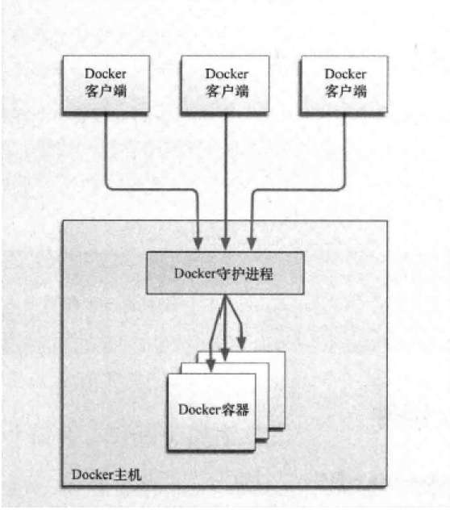

### 1.4.2 Docker镜像与容器

镜像是构建Docker的基石。用户基于镜像来运行自己的容器。镜像也是Docker生命周期中的“构建”部分。镜像是基
于联合文件系统的一种层式结构，由一系列指令一步一步构建出来。例如：
添加一个文件；
执行一个命令；
打开一个窗口。
也可以将镜像当作容器的“源代码”。镜像体积很小，非常“便携”，易于分享、存储和更新。
Docker可以帮助你构建和部署容器，你只需要把自己的应用程序或者服务打包放进容器即可。容器是基于镜像启
动起来的，容器中可以运行一个或多个进程。我们可以认为，镜像是Docker生命周期中的构建或者打包阶段，而
容器则是启动或者执行阶段。 容器基于镜像启动，一旦容器启动完成后，我们就可以登录到容器中安装自己需要
的软件或者服务。
所以Docker容器就是：
一个镜像格式；
一些列标准操作；
一个执行环境。
Docker借鉴了标准集装箱的概念。标准集装箱将货物运往世界各地，Docker将这个模型运用到自己的设计中，唯
一不同的是：集装箱运输货物，而Docker运输软件。
和集装箱一样，Docker在执行上述操作时，并不关心容器中到底装了什么，它不管是web服务器，还是数据
库，或者是应用程序服务器什么的。所有的容器都按照相同的方式将内容“装载”进去。

Docker也不关心你要把容器运到何方：我们可以在自己的笔记本中构建容器，上传到Registry，然后下载到
一个物理的或者虚拟的服务器来测试，在把容器部署到具体的主机中。像标准集装箱一样，Docker容器方便替
换，可以叠加，易于分发，并且尽量通用。

### 1.4.3 Registry（注册中心）

Docker用Registry来保存用户构建的镜像。Registry分为公共和私有两种。Docker公司运营公共的Registry叫做
Docker Hub。用户可以在Docker Hub注册账号，分享并保存自己的镜像（说明：在Docker Hub下载镜像巨慢，
可以自己构建私有的Registry）。
https://hub.docker.com/

# 2 Docker安装与启动

## 2.1 安装Docker

Docker官方建议在Ubuntu中安装，因为Docker是基于Ubuntu发布的，而且一般Docker出现的问题Ubuntu是最
先更新或者打补丁的。在很多版本的CentOS中是不支持更新最新的一些补丁包的。
由于我们学习的环境都使用的是CentOS，因此这里我们将Docker安装到CentOS上。注意：这里建议安装在
CentOS7.x以上的版本，在CentOS6.x的版本中，安装前需要安装其他很多的环境而且Docker很多补丁不支持更
新。
请直接挂载课程配套的Centos7.x镜像

### 2.1.1 更新 yum 包到最新

```
sudo yum update
```

时间比较长 看到以下结束

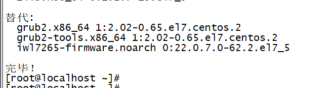

### 2.1.2 安装需要的软件包 

yum-util 提供yum-config-manager功能，另外两个是devicemapper驱动依赖的

```
sudo yum install -y yum-utils device-mapper-persistent-data lvm2
```

### 2.1.3 设置yum源为阿里云

```
sudo yum-config-manager --add-repo http://mirrors.aliyun.com/dockerce/linux/centos/docker-ce.repo
```

### 2.1.4 安装docker

```
sudo yum install docker-ce
```

### 2.1.5 安装后查看docker版本

```
docker -v
```

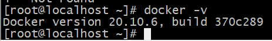

## 2.2 设置ustc的镜像

ustc是老牌的linux镜像服务提供者了，还在遥远的ubuntu 5.04版本的时候就在用。ustc的docker镜像加速器速度
很快。ustc docker mirror的优势之一就是不需要注册，是真正的公共服务。

https://lug.ustc.edu.cn/wiki/mirrors/help/docker

编辑该文件:

```
vi /etc/docker/daemon.json
```

在该文件中输入如下内容：

```
{
"registry-mirrors": ["https://docker.mirrors.ustc.edu.cn"]
}
```

## 2.3 Docker的启动与停止

systemctl命令是系统服务管理器指令

### 2.3.1 启动docker：

```
systemctl start docker
启动完成 可以查看docker状态
```

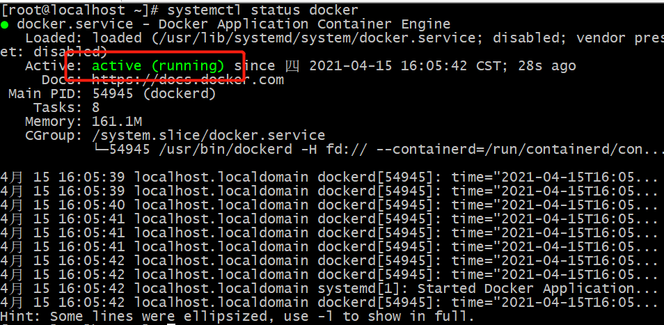

### 2.3.2 停止docker

```
systemctl stop docker
```

### 2.3.3 重启docker：

```
systemctl restart docker
```

### 2.3.4 查看docker状态：

```
systemctl status docker
```

### 2.3.5 开机启动：

```
systemctl enable docker
```

### 2.3.6 查看docker概要信息

```
docker info
```

### 2.3.7 查看docker帮助文档

```
docker --help
```

# 3 常用命令

## 3.1 镜像相关命令

### 3.1.1 查看镜像

```
docker images
```

REPOSITORY：镜像名称
TAG：镜像标签
IMAGE ID：镜像ID
CREATED：镜像的创建日期（不是获取该镜像的日期）
SIZE：镜像大小
这些镜像都是存储在Docker宿主机的/var/lib/docker目录下

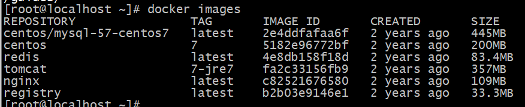

### 3.1.2 搜索镜像

如果你需要从网络中查找需要的镜像，可以通过以下命令搜索

```
docker search 镜像名称
```

NAME：仓库名称
DESCRIPTION：镜像描述
STARS：用户评价，反应一个镜像的受欢迎程度
OFFICIAL：是否官方
AUTOMATED：自动构建，表示该镜像由Docker Hub自动构建流程创建的

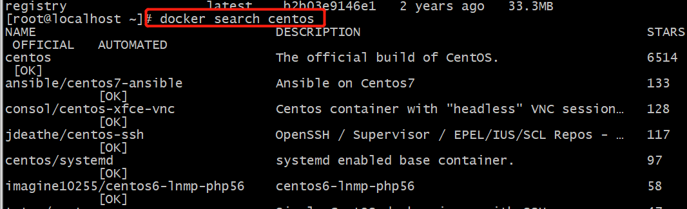

### 3.1.3 拉取镜像

拉取镜像就是从中央仓库中下载镜像到本地

```
docker pull 镜像名称
```

例如，我要下载centos7镜像

```
docker pull centos   		这种下载最后版本
docker pull centos:7  		:版本号   下载该版本
```

### 3.1.4 删除镜像

按镜像ID删除镜像

```
docker rmi 镜像ID
```

删除所有镜像

```
docker rmi `docker images -q`
```

## 3.2 容器相关命令

### 3.2.1 查看容器

查看正在运行的容器

```
docker ps
```

查看所有容器

```
docker ps –a
```

查看最后一次运行的容器

```
docker ps –l
```

查看停止的容器

```
docker ps -f status=exited
```

### 3.2.2 创建与启动容器

创建容器常用的参数说明：
创建容器命令：docker run
-i：表示运行容器
-t：表示容器启动后会进入其命令行。加入这两个参数后，容器创建就能登录进去。即分配一个伪终端。
--name :为创建的容器命名。
-v：表示目录映射关系（前者是宿主机目录，后者是映射到宿主机上的目录），可以使用多个－v做多个目录或文
件映射。注意：最好做目录映射，在宿主机上做修改，然后共享到容器上。
-d：在run后面加上-d参数,则会创建一个守护式容器在后台运行（这样创建容器后不会自动登录容器，如果只加-i -t
两个参数，创建后就会自动进去容器）。
-p：表示端口映射，前者是宿主机端口，后者是容器内的映射端口。可以使用多个-p做多个端口映射

#### 3.2.2.1 交互式方式创建容器

```
docker run -it --name=容器名称 镜像名称:标签 /bin/bash
```

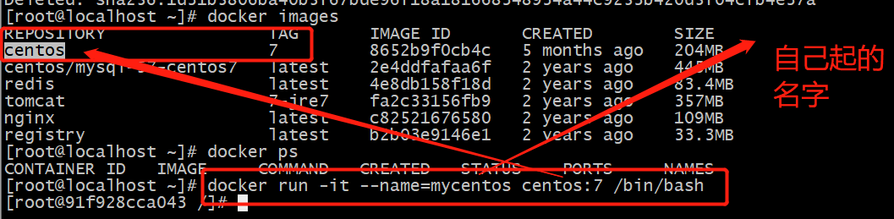

这时我们通过ps命令查看，发现没有启动的容器

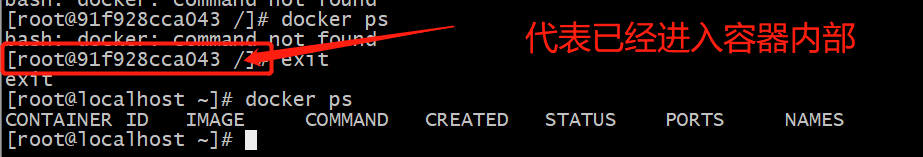

退出当前容器

```
exit
```

发现仍然没有启动的容器,因为以这种方式创建的容器退出就关闭了

#### 3.2.2.2 守护式方式创建容器

```
docker run -di --name=容器名称 镜像名称:标签
```

登录守护式容器方式：

```
docker exec -it 容器名称 (或者容器ID) /bin/bash
```

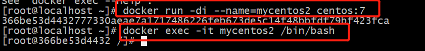

然后退出查看


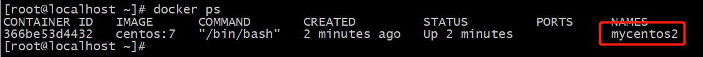

### 3.2.3 停止与启动容器

停止容器：

```
docker stop 容器名称（或者容器ID）
```

启动容器：

```
docker start 容器名称（或者容器ID）
```

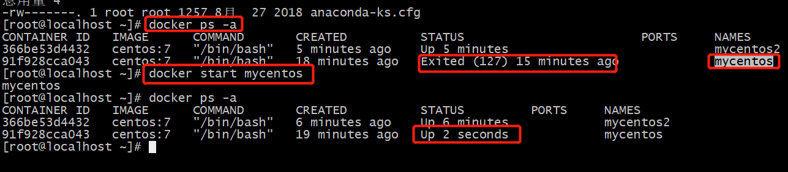

### 3.2.4 文件拷贝

如果我们需要将文件拷贝到容器内可以使用cp命令

cp  命令不管容器停止还是启动,都是可以使用的

```
docker cp 需要拷贝的文件或目录 容器名称:容器目录
```

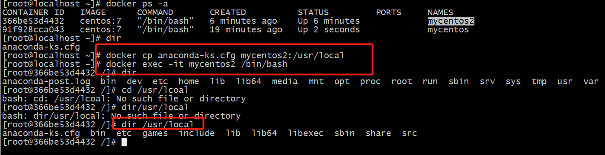

也可以将文件从容器内拷贝出来

```
docker cp 容器名称:容器目录 需要拷贝的文件或目录
```

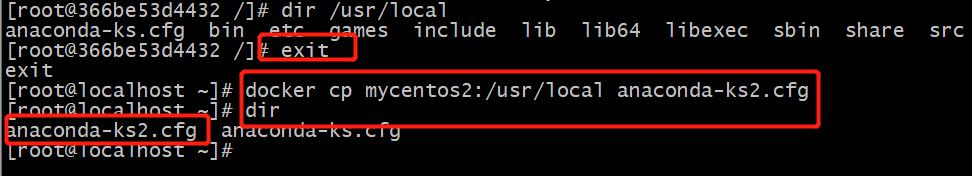

### 3.2.5 目录挂载

我们可以在创建容器的时候，将宿主机的目录与容器内的目录进行映射，这样我们就可以通过修改宿主机某个目录的文件从而去影响容器。 

创建容器 添加-v参数 后边为 宿主机目录:容器目录，例如：

```
docker run -di -v /usr/local/myhtml:/usr/local/myhtml --name=mycentos3 centos:7
```

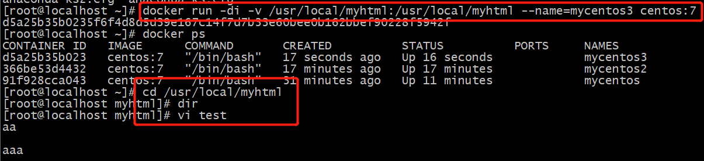

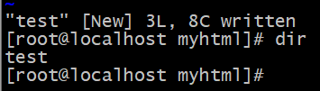

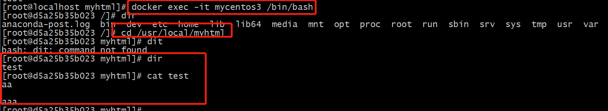

如果你共享的是多级的目录，可能会出现权限不足的提示。
这是因为CentOS7中的安全模块selinux把权限禁掉了，我们需要添加参数 --privileged=true 来解决挂载的目录没
有权限的问题

### 3.2.6 查看容器IP地址

我们可以通过以下命令查看容器运行的各种数据

```
docker inspect 容器名称（容器ID）
```

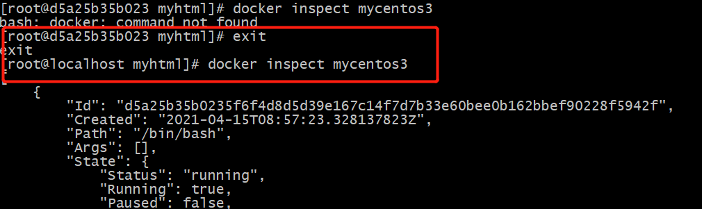

也可以直接执行下面的命令直接输出IP地址

```
docker inspect --format='{{.NetworkSettings.IPAddress}}' 容器名称（容器ID）
```

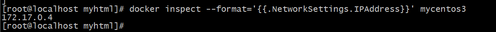

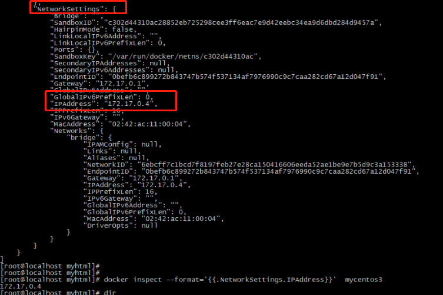

### 3.2.7 删除容器

删除指定的容器： 无法删除运行的容器  需要先停止

```
docker rm 容器名称（容器ID）
```

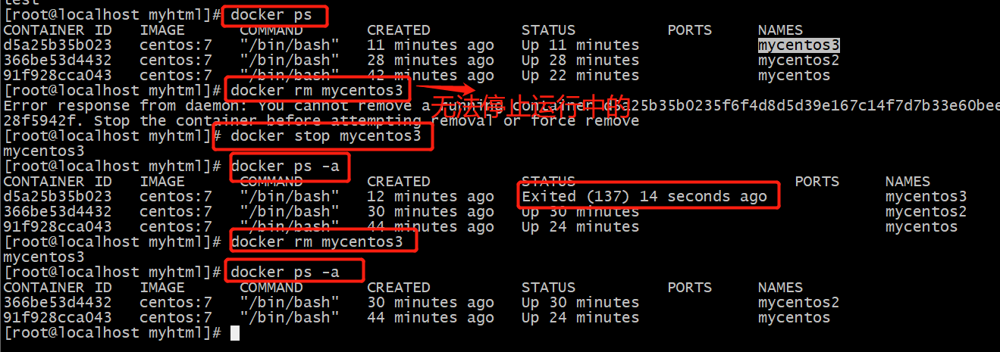

### 3.2.8 删除镜像

```
docker rmi 镜像名称
```

如果镜像有正在运行的容器时, 是无法删除的 ,必须先停止容器

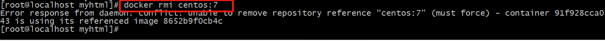

# 4 应用部署

## 4.1 MySQL部署

（1）拉取mysql镜像

```
docker pull centos/mysql-57-centos7
```

（2）创建容器

```
docker run -di --name=tensquare_mysql -p 33306:3306 -e MYSQL_ROOT_PASSWORD=123456 centos/mysql-57-centos7

-p 代表端口映射，格式为 宿主机映射端口:容器运行端口
-e 代表添加环境变量  MYSQL_ROOT_PASSWORD 是root用户的登陆密码
```

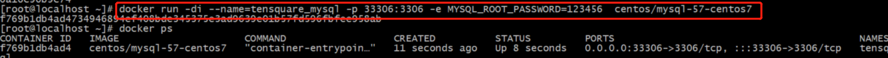

（3）远程登录mysql

连接宿主机的IP ,指定端口为33306

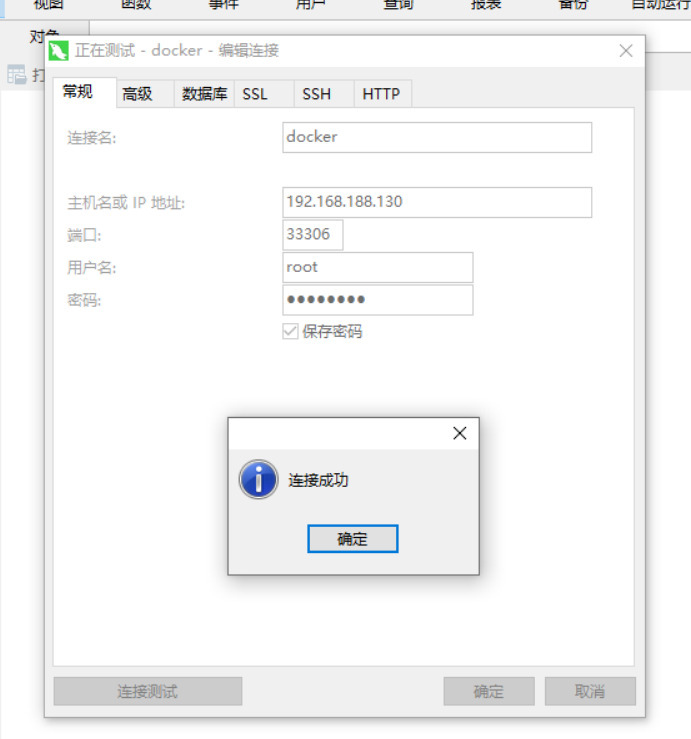

## 4.2 tomcat部署

（1）拉取镜像

```
docker pull tomcat:7-jre7
```

（2）创建容器

创建容器 -p表示地址映射

```
docker run -di --name=mytomcat -p 9000:8080 -v /usr/local/webapps:/usr/local/tomcat/webapps tomcat:7-jre7
```

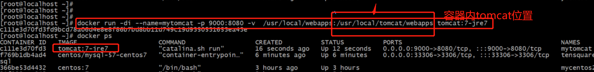

直接访问  发现不能访问 因为 /usr/local/webapps 下面是空的 没有页面访问 

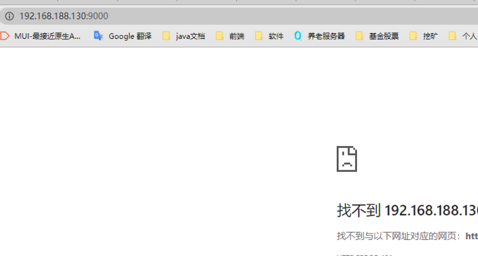

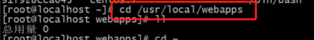

所以找一个页面上传


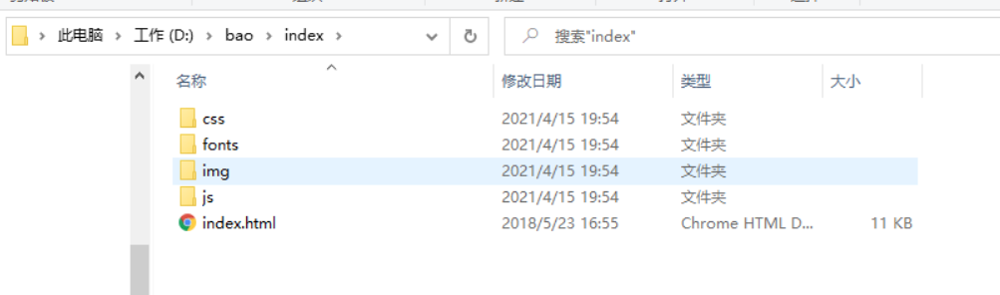

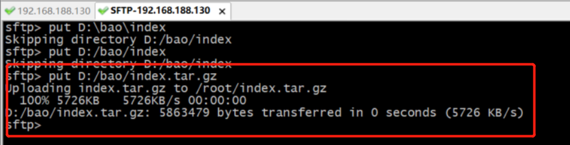

上传之后移动 /usr/lcoal/webapps 下面并且解压

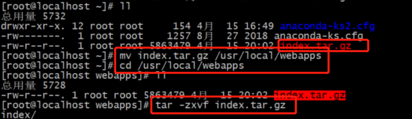

然后访问就有页面了

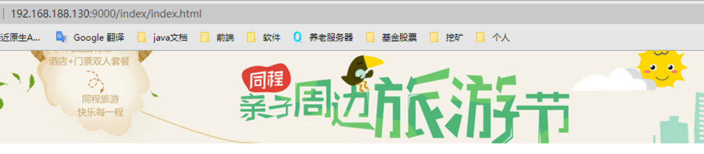

## 4.3 Nginx部署

（1）拉取镜像

```
docker pull nginx
```

（2）创建Nginx容器

```
docker run -di --name=mynginx -p 80:80 nginx
```

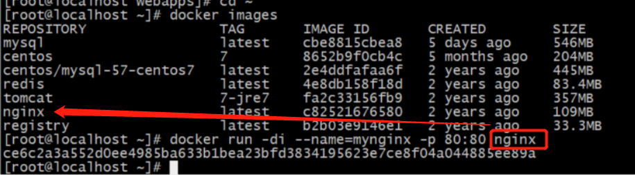


直接访问就能看到 nginx

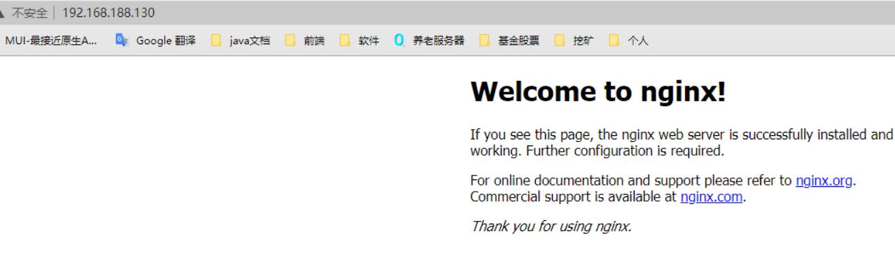

```
put -r 文件位置     这种可以传未压缩的文件
```

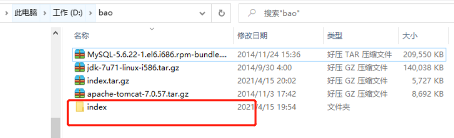

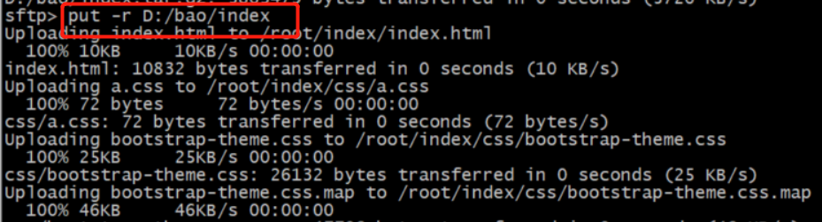

```
docker exec -it mynginx /bin/bash 
dir
cd etc
cd nginx
```

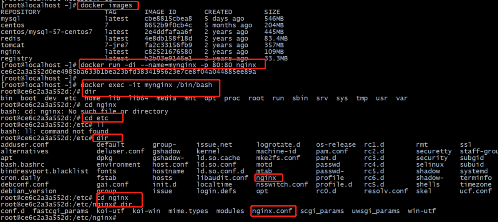

```
cat nginx.conf
```

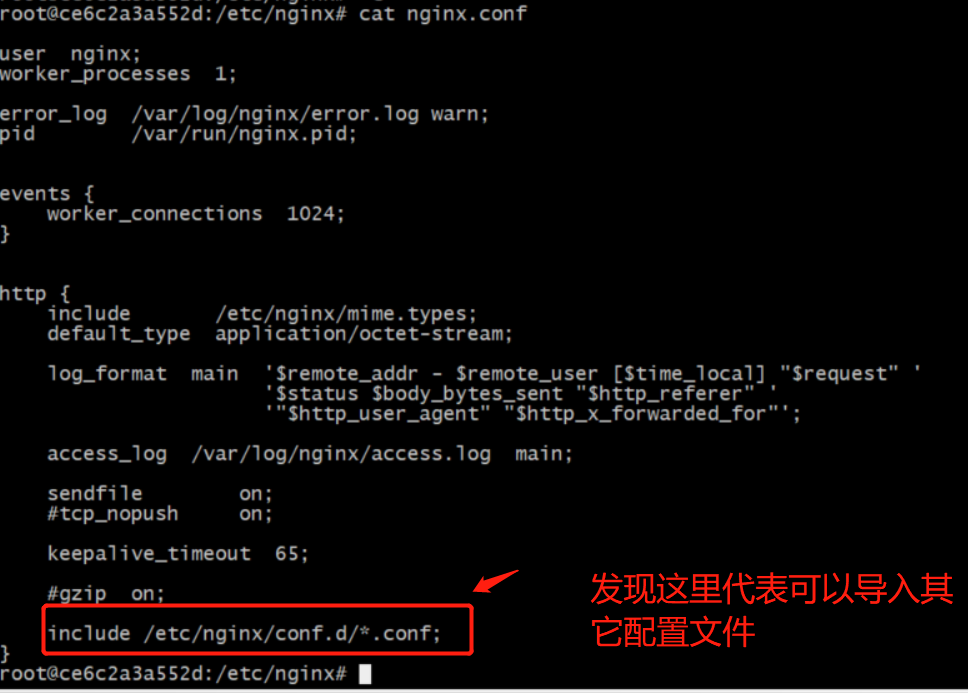

```
cd conf.d  
dir
cat default.conf
```

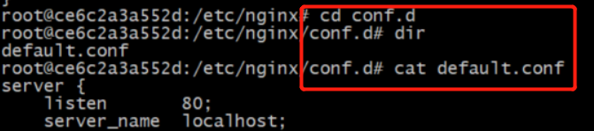

```
cat default.conf   找到欢迎页面放的位置  /usr/share/nginx/html
```


```
exit
mv index html   将上传的文件 index 改名成 html 
docker cp html mynginx:/usr/share/nginx/   
	复制到mynginx:/usr/share/nginx/ 直接覆盖原来的 html 页面
```

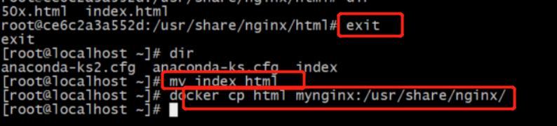

再次访问 ip 地址 就能访问到页面


（1）拉取镜像

```
docker pull redis
```

（2）创建容器

```
docker run -di --name=myredis -p 6379:6379 redis
```

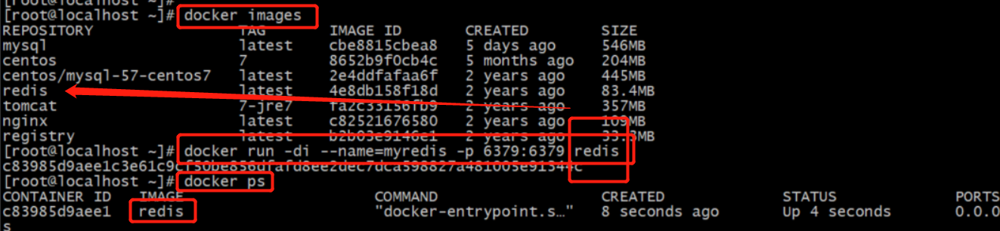

(3)可以去测试

```
cmd   打开本机的 cmd
# 找到 本机的 redis客户端
d:
cd D:\JAVA视频\数据库部分+web 3\day23_redis\资料\redis\windows-64\redis-2.8.9 
#  redis-cli  执行程序的名称   -h 代表连接远程 不写就是连接本机    192.168.188.130  连接的ip地址
redis-cli -h 192.168.188.130     
```

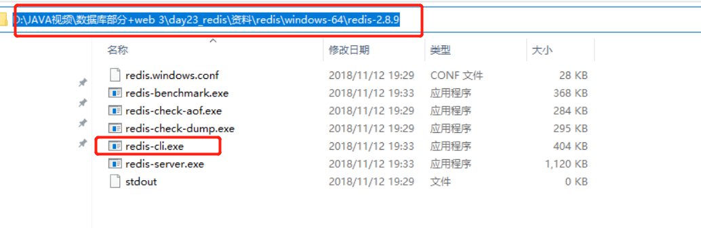

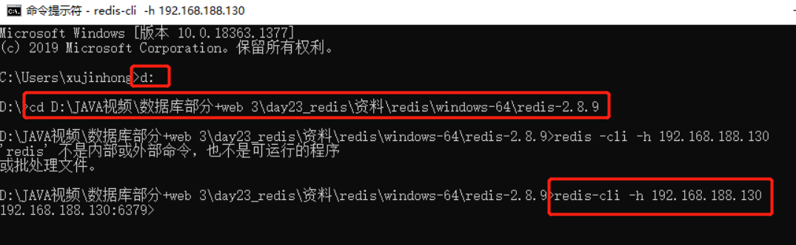

测试使用

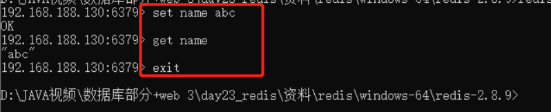

# 5 迁移与备份

## 5.1 容器保存为镜像

我们可以通过以下命令将容器保存为镜像

```
docker commit mynginx mynginx_i
```


```
docker images    查看镜像
docker run -di --name=mynginx2 -p 81:80 mynginx_i  利用镜像创建新的容器
```


浏览器访问 81 端口

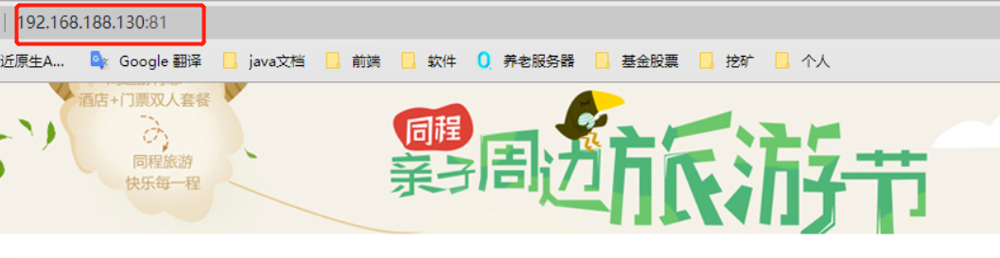

## 5.2 镜像备份

我们可以通过以下命令将镜像保存为tar 文件

```
docker save -o mynginx.tar mynginx_i
# 保存的文件名 mynginx.tar  镜像名 mynginx_i  -o  代表保存(output)
```


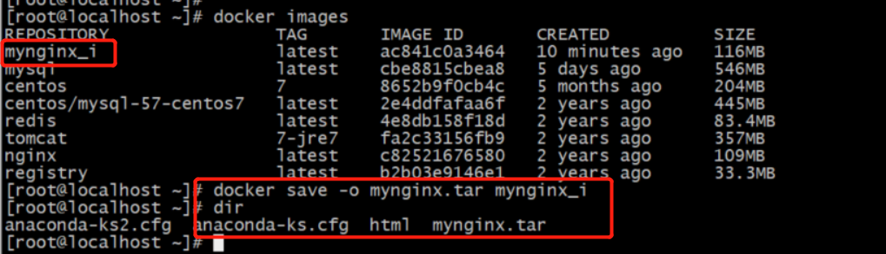

## 5.3 镜像恢复与迁移

首先我们先删除掉mynginx_img镜像 然后执行此命令进行恢复

-i 输入的文件
执行后再次查看镜像，可以看到镜像已经恢复

```
docker stop mynginx2  停止容器
docker rm mynginx2    删除容器
docker rmi mynginx_i  删除镜像
docker images         查看镜像是否有 myngxin2
docker load -i mynginx.tar   利用上面镜像保存的 mynginx.tar 文件 恢复镜像
```

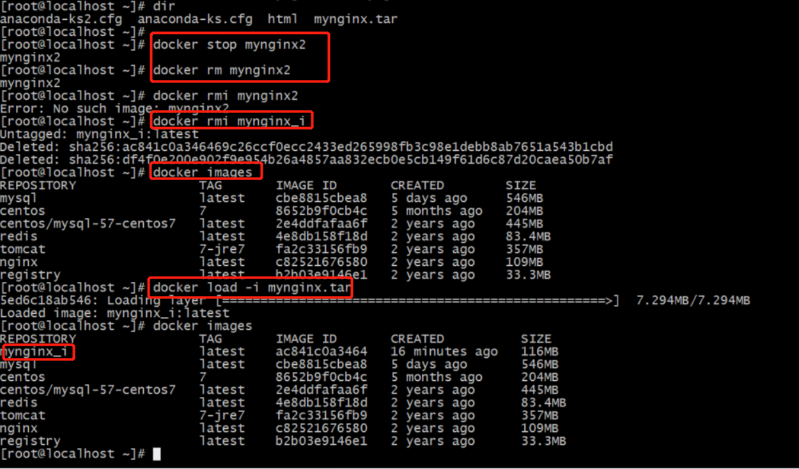

# 6 Dockerfile

Dockerfile是由一系列命令和参数构成的脚本，这些命令应用于基础镜像并最终创建一个新的镜像。
1、对于开发人员：可以为开发团队提供一个完全一致的开发环境； 2、对于测试人员：可以直接拿开发时所构建
的镜像或者通过Dockerfile文件构建一个新的镜像开始工作了； 3、对于运维人员：在部署时，可以实现应用的无
缝移植。

## 6.2 常用命令

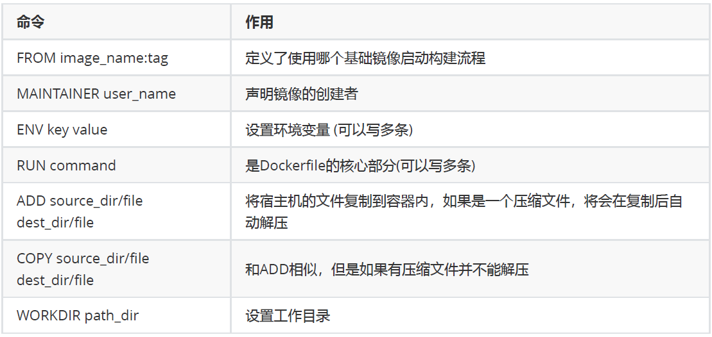

## 6.3 使用脚本创建镜像

### 6.3.1 创建目录

```
mkdir –p /usr/local/dockerjdk8  创建目录
```


### 6.3.2上传jdK

下载 jdk-8u171-linux-x64.tar.gz 并上传到服务器（虚拟机）中的 usr/local/dockerjdk8 目录


```
 put D:/bao/jdk-8u171-linux-x64.tar.gz   上传文件
```

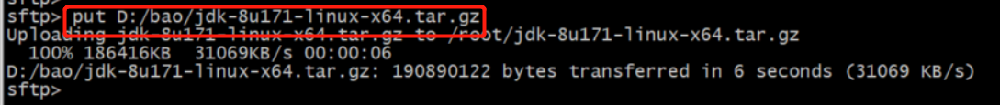

```
dir  查看上传的文件
mv jdk-8u171-linux-x64.tar.gz /usr/local/dockerjdk8    移动到创建的文件下
cd /usr/local/dockerjdk8     打开文件夹
dir 		查看文件夹下面有没有

```

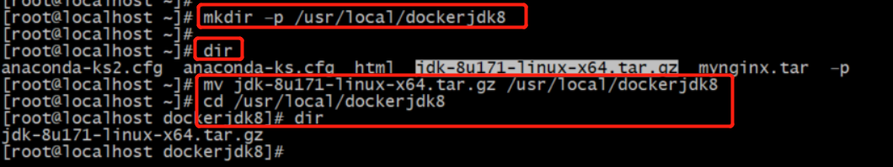

### 6.3.3 创建文件 Dockerfile 

```
vi Dockerfile  	创建文件 Dockerfile 必须叫这个名字  
```

然后在里面配置以下信息

```
#依赖镜像名称和ID
FROM centos:7
#指定镜像创建者信息
MAINTAINER ITCAST
#切换工作目录
WORKDIR /usr
RUN mkdir /usr/local/java
#ADD 是相对路径jar,把java添加到容器中
ADD jdk-8u171-linux-x64.tar.gz /usr/local/java/

#配置java环境变量
ENV JAVA_HOME /usr/local/java/jdk1.8.0_171
ENV JRE_HOME $JAVA_HOME/jre
ENV CLASSPATH $JAVA_HOME/lib/dt.jar:$JAVA_HOME/lib/tools.jar:$JRE_HOME/lib:$CLASSPATH
ENV PATH $JAVA_HOME/bin:$PATH
```

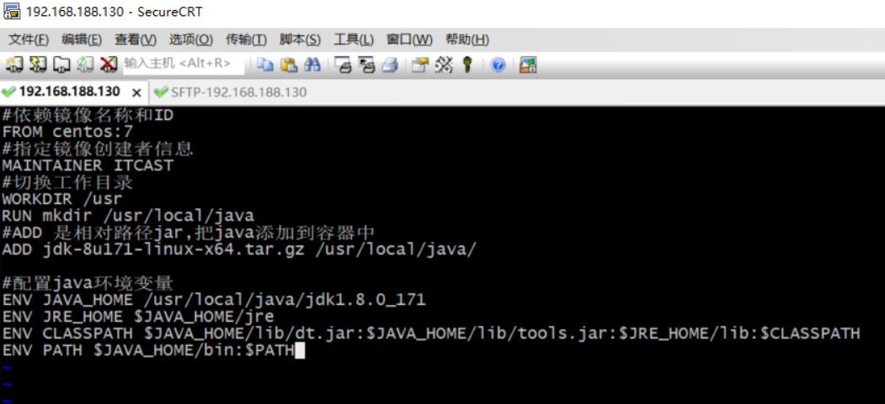

保存以后  有了这2个文件

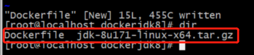

### 6.3.4 执行命令构建镜像

```
docker build -t='jdk1.8' .   注意后边的空格和点，不要省略 时间比较长
```

### 6.3.5 查看镜像是否建立完成

```
dir
docker iamges
```

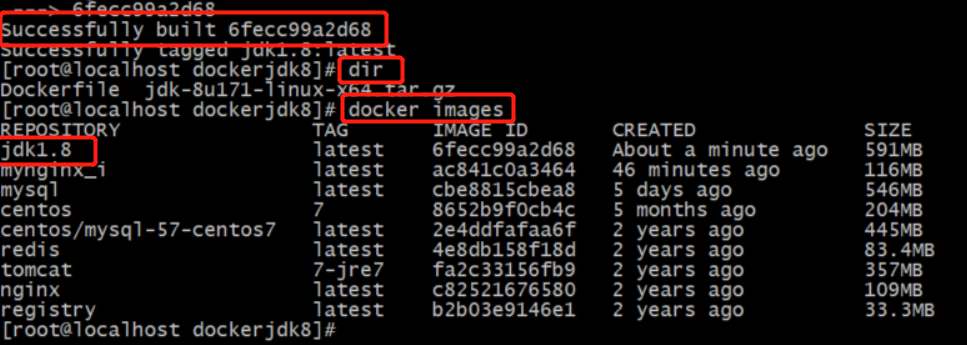

# 7 Docker私有仓库

## 7.1 私有仓库搭建与配置

### 7.1.1 拉取私有仓库镜像（此步省略 已经下好）

```
docker pull registry
```

### 7.1.2 启动私有仓库容器

```
docker run -di --name=registry -p 5000:5000 registry
```

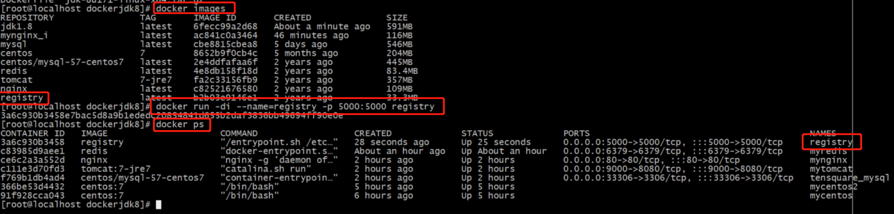

### 7.1.3  查看私有仓库

打开浏览器 输入地址http://192.168.188.130:5000/v2/_catalog看到{"repositories":[]} 表示私有仓库
搭建成功并且内容为空

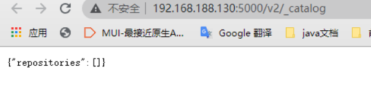

### 7.1.4 修改 daemon.json

```
vi /etc/docker/daemon.json
```

添加以下内容，保存退出。

```
"insecure-registries":["192.168.188.130:5000"]
```

此步用于让 docker信任私有仓库地址

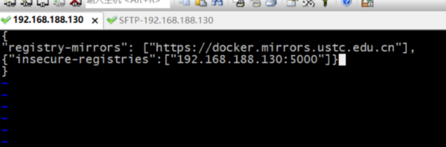

### 7.1.5 重启docker 服务

```
systemctl restart docker
```

## 7.2 镜像上传至私有仓库

### 7.2.1 标记此镜像为私有仓库的镜像

```
docker tag jdk1.8 192.168.188.130:5000/jdk1.8
```

多了镜像 id一样

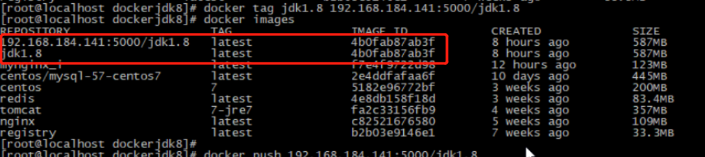

### 7.2.2 再次启动私服容器

```
docker start registry
```

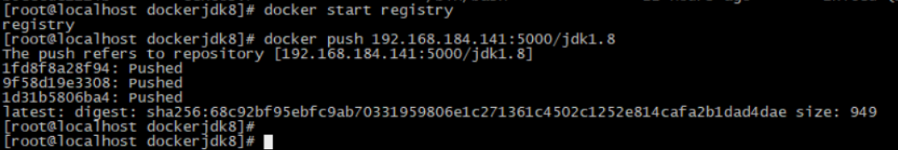

### 7.2.3 上传标记的镜像

```
docker push 192.168.188.130:5000/jdk1.8
```

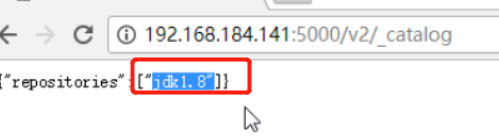

别的电脑信任 这个 配置信任这台机器 也可以下载

### 7.2.4 从私服拉取镜像到本地

网上的 没试过

```
获取私有仓库镜像
docker pull 192.168.188.130:5000/jdk1.8
对私有仓库的操作，其提供了HTTP API 地址为:https://docs.docker.com/registry/spec/api/

查看私服镜像所有仓库
curl http://192.168.188.130:5000/v2/_catalog

查看仓库中镜像的所有标签列表
curl http://localhost:5000/v2/java/tags/lis
————————————————
版权声明：本文为CSDN博主「DemonHunter211」的原创文章，遵循CC 4.0 BY-SA版权协议，转载请附上原文出处链接及本声明。
原文链接：https://blog.csdn.net/kwame211/article/details/87979397
```

