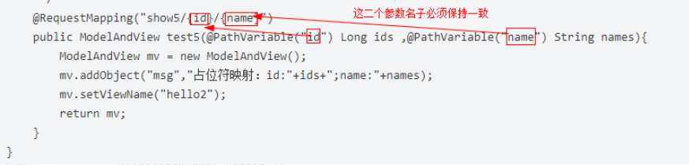

<h1 align = "center">SpringMvc</h1>

## 1. 注解

### 1.1  @ModelAttribute注解的作用

1. 用在方法的参数上

   注解在参数上，会将客户端传递过来的参数按名称注入到指定对象中，
   并且会将这个对象自动加入ModelMap中

   ```java
   @RequestMapping(value="/register")
   	public String register(@ModelAttribute User user,Model model) {
   		System.out.println(user.getBirthday());
   		model.addAttribute("user", user);
   		return "success";
   	}
   ```

   

2. 在Controller的方法上

   每次执行方法时都会先执行@ModelAttribute注解的方法
   如果有返回值，则自动将该返回值加入到ModelMap

```java
@ModelAttribute("top")
public Map top(){
    return pageTop.getDataMap();
}

@RequestMapping({"", "/", "/home"})
public String home(@RequestBody(required = false) Map<String, Object> param, Model model) {
    model.addAttribute("model", dataAssembly.homePageData(param));
    return "home";
}

```

### 1.2  @PathVariable注解使用

```java
@Controller
@RequestMapping("hello")
public class HelloController2 {
    /**
     *3、占位符映射
     * 语法：@RequestMapping(value=”user/{userId}/{userName}”)
     * 请求路径：http://localhost:8080/hello/show5/1/james
     * @param ids
     * @param names
     * @return
     */
    @RequestMapping("show5/{id}/{name}")
    public ModelAndView test5(@PathVariable("id") Long ids ,@PathVariable("name") String names){
        ModelAndView mv = new ModelAndView();
        mv.addObject("msg","占位符映射：id:"+ids+";name:"+names);
        mv.setViewName("hello2");
        return mv;
    }
}
```




