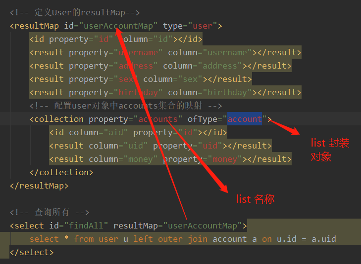

<h1 align = "center">Mybatis连接池与事务深入</h1>

# 1  Mybatis的连接池技术

Mybatis中也有连接池技术，但是它采用的是自己的连接池技术。在Mybatis的SqlMapConfig.xml配置文件中，通过<dataSource type="pooled">来实现Mybatis中连接池的配置。

## 1.1  Mybatis连接池的分类

在Mybatis中我们将它的数据源dataSource分为以下几类：


## 1.2 Mybatis中数据源的配置

```
我们的数据源配置就是在SqlMapConfig.xml文件中，具体配置如下： <!-- 配置数据源（连接池）信息 -->

<!--配置连接池-->
                <dataSource type="POOLED">
                    <property name="driver" value="${jdbc.driver}"></property>
                    <property name="url" value="${jdbc.url}"></property>
                    <property name="username" value="${jdbc.username}"></property>
                    <property name="password" value="${jdbc.password}"></property>
                </dataSource>
                
MyBatis在初始化时，根据<dataSource>的type属性来创建相应类型的的数据源DataSource，即： type=”POOLED”：MyBatis会创建PooledDataSource实例 type=”UNPOOLED” ： MyBatis会创建UnpooledDataSource实例 type=”JNDI”：MyBatis会从JNDI服务上查找DataSource实例，然后返回使用       
```

# 2. Mybatis的动态SQL语句

## 2.1  动态SQL之 <if> <where> 标签

```
<select id="findUserByCondition" resultMap="userMap" parameterType="user">
        select * from user
        <where>
            <if test="userName != null">
                and username = #{userName}
            </if>
            <if test="userSex != null">
                and sex = #{userSex}
            </if>
        </where>
    </select>
```

## 2.2 动态标签之<foreach>标签

```
<!-- 根据queryvo中的Id集合实现查询用户列表 -->
    <select id="findUserInIds" resultMap="userMap" parameterType="queryvo">
        <include refid="defaultUser"></include>
        <where>
            <if test="ids != null and ids.size()>0">
                <foreach collection="ids" open="and id in (" close=")" item="uid" 							separator=",">
                    	#{uid}
                </foreach>
            </if>
        </where>
    </select>
```

## 2.3 定义代码片段 抽取重复

```
<!-- 了解的内容：抽取重复的sql语句-->
    <sql id="defaultUser">
        select * from user
    </sql>
    
<!-- 查询所有 -->
    <select id="findAll" resultMap="userMap">
        <include refid="defaultUser"></include>
    </select>    
```

# 3. Mybatis 多表查询

配置文件 配置了别名

```
<?xml version="1.0" encoding="UTF-8"?>
<!DOCTYPE configuration
        PUBLIC "-//mybatis.org//DTD Config 3.0//EN"
        "http://mybatis.org/dtd/mybatis-3-config.dtd">
<configuration>
    <!-- 配置properties-->
    <properties resource="jdbcConfig.properties"></properties>

    <!--使用typeAliases配置别名，它只能配置domain中类的别名 -->
    <typeAliases>
        <package name="com.itheima.domain"></package>
    </typeAliases>

    <!--配置环境-->
    <environments default="mysql">
        <!-- 配置mysql的环境-->
        <environment id="mysql">
            <!-- 配置事务 -->
            <transactionManager type="JDBC"></transactionManager>

            <!--配置连接池-->
            <dataSource type="POOLED">
                <property name="driver" value="${jdbc.driver}"></property>
                <property name="url" value="${jdbc.url}"></property>
                <property name="username" value="${jdbc.username}"></property>
                <property name="password" value="${jdbc.password}"></property>
            </dataSource>
        </environment>
    </environments>
    <!-- 配置映射文件的位置 -->
    <mappers>
        <package name="com.itheima.dao"></package>
    </mappers>
</configuration>
```

## 3.1  一对一查询(多对一)

```
<!-- 定义封装account和user的resultMap -->
    <resultMap id="accountUserMap" type="account">
        <id property="id" column="aid"></id>
        <result property="uid" column="uid"></result>
        <result property="money" column="money"></result>
        <!-- 一对一的关系映射：配置封装user的内容-->
        <association property="user" column="uid" javaType="user">
            <id property="id" column="id"></id>
            <result column="username" property="username"></result>
            <result column="address" property="address"></result>
            <result column="sex" property="sex"></result>
            <result column="birthday" property="birthday"></result>
        </association>
    </resultMap>

    <!-- 查询所有 -->
    <select id="findAll" resultMap="accountUserMap">
        select u.*,a.id as aid,a.uid,a.money from account a , user u where u.id = a.uid;
    </select>
```


主表


从表


## 3.2 一对多查询




## 3.3 多对多

实体类


接口


xml    sql语句


