ss

# 1. 配置文件

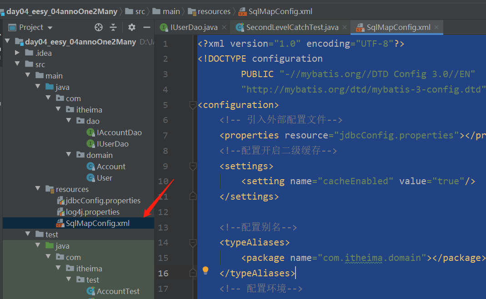

```
<?xml version="1.0" encoding="UTF-8"?>
<!DOCTYPE configuration
        PUBLIC "-//mybatis.org//DTD Config 3.0//EN"
        "http://mybatis.org/dtd/mybatis-3-config.dtd">
<configuration>
    <!-- 引入外部配置文件-->
    <properties resource="jdbcConfig.properties"></properties>
    <!--配置开启二级缓存-->
    <settings>
        <setting name="cacheEnabled" value="true"/>
    </settings>

    <!--配置别名-->
    <typeAliases>
        <package name="com.itheima.domain"></package>
    </typeAliases>
    <!-- 配置环境-->
    <environments default="mysql">
        <environment id="mysql">
            <transactionManager type="JDBC"></transactionManager>
            <dataSource type="POOLED">
                <property name="driver" value="${jdbc.driver}"></property>
                <property name="url" value="${jdbc.url}"></property>
                <property name="username" value="${jdbc.username}"></property>
                <property name="password" value="${jdbc.password}"></property>
            </dataSource>
        </environment>
    </environments>
    <!-- 指定带有注解的dao接口所在位置 -->
    <mappers>
       <package name="com.itheima.dao"></package>
    </mappers>
</configuration>
```

# 2. Mybatis注解开发

## 2.1 mybatis的常用注解说明

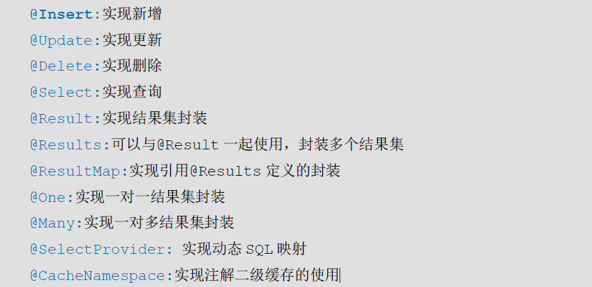

## 2.2  使用Mybatis注解实现基本CRUD

### 2.2.1 编写实体类

### 2.2.2 使用注解方式开发持久层接口

```

import org.apache.ibatis.annotations.Delete;
import org.apache.ibatis.annotations.Insert;
import org.apache.ibatis.annotations.Select;
import org.apache.ibatis.annotations.Update;

import java.util.List;

/**
 * 在mybatis中针对,CRUD一共有四个注解
 *  @Select @Insert @Update @Delete
 */
public interface IUserDao {

    /**
     * 查询所有用户
     * @return
     */
    @Select("select * from user")
    List<User> findAll();

    /**
     * 保存用户
     * @param user
     */
    @Insert("insert into user(username,address,sex,birthday)values(#{username},#{address},#{sex},#{birthday})")
    void saveUser(User user);

    /**
     * 更新用户
     * @param user
     */
    @Update("update user set username=#{username},sex=#{sex},birthday=#{birthday},address=#{address} where id=#{id}")
    void updateUser(User user);

    /**
     * 删除用户
     * @param userId
     */
    @Delete("delete from user where id=#{id} ")
    void deleteUser(Integer userId);

    /**
     * 根据id查询用户
     * @param userId
     * @return
     */
    @Select("select * from user  where id=#{id} ")
    User findById(Integer userId);

    /**
     * 根据用户名称模糊查询
     * @param username
     * @return
     */
//    @Select("select * from user where username like #{username} ")
    @Select("select * from user where username like '%${value}%' ")
    List<User> findUserByName(String username);

    /**
     * 查询总用户数量
     * @return
     */
    @Select("select count(*) from user ")
    int findTotalUser();
}

```

### 2.2.3  编写SqlMapConfig 配置文件

```
<?xml version="1.0" encoding="UTF-8"?>
<!DOCTYPE configuration
        PUBLIC "-//mybatis.org//DTD Config 3.0//EN"
        "http://mybatis.org/dtd/mybatis-3-config.dtd">
<configuration>
    <!-- 引入外部配置文件-->
    <properties resource="jdbcConfig.properties"></properties>
    <!--配置别名-->
    <typeAliases>
        <package name="com.itheima.domain"></package>
    </typeAliases>
    <!-- 配置环境-->
    <environments default="mysql">
        <environment id="mysql">
            <transactionManager type="JDBC"></transactionManager>
            <dataSource type="POOLED">
                <property name="driver" value="${jdbc.driver}"></property>
                <property name="url" value="${jdbc.url}"></property>
                <property name="username" value="${jdbc.username}"></property>
                <property name="password" value="${jdbc.password}"></property>
            </dataSource>
        </environment>
    </environments>
    <!-- 指定带有注解的dao接口所在位置 -->
    <mappers>
        <mapper class="com.itheima.dao.IUserDao"></mapper>
    </mappers>
</configuration>
```

## 2.3 使用注解实现复杂关系映射开发

实现复杂关系映射之前我们可以在映射文件中通过配置<resultMap>来实现，在使用注解开发时我们需要借助@Results注解，@Result注解，@One注解，@Many注解。

### 2.3.1 复杂关系映射的注解说明

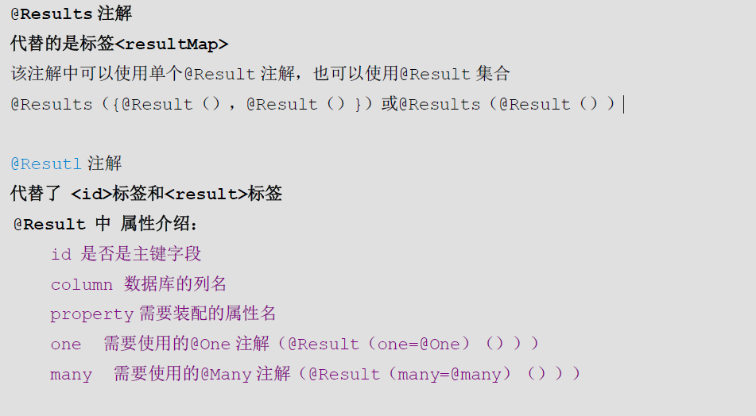

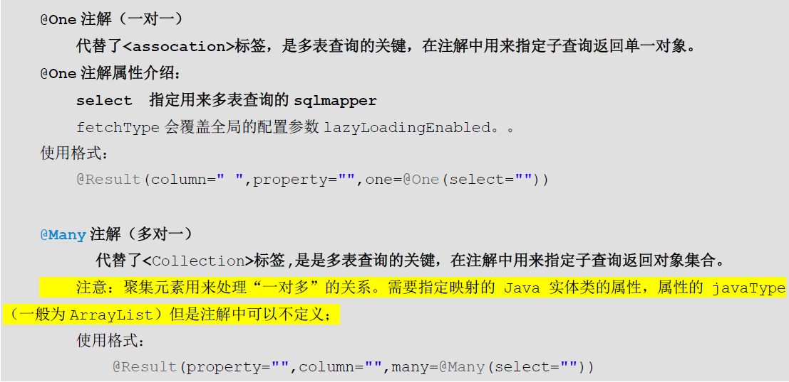

第一行是sql 

第二行 解决实体类和数据库名称不对应    id属性可以让它重复使用

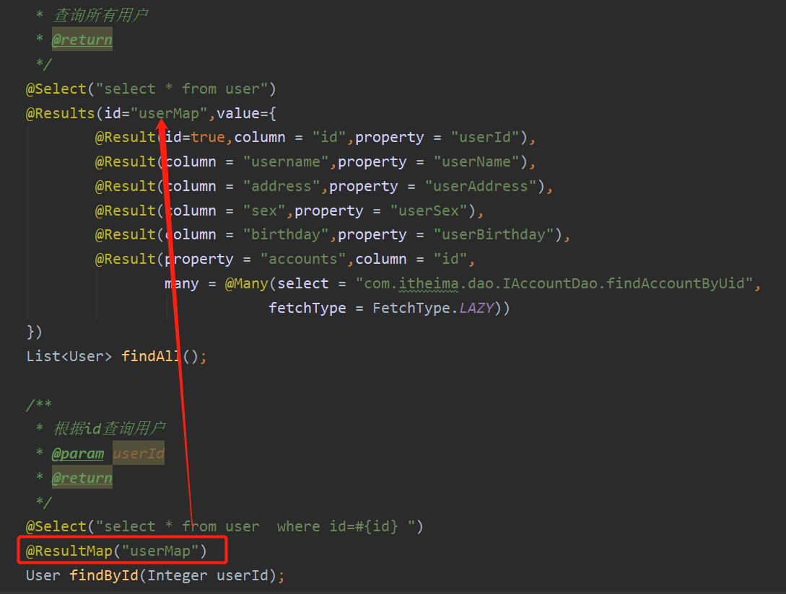

### 2.3.2  使用注解实现一对一复杂关系映射及延迟加载

需求： 加载账户信息时并且加载该账户的用户信息，根据情况可实现延迟加载。（注解方式实现）

#### 2.3.2.1 添加User实体类及Account实体类

User

```
package com.itheima.domain;

import java.io.Serializable;
import java.util.Date;
import java.util.List;

public class User implements Serializable{

    private Integer userId;
    private String userName;
    private String userAddress;
    private String userSex;
    private Date userBirthday;

    //一对多关系映射：一个用户对应多个账户
    private List<Account> accounts;

    public List<Account> getAccounts() {
        return accounts;
    }

    public void setAccounts(List<Account> accounts) {
        this.accounts = accounts;
    }

    public Integer getUserId() {
        return userId;
    }

    public void setUserId(Integer userId) {
        this.userId = userId;
    }

    public String getUserName() {
        return userName;
    }

    public void setUserName(String userName) {
        this.userName = userName;
    }

    public String getUserAddress() {
        return userAddress;
    }

    public void setUserAddress(String userAddress) {
        this.userAddress = userAddress;
    }

    public String getUserSex() {
        return userSex;
    }

    public void setUserSex(String userSex) {
        this.userSex = userSex;
    }

    public Date getUserBirthday() {
        return userBirthday;
    }

    public void setUserBirthday(Date userBirthday) {
        this.userBirthday = userBirthday;
    }

    @Override
    public String toString() {
        return "User{" +
                "userId=" + userId +
                ", userName='" + userName + '\'' +
                ", userAddress='" + userAddress + '\'' +
                ", userSex='" + userSex + '\'' +
                ", userBirthday=" + userBirthday +
                '}';
    }
}
```

Account

```
package com.itheima.domain;

import java.io.Serializable;


public class Account implements Serializable {

    private Integer id;
    private Integer uid;
    private Double money;

    //多对一（mybatis中称之为一对一）的映射：一个账户只能属于一个用户
    private User user;

    public User getUser() {
        return user;
    }

    public void setUser(User user) {
        this.user = user;
    }

    public Integer getId() {
        return id;
    }

    public void setId(Integer id) {
        this.id = id;
    }

    public Integer getUid() {
        return uid;
    }

    public void setUid(Integer uid) {
        this.uid = uid;
    }

    public Double getMoney() {
        return money;
    }

    public void setMoney(Double money) {
        this.money = money;
    }

    @Override
    public String toString() {
        return "Account{" +
                "id=" + id +
                ", uid=" + uid +
                ", money=" + money +
                '}';
    }
}

```

#### 2.3.2.2 添加账户的持久层接口并使用注解配置

##### 2.3.2.2.1    一对一注解

IAccountDao 接口   Account 表

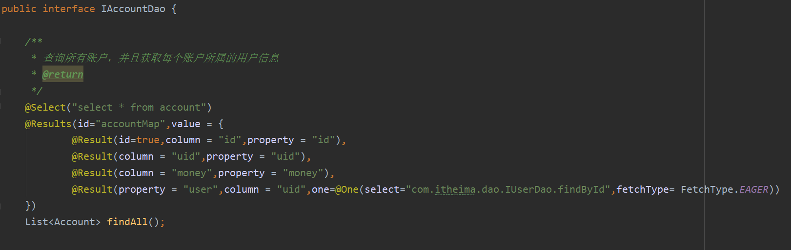

IUserDao 接口   User表

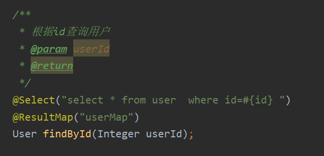

##### 2.3.2.2.2  一对多注解

IUserDao 接口   User表

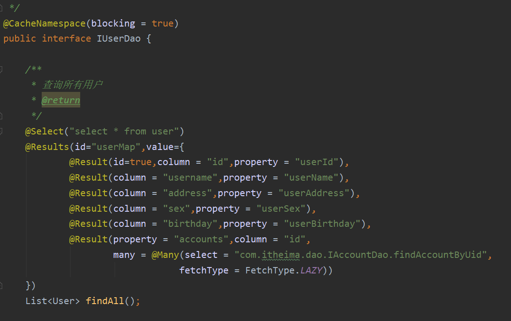

IAccountDao 接口   Account 表

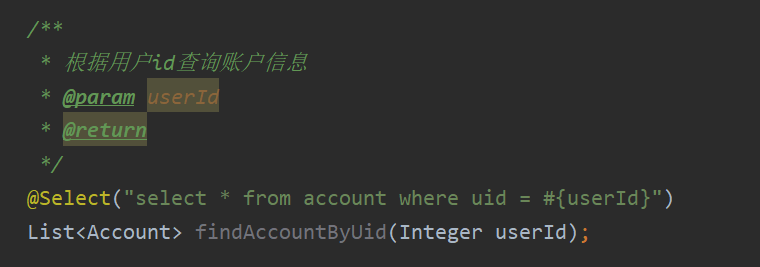


## 2.4 mybatis基于注解的二级缓存

### 2.4.1 在SqlMapConfig中开启二级缓存支持

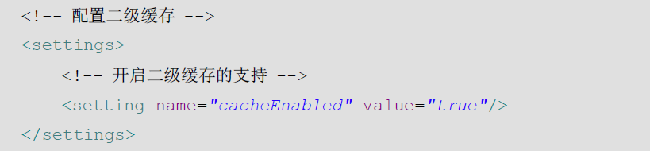

### 2.4.2 在持久层接口中使用注解配置二级缓存

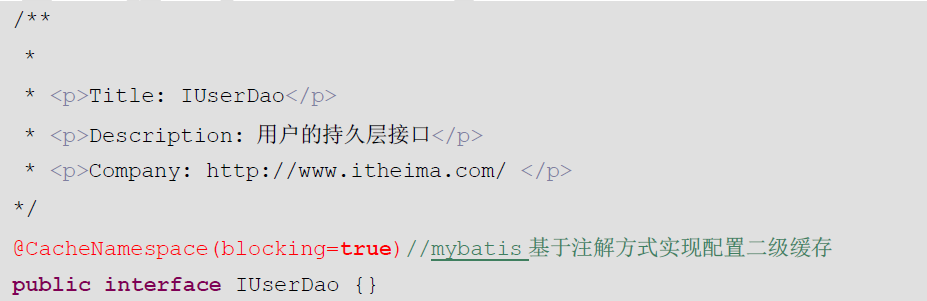

