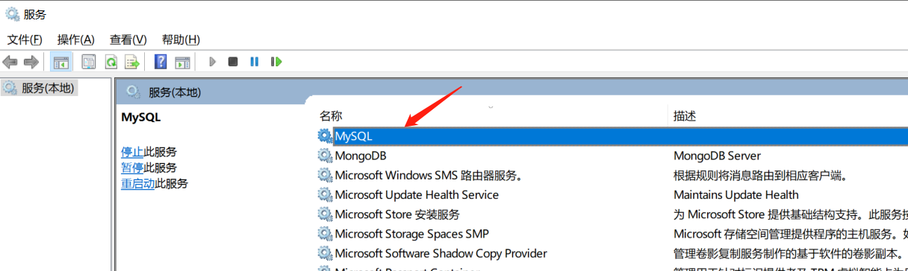
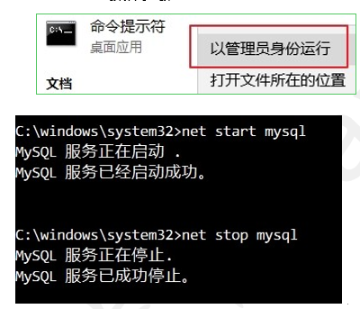
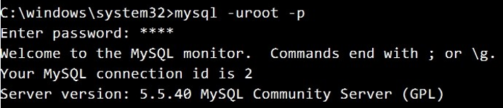
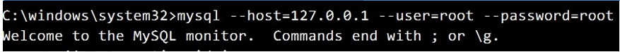
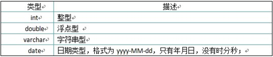
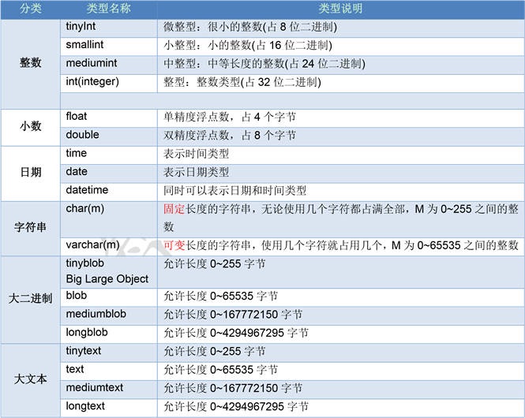

<h1 align = "center">Mysql基础</h1>

## 1. 数据库介绍

### 1.1 数据库概述

#### 1.1.1 数据的存储方式 

Java 中创建对象： Student s = new Student(1, "张三") 存在内存中学习了 Java IO 流：把数据保存到文件中 


#### 1.1.2 什么是数据库

​	1.存储数据的仓库 

​	2.本质上是一个文件系统，还是以文件的方式存在服务器的电脑上的。 

​	3.所有的关系型数据库都可以使用通用的 SQL 语句进行管理 DBMS DataBase Management System

### 1.2 数据库服务的启动与登录

MySQL 服务器启动方式有两种：

1)   通过服务的方式自动启动 

2)   手动启动的方式 

#### 1.2.1  Windows 服务方式启动

快捷键：win+R键，打开运行，在输入框中输入：services.msc，确定打开。



#### 1.2.2 命令方式启动

```
net start mysql: 启动mysql的服务
net stop mysql:   关闭mysql服务
```



#### 1.2.3 连接数据库

MySQL 是一个需要账户名密码登录的数据库，登陆后使用，它提供了一个默认的 root 账号，使用安装时设置的密码即可登录 

##### 1.2.3.1 mysql -u用户名 -p密码 

```mysql
mysql -uroot -p密码
```

##### 1.2.3.2 后输入密码方式：

```
 mysql -hip -uroot -p连接目标的密码
```



##### 1.2.3.3 mysql --host=ip地址 --user=用户名 --password=密码 

```
mysql --host=ip --user=root --password=连接目标的密码
```



##### 1.2.3.4 退出 MySQL 

```
quit或exit 
```

##### 1.2.3.5    数据库的卸载

如果安装mysql有问题,卸载 MySQL,重装 MySQL

 停止 window 的 MySQL 服务。 找到“控制面板”-> “管理工具”-> “服务”，停止 MySQL 后台服务。

## 2. DDL  操作数据库

### 2.1 创建数据库

#### 2.1.1 创建数据库的种方式 

1. 创建数据库

```mysql
CREATE DATABASE 数据库名;
```

2. 判断数据库是否已经存在，不存在则创建数据库 

```mysql
CREATE DATABASE IF NOT EXISTS 数据库名;
```

3. 创建数据库并指定字符集

```mysql
CREATE DATABASE 数据库名 CHARACTER SET 字符集; 
```

4. 具体操作

   ```mysql
   -- 直接创建数据库db1 
   create database db1; 
    
   -- 判断是否存在，如果不存在则创建数据库db2 
   create database if not exists db2; 
    
   -- 创建数据库并指定字符集为gbk 
   create database db3 default character set gbk; 
   ```

### 2.2 查看数据库

按 tab 键可以自动补全关键字 

```mysql
-- 查看所有的数据库  
show databases; 
-- 查看某个数据库的定义信息 
show create database db3; show create database db1; 
```

### 2.3 修改数据库 

```mysql
 修改数据库默认的字符集 
ALTER DATABASE 数据库名 DEFAULT CHARACTER SET 字符集; 
 db3 数据库的字符集改成 utf8 
alter database db3 character set utf8; 
```

### 2.4 删除数据库 

```mysql
删除数据库 
删除数据库的语法 
DROP DATABASE 数据库名; 
每行 SQL 语句需要选中再执行，可以按 F9 
删除 db2 数据库 
drop database db2; 
```

### 2.5  使用数据库 

#### 2.5.1  查看正在使用的数据库 

```mysql
-- 查看正在使用的数据库 
select database(); 
```

#### 2.5.2 使用/切换数据库  

```mysql
-- 改变要使用的数据库 
use db4; 
```

## 3. DDL 操作表结构

####  3.1 创建表 

##### 3.1.1 创建表的格式 

```mysql
CREATE TABLE 表名 ( 字段名 1 字段类型 1,  字段名 2 字段类型 2 );
```

##### 3.1.2 关键字说明

| **创建表的关键字** | **说明** |
| ------------------ | -------- |
| **CREATE**         | 创建     |
| **TABLE**          | 表       |

#### 3.2 MySQL 数据类型  

##### 3.2.1 常使用的数据类型如下



##### 3.2.1  详细的数据类型如下 



##### 3.2.3具体操作

创建 student 表包含 id,name,birthday 字段 

```mysql
create table student ( 
 	id int,  -- 整数  
    name varchar(20),  -- 字符串  
    birthday date -- 生日，最后没有逗号 
); 
```

#### 3.3查看表 

##### 3.3.1 查看某个数据库中所有表 

```mysql
SHOW TABLES; 
```

##### 3.3.2 查看表结构

```mysql
DESC 表名; 
```

#####  3.3.3 查看创建表的 SQL 语句

```mysql
SHOW CREATE TABLE 表名; 
```

#####  3.3.4  具体操作

```mysql
查看 day21 数据库中的所有表
use day21; 
show tables; 
查看 student 表的结构 
desc student; 
查看 student 的创建表 SQL 语句 
show create table student; 
执行结果： 存在的目的是为了避免关键字的冲突 
CREATE TABLE `student` ( 
  `id` int(11) DEFAULT NULL, 
  `name` varchar(20) DEFAULT NULL, 
  `birthday` date DEFAULT NULL ) ENGINE=InnoDB DEFAULT CHARSET=utf8 
```

####  3.4 快速创建一个表结构相同的表 

```mysql
CREATE TABLE 新表名 LIKE 旧表名; 
```

#### 3.5 删除表 

```mysql
直接删除表 
DROP TABLE 表名; 
判断表是否存在，如果存在则删除表  
DROP TABLE IF EXISTS 表名; 
```

#### 3.6 修改表结构

```mysql
添加表列 ADD 
ALTER TABLE 表名 ADD 列名 类型; 
alter table student add remark varchar(20);
修改列类型 MODIFY 
ALTER TABLE 表名 MODIFY列名 新的类型; 
alter table student modify remark varchar(100); 
修改列名 CHANGE
ALTER TABLE 表名 CHANGE 旧列名 新列名 类型; 
删除列 DROP
ALTER TABLE 表名 DROP 列名; 
修改表名 
RENAME TABLE 表名 TO 新表名; 
修改字符集 character set 
ALTER TABLE 表名 character set 字符集; 
```

## 4. DML 操作表中的数据

###  4.1  插入记录

```mysql
插入全部字段，所有的字段名都写出来  
INSERT INTO 表名 (字段名1, 字段名2, 字段名3…) VALUES (值1, 值2, 值3);
不写字段名  
INSERT INTO 表名 VALUES (值1, 值2, 	值3…); 
插入部分数据 	
INSERT INTO 表名 (字段名1, 字段名2, 	...) VALUES (值1, 值2, ...); 
注：没有添加数据的字段会使用 NULL 
```

### 4.2 更新表记录

UPDATE 表名 SET 列名=值 [WHERE 条件表达式]  
UPDATE: 需要更新的表名 
SET: 修改的列值 
WHERE: 符合条件的记录才更新 
你可以同时更新一个或多个字段。 
你可以在 WHERE 子句中指定任何条件。 

```mysql
不带条件修改数据  
UPDATE 表名 SET 字段名=值;  -- 修改所有的行 
带条件修改数据  
UPDATE 表名 SET 字段名=值 WHERE 字段名=值; 
```

### 4.3  删除表记录 

DELETE FROM 表名 [WHERE 条件表达式] 
如果没有指定 WHERE 子句，MySQL 表中的所有记录将被删除。 
你可以在 WHERE 子句中指定任何条件 

```mysql
不带条件删除数据  
DELETE FROM 表名; 
带条件删除数据  
DELETE FROM 表名 WHERE 字段名=值; 
使用 truncate 删除表中所有记录  
TRUNCATE TABLE 表名; 
```

truncate 和 delete 的区别： truncate 相当于删除表的结构，再创建一张表

##  5. DQL 查询表中的数据

### 5.1 简单查询

SELECT 列名 FROM 表名 [WHERE 条件表达式]  
1)	SELECT 命令可以读取一行或者多行记录。 
2)	你可以使用星号（*）来代替其他字段，SELECT 语句会返回表的所有字段数据 
3)	你可以使用 WHERE 语句来包含任何条件。

```mysql
select 
		字段列表
from
		表名列表
where
		条件列表
group by 
		分组字段
having
		分组之后的条件
order by
		排序
limit
		分页限定
```


```mysql
使用*表示所有列  
SELECT * FROM 表名; 
查询指定列,查询指定列的数据,多个列之间以逗号分隔  
SELECT 字段名1, 字段名2, 字段名3, ... FROM 表名; 
```

### 5.2 指定列的别名进行查询 

使用别名的好处： 显示的时候使用新的名字，并不修改表的结构。

```mysql
对列指定别名 
SELECT 字段名1 AS 别名, 字段名2 AS 	别名... FROM 表名; 
对列和表同时指定别名 	
SELECT 字段名1 AS 别名, 字段名2 AS 	别名... FROM 表名 AS 表别名; 
```

表使用别名的原因：用于多表查询操作 

### 5.3 清除重复值 

```mysql
查询指定列并且结果不出现重复数据 
SELECT DISTINCT 字段名 FROM 表名; 
```

### 5.4 查询结果参与运算           

```mysql
某列数据和固定值运算  
SELECT 列名+固定值 FROM 表名; 
某列数据和其他列数据参与运算  
```

```mysql
给所有的数学加 5 分 
select math+5 from student; 
-- 查询 math + english 的和 select * from student; 
select *,(math+english) as 总成绩 from student; 
-- as 可以省略 
select *,(math+english) 总成绩 from student; 
如果english存在 null ,使用IFNULL, 第一个是列表名，第二个是替代null的值
select math + IFNULL(english,0)  from student; 
```

### 5.5 条件查询 

####  5.5.1 条件查询的语法 

```
SELECT 字段名 FROM 表名 WHERE 条件; 
```

##### 5.5.5.1 运算符 

| **比较运算符**          | **说明**                                                     |
| ----------------------- | ------------------------------------------------------------ |
| **>、<、<=、>=、=、<>** | <>在 SQL 中表示不等于，在 mysql 中也可以使用!= 没有==        |
| **BETWEEN...AND**       | 在一个范围之内，如：between  100 and 200 相当于条件在 100 到 200 之间，包头又包尾 |
| **IN(集合)**            | 集合表示多个值，使用逗号分隔                                 |
| **LIKE '张%'**          | 模糊查询                                                     |
| **IS NULL**             | 查询某一列为 NULL 的值，注：不能写=NULL                      |

##### 5.5.5.2 逻辑运算符 

| **逻辑运算符**          | **说明**                               |
| ----------------------- | -------------------------------------- |
| **and** **或**  **&&**  | 与，SQL 中建议使用前者，后者并不通用。 |
| **or** **或**  **\|\|** | 或                                     |
| **not** **或**  **!**   | 非                                     |

##### 5.5.5.3 in 关键字  

```mysql
SELECT 字段名 FROM 表名 WHERE 字段 in (数据 1, 数据 2...); 
in 里面的每个数据都会作为一次条件，只要满足条件的就会显示 
-- 查询id是1或3或5的学生 
select * from student3 where id in(1,3,5); 
 
-- 查询id不是1或3或5的学生 
select * from student3 where id not in(1,3,5); 
```

##### 5.5.5.4 范围查询 

```mysql
范围查询 
BETWEEN 值 1 AND 值 2 
表示从值 1 到值 2 范围，包头又包尾 
比如：age BETWEEN 80 AND 100 相当于： age>=80 && age<=100 
```

##### 5.5.5.5 like 关键字

```
LIKE 表示模糊查询 
SELECT * FROM 表名 WHERE 字段名 LIKE '通配符字符串'; 
```

| MYSQL 通配符 | 说明               |
| ------------ | ------------------ |
| %            | 匹配任意多个字符串 |
| _            | 匹配一个字符       |

```mysql
-- 查询姓名中以'德'字开头的学生 
select * from student3 where name like '德%'; 
-- 查询姓名中以'德'字结尾的学生 
select * from student3 where name like '%德'; 
-- 查询姓名中包含'德'字的学生 
select * from student3 where name like '%德%'; 
 
-- 查询姓马，且姓名有两个字的学生 
select * from student3 where name like '马_';
```

##### 5.5.5.6  IS NULL  &  **IS NOT NULL**   的使用

```mysql
错误写法:  在mysql中, NULL 不可以使用 =  和 != 进行判断 
select * from student where english = NULL;
查询英语成绩是 null 的学生
select * from student where english  IS NULL ;
查询英语成绩不是 null 的学生
select * from student where english  IS NOT NULL ;
```


