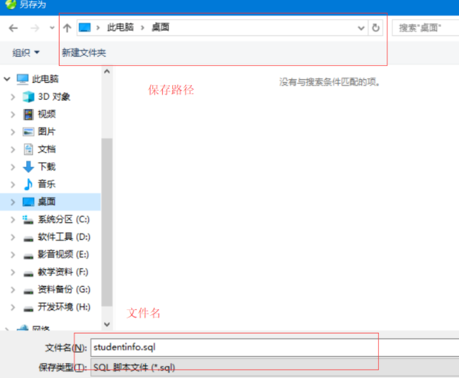
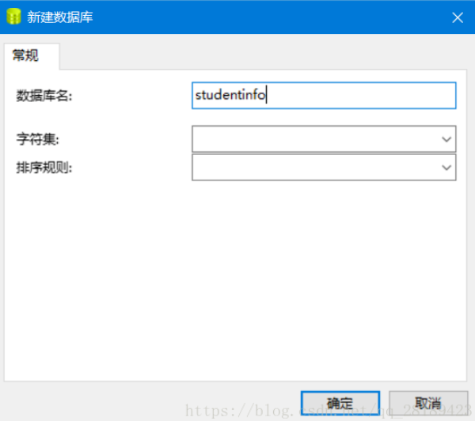

<h1 align = "center">MySQL约束</h1>

## 1. DQL:查询语句

### 1.1 排序查询	order by

```mysql
- 语法：order by 子句
  - order by 排序字段1 排序方式1 ，  排序字段2 排序方式2...
- 排序方式：
  - ASC：升序，默认的。
  - DESC：降序。
- 注意：
  - 如果有多个排序条件，则当前边的条件值一样时，才会判断第二条件。
```

### 1.2 聚合函数

```mysql
聚合函数：将一列数据作为一个整体，进行纵向的计算。

1. count：计算个数
   1. 一般选择非空的列：主键, null不纳入计算
   2. count(*)
2. max：计算最大值
3. min：计算最小值
4. sum：计算和
5. avg：计算平均值
* 注意：聚合函数的计算，排除null值。
		解决方案：
			1. 选择不包含非空的列进行计算
			2. IFNULL函数   例如: IFNULL(age,0) age为null,以0代替
```

### 1.3  分组查询  group by 

```mysql
1. 语法：group by 分组字段；
	2. 注意：
		1. 分组之后查询的字段：分组字段、聚合函数
		2. where 和 having 的区别？
			1. where 在分组之前进行限定，如果不满足条件，则不参与分组。having在分组之后进行限定，如果不满足结果，则不会被查询出来
			2. where 后不可以跟聚合函数，having可以进行聚合函数的判断。

		-- 按照性别分组。分别查询男、女同学的平均分
		SELECT sex , AVG(math) FROM student GROUP BY sex;
		
		-- 按照性别分组。分别查询男、女同学的平均分,人数
		SELECT sex , AVG(math),COUNT(id) FROM student GROUP BY sex;
		
		--  按照性别分组。分别查询男、女同学的平均分,人数 要求：分数低于70分的人，不参与分组
		SELECT sex , AVG(math),COUNT(id) FROM student WHERE math > 70 GROUP BY sex;
		
		--  按照性别分组。分别查询男、女同学的平均分,人数 要求：分数低于70分的人，不参与分组,分组之后。人数要大于2个人
		SELECT sex , AVG(math),COUNT(id) FROM student WHERE math > 70 GROUP BY sex HAVING COUNT(id) > 2;
		
		SELECT sex , AVG(math),COUNT(id) 人数 FROM student WHERE math > 70 GROUP BY sex HAVING 人数 > 2;
```

### 1.3  分页查询

```mysql
1. 语法：limit 开始的索引,每页查询的条数;
2. 公式：开始的索引 = （当前的页码 - 1） * 每页显示的条数
-- 每页显示3条记录 
   SELECT * FROM student LIMIT 0,3; -- 第1页
   SELECT * FROM student LIMIT 3,3; -- 第2页
   SELECT * FROM student LIMIT 6,3; -- 第3页
3. limit 是一个MySQL"方言"
```

## 2. 约束

* 概念： 对表中的数据进行限定，保证数据的正确性、有效性和完整性。	
* 分类：
	1. 主键约束：primary key
	2. 非空约束：not null
	3. 唯一约束：unique
	4. 外键约束：foreign key

### 2.1 非空约束：not null

某一列的值不能为null

```mysql
1. 创建表时添加约束
		CREATE TABLE stu(
			id INT,
			NAME VARCHAR(20) NOT NULL -- name为非空
		);
	2. 创建表完后，添加非空约束
		ALTER TABLE stu MODIFY NAME VARCHAR(20) NOT NULL;

	3. 删除name的非空约束
		ALTER TABLE stu MODIFY NAME VARCHAR(20);
```

### 2.2 唯一约束：unique

某一列的值不能重复

```mysql
1. 注意：
		* 唯一约束可以有NULL值，但是只能有一条记录为null
	2. 在创建表时，添加唯一约束
		CREATE TABLE stu(
			id INT,
			phone_number VARCHAR(20) UNIQUE -- 手机号
		);
	3. 删除唯一约束
		ALTER TABLE stu DROP INDEX phone_number;
	4. 在表创建完后，添加唯一约束
		ALTER TABLE stu MODIFY phone_number VARCHAR(20) UNIQUE;
```

### 2.3 主键约束：primary key

	1. 注意：
		1. 含义：非空且唯一
		2. 一张表只能有一个字段为主键
		3. 主键就是表中记录的唯一标识

```mysql
2. 在创建表时，添加主键约束
	create table stu(
		id int primary key,-- 给id添加主键约束
		name varchar(20)
	);

3. 删除主键
	-- 错误 alter table stu modify id int ;
	ALTER TABLE stu DROP PRIMARY KEY;

4. 创建完表后，添加主键
	ALTER TABLE stu MODIFY id INT PRIMARY KEY;

5. 自动增长：
	1.  概念：如果某一列是数值类型的，使用 auto_increment 可以来完成值得自动增长

	2. 在创建表时，添加主键约束，并且完成主键自增长
	create table stu(
		id int primary key auto_increment,-- 给id添加主键约束
		name varchar(20)
	);
	3. 删除自动增长
	ALTER TABLE stu MODIFY id INT;
	4. 添加自动增长
	ALTER TABLE stu MODIFY id INT AUTO_INCREMENT;
```
### 2.4 外键约束：foreign key

让表于表产生关系，从而保证数据的正确性

```mysql
1. 在创建表时，可以添加外键
	* 语法：
		create table 表名(
			....
			外键列
			constraint 外键名称 foreign key (外键列名称) references 主表名称(主表列名称)
		);
2. 删除外键
	ALTER TABLE 表名 DROP FOREIGN KEY 外键名称;
3. 创建表之后，添加外键
	ALTER TABLE 表名 ADD CONSTRAINT 外键名称 FOREIGN KEY (外键字段名称) REFERENCES 主表名称(主表列名称);
	
4. 级联操作
		1. 添加级联操作
			语法：ALTER TABLE 表名 ADD CONSTRAINT 外键名称 
					FOREIGN KEY (外键字段名称) REFERENCES 主表名称(主表列名称) ON UPDATE CASCADE ON DELETE CASCADE  ;
		2. 分类：
			1. 级联更新：ON UPDATE CASCADE 
			2. 级联删除：ON DELETE CASCADE 
```
## 3. 数据库的设计

### 3.1 多表之间的关系

```
1. 分类：
		1. 一对一(了解)：
			* 如：人和身份证
			* 分析：一个人只有一个身份证，一个身份证只能对应一个人
		2. 一对多(多对一)：
			* 如：部门和员工
			* 分析：一个部门有多个员工，一个员工只能对应一个部门
		3. 多对多：
			* 如：学生和课程
			* 分析：一个学生可以选择很多门课程，一个课程也可以被很多学生选择
2. 实现关系：
		1. 一对多(多对一)：
			* 如：部门和员工
			* 实现方式：在多的一方建立外键，指向一的一方的主键。
		2. 多对多：
			* 如：学生和课程
			* 实现方式：多对多关系实现需要借助第三张中间表。中间表至少包含两个字段，这两个字段作为第三张表的外键，分别指向两张表的主键
		3. 一对一(了解)：
			* 如：人和身份证
			* 实现方式：一对一关系实现，可以在任意一方添加唯一外键指向另一方的主键。			
```

## 4. 数据库的备份和还原

1. 命令行：

``` 
* 语法：
		* 备份： mysqldump -u用户名 -p密码 数据库名称 > 保存的路径
		* 还原：
			1. 登录数据库
			2. 创建数据库
			3. 使用数据库
			4. 执行文件。 source 文件路径
```

2. 图形化工具: Navicat

   1. 备份  打开数据库

      

   2. 右键->转储SQL文件



​			

3.  恢复  

右键，新建数据库。输入数据库名字，字符集和排序规则保持为空即可



4. 双击打开数据库后，右键->运行SQL文件

5. 恢复完成。打开数据库，检查数据。（检查之前刷新数据库，刷新表）