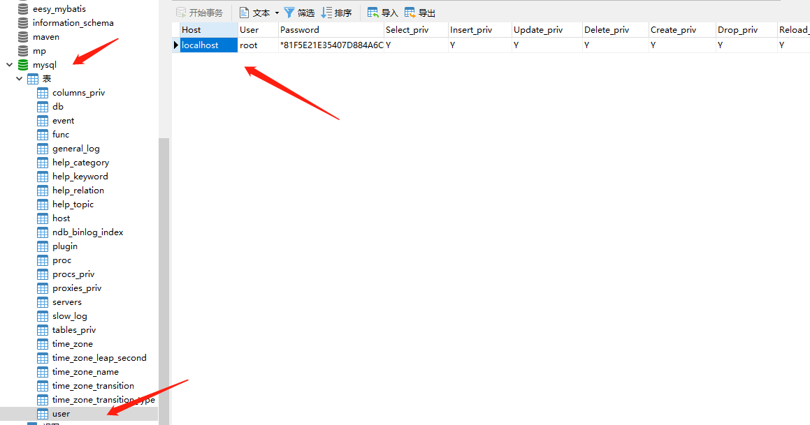

<h1 align = "center">Mysql多表&事务</h1>

## 1. 多表查询

### 1.1 查询语法

```mysql
	select
		列名列表
	from
		表名列表
	where....
```

### 1.2 多表查询的分类

#### 1.2.1 内连接查询

##### 1.2.1.1 隐式内连接

使用where条件消除无用数据

```mysql
SELECT 
		t1.name, -- 员工表的姓名
		t1.gender,-- 员工表的性别
		2.name -- 部门表的名称
FROM
		emp t1,
		dept t2
WHERE 
		t1.`dept_id` = t2.`id`;
```

##### 1.2.1.2  显式内连接

```mysql
* 语法： select 字段列表 from 表名1 [inner] join 表名2 on 条件
* 例如：
* SELECT * FROM emp INNER JOIN dept ON emp.`dept_id` = dept.`id`;	
* SELECT * FROM emp JOIN dept ON emp.`dept_id` = dept.`id`;	
```

####  1.2.2 外链接查询

##### 1.2.2.1 左外连接

```mysql
* 语法：select 字段列表 from 表1 left [outer] join 表2 on 条件；
* 例子： 会查询出左表所有的信息
-- 查询所有员工信息，如果员工有部门，则查询部门名称，没有部门，则不显示部门名称
SELECT 	t1.*,t2.`name` FROM emp t1 LEFT JOIN dept t2 ON t1.`dept_id` = t2.`id`;
```

##### 1.2.2.2  右外连接

```mysql
* 语法：select 字段列表 from 表1 right [outer] join 表2 on 条件；
* 查询的是右表所有数据以及其交集部分。
* 例子：
SELECT 	* FROM dept t2 RIGHT JOIN emp t1 ON t1.`dept_id` = t2.`id`;
```

#### 1.2.3 子查询

##### 1.2.3.1 概念

查询中嵌套查询，称嵌套查询为子查询

```mysql
-- 查询工资最高的员工信息
-- 1 查询最高的工资是多少 9000
SELECT MAX(salary) FROM emp;
-- 2 查询员工信息，并且工资等于9000的
SELECT * FROM emp WHERE emp.`salary` = 9000;
-- 一条sql就完成这个操作。子查询
SELECT * FROM emp WHERE emp.`salary` = (SELECT MAX(salary) FROM emp);
```

##### 1.2.3.2 子查询不同情况

###### 1.2.3.2.1  子查询的结果是单行单列的

```mysql
* 子查询可以作为条件，使用运算符去判断。 运算符： > >= < <= =
* 
-- 查询员工工资小于平均工资的人
SELECT * FROM emp WHERE emp.salary < (SELECT AVG(salary) FROM emp);
```

###### 1.2.3.2.2 子查询的结果是多行单列的：

```mysql
* 子查询可以作为条件，使用运算符 in 来判断
-- 查询'财务部'和'市场部'所有的员工信息
SELECT id FROM dept WHERE NAME = '财务部' OR NAME = '市场部';
SELECT * FROM emp WHERE dept_id = 3 OR dept_id = 2;
-- 子查询
SELECT * FROM emp WHERE dept_id IN (SELECT id FROM dept WHERE NAME = '财务部' OR NAME = '市场部');
```

###### 1.2.3.2.3 子查询的结果是多行多列的

```mysql
* 子查询可以作为一张虚拟表参与查询
-- 查询员工入职日期是2011-11-11日之后的员工信息和部门信息
-- 子查询
SELECT * FROM dept t1 ,(SELECT * FROM emp WHERE emp.`join_date` > '2011-11-11') t2
				WHERE t1.id = t2.dept_id;
				
-- 普通内连接
SELECT * FROM emp t1,dept t2 WHERE t1.`dept_id` = t2.`id` AND t1.`join_date` >  '2011-11-11'
```


## 2. 事务

### 2.1  事务的基本介绍

```mysql
	1. 概念：
		*  如果一个包含多个步骤的业务操作，被事务管理，那么这些操作要么同时成功，要么同时失败。
		
	2. 操作：
		1. 开启事务： start transaction;
		2. 回滚： rollback;
		3. 提交： commit;
	3. 例子：
		CREATE TABLE account (
			id INT PRIMARY KEY AUTO_INCREMENT,
			NAME VARCHAR(10),
			balance DOUBLE
		);
		-- 添加数据
		INSERT INTO account (NAME, balance) VALUES ('zhangsan', 1000), ('lisi', 1000);
	4. MySQL数据库中事务默认自动提交
		* 事务提交的两种方式：
			* 自动提交：
				* mysql 就是自动提交的
				* 一条 DML (增删改)语句会自动提交一次事务。
			* 手动提交：
				* Oracle 数据库默认是手动提交事务
				* 需要先开启事务，再提交
		* 修改事务的默认提交方式：
			* 查看事务的默认提交方式： SELECT @@autocommit; -- 1 代表自动提交  0 代表手动提交
			* 修改默认提交方式： set @@autocommit = 0;	
```

### 2.2 事务的四大特征

1. 原子性：是不可分割的最小操作单位，要么同时成功，要么同时失败。

2. 持久性：当事务提交或回滚后，数据库会持久化的保存数据。

3. 隔离性：多个事务之间。相互独立。

4. 一致性：事务操作前后，数据总量不变

### 2.3 事务的隔离级别（了解）

#### 2.3.1 概念

多个事务之间隔离的，相互独立的。但是如果多个事务操作同一批数据，则会引发一些问题，设置不同的隔离级别就可以解决这些问题。

#### 2.3.2 存在问题

1. 脏读：一个事务，读取到另一个事务中没有提交的数据
2. 不可重复读(虚读)：在同一个事务中，两次读取到的数据不一样。
3. 幻读：一个事务操作(DML)数据表中所有记录，另一个事务添加了一条数据，则第一个事务查询不到自己的修改。

#### 2.3.3 隔离级别

```mysql
1. read uncommitted：读未提交
	* 产生的问题：脏读、不可重复读、幻读
2. read committed：读已提交 （Oracle）
	* 产生的问题：不可重复读、幻读
3. repeatable read：可重复读 （MySQL默认）
	* 产生的问题：幻读
4. serializable：串行化
	* 可以解决所有的问题

	* 注意：隔离级别从小到大安全性越来越高，但是效率越来越低
	* 数据库查询隔离级别：
		* select @@tx_isolation;
	* 数据库设置隔离级别：
		* set global transaction isolation level  级别字符串;
```

## 3. DCL

#### 3.1  SQL分类

1. DDL：操作数据库和表

2. DML：增删改表中数据

3. DQL：查询表中数据

4. DCL：管理用户，授权

#### 3.2  DBA：数据库管理员

#### 3.3  DCL：管理用户，授权

##### 3.3.1  管理用户 

```mysql
1. 添加用户：
		* 语法： CREATE USER '用户名'@'主机名' IDENTIFIED BY '密码';
2. 删除用户：
		* 语法： DROP USER '用户名'@'主机名';
3. 修改用户密码：
		UPDATE USER SET PASSWORD = PASSWORD('新密码') WHERE USER = '用户名';
		UPDATE USER SET PASSWORD = PASSWORD('abc') WHERE USER = 'lisi';
			
		SET PASSWORD FOR '用户名'@'主机名' = PASSWORD('新密码');
		SET PASSWORD FOR 'root'@'localhost' = PASSWORD('123');
4. 查询用户：
		-- 1. 切换到mysql数据库
		USE myql;
		-- 2. 查询user表
		SELECT * FROM USER;
		* 通配符： % 表示可以在任意主机使用用户登录数据库
```

##### 3.3.2  mysql中忘记了root用户的密码

```mysql
* mysql中忘记了root用户的密码？
		1. cmd -- > net stop mysql 停止mysql服务
					* 需要管理员运行该cmd, 需要以管理员方式启动cmd

		2. 使用无验证方式启动mysql服务： mysqld --skip-grant-tables
		3. 打开新的cmd窗口,直接输入mysql命令，敲回车。就可以登录成功
		4. use mysql;  准备重新修改user表中的用户密码
		5. update user set password = password('你的新密码') where user = 'root'; 
		6. 关闭两个窗口
		7. 打开任务管理器，手动结束mysqld.exe 的进程
		8. 启动mysql服务, 需要以管理员方式启动cmd 
		   执行  net start mysql
		9. 使用新密码登录。
```

用户信息在 mysql 数据库下面的 user 表中



##### 3.3.3 权限管理

```mysql
1. 查询权限：
	-- 查询权限
	SHOW GRANTS FOR '用户名'@'主机名';
	SHOW GRANTS FOR 'lisi'@'%';

2. 授予权限：
	-- 授予权限
	grant 权限列表 on 数据库名.表名 to '用户名'@'主机名';
	-- 给张三用户查询权限,修改权限,删除权限，在 db3数据库 的accoumt 表上
	GRANT SELECT, UPDATE, DELETE ON db3.accoumt TO 'zhangsan'@'localhost';
	-- 给张三用户授予所有权限，在任意数据库任意表上
	GRANT ALL ON *.* TO 'zhangsan'@'localhost';
	
3. 撤销权限：
	-- 撤销权限：
	revoke 权限列表 on 数据库名.表名 from '用户名'@'主机名';
	REVOKE UPDATE ON db3.`account` FROM 'lisi'@'%';		
```

