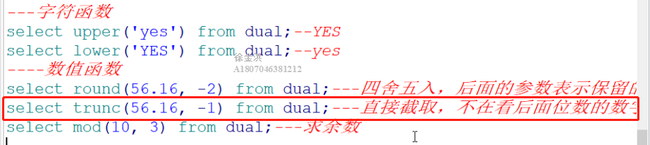
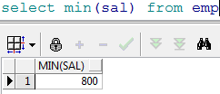

<h1 align = "center">Oracle基础</h1>

# 1. oracle介绍[了解]

​		ORACLE数据库系统是美国ORACLE公司（甲骨文）提供的以分布式数据库为核心的一组软件产品，是目前最流行的客户/服务器(CLIENT/SERVER)或B/S体系结构的数据库之一。比如SilverStream就是基于数据库的一种中间件。ORACLE数据库是目前世界上使用最为广泛的数据库管理系统，作为一个通用的数据库系统，它具有完整的数据管理功能；作为一个关系数据库，它是一个完备关系的产品；作为分布式数据库它实现了分布式处理功能。但它的所有知识，只要在一种机型上学习了ORACLE知识，便能在各种类型的机器上使用它。

# 2. Oracle安装[了解]

请参考文档《Oracle安装.docx》  在f盘软件安装包

# 3.  Oracle体系结构[理解]


## 3.1  数据库

Oracle数据库是数据的物理存储。这就包括（数据文件ORA或者DBF、控制文件、联机日志、参数文件）。其实Oracle数据库的概念和其它数据库不一样，这里的数据库是一个操作系统只有一个库。可以看作是Oracle就只有一个大数据库。

## 3.2 实例

一个Oracle实例（Oracle Instance）有一系列的后台进程（Backguound Processes)和内存结构（Memory Structures)组成。一个数据库可以有n个实例。

## 3.3  用户

用户是在实例下建立的。不同实例可以建相同名字的用户。

## 3.4  表空间

表空间是Oracle对物理数据库上相关数据文件（ORA或者DBF文件）的逻辑映射。一个数据库在逻辑上被划分成一到若干个表空间，每个表空间包含了在逻辑上相关联的一组结构。每个数据库至少有一个表空间(称之为system表空间)。

每个表空间由同一磁盘上的一个或多个文件组成，这些文件叫数据文件(datafile)。一个数据文件只能属于一个表空间。


## 3.5 数据文件（dbf、ora）

数据文件是数据库的物理存储单位。数据库的数据是存储在表空间中的，真正是在某一个或者多个数据文件中。而一个表空间可以由一个或多个数据文件组成，一个数据文件只能属于一个表空间。一旦数据文件被加入到某个表空间后，就不能删除这个文件，如果要删除某个数据文件，只能删除其所属于的表空间才行。

注： 表的数据，是有用户放入某一个表空间的，而这个表空间会随机把这些表数据放到一个或者多个数据文件中。

由于oracle的数据库不是普通的概念，oracle是有用户和表空间对数据进行管理和存放的。但是表不是有表空间去查询的，而是由用户去查的。因为不同用户可以在同一个表空间建立同一个名字的表！这里区分就是用户了！


# 4.  创建表空间[理解]

表空间？ ORACLE数据库的逻辑单元。

 数据库---表空间 一个表空间可以与多个数据文件（物理结构）关联
一个数据库下可以建立多个表空间，一个表空间可以建立多个用户、一个用户下可以建立多个表。

```
create tablespace itcast 
datafile 'c:\itcast.dbf' 
size 100m 
autoextend on 
next 10m
```

itcast 为表空间名称
datafile 指定表空间对应的数据文件
size 后定义的是表空间的初始大小
autoextend on 自动增长 ，当表空间存储都占满时，自动增长
next 后指定的是一次自动增长的大小。

# 5. 用户[理解]

## 5.1 创建用户

```
create user itcastuser 
identified by itcast 
default tablespace itcast

identified by 后边是用户的密码 
default tablespace 后边是表空间名称
oracle数据库与其它数据库产品的区别在于，表和其它的数据库对象都是存储在用户下的。
```

## 5.2  用户赋权限

新创建的用户没有任何权限，登陆后会提示


Oracle中已存在三个重要的角色：connect角色，resource角色，dba角色。

### 5.2.1  connect角色

```
CONNECT角色： --是授予最终用户的典型权利，最基本的

ALTER SESSION --修改会话
CREATE CLUSTER --建立聚簇
CREATE DATABASE LINK --建立数据库链接
CREATE SEQUENCE --建立序列
CREATE SESSION --建立会话
CREATE SYNONYM --建立同义词
CREATE VIEW --建立视图
```

### 5.2.2  resource角色

```
RESOURCE角色： --是授予开发人员的

CREATE CLUSTER --建立聚簇
CREATE PROCEDURE --建立过程
CREATE SEQUENCE --建立序列
CREATE TABLE --建表
CREATE TRIGGER --建立触发器
CREATE TYPE --建立类型
```

### 5.2.3  DBA角色

```
DBA角色：拥有全部特权，是系统最高权限，只有DBA才可以创建数据库结构，并且系统权限也需要DBA授出，且DBA用户可以操作全体用户的任意基表，包括删除
```

### 5.2.4  赋予权限

```
grant dba to itcastuser
```

进入system用户下给用户赋予dba权限，否则无法正常登陆

# 6.  Oracle数据类型[应用]


# 7. 表的管理[应用]

## 7.1   建表

语法：

```
create table 表名（
字段1 数据类型 [default 默认值],
字段2 数据类型 [default 默认值],
...
字段n 数据类型 [default 默认值]
）;
范例：创建person表 create table person( pid number(10), name varchar2(10), gender number(1) default 1, birthday date );
insert into person(pid, name, gender, birthday) values(1, '张三', 1, to_date('1999-12-22', 'yyyy-MM-dd'));
```

查看表结构


## 7.2 表删除

语法：DROP TABLE 表名

## 7.3  表的修改

在sql中使用alter可以修改表

```
	添加语法：ALTER TABLE 表名称 ADD(列名1 类型 [DEFAULT 默认值]，列名1 类型 [DEFAULT 默认值]...)
	
	修改语法：ALTER TABLE 表名称 MODIFY(列名1 类型 [DEFAULT 默认值]，列名1 类型 [DEFAULT 默认值]...)
	
	修改列名: ALTER TABLE 表名称 RENAME 列名1 TO 列名2
	
范例：在person表中增加列address alter table person add(address varchar2(10));
范例：把person表的address列的长度修改成20长度 alter table person modify(address varchar2(20));
```


## 7.4  数据库表数据的更新

### 7.4.1 INSERT（增加）

```
标准写法：
INSERT INTO表名[(列名1，列名2，...)]VALUES(值1，值2，...)
简单写法（不建议）
INSERT INTO 表名VALUES(值1，值2，...)
注意：使用简单的写法必须按照表中的字段的顺序来插入值，而且如果有为空的字段使用null
insert into person
values(2,'李四',1,null,'北京育新');
```

### 7.4.2 UPDATE（修改）

```
全部修改：UPDATE 表名 SET 列名1=值1，列名2=值2，....
局部修改：UPDATE 表名 SET 列名1=值1，列名2=值2，....WHERE 修改条件；
全部更新
局部更新
```

### 7.4.3 DELETE（删除）

```
语法 : DELETE FROM 表名 WHERE 删除条件;

在删除语句中如果不指定删除条件的话就会删除所有的数据
因为oracle的事务对数据库的变更的处理，我们必须做提交事务才能让数据真正的插入到数据库中，在同样在执行完数据库变更的操作后还可以把事务进行回滚，这样就不会插入到数据库。如果事务提交后则不可以再回滚。
提交：commit
回滚：rollback
```

## 7.5 序列

在很多数据库中都存在一个自动增长的列,如果现在要想在oracle 中完成自动增长的功能, 则只能依靠序列完成,所有的自动增长操作,需要用户手工完成处理。

```
语法：CREATE SEQUENCE 序列名
[INCREMENT BY n]
[START WITH n]
[{MAXVALUE/ MINVALUE n|NOMAXVALUE}]
[{CYCLE|NOCYCLE}]
[{CACHE n|NOCACHE}];
范例:创建一个seqpersonid的序列,验证自动增长的操作 CREATE SEQUENCE seqpersonid;
序列创建完成之后,所有的自动增长应该由用户自己处理,所以在序列中提供了以下的两种操作：
nextval :取得序列的下一个内容
currval :取得序列的当前内容 
select seqpersonid.nextval from dual; 
select seqpersonid.currval from dual;
在插入数据时需要自增的主键中可以这样使用
```


在实际项目中每一张表会配一个序列，但是表和序列是没有必然的联系的，一个序列被哪一张表使用都可以，但是我们一般都是一张表用一个序列。

序列的管理一般使用工具来管理。

# 8. Scott用户下的表结构[了解]

切换scott 用户并登陆


# 9.单行函数[应用]

## 9.1 字符函数

接收字符输入返回字符或者数值，dual是伪表

### 9.1.1  把小写的字符转换成大写字符

```
upper('smith')
```


### 9.1.2  把大写字符变成小写字符

```
lower('SMITH')
```


## 9.2  数值函数

### 9.2.1   四舍五入函数：ROUND()

默认情况下ROUND四舍五入取整，可以自己指定保留的位数。


第二位表示保留的位数, 正数往后保留  负数往前保留


直接截取 不在四舍五入



## 9.3  日期函数

Oracle中提供了很多和日期相关的函数，包括日期的加减，在日期加减时有一些规律
日期 – 数字 = 日期
日期 + 数字 = 日期
日期 – 日期 = 数字


### 9.3.1  范例1

范例： 查询雇员的进入公司的周数。

分析：查询雇员进入公司的天数(sysdate – 入职日期)/7就是周数


### 9.3.2  范例2

获得两个时间段中的月数：MONTHS_BETWEEN()
范例：查询所有雇员进入公司的月数


## 9.4  转换函数

### 9.4.1 TO_CHAR:字符串转换函数

范例：查询所有的雇员将将年月日分开，此时可以使用TO_CHAR函数来拆分
拆分时需要使用通配符
年：y, 年是四位使用yyyy
月：m, 月是两位使用mm
日：d, 日是两位使用dd


在结果中10以下的月前面被被补了前导零，可以使用fm去掉前导零


### 9.4.2 TO_DATE:日期转换函数

TO_DATE可以把字符串的数据转换成日期类型


## 9.5 通用函数

### 9.5.1  空值处理nvl

范例：查询所有的雇员的年薪


我们发现很多员工的年薪是空的，原因是很多员工的奖金是null，null和任何数值计算都是null，这时我们可以使用nvl来处理


### 9.5.2  Decode函数


```
该函数类似if....else if...esle
语法：DECODE(col/expression, [search1,result1],[search2, result2]....[default])
Col/expression:列名或表达式
Search1，search2...:用于比较的条件
Result1, result2...:返回值
如果col/expression和Searchi匹配就返回resulti,否则返回default的默认值
```


范例：查询出所有雇员的职位的中文名


### 9.5.3  case when ( mysql   oracle 通用)


```
CASE expr WHEN comparison_expr1 THEN return_expr1
[WHEN comparison_expr2 THEN return_expr2
WHEN comparison_exprn THEN return_exprn
ELSE else_expr]
END

select t.empno, t.ename, case when t.job = 'CLERK' then '业务员' when t.job = 'MANAGER' then '经理' when t.job = 'ANALYST' then '分析员' when t.job = 'PRESIDENT' then '总裁' when t.job = 'SALESMAN' then '销售' else '无业' end from emp t
```


# 10. 多行函数（聚合函数）

## 10.1  统计记录数count()

范例：查询出所有员工的记录数


不建议使用count(*)，可以使用一个具体的列以免影响性能。


## 10.2 最小值查询min()

范例：查询出来员工最低工资



## 10.3  最大值查询max()

范例：查询出员工的最高工资


## 10.4  查询平均值avg()


## 10.5  求和函数sum()

范例：查询出20号部门的员工的工资总和


# 11  分组统计

```
分组统计需要使用GROUP BY来分组
语法：语法：SELECT * |列名 FROM 表名 {WEHRE 查询条件} {GROUP BY 分组字段} ORDER BY 列名1 ASC|DESC，列名2...ASC|DESC
```

## 11.1 范例：查询每个部门的人数


## 11.2 范例：查询出每个部门的平均工资


如果我们想查询出来部门编号，和部门下的人数


我们发现报了一个ORA-00937的错误
注意：
1. 如果使用分组函数，SQL只可以把GOURP BY分组条件字段和分组函数查询出来，不能有其他字段。
2. 如果使用分组函数，不使用GROUP BY 只可以查询出来分组函数的值


## 11.3 范例：按部门分组，查询出部门名称和部门的员工数量


## 11.4 范例：查询出部门人数大于5人的部门

分析：需要给count(ename)加条件，此时在本查询中不能使用where，可以使用HAVING


## 11.5 范例：查询出部门平均工资大于2000的部门


# 12  多表查询[应用]

## 12.1   多表连接基本查询

```
使用一张以上的表做查询就是多表查询
语法： SELECT {DISTINCT} *|列名.. FROM 表名 别名，表名1 别名
{WHERE 限制条件 ORDER BY 排序字段 ASC|DESC...}
```

### 12.1.1 范例：查询员工表和部门表


我们发现产生的记录数是56条，我们还会发现emp表是14条，dept表是4条，56正是emp表和dept表的记录数的乘积，我们称其为笛卡尔积。
如果多张表进行一起查询而且每张表的数据很大的话笛卡尔积就会变得非常大，对性能造成影响，想要去掉笛卡尔积我们需要关联查询。
在两张表中我们发现有一个共同的字段是depno，depno就是两张表的关联的字段，我们可以使用这个字段来做限制条件，两张表的关联查询字段一般是其中一张表的主键，另一张表的外键。


关联之后我们发现数据条数是14条，不在是56条。
多表查询我们可以为每一张表起一个别名


### 12.1.2 范例：查询出雇员的编号，姓名，部门的编号和名称，地址


### 12.1.3  范例：查询出每个员工的上级领导

分析：emp表中的mgr字段是当前雇员的上级领导的编号，所以该字段对emp表产生了自身关联，可以使用mgr字段和empno来关联


### 12.1.4  范例:在上一个例子的基础上查询该员工的部门名称

分析：只要在上一个例子基础上再加一张表的关联，使用deptno来做关联字段即可


### 12.1.5 范例：查询出每个员工编号，姓名，部门名称，工资等级和他的上级领导的姓名，工资等级

```
select e.empno, e.ename, decode(s.grade,1,'一级', 2,'二级', 3,'三级', 4,'四级', 5,'五级') grade, d.dname, e1.empno, e1.ename, decode(s1.grade, 1,'一级', 2,'二级', 3,'三级', 4,'四级', 5,'五级') grade from emp e, emp e1, dept d, salgrade s, salgrade s1 where e.mgr = e1.empno and e.deptno = d.deptno and e.sal between s.losal and s.hisal and e1.sal between s1.losal and s1.hisal
```


## 12.2 外连接（左右连接）

### 12.2.1  右连接

当我们在做基本连接查询的时候，查询出所有的部门下的员工，我们发现编号为40的部门下没有员工，但是要求把该部门也展示出来，我们发现上面的基本查询是办不到的


显示没有 + 号 那边的所有信息

使用(+)表示左连接或者右连接，当(+)在左边表的关联条件字段上时是左连接，如果是在右边表的关联条件字段上就是右连接。

范例：查询出所有员工的上级领导

分析：我们发现使用我们以前的做法发现KING的上级领导没有被展示，我们需要使用左右连接把他查询出来


## 12.3   自连接查询


# 13. 子查询[应用]

子查询：在一个查询的内部还包括另一个查询，则此查询称为子查询。
Sql的任何位置都可以加入子查询。


## 13.1 范例1

范例：查询比7654工资高的雇员

分析：查询出7654员工的工资是多少，把它作为条件


子查询在操作中有三类：
单列子查询：返回的结果是一列的一个内容

单行子查询：返回多个列，有可能是一个完整的记录

多行子查询：返回多条记录

## 13.2 范例2

范例2：查询出比雇员7654的工资高，同时从事和7788的工作一样的员工


## 13.3  范例3

范例：要求查询每个部门的最低工资和最低工资的雇员和部门名称


在返回多条记录的子查询可以把它的结果集当做一张表，给起个别名， 如图中的a。

# 14 Rownum与分页查询[应用]

ROWNUM:表示行号，实际上此是一个列,但是这个列是一个伪列,此列可以在每张表中出现。


错误写法


正确写法  rownum给个别名就能用   分页查询就用这种


范例：查询emp表带有rownum列


我们可以根据rownum来取结果集的前几行，比如前5行


但是我们不能取到中间几行，因为rownum不支持大于号，只支持小于号，如果想 实现我们的需求怎么办呢？答案是使用子查询，也正是oracle分页的做法。

第一种写法：

```
select * from (select rownum rm, a.* from (select * from emp) a where rownum < 11) b where b.rm > 5
```

第二种写法：

```
select * from (select rownum r ,emp.* from emp) b where b.r >5 and b.r <11
```

