<h1 align = "center">Oracle高级</h1>

# 1. 视图[应用]

视图就是封装了一条复杂查询的语句。

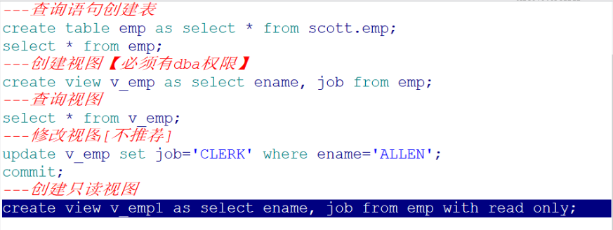

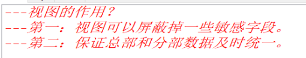

## 1.1 语法1

```
语法1：CREATE VIEW 视图名称 AS 子查询

范例：建立一个视图，此视图包括了20部门的全部员工信息 
create view empvd20 as select * from emp t where t.deptno = 20
视图创建完毕就可以使用视图来查询，查询出来的都是20部门的员工
```

## 1.2 语法2

```
语法2：CREATE OR REPLACE VIEW 视图名称 AS 子查询
如果视图已经存在我们可以使用语法2来创建视图，这样已有的视图会被覆盖。 create or replace view empvd20 as select * from emp t where t.deptno = 20
那么视图可以修改吗？
```

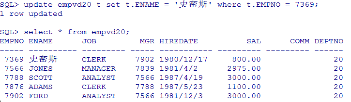

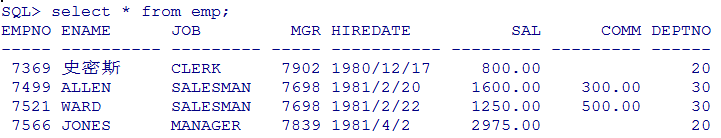

```
我们尝试着修改视图但是发现是视图所查询的表的字段值被修改了。所以我们一般不会去修改视图。
我们可以设置视图为只读。
```

## 1.3  语法3

```
语法3：
CREATE OR REPLACE VIEW 视图名称 AS 子查询 WITH READ ONLY create or replace view empvd20 as select * from emp t where t.deptno = 20 with read only
```

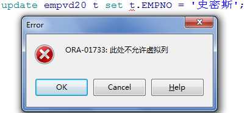

# 2. 索引[应用]

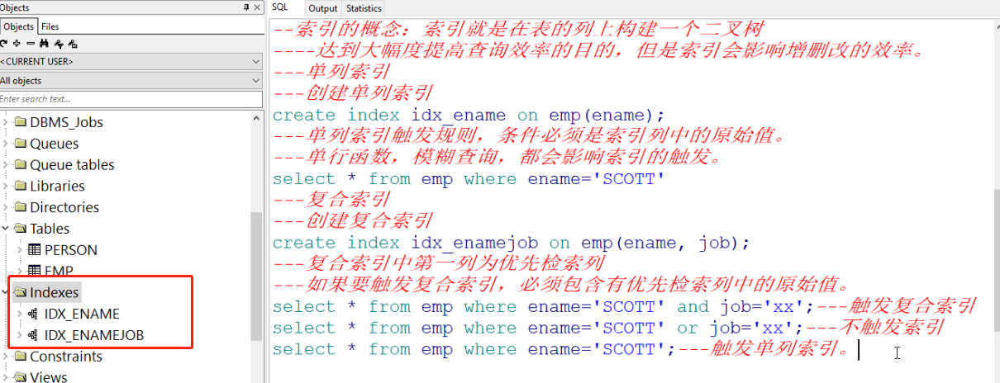

or  其实代表2个函数 一个触发 一个不触发  合在一起就是不触发

索引是用于加速数据存取的数据对象。合理的使用索引可以大大降低i/o 次数,从而
提高数据访问性能。索引有很多种我们主要介绍常用的几种:
为什么添加了索引之后，会加快查询速度呢？
图书馆：如果杂乱地放书的话检索起来就非常困难,所以将书分类，然后再建一个箱子，箱子里面放卡片，卡片里面可以按类查询,按书名查或者类别查,这样的话速度会快很多很多，这个就有点像索引。索引的好处就是提高你找到书的速度，但是正是因为你建了索引，就应该有人专门来维护索引，维护索引是要有时间精力的开销的，也就是说索引是不能乱建的，所以建索引有个原则：如果有一个字段如果不经常查询，就不要去建索引。现在把书变成我们的表，把卡片变成我们的索引，就知道为什么索引会快，为什么会有开销。
创建索引的语法：
创建索引：

## 2.1 单列索引

单列索引是基于单个列所建立的索引，比如:

CREATE index 索引名 on 表名(列名)

## 2.2  复合索引

复合索引是基于两个列或多个列的索引。在同一张表上可以有多个索引，但是
要求列的组合必须不同,比如：

```
Create index emp_idx1 on emp(ename,job);
Create index emp_idx1 on emp(job,ename);

范例：给person表的name建立索引 create index pname_index on person(name);
范例：给person表创建一个name和gender的索引 create index pname_gender_index on person(name, gender);
```

## 2.3 索引的使用原则：

```
在大表上建立索引才有意义
在where子句后面或者是连接条件上的字段建立索引
表中数据修改频率高时不建议建立索引
```

# 3. pl/sql基本语法[了解]

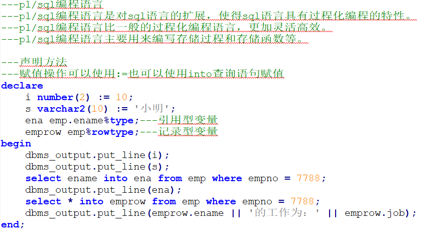

什么是PL/SQL?
PL/SQL（Procedure Language/SQL）
PLSQL是Oracle对sql语言的过程化扩展，指在SQL命令语言中增加了过程处理语句（如分支、循环等），使SQL语言具有过程处理能力。把SQL语言的数据操纵能力与过程语言的数据处理能力结合起来，使得PLSQL面向过程但比过程语言简单、高效、灵活和实用。
范例1：为职工涨工资，每人涨10％的工资。
update emp set sal=sal*1.1
范例2：例2: 按职工的职称长工资,总裁涨1000元,经理涨800元，其他人员涨400元。
这样的需求我们就无法使用一条SQL来实现，需要借助其他程序来帮助完成，也可以使用pl/sql。

## 3.1  pl/sql程序语法

```
程序语法：
	declare
    说明部分 （变量说明，游标申明，例外说明 〕
    begin
    语句序列 （DML语句〕…
    exception
    例外处理语句
    End;
```

## 3.2 常量和变量定义

```
在程序的声明阶段可以来定义常量和变量。
1. 变量的基本类型就是oracle中的建表时字段的变量如char, varchar2, date, number, boolean, long
定义语法：varl char(15);
Psal number(9,2);
说明变量名、数据类型和长度后用分号结束说明语句。
常量定义：married constant boolean:=true

2. 引用变量
Myname emp.ename%type;
引用型变量，即my_name的类型与emp表中ename列的类型一样
在sql中使用into来赋值 declare emprec emp.ename%type; begin select t.ename into emprec from emp t where t.empno = 7369; dbms_output.put_line(emprec); end;

3. 记录型变量
Emprec emp%rowtype
记录变量分量的引用
emp_rec.ename:='ADAMS'; declare p emp%rowtype; begin select * into p from emp t where t.empno = 7369; dbms_output.put_line(p.ename || ' ' || p.sal); end;
```

## 3.3 if分支

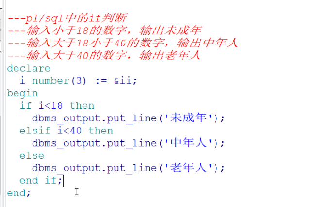

```
语法1：
	IF 条件 THEN 语句1;
语句2;
    END IF;
    语法2：
    IF 条件 THEN 语句序列1；
    ELSE 语句序列 2；
    END IF；
语法3：
    IF 条件 THEN 语句;
    ELSIF 语句 THEN 语句;
    ELSE 语句;
	END IF;
```

### 3.3.1   范例1

```
范例1：如果从控制台输入1则输出我是1 
declare pnum number := &num;
begin
	if pnum = 1 then 
		dbms_output.put_line('我是1'); 
	end if; 
end;
```

### 3.3.2  范例2

```
范例2：如果从控制台输入1则输出我是1否则输出我不是1 
declare 
	mynum number := &num; 
begin 
	if mynum = 1 then
    	dbms_output.put_line('我是1'); 
    else 
    	dbms_output.put_line('我不是1'); 
    end if; 
end;
```

### 3.3.3  范例3

```
范例3:判断人的不同年龄段18岁以下是未成年人，18岁以上40以下是成年人，40以上是老年人 
declare 
	mynum number := &num; 
begin 
	if mynum < 18 then 
		dbms_output.put_line('未成年人'); 
	elsif mynum >= 18 and mynum < 40 then 
		dbms_output.put_line('中年人'); 
	elsif mynum >= 40 then 
		dbms_output.put_line('老年人'); 
	end if; 
end;
```

## 3.3.4  LOOP循环语句

```
语法1：
    WHILE total <= 25000 LOOP
    .. .
    total : = total + salary;
    END LOOP;
语法2：
    Loop
    EXIT [when 条件];
    ……
    End loop
语法3：
    FOR I IN 1 . . 3 LOOP
语句序列 ;
	END LOOP ;
```

### 3.3.4.1 范例1

```
范例:使用语法1输出1到10的数字 
declare 
	step number := 1;
begin
	while step <= 10 loop 
		dbms_output.put_line(step); 、step := step + 1; 
	end loop; 
end;
```

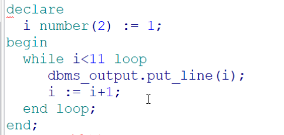

### 3.3.4.2 范例2 (用的多  退出循环)

```
范例:使用语法2输出1到10的数字
declare 
	step number := 1; 
begin 
	loop exit when step > 10; 
		dbms_output.put_line(step); 
		step := step + 1; 
	end loop; 
end;
```

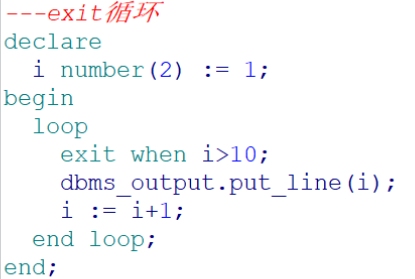

### 3.3.4.3 范例3

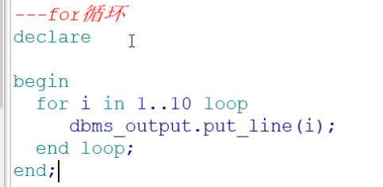

```
范例:使用语法3输出1到10的数字 
declare 
	step number := 1; 
begin 
	for step in 1 .. 10 loop 
		dbms_output.put_line(step); 
	end loop; 
end;
```

## 3.5  游标Cursor

在写java程序中有集合的概念，那么在pl/sql中也会用到多条记录，这时候我们就要用到游标，游标可以存储查询返回的多条数据。

```
语法：
CURSOR 游标名 [ (参数名 数据类型,参数名 数据类型,...)] IS SELECT 语句; 例如：cursor c1 is select ename from emp;

游标的使用步骤：
1 打开游标： open c1; (打开游标执行查询)
2 取一行游标的值：fetch c1 into pjob; (取一行到变量中)
3 关闭游标： close c1;(关闭游标释放资源)
4 游标的结束方式 exit when c1%notfound

注意： 上面的pjob必须与emp表中的job列类型一致：
定义：pjob emp.empjob%type;
```

### 3.5.1  范例1

```
范例1：使用游标方式输出emp表中的员工编号和姓名 
```

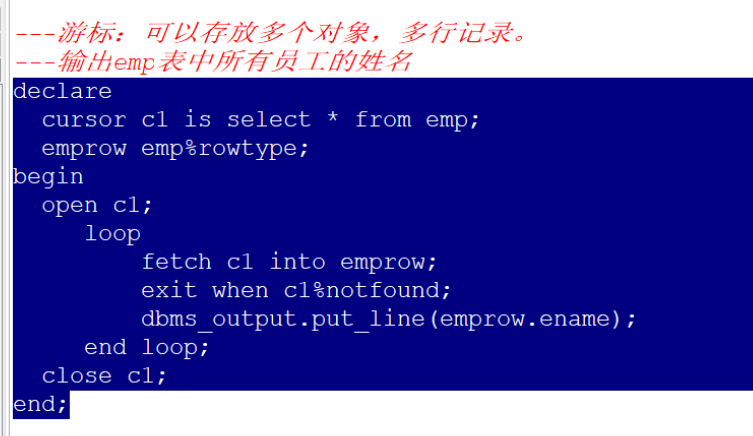

### 3.5.2  范例2

```
范例2：按员工的工种涨工资,总裁1000元，经理涨800元其，他人员涨400元。
备份出一张新表为myemp;create table myemp as select * from emp;

declare cursor pc is select * from myemp; addsal myemp.sal%type; pemp myemp%rowtype; begin open pc; loop fetch pc into pemp; exit when pc%notfound; if pemp.job = 'PRESIDENT' then addsal := 1000; elsif pemp.job = 'MANAGER' then addsal := 800; else addsal := 400;
end if; update myemp t set t.sal = t.sal + addsal where t.empno = pemp.empno; end loop; close pc; end;
```

### 3.5.3  范例3

```
范例3：写一段PL/SQL程序，为部门号为10的员工涨工资。
```

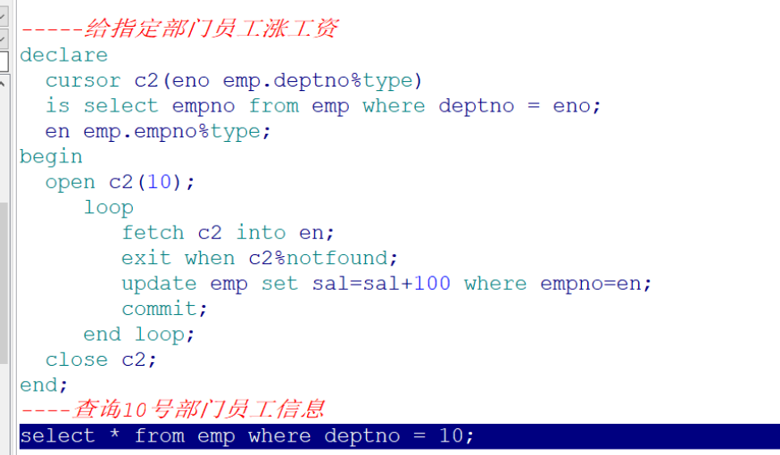

# 4 存储过程[理解]

存储过程（Stored Procedure）是在大型数据库系统中，一组为了完成特定功能的SQL 语句集，经编译后存储在数据库中，用户通过指定存储过程的名字并给出参数（如果该存储过程带有参数）来执行它。存储过程是数据库中的一个重要对象，任何一个设计良好的数据库应用程序都应该用到存储过程。

```
创建存储过程语法：
create [or replace] PROCEDURE 过程名[(参数名 in/out 数据类型)]
AS
begin
PLSQL子程序体；
End;
或者
create [or replace] PROCEDURE 过程名[(参数名 in/out 数据类型)]
is
begin
PLSQL子程序体；
End 过程名;
```

## 4.1 范例1

```
范例1：
创建一个输出helloword的存储过程 
create or replace procedure helloworld is 
begin 
	dbms_output.put_line('helloworld'); 
end helloworld;
调用存储过程
在plsql中调用存储过程
begin 
	-- Call the procedure 
	helloworld; 
end;
```

## 4.2 范例2

```
范例2：给指定的员工涨100工资，并打印出涨前和涨后的工资
分析：我们需要使用带有参数的存储过程
create or replace procedure addSal1(eno in number) is 
	pemp myemp%rowtype; 
begin	
	select * into pemp from myemp where empno = eno; 
	update myemp set sal = sal + 100 where empno = eno; 
    dbms_output.put_line('涨工资前' || pemp.sal || '涨工资后' || (pemp.sal + 		100)); 
end addSal1;
调用 
begin 
	-- Call the procedure 
	addsal1(eno => 7902); 
	commit; 
end;
```

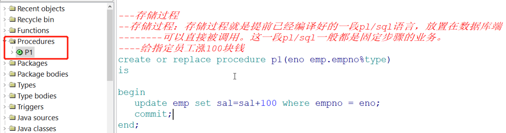

测试

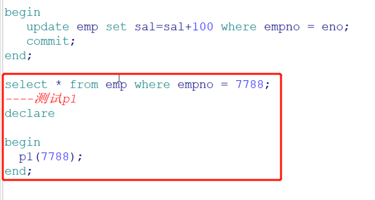

# 5. 存储函数[理解]

```
create or replace function 函数名(Name in type, Name in type, ...) return 数据类型 is
结果变量 数据类型;
begin
return(结果变量);
end函数名;
```

## 5.1 存储过程和存储函数的区别

一般来讲，过程和函数的区别在于函数可以有一个返回值；而过程没有返回值。
但过程和函数都可以通过out指定一个或多个输出参数。我们可以利用out参数，在过程和函数中实现返回多个值。

## 5.2  范例1

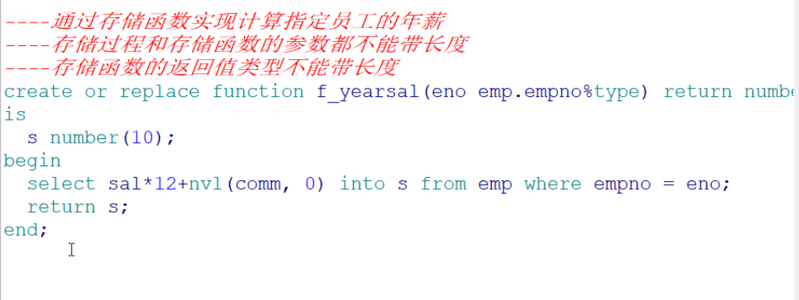

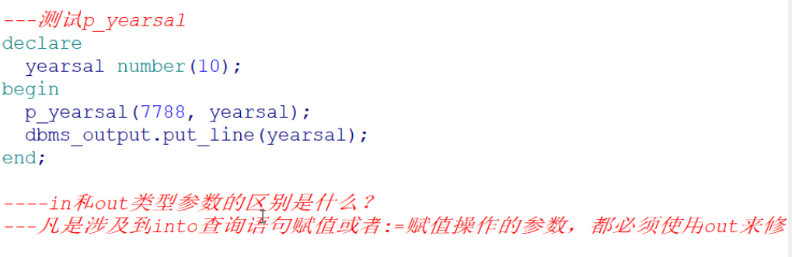

```
范例：使用存储函数来查询指定员工的年薪
create or replace function empincome(eno in emp.empno%type) return number is 	psal emp.sal%type;
	pcomm emp.comm%type; 
begin 
	select t.sal into psal from emp t where t.empno = eno; 
	return psal * 12 + nvl(pcomm, 0); 
end;
使用存储过程来替换上面的例子
create or replace procedure empincomep(eno in emp.empno%type, 
income out number) is 
	psal emp.sal%type; 
	pcomm emp.comm%type; 
begin 
	select t.sal, t.comm into psal, pcomm from emp t where t.empno = eno; 		income := psal*12+nvl(pcomm,0); 
end empincomep;
调用： 
declare 
	income number;
begin 
	empincomep(7369, income);
	dbms_output.put_line(income); 
end;
```

# 6. 触发器[理解]

数据库触发器是一个与表相关联的、存储的PL/SQL程序。每当一个特定的数据操作语句(Insert,update,delete)在指定的表上发出时，Oracle自动地执行触发器中定义的语句序列。

## 6.1 触发器可用于

```
1. 数据确认
2. 实施复杂的安全性检查
3. 做审计，跟踪表上所做的数据操作等
4. 数据的备份和同步
```

## 6.2   触发器的类型

1. 语句级触发器 ：在指定的操作语句操作之前或之后执行一次，不管这条语句影响 了多少行 。
2. 行级触发器（FOR EACH ROW） ：触发语句作用的每一条记录都被触发。在行级触 发器中使用old和new伪记录变量, 识别值的状态。

## 6.3 语法：

```
CREATE [or REPLACE] TRIGGER 触发器名
    {BEFORE | AFTER}
	{DELETE | INSERT | UPDATE [OF 列名]}
	ON 表名
	[FOR EACH ROW [WHEN(条件) ] ]
begin
	PLSQL 块
End 触发器名
```

## 6.4 范例

### 6.4.1 范例1

插入员工后打印一句话“一个新员工插入成功”

```
create or replace trigger testTrigger 
	after insert on person 
declare 
	-- local variables here 
begin 
	dbms_output.put_line('一个员工被插入'); 
	end testTrigger;
```

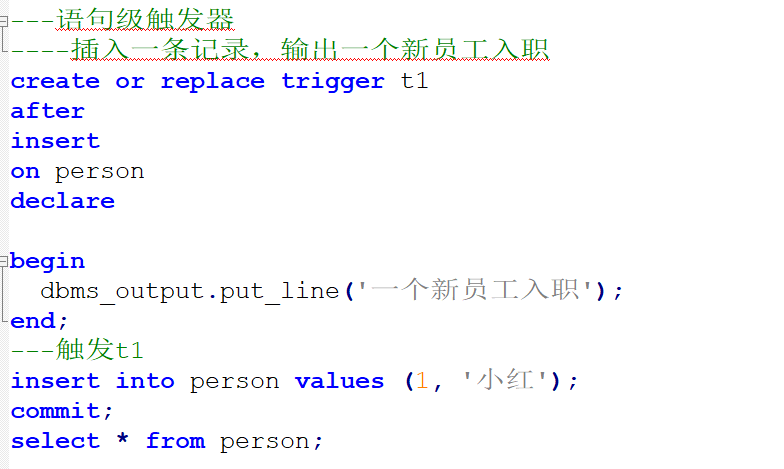

### 6.4.2 范例2

不能在休息时间插入员工

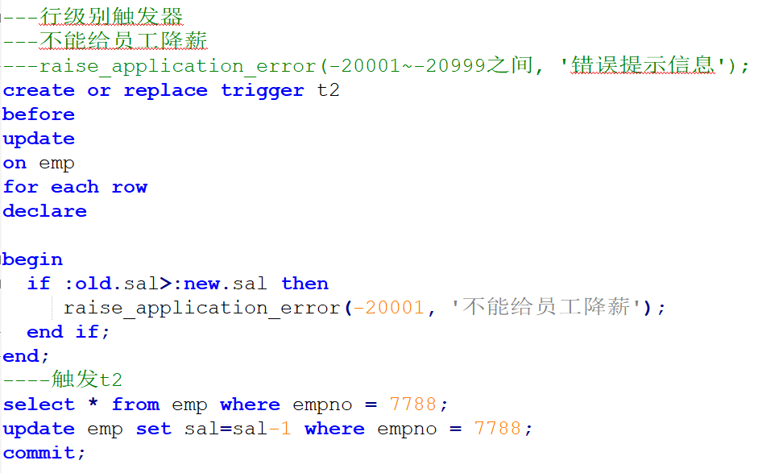

当执行插入时会报错

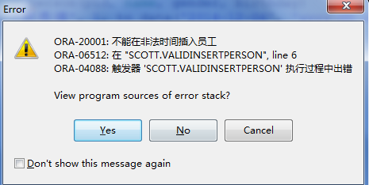

在触发器中触发语句与伪记录变量的值

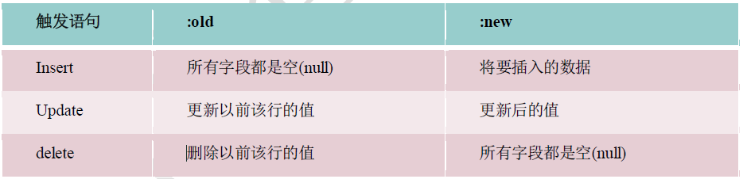

### 6.4.3 范例3

范例：判断员工涨工资之后的工资的值一定要大于涨工资之前的工资

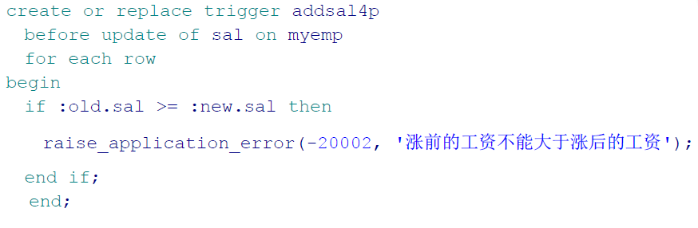

调用

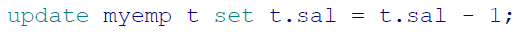

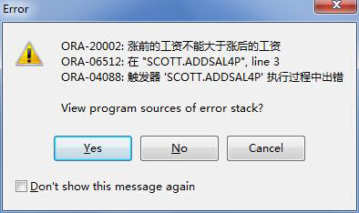

### 6.4.4 使用触发器自增

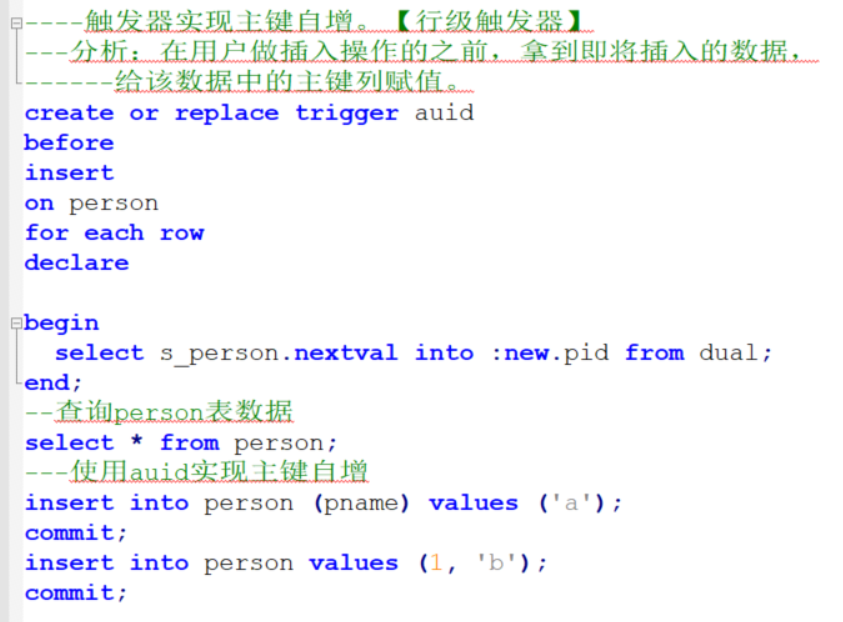

# 7 Java程序调用存储过程[应用]


## 7.1 java连接oracle的jar包

可以在虚拟机中xp的oracle安装目录下找到jar包 :ojdbc14.jar

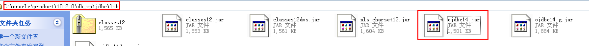

## 7.2 数据库连接字符串

```
String driver="oracle.jdbc.OracleDriver";
String url="jdbc:oracle:thin:@192.168.56.10:1521:orcl";
String username="scott";
String password="tiger";
```

测试代码：

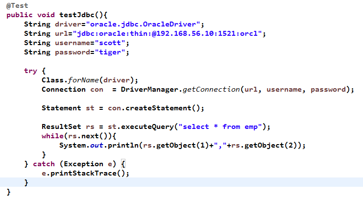

## 7.3 实现过程的调用

### 7.3.1 调用过程

过程定义

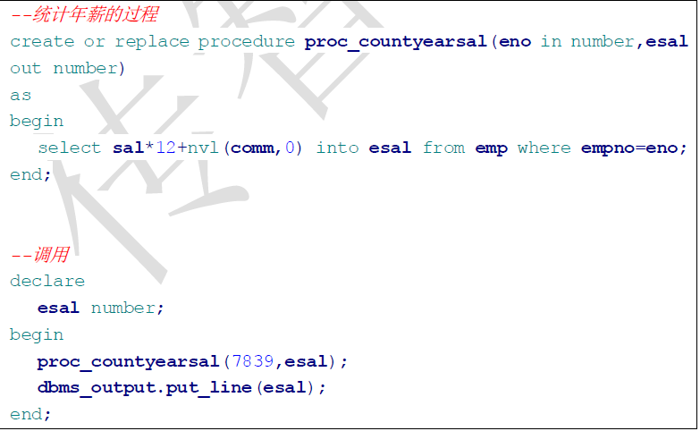

过程调用

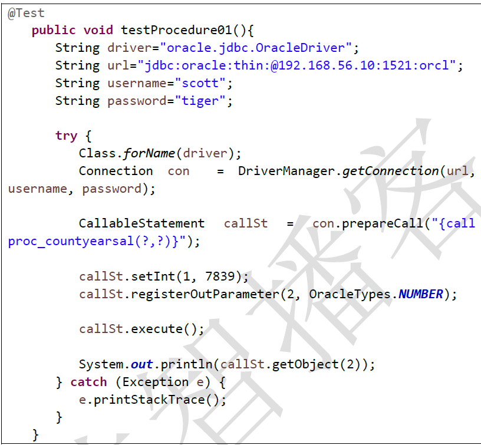

