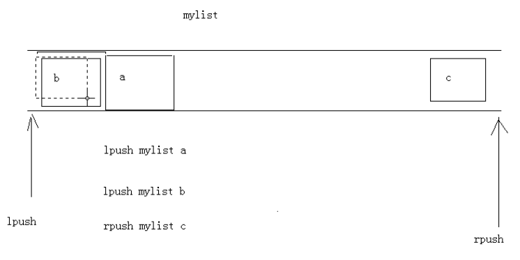

# 														Redis

## 1.概念

 redis是一款高性能的NOSQL系列的非关系型数据库,  经常查询但很少修改的数据使用

##   2.下载安装

1. 官网：https://redis.i
2. 中文网：http://www.redis.net.cn/
3. 解压直接可以使用：
	* redis.windows.conf：配置文件
	* redis-cli.exe：redis的客户端
	* redis-server.exe：redis服务器端


## 3.  命令操作

### 3.1  redis的数据结构

redis存储的是：key,value格式的数据，其中key都是字符串，value有5种不同的数据结构

		* value的数据结构：
			1) 字符串类型 string
			2) 哈希类型 hash ： map格式  
			3) 列表类型 list ： linkedlist格式。支持重复元素
			4) 集合类型 set  ： 不允许重复元素
			5) 有序集合类型 sortedset：不允许重复元素，且元素有顺序

### 3.2 字符串类型 string
```redis
	1. 存储： set key value
		127.0.0.1:6379> set username zhangsan
		OK
	2. 获取： get key
		127.0.0.1:6379> get username
		"zhangsan"
	3. 删除： del key
		127.0.0.1:6379> del age
		(integer) 1
```
### 3.3 哈希类型 hash
```redis
	1. 存储： hset key field value
		127.0.0.1:6379> hset myhash username lisi
		(integer) 1
		127.0.0.1:6379> hset myhash password 123
		(integer) 1
	2. 获取： 
		* hget key field: 获取指定的field对应的值
			127.0.0.1:6379> hget myhash username
			"lisi"
		* hgetall key：获取所有的field和value
			127.0.0.1:6379> hgetall myhash
			1) "username"
			2) "lisi"
			3) "password"
			4) "123"
			
	3. 删除： hdel key field
		127.0.0.1:6379> hdel myhash username
		(integer) 
```
###  3.4 列表类型 list

可以添加一个元素到列表的头部（左边）或者尾部（右边）



		1. 添加：
			1. lpush key value: 将元素加入列表左表		
			2. rpush key value：将元素加入列表右边		
				127.0.0.1:6379> lpush myList a
				(integer) 1
				127.0.0.1:6379> lpush myList b
				(integer) 2
				127.0.0.1:6379> rpush myList c
				(integer) 3
		2. 获取：
			* lrange key start end ：范围获取
				127.0.0.1:6379> lrange myList 0 -1
				1) "b"
				2) "a"
				3) "c"
		3. 删除：
			* lpop key： 删除列表最左边的元素，并将元素返回
			* rpop key： 删除列表最右边的元素，并将元素返回
### 3.5 集合类型 set 

不允许重复元素

		1. 存储：sadd key value
			127.0.0.1:6379> sadd myset a
			(integer) 1
			127.0.0.1:6379> sadd myset a
			(integer) 0
		2. 获取：smembers key:获取set集合中所有元素
			127.0.0.1:6379> smembers myset
			1) "a"
		3. 删除：srem key value:删除set集合中的某个元素	
			127.0.0.1:6379> srem myset a
			(integer) 1
### 3.5.6 有序集合类型 sortedset

不允许重复元素，且元素有顺序.每个元素都会关联一个double类型的分数。redis正是通过分数来为集合中的成员进行从小到大的排序。

```redis
	1. 存储：zadd key score value
		127.0.0.1:6379> zadd mysort 60 zhangsan
		(integer) 1
		127.0.0.1:6379> zadd mysort 50 lisi
		(integer) 1
		127.0.0.1:6379> zadd mysort 80 wangwu
		(integer) 1
	2. 获取：zrange key start end [withscores]
		127.0.0.1:6379> zrange mysort 0 -1
		1) "lisi"
		2) "zhangsan"
		3) "wangwu"

		127.0.0.1:6379> zrange mysort 0 -1 withscores
		1) "zhangsan"
		2) "60"
		3) "wangwu"
		4) "80"
		5) "lisi"
		6) "500"
	3. 删除：zrem key value
		127.0.0.1:6379> zrem mysort lisi
		(integer) 1
```
### 3.7  通用命令
		1. keys * : 查询所有的键
		2. type key ： 获取键对应的value的类型
		3. del key：删除指定的key value
## 4. redis持久化

1. redis是一个内存数据库，当redis服务器重启，获取电脑重启，数据会丢失，我们可以将redis内存中的数据持久化保存到硬盘的文件中。
2. redis持久化机制：( 要生效  每次必须执行 redis-server.exe redis.windows.conf 指定配置文件打开)

		1. RDB：默认方式，不需要进行配置，默认就使用这种机制
			* 在一定的间隔时间中，检测key的变化情况，然后持久化数据
			1. 编辑redis.windwos.conf文件
				#   after 900 sec (15 min) if at least 1 key changed       过900秒变化一次保存
				save 900 1
				#   after 300 sec (5 min) if at least 10 keys changed
				save 300 10
				#   after 60 sec if at least 10000 keys changed  
				save 60 10000
				
			2. 重新启动redis服务器，并指定配置文件名称,不指定不生效,客户端不需要指定
				D:\redis-2.8.9>redis-server.exe redis.windows.conf		
			3.  会生成一个名称为 dump.rbd 文件,将数据保存其中
			
		2. AOF：日志记录的方式，可以记录每一条命令的操作。可以每一次命令操作后，持久化数据
			1. 编辑redis.windwos.conf文件
				将 appendonly no（关闭aof） --> appendonly yes （开启aof）
				
				# appendfsync always ： 每一次操作都进行持久化
				# appendfsync everysec ： 每隔一秒进行一次持久化
				# appendfsync no	 ： 不进行持久化
				
			2. 会生成一个名称为 appendonly.aof 文件,将数据保存其中	
## 5. Java客户端 Jedis

### 1.Jedis介绍

一款java操作redis数据库的工具

### 2.使用步骤


```java
	1. 下载jedis的jar包
	2. 使用
		//1. 获取连接
		Jedis jedis = new Jedis("localhost",6379);
		//2. 操作
		jedis.set("username","zhangsan");
		//3. 关闭连接
		jedis.close();
```
### 3.Jedis操作各种redis中的数据结构

#### 3.1 字符串类型 string

​		set
​		get	

```java
	 //1. 获取连接
    Jedis jedis = new Jedis();//如果使用空参构造，默认值 "localhost",6379端口
    //2. 操作
    //存储
    jedis.set("username","zhangsan");
    //获取
    String username = jedis.get("username");
    System.out.println(username);

    //可以使用setex()方法存储可以指定过期时间的 key value
    jedis.setex("activecode",20,"hehe");//将activecode：hehe键值对存入redis，并且20秒后自动删除该键值对

    //3. 关闭连接
    jedis.close();
```
#### 3.2 哈希类型 hash ： map格式  
​			hset
​			hget
​			hgetAll

```java
			//1. 获取连接
	        Jedis jedis = new Jedis();//如果使用空参构造，默认值 "localhost",6379端口
	        //2. 操作
	        // 存储hash
	        jedis.hset("user","name","lisi");
	        jedis.hset("user","age","23");
	        jedis.hset("user","gender","female");
	
	        // 获取hash
	        String name = jedis.hget("user", "name");
	        System.out.println(name);
	          // 获取hash的所有map中的数据
	        Map<String, String> user = jedis.hgetAll("user");
	
	        // keyset
	        Set<String> keySet = user.keySet();
	        for (String key : keySet) {
	            //获取value
	            String value = user.get(key);
	            System.out.println(key + ":" + value);
	        }
	
	        //3. 关闭连接
	        jedis.close();
```

#### 3.3列表类型 list ： linkedlist格式  支持重复元素

​			lpush / rpush
​			lpop / rpop
​			lrange start end : 范围获取

```java
		 //1. 获取连接
        Jedis jedis = new Jedis();//如果使用空参构造，默认值 "localhost",6379端口
        //2. 操作
        // list 存储
        jedis.lpush("mylist","a","b","c");//从左边存
        jedis.rpush("mylist","a","b","c");//从右边存

        // list 范围获取
        List<String> mylist = jedis.lrange("mylist", 0, -1);
        System.out.println(mylist);
        
        // list 弹出
        String element1 = jedis.lpop("mylist");//c
        System.out.println(element1);

        String element2 = jedis.rpop("mylist");//c
        System.out.println(element2);

        // list 范围获取
        List<String> mylist2 = jedis.lrange("mylist", 0, -1);
        System.out.println(mylist2);

        //3. 关闭连接
        jedis.close();
```
#### 3.4 集合类型 set  ： 不允许重复元素
​		sadd
​		smembers:获取所有元素

```java
		//1. 获取连接
        Jedis jedis = new Jedis();//如果使用空参构造，默认值 "localhost",6379端口
        //2. 操作
          // set 存储
	        jedis.sadd("myset","java","php","c++");
	
	        // set 获取
	        Set<String> myset = jedis.smembers("myset");
	        System.out.println(myset);
	
	        //3. 关闭连接
	        jedis.close();
```

#### 3.5  有序集合类型 sortedset：不允许重复元素，且元素有顺序
​			zadd
​			zrange

```java
		//1. 获取连接
        Jedis jedis = new Jedis();//如果使用空参构造，默认值 "localhost",6379端口
        //2. 操作
        // sortedset 存储
        jedis.zadd("mysortedset",3,"亚瑟");
        jedis.zadd("mysortedset",30,"后裔");
        jedis.zadd("mysortedset",55,"孙悟空");

        // sortedset 获取
        Set<String> mysortedset = jedis.zrange("mysortedset", 0, -1);

        System.out.println(mysortedset);
         //3. 关闭连接
	        jedis.close();
```
#### 3.6 jedis连接池： JedisPool

##### 3.6.1使用：

```java
 		1. 创建JedisPool连接池对象
		2. 调用方法 getResource()方法获取Jedis连接
			//0.创建一个配置对象
	        JedisPoolConfig config = new JedisPoolConfig();
	        config.setMaxTotal(50);
	        config.setMaxIdle(10);
	
	        //1.创建Jedis连接池对象
	        JedisPool jedisPool = new JedisPool(config,"localhost",6379);
	
	        //2.获取连接
	        Jedis jedis = jedisPool.getResource();
	        //3. 使用
	        jedis.set("hehe","heihei");
	         //4. 关闭 归还到连接池中
		        jedis.close();
```
##### 3.6.2 连接池工具类

```java
public class JedisPoolUtils {

			    private static JedisPool jedisPool;
			
			    static{
			        //读取配置文件
			        InputStream is = JedisPoolUtils.class.getClassLoader().getResourceAsStream("jedis.properties");
			        //创建Properties对象
			        Properties pro = new Properties();
			        //关联文件
			        try {
			            pro.load(is);
			        } catch (IOException e) {
			            e.printStackTrace();
			        }
			        //获取数据，设置到JedisPoolConfig中
			        JedisPoolConfig config = new JedisPoolConfig();
			        config.setMaxTotal(Integer.parseInt(pro.getProperty("maxTotal")));
			        config.setMaxIdle(Integer.parseInt(pro.getProperty("maxIdle")));
			
			        //初始化JedisPool
			        jedisPool = new JedisPool(config,pro.getProperty("host"),Integer.parseInt(pro.getProperty("port")));
			         }
			     /**
			     * 获取连接方法
			     */
			    public static Jedis getJedis(){
			        return jedisPool.getResource();
			    }
			}
```

