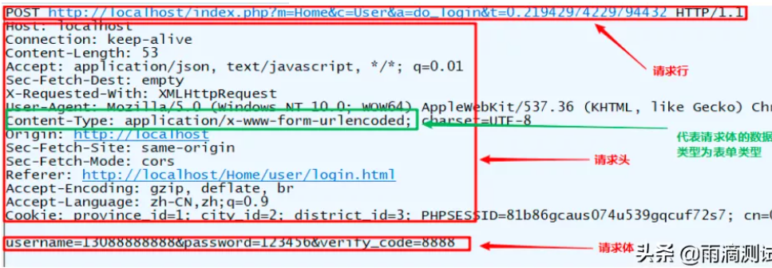
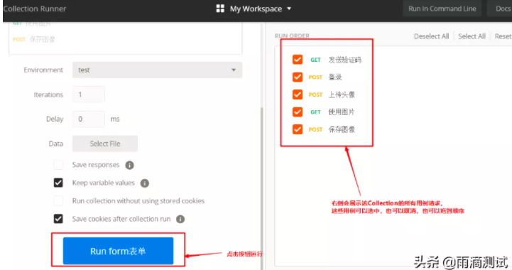

<h1 align = "center">Postman使用教程</h1>

# 1. postman功能介绍

## 1.1  基础功能

- 常见类型的接口请求
- 接口响应数据的解析
- 接口管理(Collection)
- 批量执行接口请求
- 日志调试
- 断言
- 变量
- 请求前置脚本
- 接口关联
- 常见的返回值获取

## 1.2 便捷功能

- 快速填写查询参数
- 快速填写请求头信息
- 快速实现添加一个请求
- 如何继承集合认证
- 批量断言
- 快速查询和替换

## 1.3 高级功能

- 读取文件进行参数化
- 生成测试报告
- 代码中发送请求
- 编写接口文档
- mock服务
- 监控
- 使用工作空间
- 代码同步与分支管理
- 连接数据库
- apis

# 2. postman安装说明

## 2.1  下载与安装

### 2.1.1   访问postman官方网站

```
访问postman官方网站，下载最新版本，访问地址：https://www.postman.com/downloads/
```

### 2.1.2  选择版本

进入到下载页面，根据自己电脑下载对应的版本


## 2.2 界面导航说明

元素的含义


## 2.3  发送第一个请求


# 3.postman 基础功能

## 3.1  常见类型的接口请求(4种)

```
常见的接口有如下四种类型，分别是含有
查询参数的接口，
表单类型的接口，
json类型的接口,
以及含有上传文件的接口
```

### 3.1.1  查询参数的接口请求

所谓的查询参数，其实就是URL地址中问号（?）后面的部分就叫查询参数，

比如：http://cx.shouji.360.cn/phonearea.php?number=13012345678 。在这个接口中，查询参数就是:**number=13012345678** 。而这一部分是由有键值对组成，格式为：key1=value1&key2=value2, 如果有多组键值对，要用&隔开 。


说明：查询参数的URL一般直接拷贝到输入的URL地址栏中就可以了，当然也可以把查询参数在Params中输入，俩者的效果是一样的 。

### 3.1.2  表单类型的接口请求

什么是表单类型呢 ？简单理解就是在请求头中查看**Content-Type，它的值如果是:application/x-www-form-urlencoded** .那么就说明客户端提交的数据是以表单形式提交的 。



#### 3.1.2.1 设置请求头

```
Content-Type: application/x-www-form-urlencoded
```


#### 3.1.2.2 设置请求体


### 3.1.3  上传文件的表单请求

在做接口测试时，我们经常会遇到需要上传文件的接口，比如微信的更新头像。这就需要用到：multipart/form-data。它也属于一种表单，但它既支持表单请求，也支持文件上传。它的请求报文中数据往往是下面这样的。

#### 3.1.3.1 设置请求头

```
Content-Type: multipart/form-data
```


#### 3.1.3.2   设置请求体

postman中设置请求体类型，需要**选择body-> form-data** 。file中要选择File类型，然后上传本地的文件 


### 3.1.4  json类型的接口请求

接口测试中最常见的一种情况了 ， 也就是请求体类型为json

#### 3.1.4.1   设置请求头

```
Content-Type: application/json;charset=UTF-8
```


#### 3.1.4.2   设置请求体


## 3.2  接口响应数据解析

响应数据是发送请求后经过服务器处理后返回的结果，响应由三部分组成，分别是状态行、响应头、响应体。我们来看下postman的响应数据展示。

### 3.2.1  数据解析


```
在postman中的响应数据展示：

状态行：Status：200 OK
响应头：Headers + Cookies，需要注意的是Cookies是包含在响应头中的，但是为了明显，工具会分开显示
响应体：Body
那么这些数据对我们做接口测试有什么作用呢 ？

Body和Status是我们做接口测试的重点，一般来说我们都会验证响应体中的数据和响应状态码
Test Results 是我们编写断言后，可以查看断言的执行结果 ，所以这个对我们也很有用 。
Time 和Size 是我们做性能测试时，可以根据这两个参数来对所测接口的性能做一个简单的判断。
```

### 3.2.2  3个主题解析

Body中的几个显示主题，分别是：Pretty，Raw，Preview

```
Pretty:翻译成中文就是漂亮 ， 也就是说返回的Body数据在这个标签中查看 ，都是经过格式化的，格式化后的数据看起来更加直观，所以postman默认展示的也是这个选项。比如返回html页面，它会经过格式化成HTML格式后展示，比如返回json，那么也会格式化成json格式展示 。

Raw：翻译成中文未经过加工的，也就是原始数据 ，原始数据一般都是本文格式的，未经过格式化处理的，一般在抓包工具中都有这个选项 。

Preview：翻译成中文就是预览，这个选项一般对返回HTML的页面效果特别明显，如请求百度后返回结果，点击这个选项后就直接能查看到的页面 ，如下图 。同时这个选项和浏览器抓包中的Preview也是一样的 。
```

## 3.3 接口管理（Collection）

当我们对一个或多个系统中的很多用例进行维护时，首先想到的就是对用例进行分类管理，同时还希望对这批用例做回归测试 。在postman也提供了这样一个功能，就是Collection 。

### 3.3.1  新建测试系统

点击Collection，点击+New Collection，在弹出的输入框中输入Collection名称（这个就可以理解为所测试的系统


### 3.3.2  新建模块

选中新建的Collection右键，点击Add Folder ，在弹出对话框中输入文件夹名称（这个就可以理解为系统中的模块）


### 3.3.3  新建测试用例

选中新建的Folder，点击Add Request ，在弹出的对话框中输入请求名称，这个就是我们所测试的接口，也可以理解为测试用例 


需要 点击  save  才能保存 post请求 (或者其他) 


### 3.3.4  结果展示 

那么通过以上三个步骤，达到的效果就是如图所示：


### 3.3.5 批量执行接口请求

当我们在一个Collection中编写了很多的接口测试用例，想一起执行这批用例

#### 3.3.5.1  选中一个Collection，点击右三角，在弹出的界面点击RUN


#### 3.3.5.2  会弹出一个叫Collection Runner的界面，默认会把Collection中的所有用例选中



#### 3.3.5.3  点击界面下方的RUN Collection，就会对Collection中选中的所有测试用例运行


#### 3.3.5.4   对上面的几个红框内的功能进行简单说明：

- **断言统计** ：左上角的两个0是统计当前Collection中断言成功的执行数和失败的执行数，如果没有编写断言默认都为0 。
- Run Summary: 运行结果总览，点击它可以看到每个请求中具体的测试断言详细信息 。Export Result：导出运行结果，默认导出的结果json文件 。
- Retry: 重新运行，点击它会把该Collection重新运行一遍
- New：返回到Runner，可以重新选择用例的组合 。