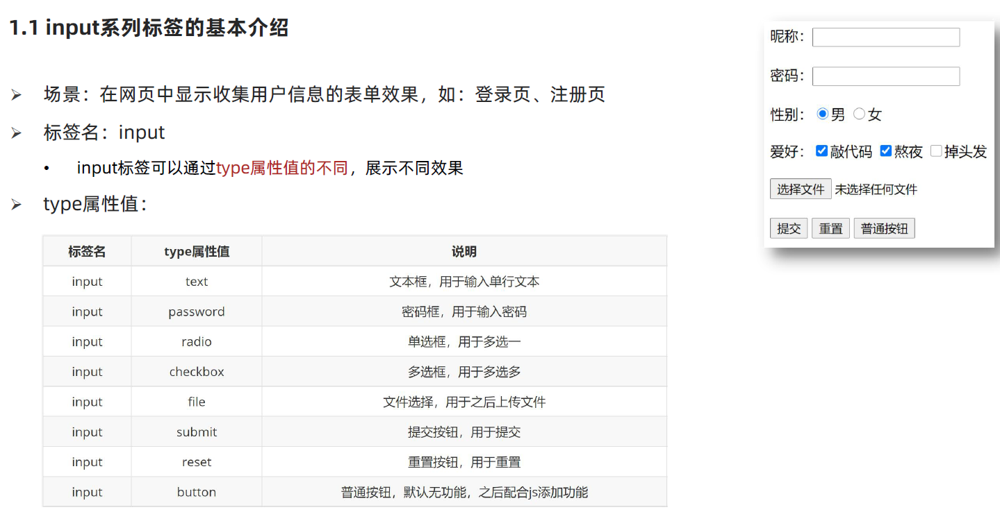

<h1 align = "center">HTML</h1>


## 1. HTML标签

### 1.1	文本格式化标签


### 1.2  图片属性的tiltle


### 1.3  音频标签


### 1.4  视频标签


### 1.5  链接a标签的target 属性


### 1.6  列表标签


## 2.表格标签

### 2.1 表格标签


### 2.12 表格相关属性


### 2.3 表格标签和表头单元格标签


### 2.4 表格的结构标签 

(页面效果和上面一样,但是对于浏览器而言,这种效果更好解析)


### 2.5   合并单元格


## 3.表单标签

### 3.1  	input




### 3.2   button


### 3.3  select


### 3.4 textarea


### 3.5  label


```
 点中文也可以选中
 
 性别: <label><input type="radio" name="sex">男</label>
        <label><input type="radio"  name="sex">女</label>
```

## 4. 语义化标签

### 4.1  div  span


### 4.2  有语义的标签

