<h1 align = "center">CSS</h1>

```
/* CSS书写顺序: 浏览器执行效率更高
    1. 浮动 / display
    2. 盒子模型: margin border padding 宽度高度背景色
    3. 文字样式
*/
```

## 1. 基础

### 1.1  引入方式

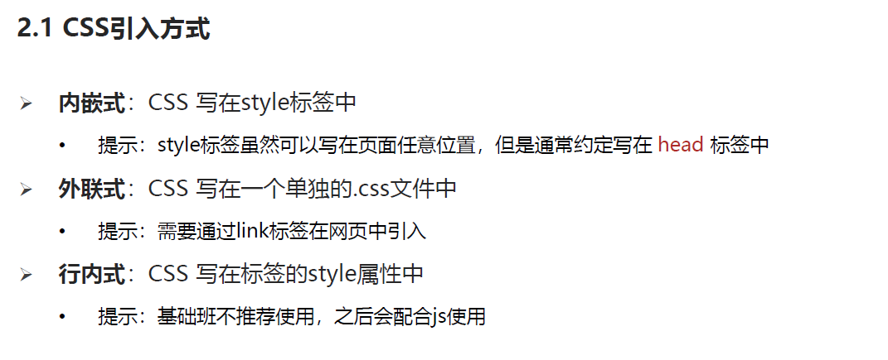

## 2. 选择器

### 2.1  基础选择器

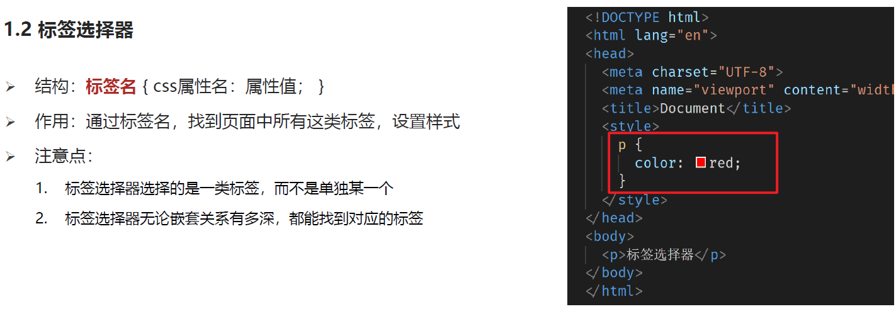

### 2.2  类选择器

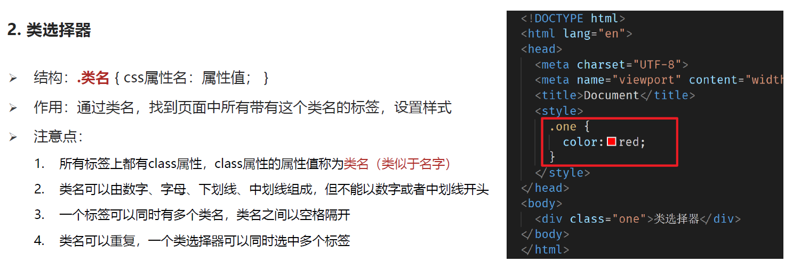

### 2.3  id 选择器

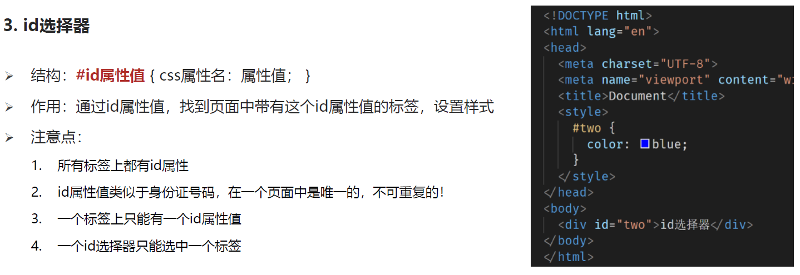

### 2.4  通配符选择器

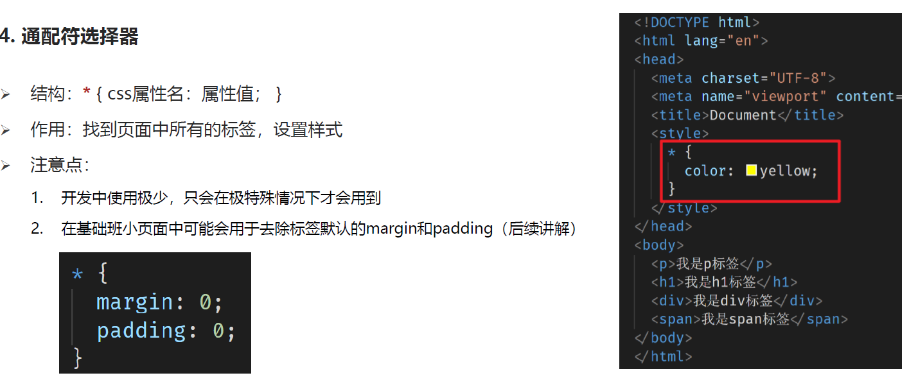

## 3  字体和文本样式

### 3.1  字体样式

#### 3.1.1 字体大小 font-size

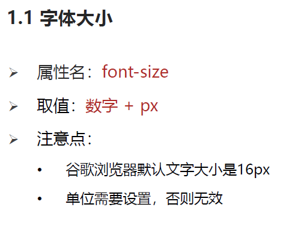

#### 3.1.2  字体粗细   font-weight

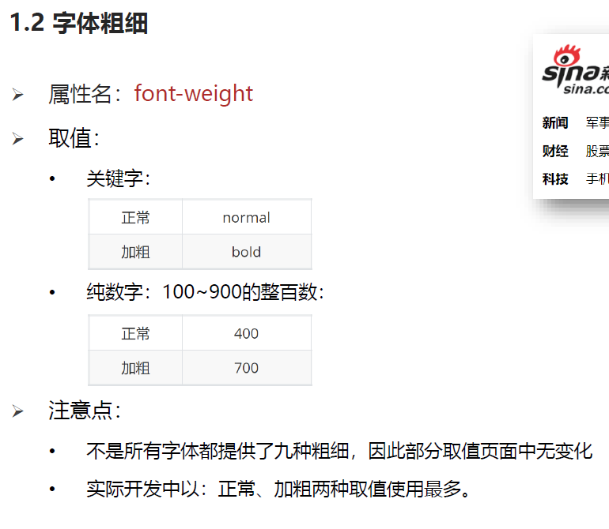

#### 3.1.3  字体样式  font-style

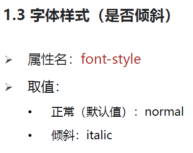

#### 3.1.4  常见字体系列(了解)

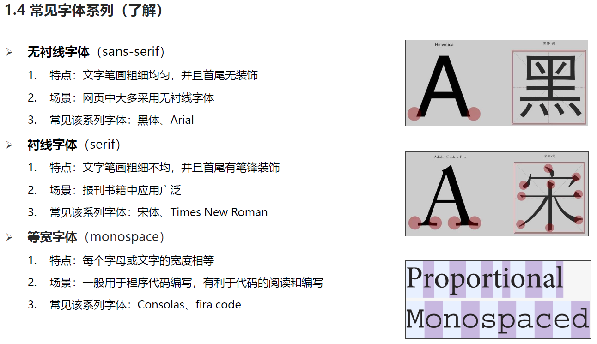

#### 3.1.5   字体系列   font-family

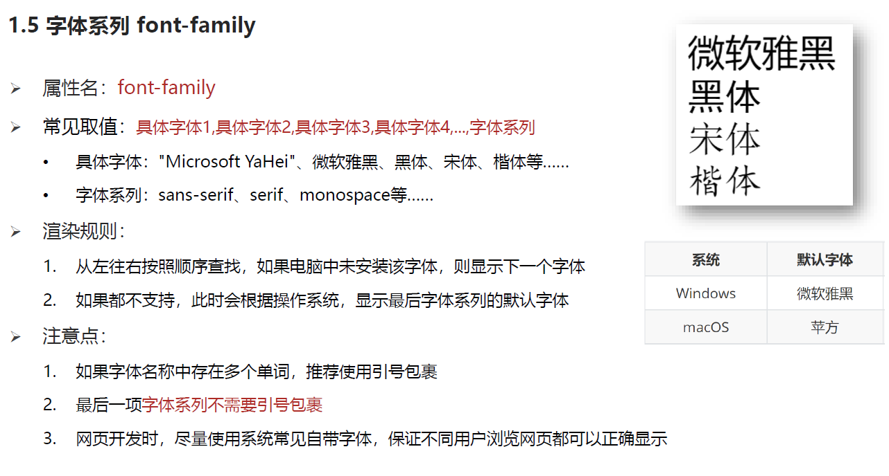

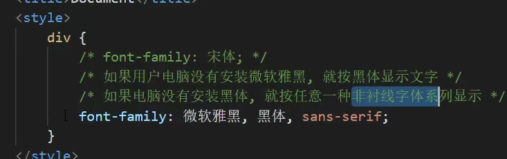

#### 3.1.6   复合属性写法  可以省略前2个属性

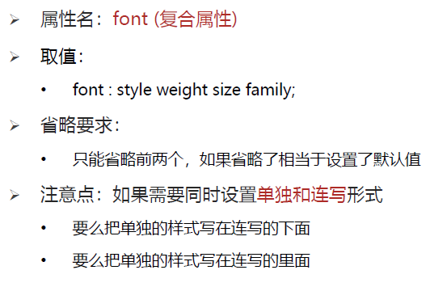


## 4. 字体和文本样式

### 4.1 文本样式

#### 4.1.1   文本缩进  text-indent

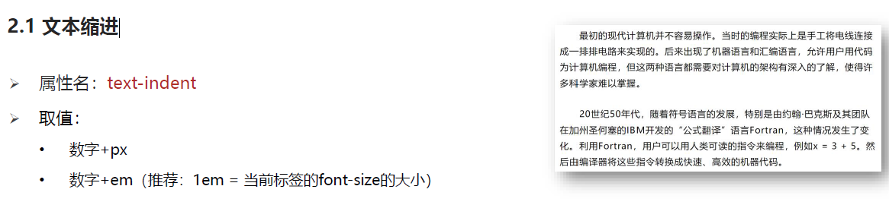

#### 4.1.2  文本水平对齐方式  text-align

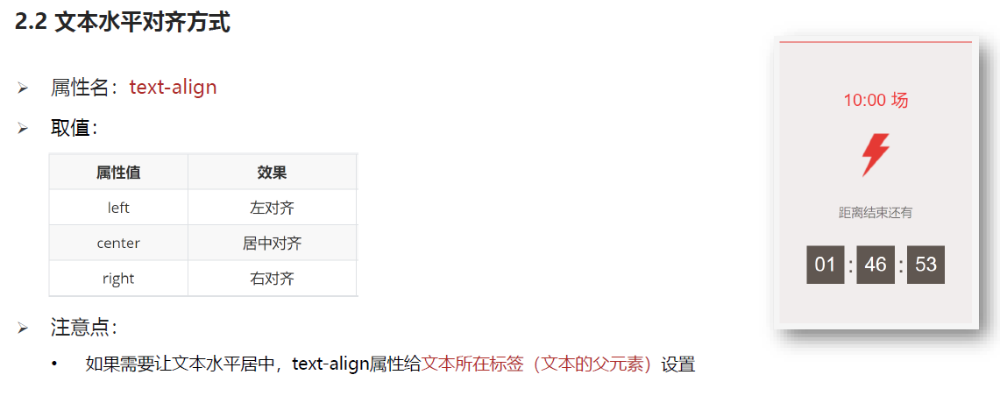

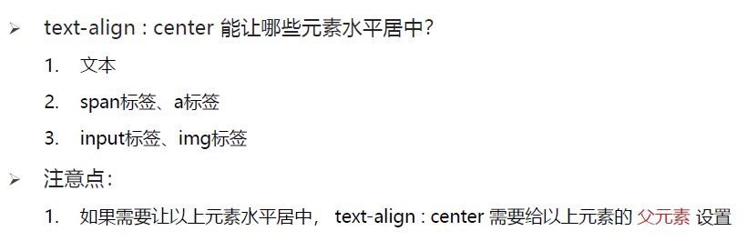

#### 4.1.3  文本修饰 下划线  删除线

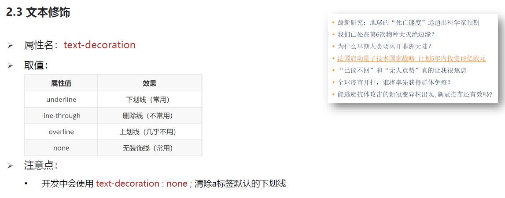

### 4.2 line-height 行高

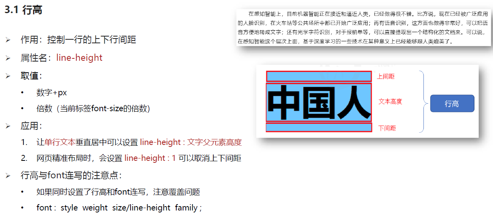

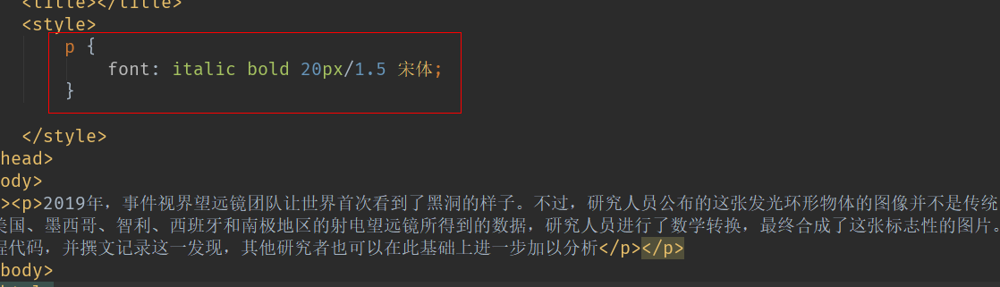

### 4.3  颜色取值

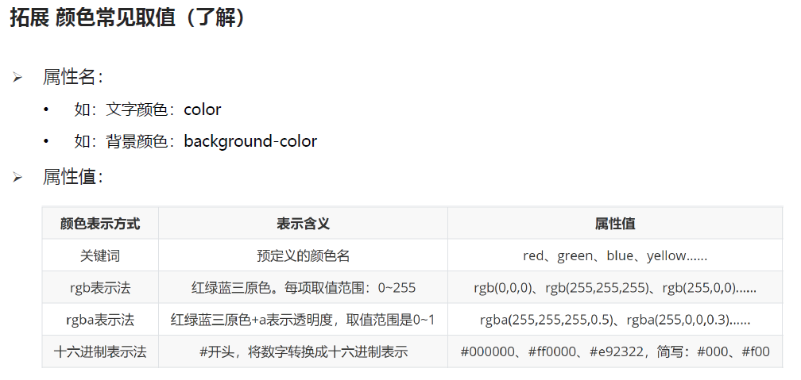

### 4.4   margin auto与text-align:center的区别

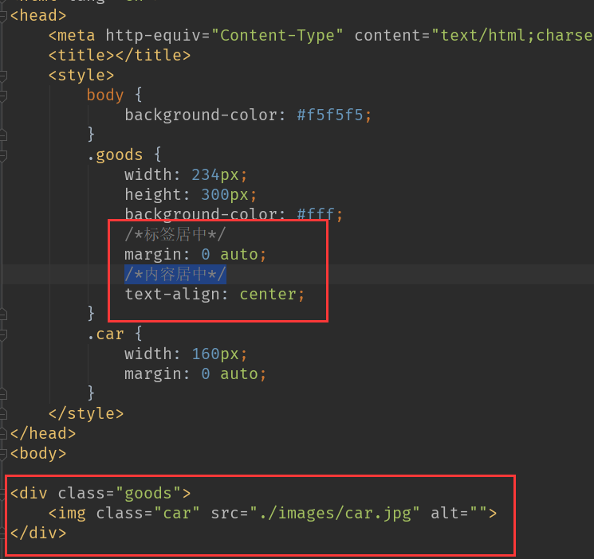

https://blog.csdn.net/qq_35038153/article/details/78514751

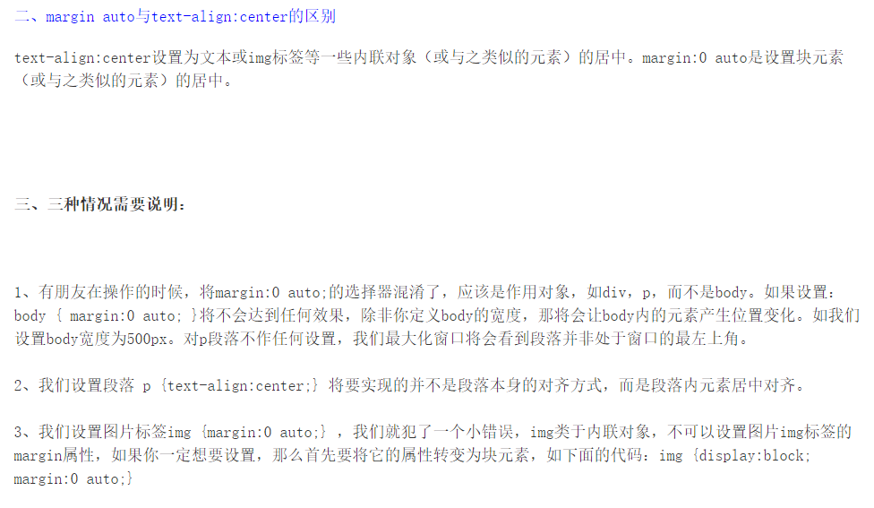

