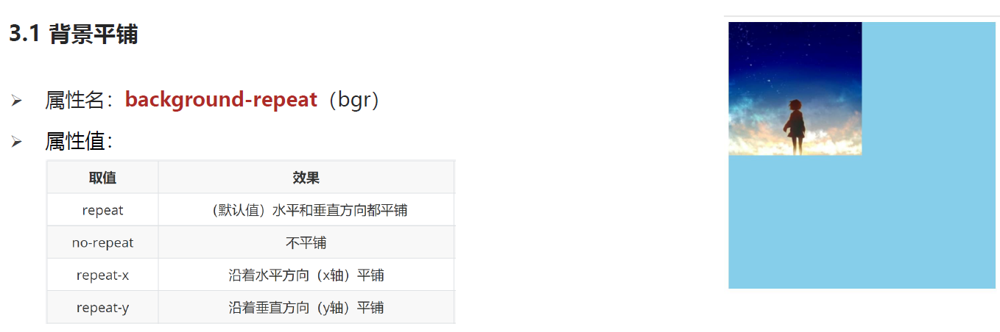
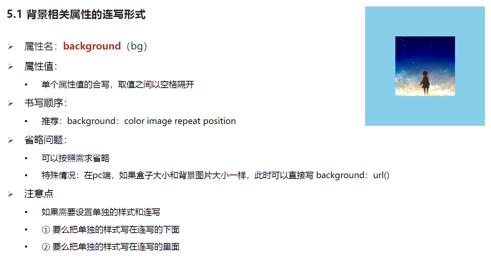

<h1 align = "center">CSS进阶</h1>

# 1. 选择器

## 1.1 属性选择器


## 1.2 后代选择器  空格


## 1.3 子代选择器


## 1.4 并集选择器


## 1.5 交集选择器


## 1.6  hover 伪类选择器  (悬停触发)


## 1.8 :before  和 :after 伪元素的使用


https://www.cnblogs.com/shihaiying/p/11657760.html

## 1.9 emment语法


# 2. 背景相关 background

## 2.1 背景颜色  background-color


## 2.2  背景图片 background-image


## 2.3  背景平铺 background-repeat




## 2.4  背景位置  background-positon


## 2.5   背景相关属性的连写方式




#  3. 元素显示模式

## 3.1  块级元素


## 3.2 行内元素


## 3.3  行内块元素


## 3.4  元素显示模式转换


## 3.5  居中方法总结


# 4 CSS特性

## 4.1 继承性


## 4.2  层叠性的介绍  优先级**展示**


# 5 综合案列

## 5.1 综合案列1

```
<!DOCTYPE html>
<html lang="en">
<head>
    <meta http-equiv="Content-Type" content="text/html;charset=utf-8">
    <title></title>
    <style>
        a {
            /* a 显示模式是行内, 加宽高默认不生效, 转显示模式: 行内块 */
            background-color: #ff182c;
            width: 100px;
            height: 40px;
            /*去除下划线*/
            text-decoration: none;
            /*行内元素转为行内块*/
            display: inline-block;
            line-height: 40px;
            text-align: center;
            color: white;
        }

        /*悬浮改变颜色*/
        a:hover{
            background-color: #ffa500;
        }

    </style>

</head>
<body>
<!-- @{导航$}*5 -->
<a href="#">导航1</a>
<a href="#">导航2</a>
<a href="#">导航3</a>
<a href="#">导航4</a>
<a href="#">导航5</a>

</body>
</html>
```

## 5.2   综合案列2

```
<!DOCTYPE html>
<html lang="en">
<head>
    <meta http-equiv="Content-Type" content="text/html;charset=utf-8">
    <title></title>
    <style>
        a {
            text-decoration: none;
            color: white;
            width: 120px;
            height: 58px;
            background-color: pink;
            display: inline-block;
            text-align: center;
            line-height: 50px;
        }
        .one {
             background-image: url("./images/bg1.png");
         }
        .two {
            background-image: url("./images/bg2.png");
        }
        .three {
            background-image: url("./images/bg3.png");
        }
        .four {
            background-image: url("./images/bg4.png");
        }

        .one:hover {
            background-image: url("./images/bg5.png");
        }
        .two:hover {
            background-image: url("./images/bg6.png");
        }
        .three:hover {
            background-image: url("./images/bg7.png");
        }
        .four:hover {
            background-image: url("./images/bg8.png");
        }

    </style>
</head>
<body>
    <a href="" class="one">五彩导航</a>
    <a href="" class="two">五彩导航</a>
    <a href="" class="three">五彩导航</a>
    <a href="" class="four">五彩导航</a>
</body>
</html>
```

