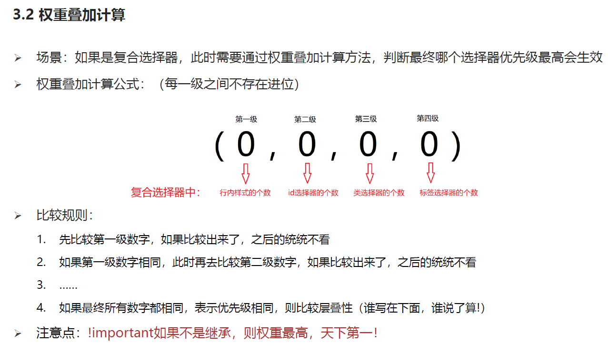

<h1 align = "center">CSS布局</h1>

# 1. CSS三大特性

前2个属性在上一个文件


## 1.1 优先级

### 1.1.1  优先级的介绍


### 1.1.2 权重叠加计算



### 1.1.3  特殊情况  都是继承 看父级


## 2.1 pxcook的使用

软件 自行下载

psg 文件 	选择开发模式

png 文件 	选择设计模式

## 3.1 盒子模型

### 3.1.1 盒子模型的介绍


### 3.1.2  内容的宽度和高度  width height


### 3.1.3  边框 border   和  盒子大小计算公式


### 3.1.4  内边距


### 3.1.5 CSS3盒模型(自动内减)   box-sizing: border-box;


### 3.1.6  外边距  margin


### 3.1.7 清除默认样式 和  去掉列表的符号


去除ul 去掉列表的符号

```
/* 去掉列表的符号 */
ul {
    list-style: none;
}
```

### 3.1.8  外边距合并现象 - 合并现象


### 3.1.9  外边距折叠现象 - 塌陷现象


### 3.1.10  行内元素的 设置高度无效  需要可以使用line-heght


# 2. 结构伪类选择器 :first-child  :nth-child  :last-child  :nth-last-child


# 3. 伪元素


# 4. 标准流


# 5. 浮动

## 5.1 浮动作用


## 5.2 浮动的代码


## 5.3 浮动的特点


# 6. 清除浮动

## 6.1  清除浮动的介绍


## 6.2 清除浮动的方法

### 6.2.1   直接设置父元素的高度


### 6.2.2 额外标签法 clear:both


### 6.2.3 单伪元素清除法


### 6.2.4 双伪元素清除法  (清除浮动+解决外边距塌陷问题)


### 6.2.5  给父元素设置 overflow:hidden  (最方便的清除浮动方法)

