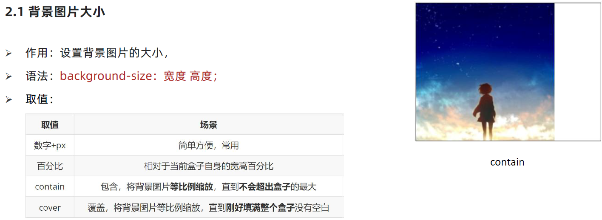
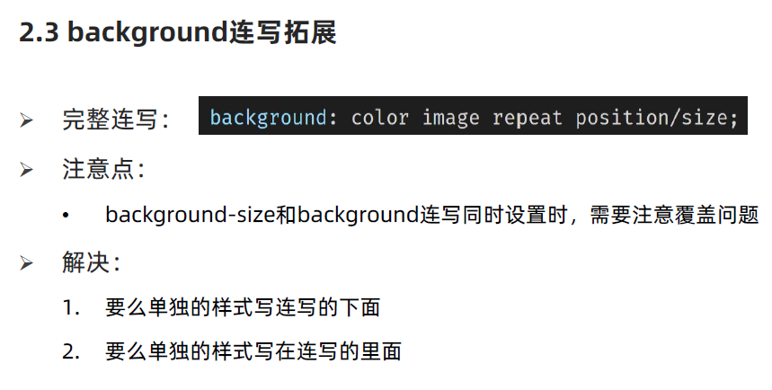
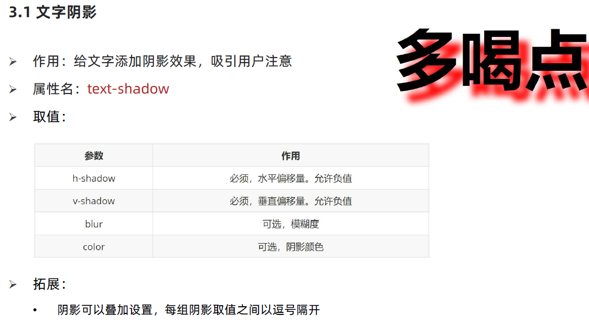
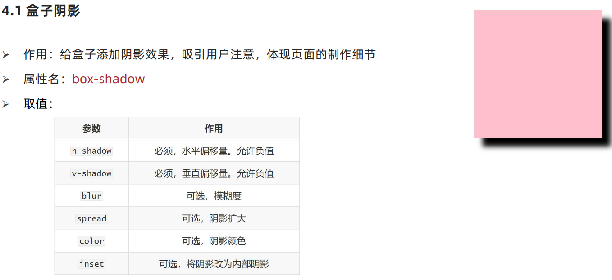
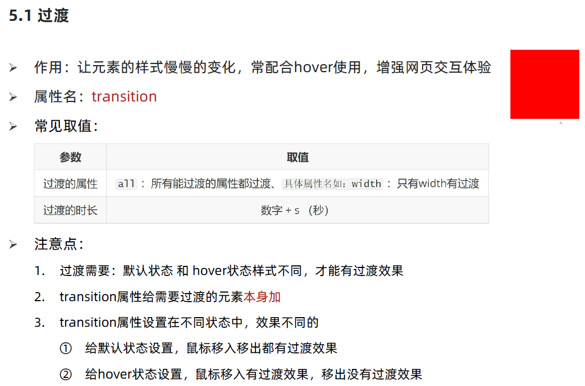
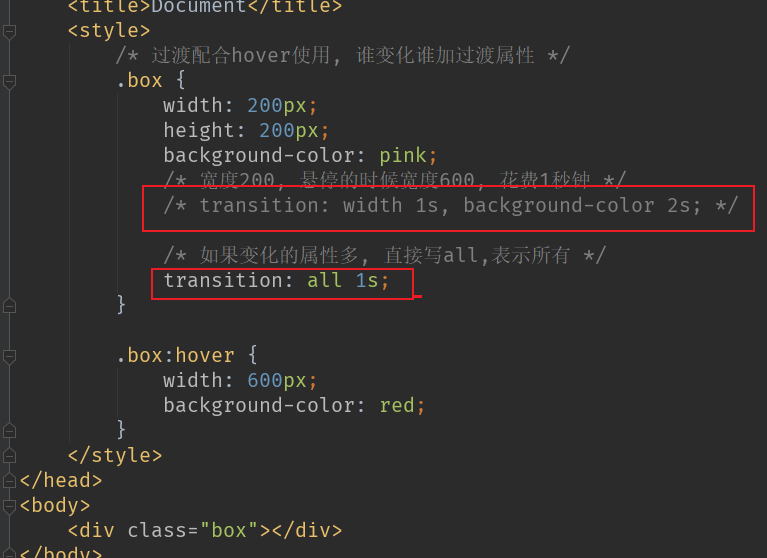
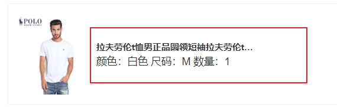
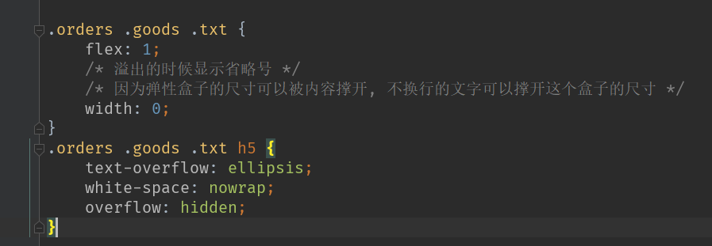

<h1 align = "center">CSS样式补充</h1>


# 1 背景图片大小  background-size



# 2 background 连写拓展



# 3 文字阴影 text-shadow



# 4  盒子阴影 box-shadow



# 5 过度 transition





# 6. 多行省略

```
overflow : hidden;
text-overflow: ellipsis;
display: -webkit-box;
-webkit-line-clamp: 2;  //行数
-webkit-box-orient: vertical;
```

小技巧  当父级是flex布局时候可以使用,让剩余部分处于单行省略,避免弹性长度带来影响





# 7.遮罩层

==遮罩层样式==

```
.mark{
    position:fixed;
    left:0;
    top:0;
    opacity:.5;
    width:100%;
    height:100%;
    background:#000;
    z-index:998;
    pointer-events: none; //遮罩整个页面，动作不能穿透遮罩层，如果需要穿透去掉pointer-events:none;
}
```

==控制遮罩层的显示和隐藏==

```
需要显示遮罩的元素加上mark类
$('#test').addClass('mark');
去除遮罩效果:
$('#test').removeClass('mark');
```

==H5出现蒙版后，禁止屏幕滚动  jquery方法==

```
// 遮罩出来后让body不可滚动
$('html').add('body').css({'overflow':'hidden'});
// 遮罩去掉之后body 可滚动
$('html').add('body').css({'overflow':'auto'});
```

# 8.箭头

```
.arrow{
    margin-top: 8rpx;
    float: right;
    width: 16rpx;
    height: 16rpx;
    border: 4rpx solid #FFFFFF;
    border-left-width: 0;
    border-bottom-width: 0;
    transform: matrix(0.71,0.71,-0.71,0.71,0,0);
}
```

# 9.防止图片抖动 提前占位

https://www.cnblogs.com/lwlblog/p/12304879.html

padding-bottom实际上是提前占位了，这个容器的高度始终是0，高度为0还之所以能够显示内容是因为内容溢出在了padding-bottom上，这里的50%是图片的**高宽**比例，切记是相对于**父元素宽度**的50%（即.img-box的上一级），不是相对于自己的width

```
.img-box{
  overflow: hidden;
  width: 100%;
  height: 0;                  //未加载图片前容器的高度为0
  padding-bottom: 50%;		  //提前占位		
}
```

# 10.box-sizing: border-box 不会撑大盒子

border-box定义的盒子，不会随着padding和boder的加入而增大盒子的占用空间

```
box-sizing: border-box
```