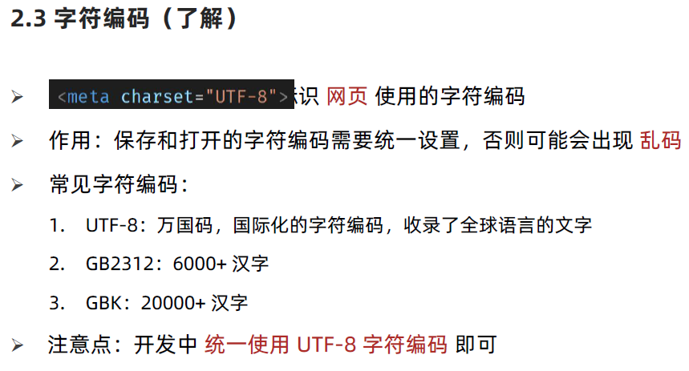

# 项目知识

# 1. 骨架结构标签

## 1.1 文档说明


## 1.2 网页语言


## 1.3 字符编码



## 1.4 代码

```
<!DOCTYPE html>
<html lang="en">
<head>
    <meta charset="UTF-8">
    <meta http-equiv="X-UA-Compatible" content="IE=edge">
    <meta name="viewport" content="width=device-width, initial-scale=1.0">
    <title>Document</title>
    <style>
        
    </style>
</head>
<body>
    <div class="box"></div>
</body>
</html>
```

# 2  SEO三大标签

## 2.1  SEO三大标签


## 2.2 拓展


# 3  icon 图标设置


# 4 CSS书写顺序


# 5. 项目结构搭建

## 5.1  文件和目录准备


