.

<h1 align = "center">position
</h1>
==z-index 需要配合定位才能生效==

# 1 定位的基本介绍

## 1.1  网页常见布局方式

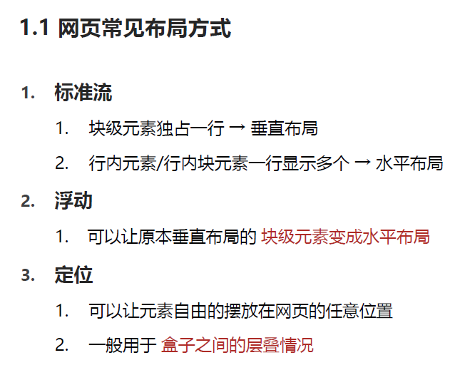

## 1.2  定位的常见应用场景

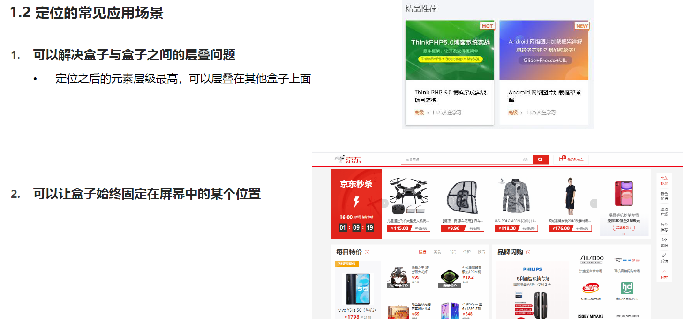

# 2 定位的基本使用

## 2.2  使用定位的步骤

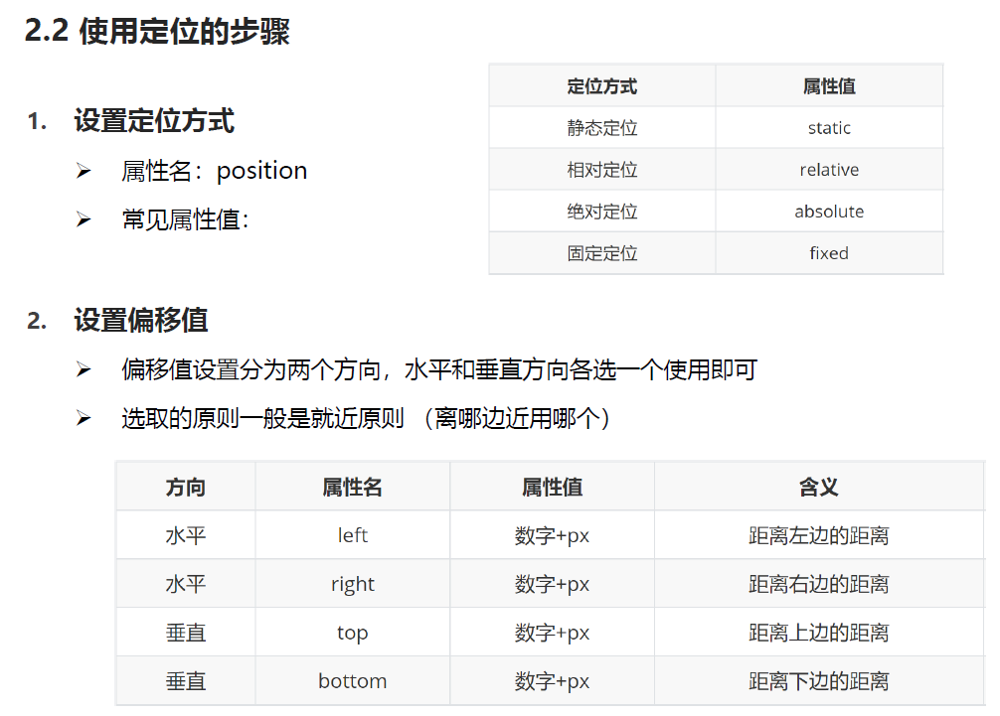

# 3.静态定位

## 3.1  静态定位

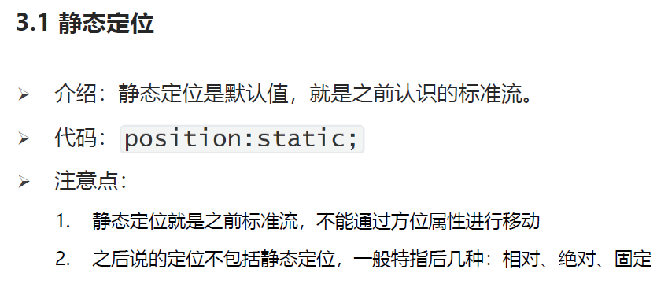

# 4.相对定位

## 4.1 相对定位

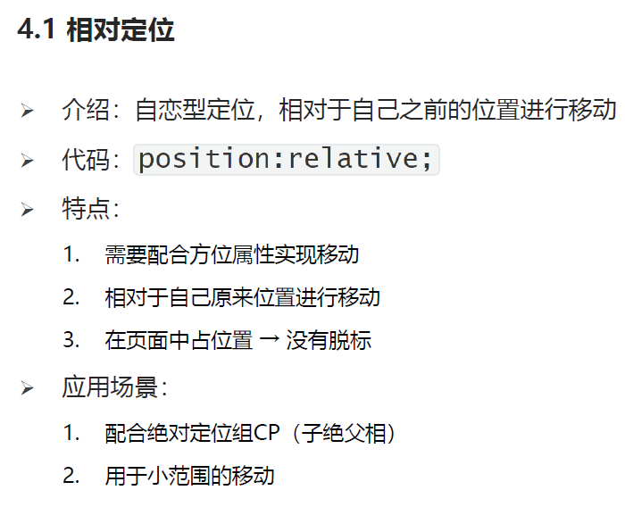

# 5.绝对定位

## 5.1  绝对定位

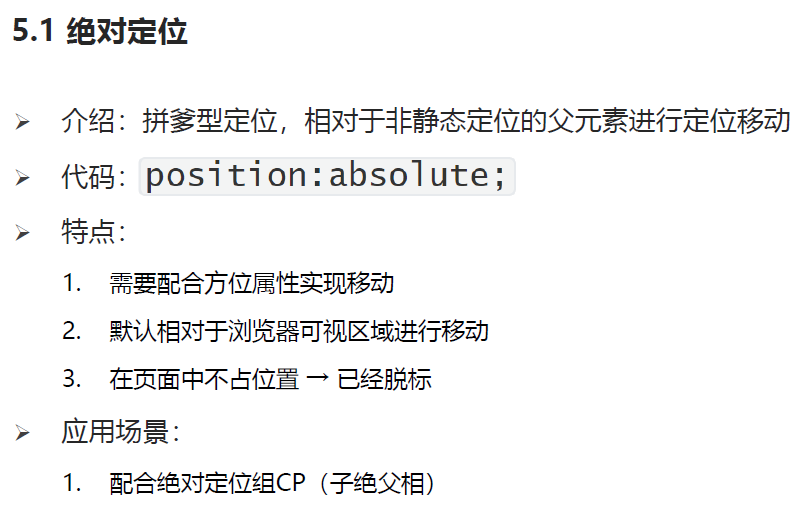

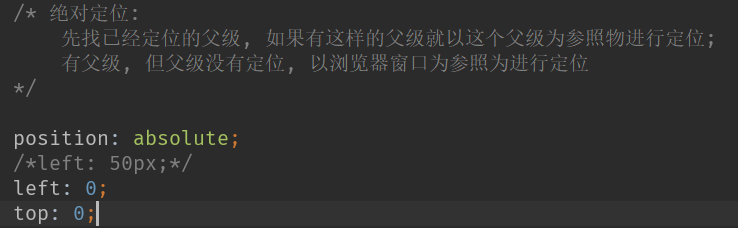

# 6.子绝父相

## 6.1 子觉父相

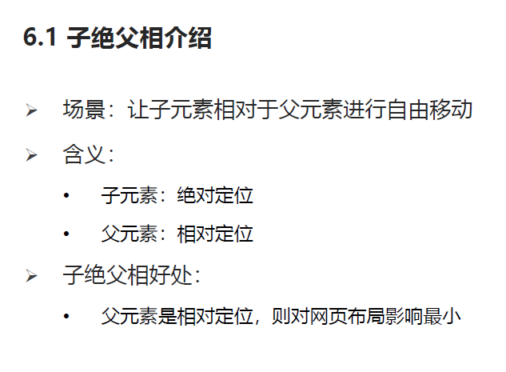

# 7.固定定位

## 7.1 固定定位

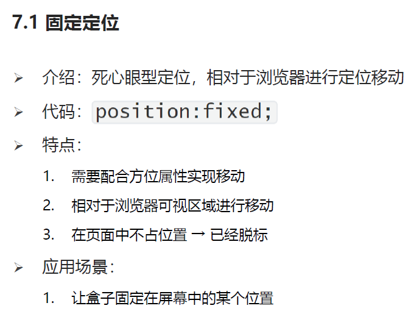

# 8.元素的层级关系

## 8.1 元素层级问题

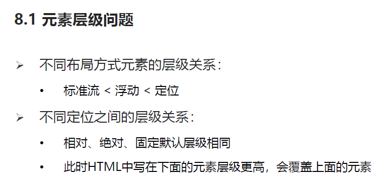

## 8.2 更改定位元素的层级 z-index

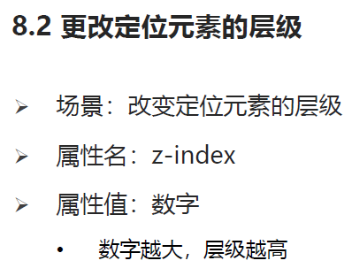