<h1 align = "center">装饰
</h1>

# 装饰

## 1.1  认识基线

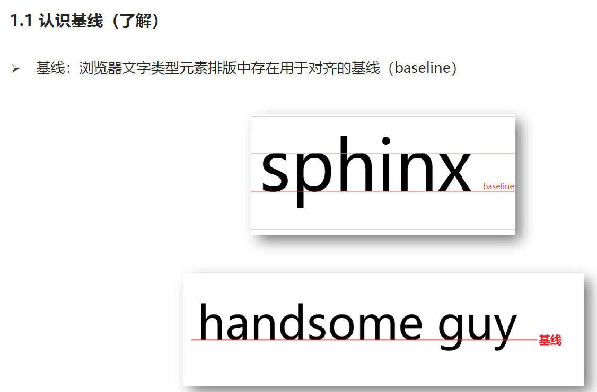

## 1.2 垂直对齐方式

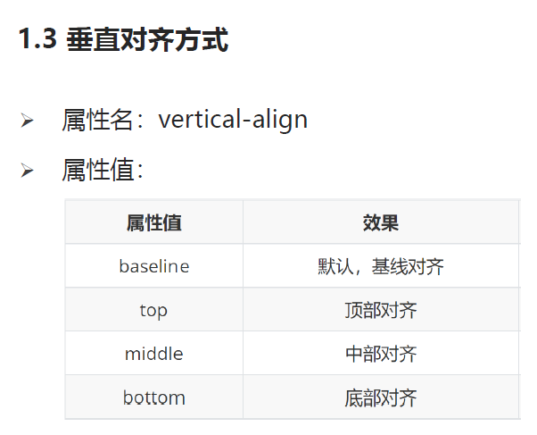

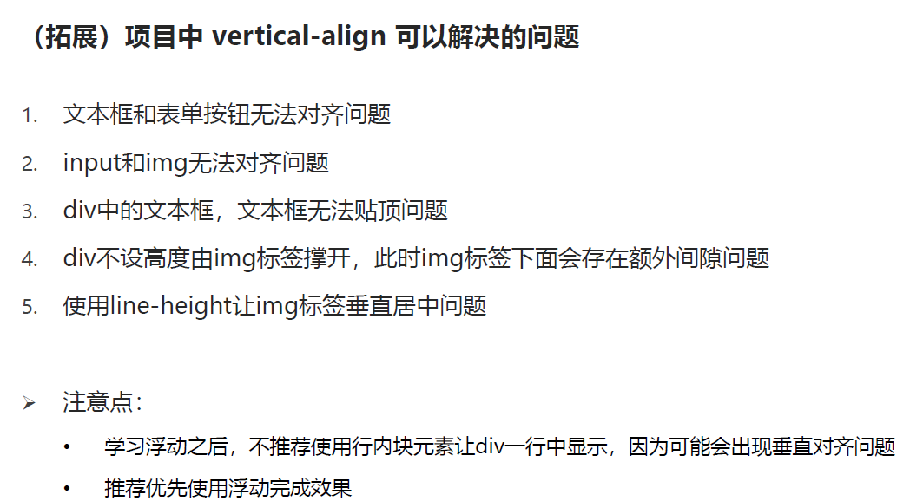

## 1.3 光标类型

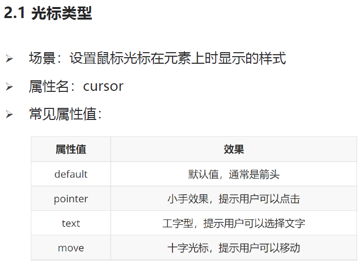

## 1.4边框圆角

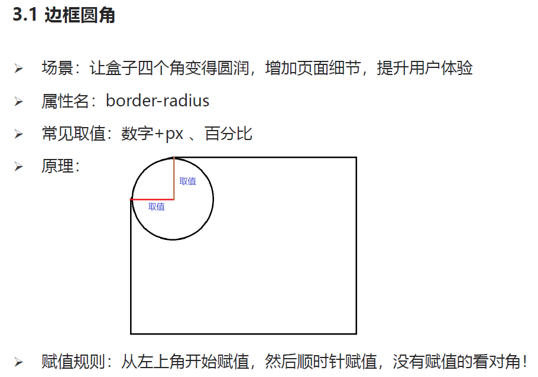

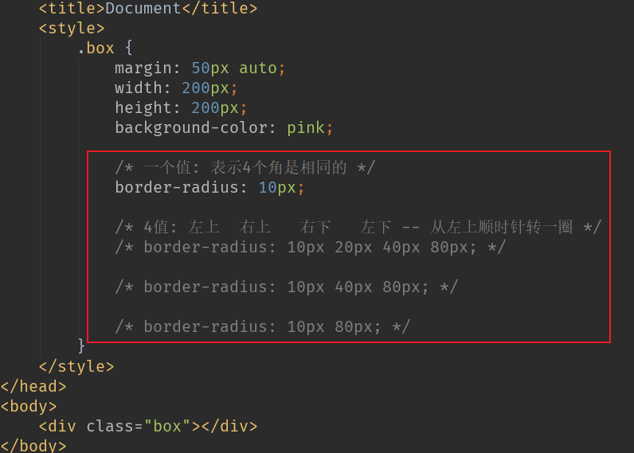

## 1.4 overflow 溢出部分显示效果

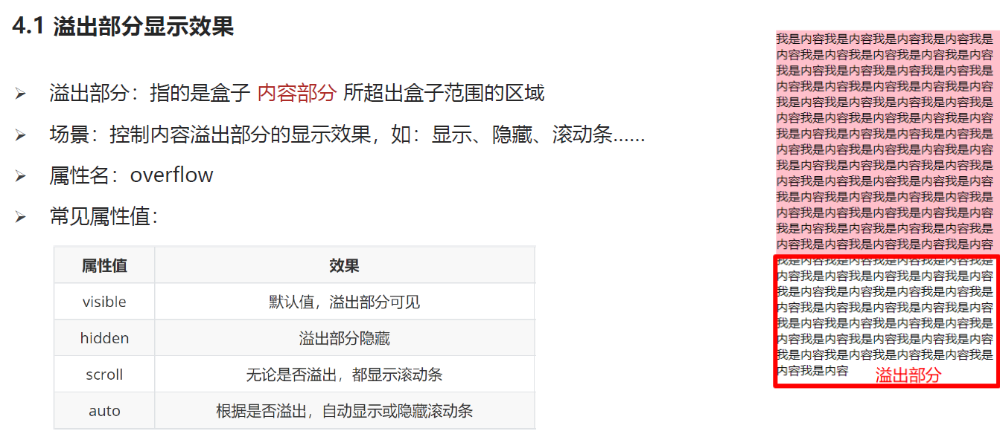

## 1.5 元素本身隐藏

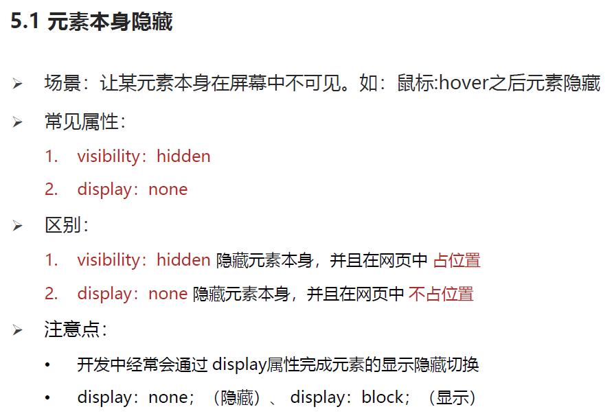

## 1.6  拓展  opacity  透明度

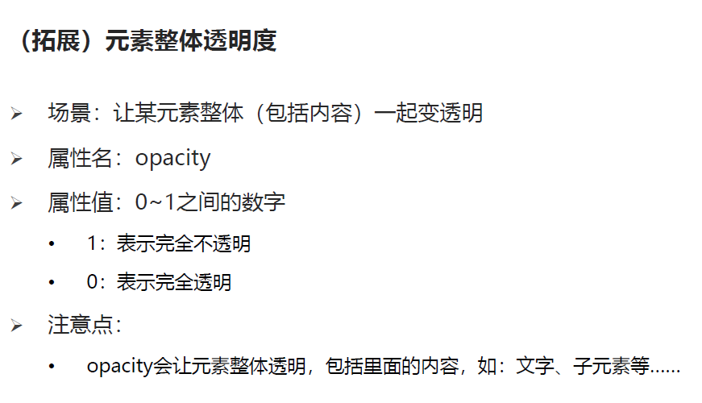

# 选择器拓展

## 1.1  链接伪类选择器

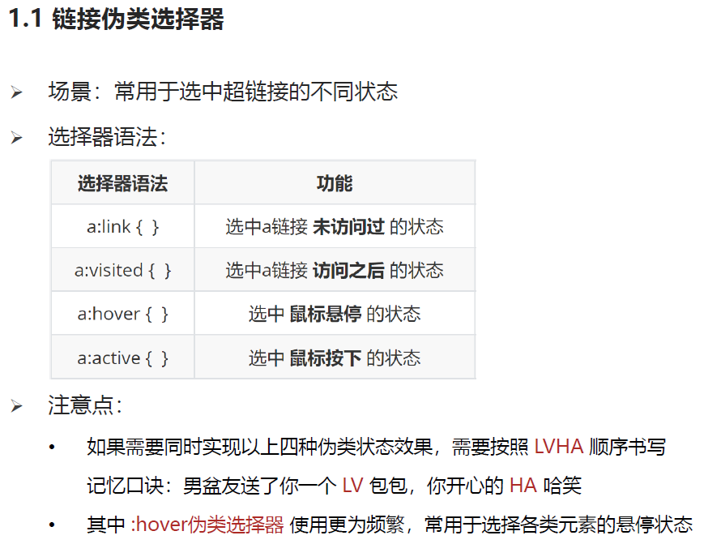

## 1.2  焦点伪类选择器

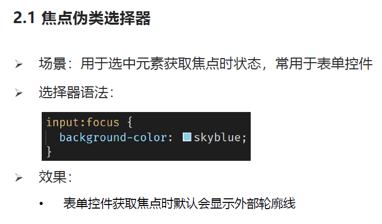

## 1.3  属性选择器

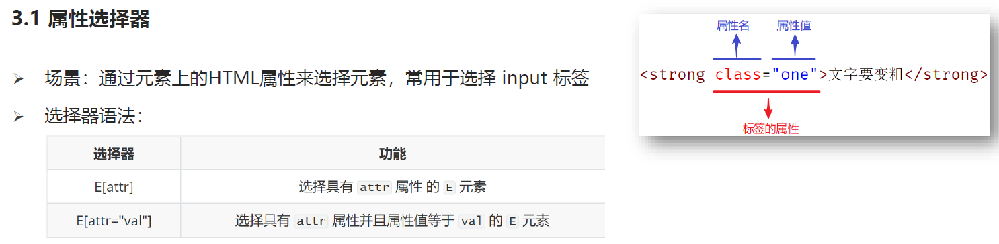

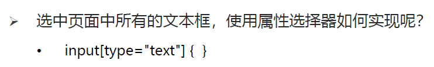