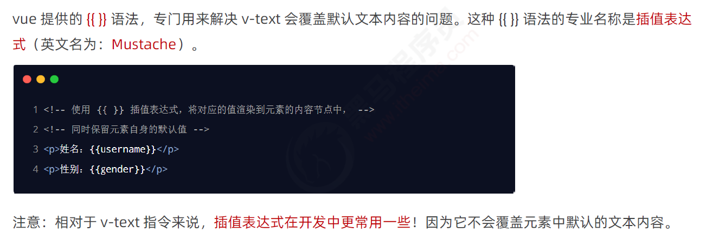
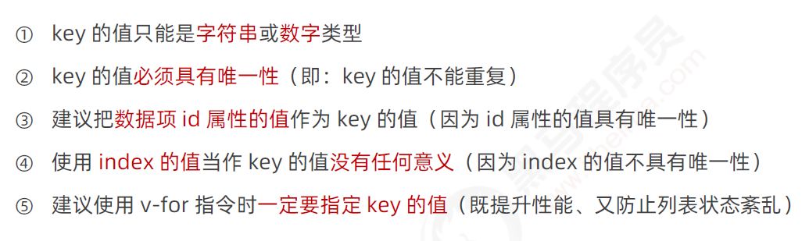

# Vue基础 + 指令 + 过滤器 

# 1 简介

## 1.1 vue 的两个特性

### 1.1.1 数据驱动视图

### 1.1.2  双向数据绑定

## 1.2 mvvm

# 2 vue的基本使用

## 2.1  基本使用步骤

## 2.2 基本代码与 MVVM 的对应关系

# 3.  vue的调试工具

# ==4 vue的指令和过滤器==

## 4.1 指令

### ==4.1.1 内容渲染指令==

#### 4.1.1.1 v-text

#### 4.1.1.2 {{ }}

#### 4.1.1.3 v-html

### ==4.1.2 属性绑定指令 v-bind==

### ==4.1.3 事件绑定指令 v-on:click==

#### 4.1.3.1 v-on指令

#### 4.1.3.2 在methods 节点中声明

#### 4.1.3.3 时间绑定的简写

#### 4.1.3.4 事件参数对象

#### 4.1.3.5 绑定参数并传参

#### ==4.1.3.6  $event(j解决参数被覆盖)==

#### 4.1.3.7 事件修饰符

#### 4.1.3.8 按键修饰符

### ==4.1.4 双向绑定指令==

#### 4.1.4.1 v-model 指令

#### 4.1.4.2 v-model 指令的修饰符

### ==4.1.5 条件渲染指令==

#### 4.1.5.1 v-if 和 v-show

#### 4.1.5.2 v-else

#### 4.1.5.3 v-else-if

### 4.1.6 列表渲染指令

#### 4.1.6.1  v-for 中的索引

#### 4.1.6.2 使用 key 维护列表的状态

#### 4.1.6.3 key的注意事项

#### 4.1.6.4 label 的 for 属性

# 5 过滤器

## 5.1  过滤器(2.x版本使用,3.x版本使用计算属性)

### 5.1.1 定义过滤器

### 5.1.2 私有过滤器 和全局过滤器

### 5.1.3 连续调用多个过滤器

### 5.1.4 过滤器传参

### 5.1.5 过滤器的兼容性

