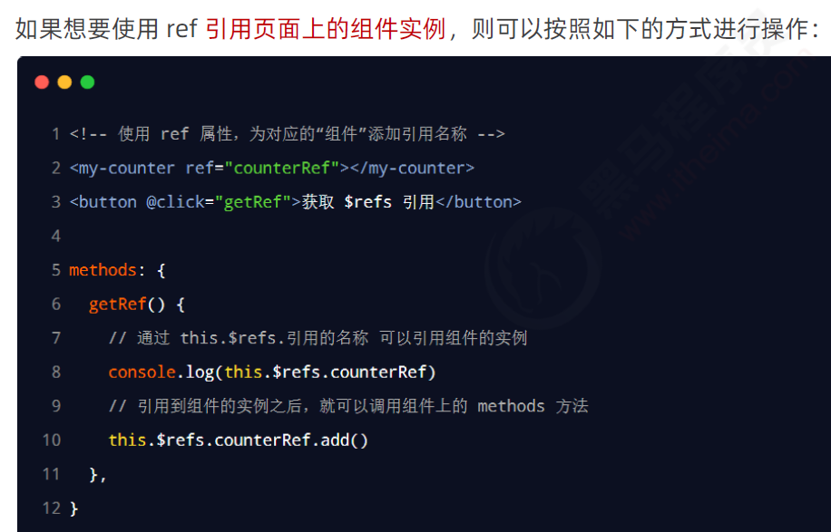

# 生命周期&数据共享(重点)

# 1. 生命周期


## 1.1 生命周期& 生命周期函数


## 1.2 组件生命周期函数的分类


# 2. 组件之间的数据共享

## 2.1 组件之间的关系


## 2.2 父子组件之间的数据共享


### 2.2.1 ==父组件向子组件共享数据==


### 2.2.2 ==子组件向父组件共享数据==


## 2.3 ==兄弟组件之间的数据共享==


### 2.3.1 EventBus 的使用步骤


# 3. ref 引用

## 3.1 什么是ref 引用


## 3.2 使用ref 引用DOM 元素


## 3.3 ==使用ref 引用 组件实例 (比父组件向子组件传值更方便)==

演示组件名称 my-counter,父组件调用可以使用子组件的值和方法



## 3.4 控制文本框和按钮的按需切换


## 3.5 让文本框自动获得焦点


## 3.6 this.$nextTick(cb) 方法


```
this.$nextTick(() => {
        // 组件的 DOM 执行后,执行下面的方法
      })
```

# 4 购物车案列用到的方法

## 4.1 数组的 some 方法 (循环有结果终止循环)


## 4.2 数组的 every 方法 (判断全选)


## 4.3 全选/全部选


## 4.4 数组的 reduce 方法 (计算总价)


## 4.5 ==props 传递对象还是属性值?==


## 4.6 子向父传值分析

