# 动态组件& 插槽& 自定义指令

# 1. 动态组件

## 1.1 什么是动态组件

动态组件指的是 动态切换组件的显示与隐藏

## 1.2 如何实现动态组件渲染

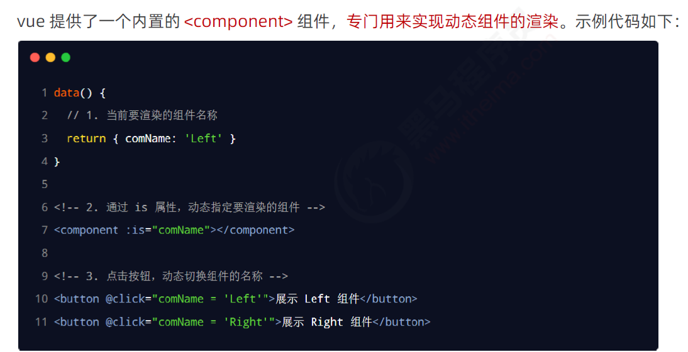

## 1.3 使用 keep-alive 保持动态组件的状态

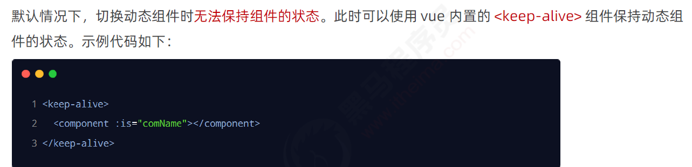

## 1.4 keep-alive 对应的生命周期函数

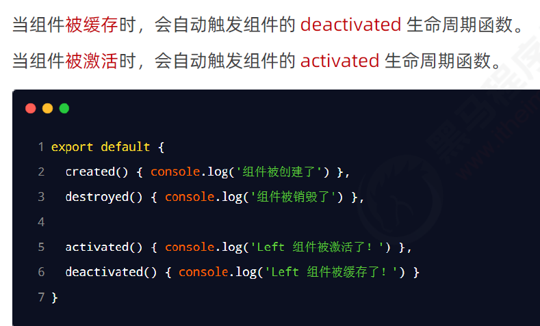

## 1.5 keep-alive 的 include 属性

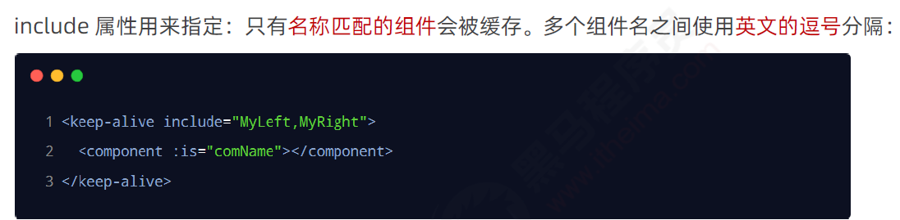

# 2 ==插槽(可以传值)==

## 2.1 什么是插槽

例子: 父组件引用子组件时, 在父组件中,引用子组件的里面,书写自定义的内容

多级父子传值,使用插槽更加方便 

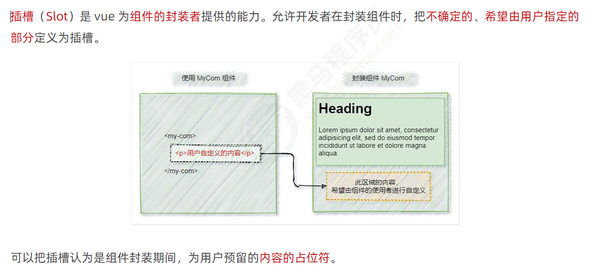

## 2.2 体验插槽的基础用法

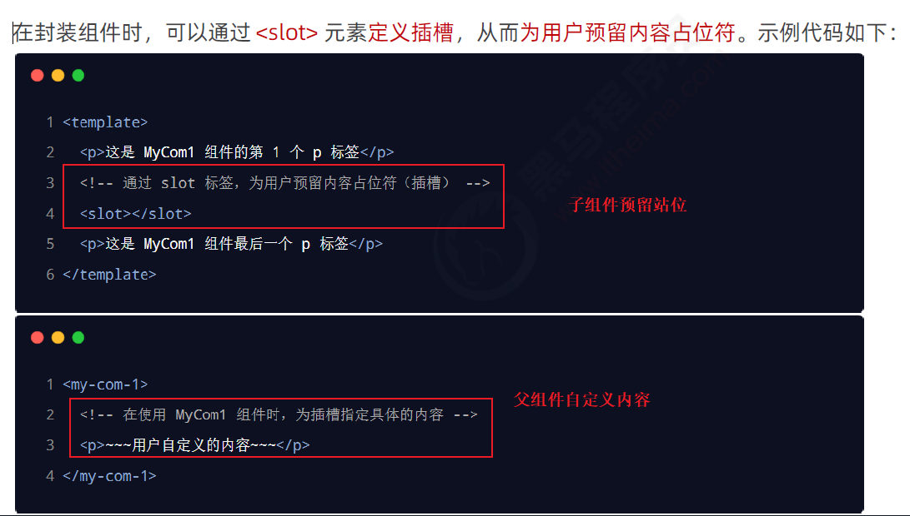

### 2.2.1 没有预留插槽的内容会被丢弃

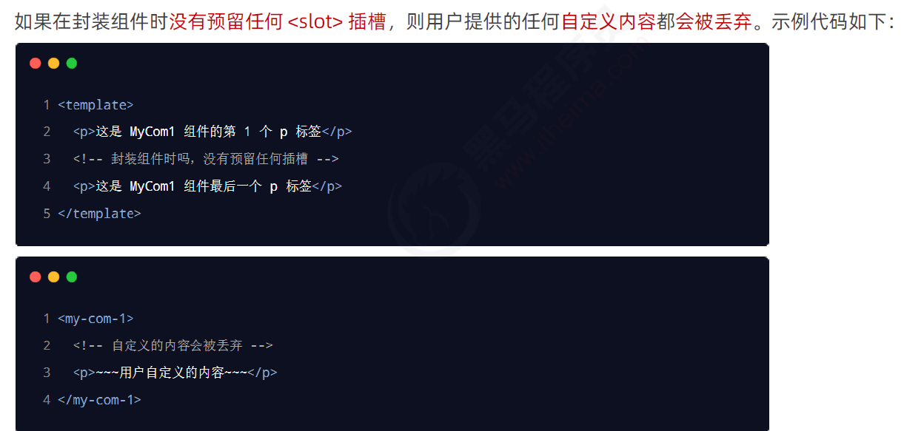

### 2.2.2 后备内容(插槽默认内容)

父组件没有自定义插槽,将会使用插槽原来的内容,  有自定义内容则会覆盖

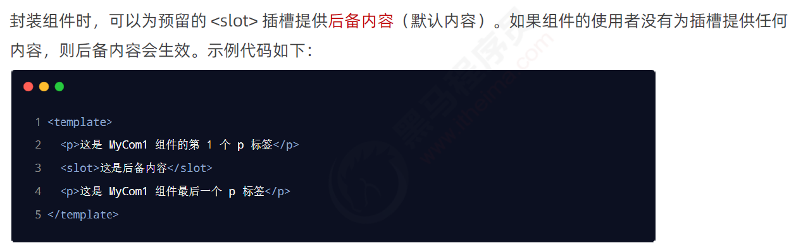

# 3 具名插槽

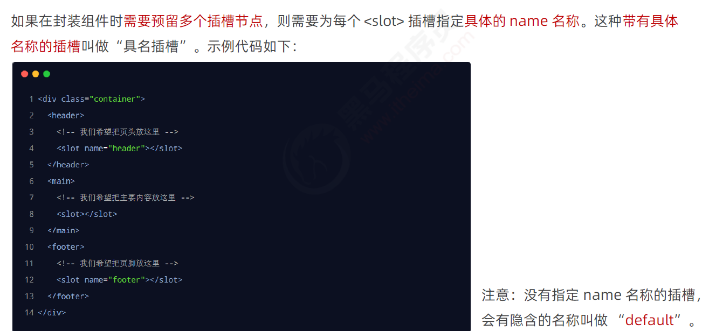

## 3.1 为具名插槽提供内容(多个插槽)

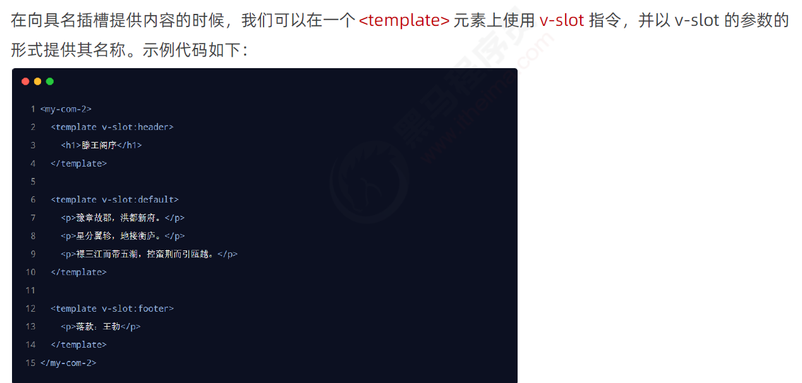

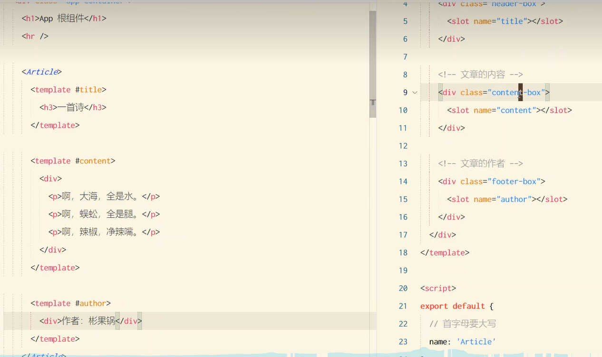

## 3.2 具名插槽的简写形式 ==#插槽名称==

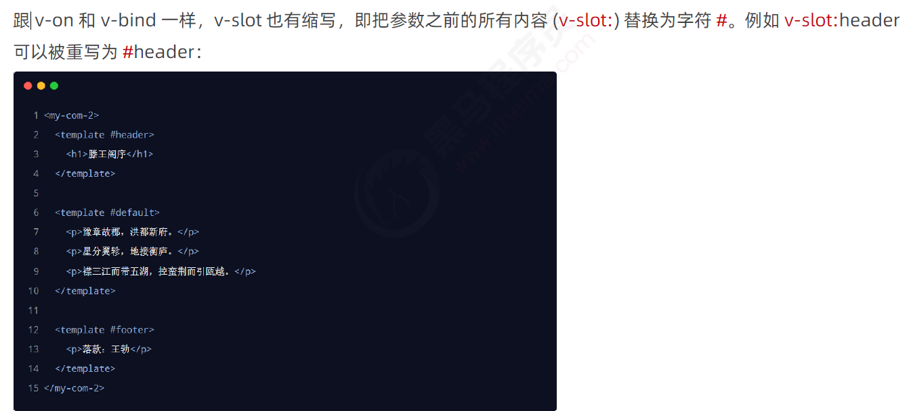

# 4 作用域插槽

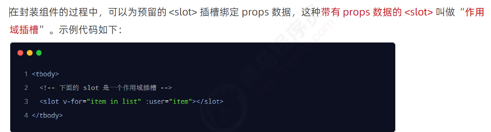

## 4.1 使用作域插槽

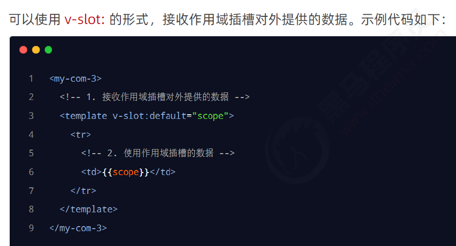

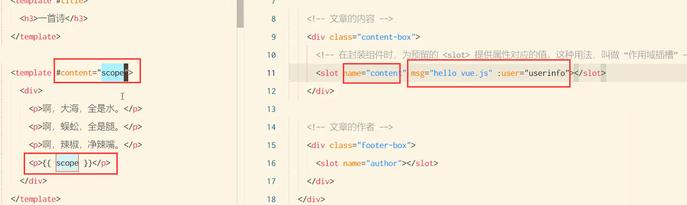

## 4.2 解构插槽 Prop

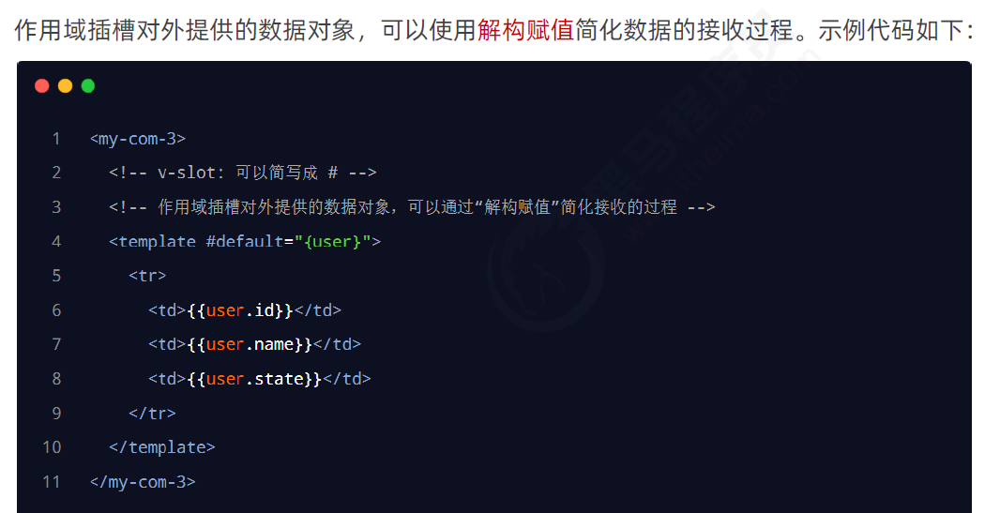

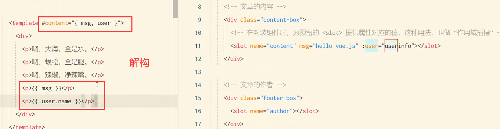

# 5 自定义指令

## 5.1 什么是自定义指令

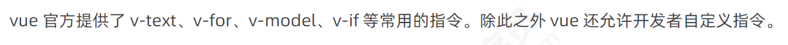

## 5.2  自定义指令的分类

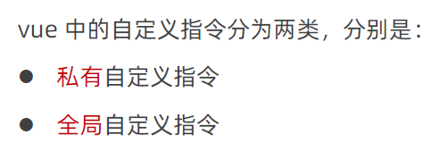

## 5.3 私有自定义指令

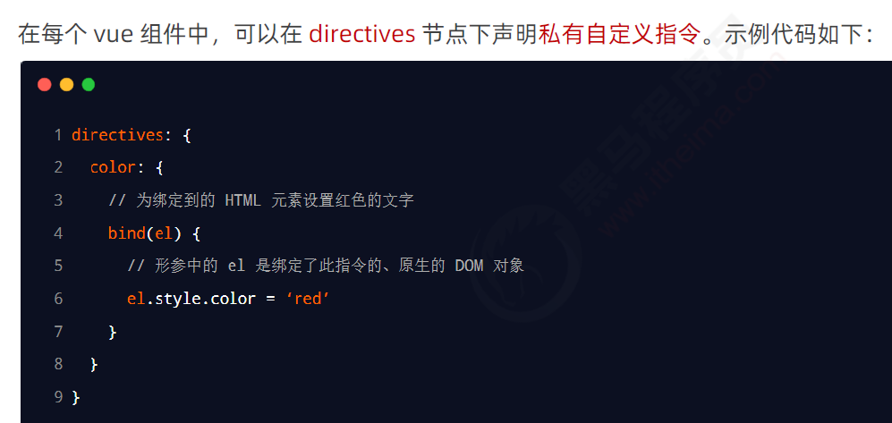

## 5.4 使用自定义指令

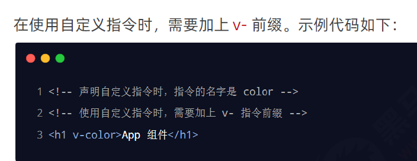

## 5.5 为自定义指令 动态绑定参数值

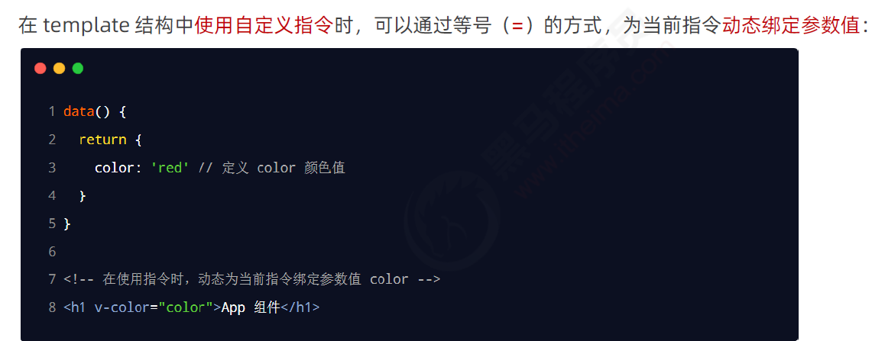

## 5.6 通过 binding 获取指令的参数值

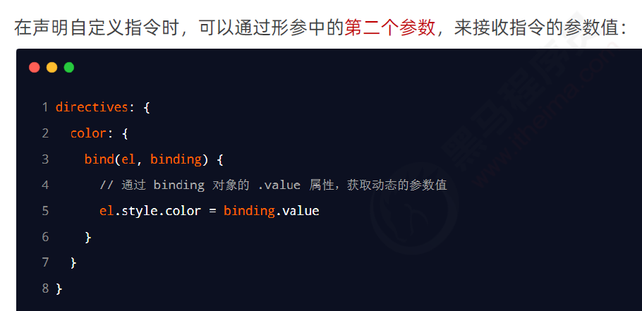

## 5.7 update函数

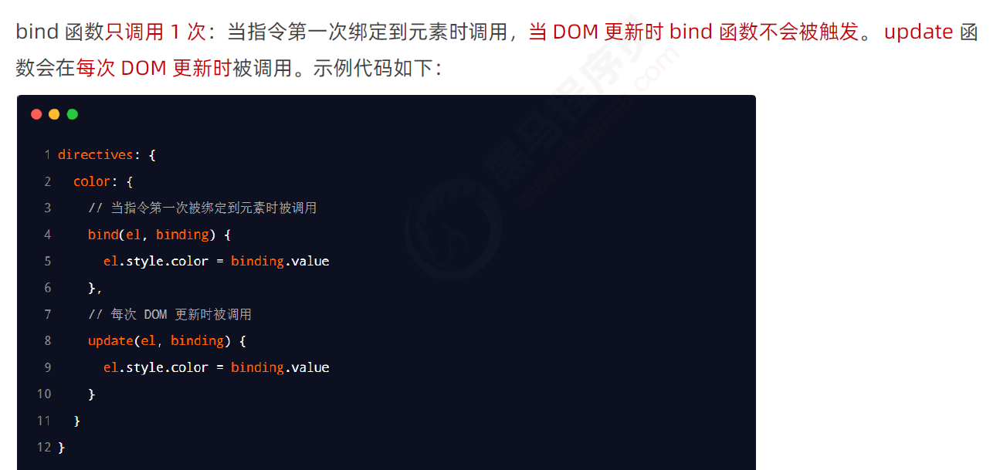

## 5.8 函数简写

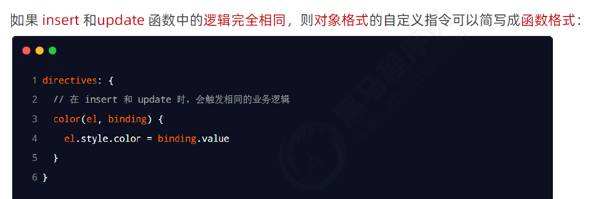

## 5.9 全局自定义指令

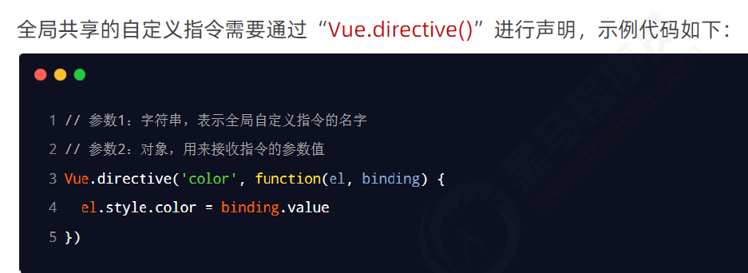