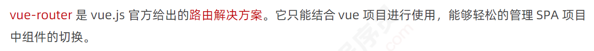
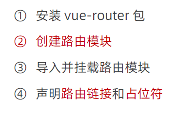
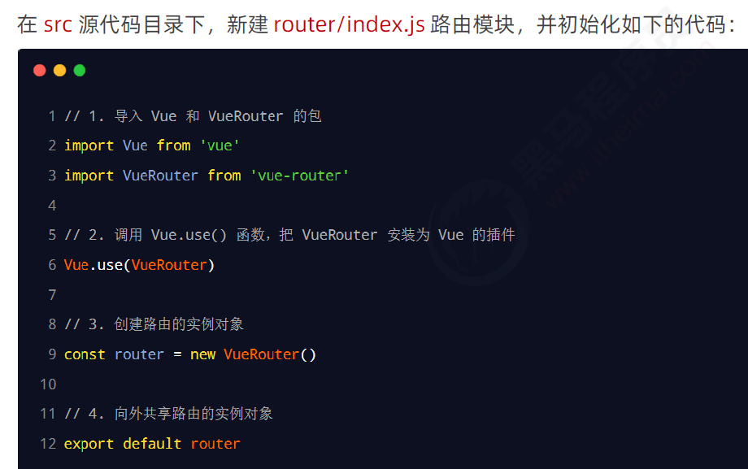

# +路由

# 1 前端路由的概念与原理

## 1.1 什么是路由

路由（英文： routerrouter）就是 对应关系 。

## 1.2 SPA与前端路由SPA

## 1.3 什么是前端路由

## 1.4 前端路由的工作方式

## 1.5 实现简易的前端路由

# 2 vue-router 的基本用法

## 2.1 什么是 vuevue-router

https://router.vuejs.org/zh/

## 2.2 ==vuevue-router 安装和配置的基本步骤==

### 2.2.1 在项目中安装 vuevue-router

### 2.2.2 创建路由模块

### 2.2.3 导入并挂载路由模块

### 2.2.4 声明 路由链接 和占位符

## 2.3==声明路由的 匹配规则==

# 3. vue -router 的常见用法

## 3.1 路由重定向

## 3.2 嵌套路由

### 3.2.1 声明 子路由链接 和子路由占位符

### 3.2.2 通过 children 属性声明 子路由规则

### 3.2.3 默认子路由 (重定向和空字符串)

## 3.3 动态路由匹配

### 3.3.1 动态路由的概念

### 3.3.2 $route.params 参数对象

### 3.3.3 使用 props 接

### 3.3.4 获取查询参数

## 3.4 声明式导航 & 编程式导航

### 3.4.1 vue-router 中的编程式导航 API

### 3.4.2 $router.push

### 3.4.3 $router.replace

### 3.4.4 $router.go

### 3.4.5  $router.go 的简化用法

## 3.5 导航守卫

### 3.5.1 全局前置守卫

### 3.5.2 守卫方法的 3 个形参

### 3.5.3 next 函数的 3 种调用方式

### 3.5.4 控制后台主页的访问权限

