# VUE 2.5 项目 去哪儿

# 1 项目准备

## 1.1  安装  node.js 查看安装版本

node  运行环境    

npm  包管理工具,安装node后自动生成

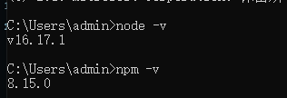

## 1.2 在github 上面创建项目

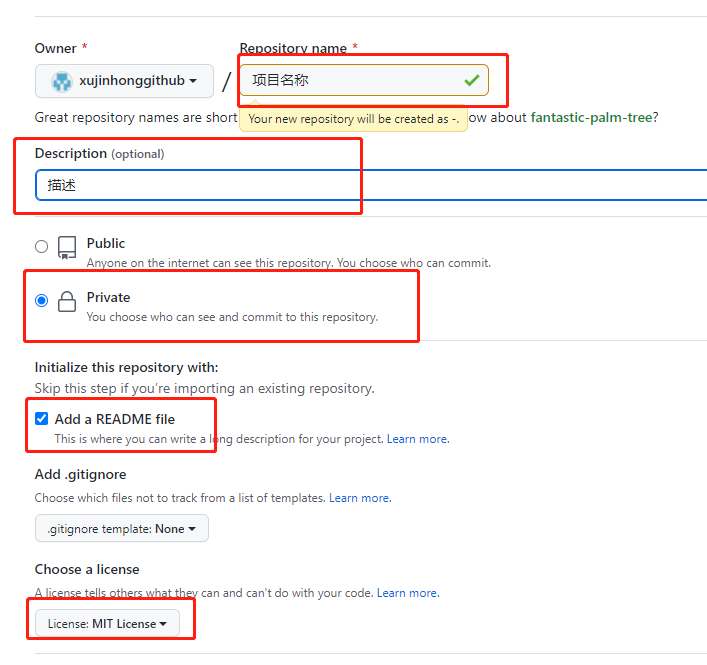

# 2 iconfont 的使用

https://www.iconfont.cn/

## 2.1 使用官方库

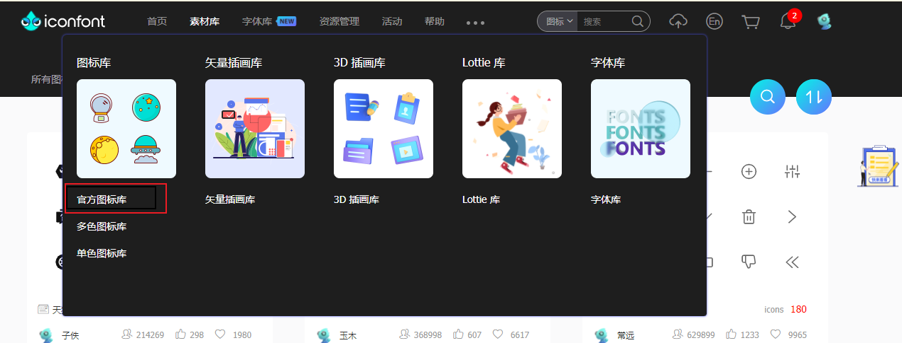

## 2.2 添加至项目

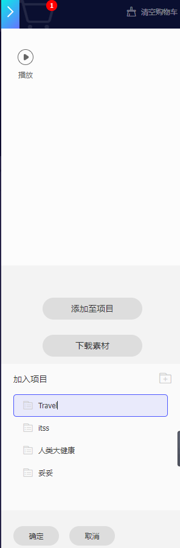

## 2.3 项目设置 选中这4个文件

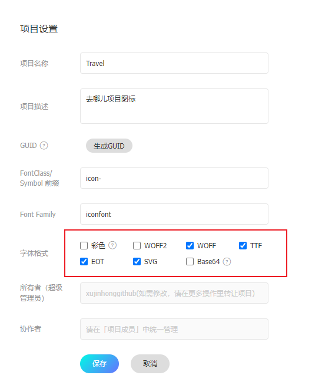

## 2.4 选择并下载到 本地

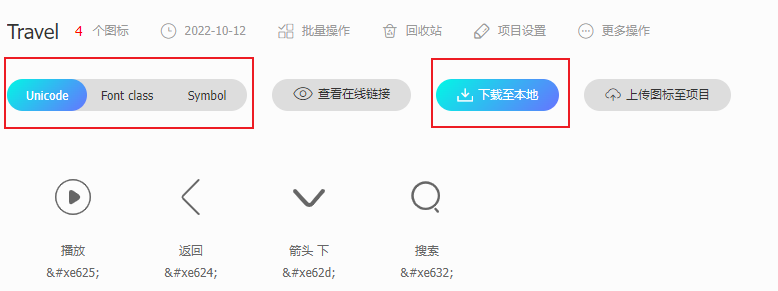

## 2.5 添加至项目 

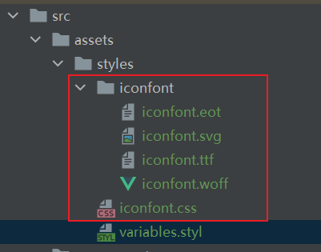

## 2.6 修改iconfont.css 中引入位置

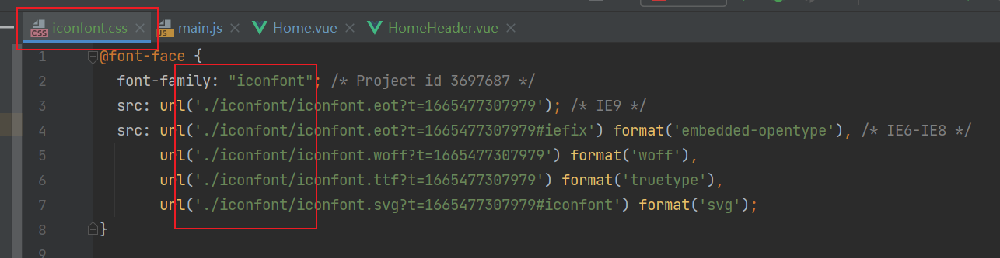

## 2.7 使用

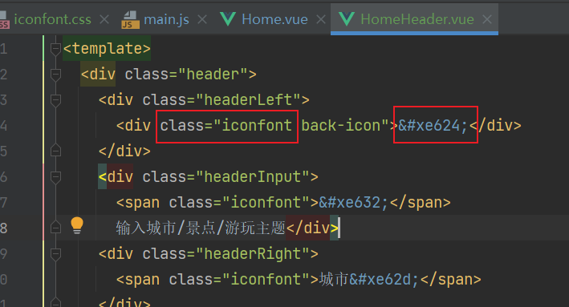

# 3 lang=stylus  全局变量和样式

## 3.1 ==全局变量的使用==

### 3.1.1 创建 variables.styl  填写全局变量

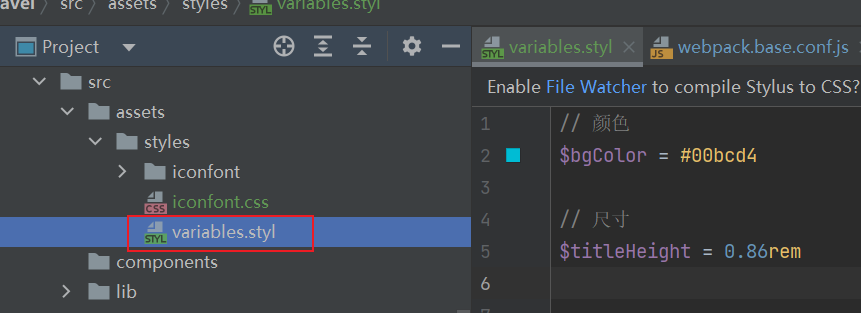

### 3.1.2 引入并使用

#### 3.1.2.1 简单使用

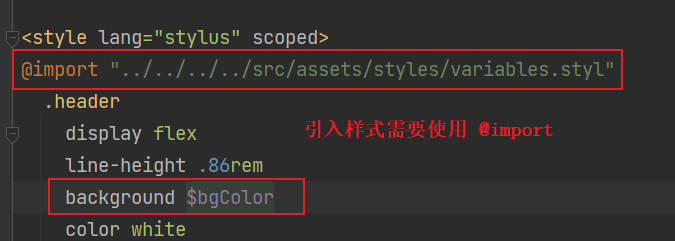

也可以这么写  在css中引入其它css 样式,需要使用 ~@ 代替 @(替代src路径) 来使用

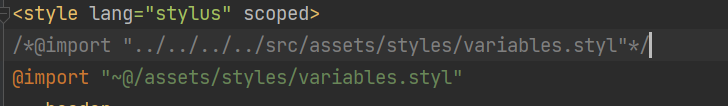

#### 3.1.2.2 ==升级写法== 

在build 中的 webpack.base.conf.js可以定义其他路径 ,例如定义 styles 代替路径 src/assets/styles

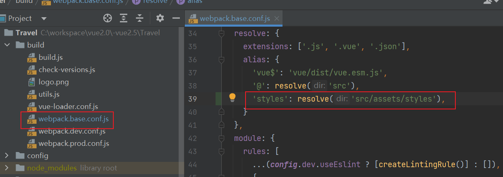

使用

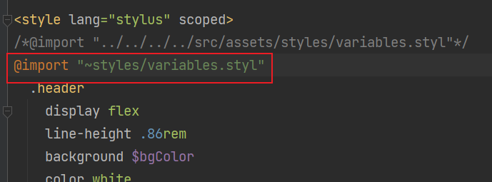

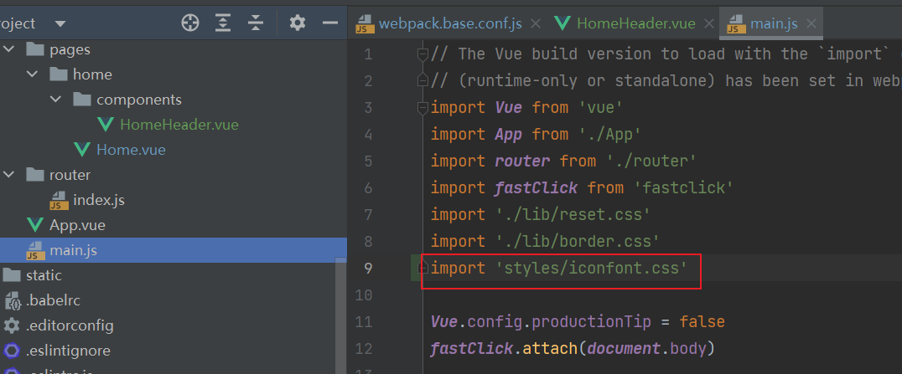