# 1. 字体&平面转换&渐变

## 1.1 字体图标 iconfont

### 1.1.1  网址账号及密码

```
网址:		https://www.iconfont.cn/
账号: 	17626049460
密码:		xjh123456
```

### 1.1.2 使用教程

#### 1.1.2.1  下载字体包

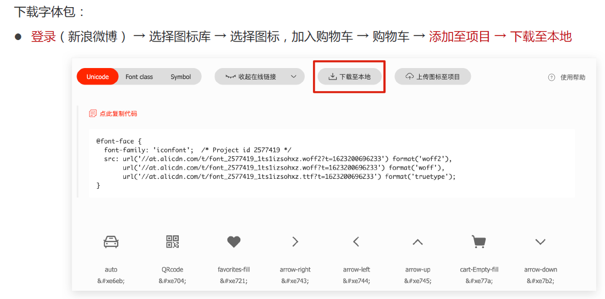

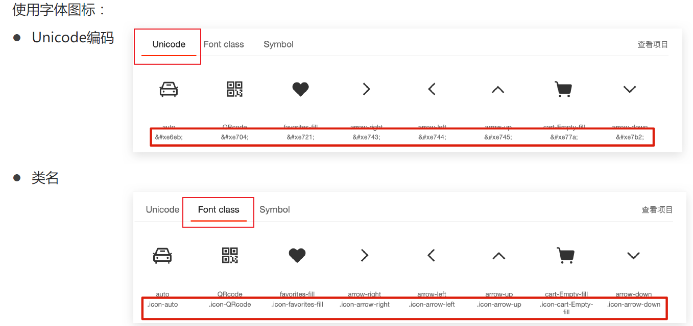

#### 1.1.2.2  2种引入方式

##### 1.1.2.2 .1 Unicode编码

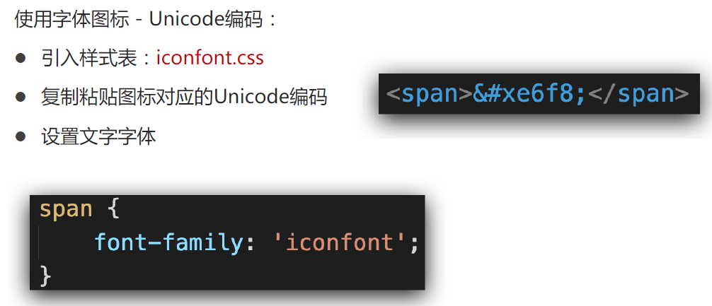

##### 1.1.2.2.2  类名(常用)

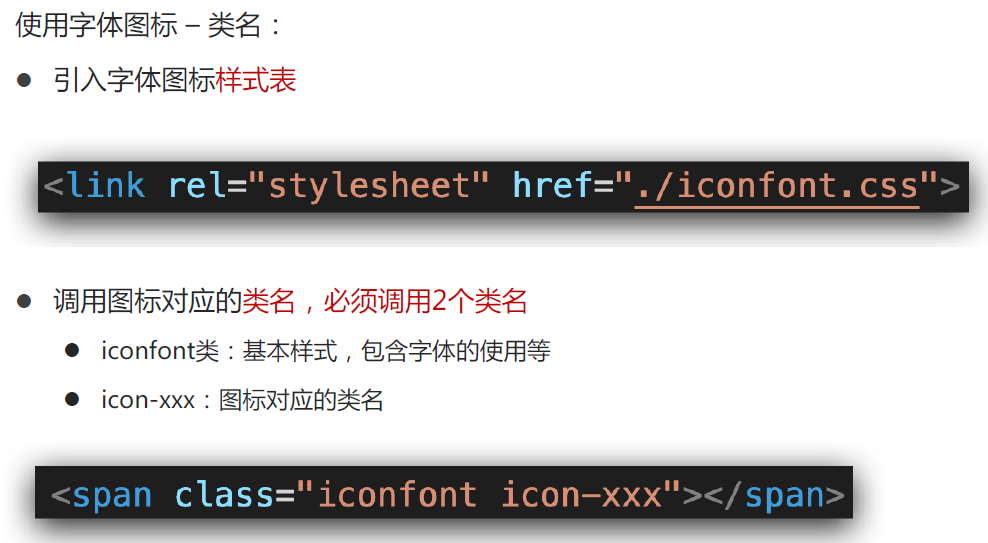

#### 1.1.2.3  上传矢量图 (项目需要的svg图片)   加入项目 下载使用

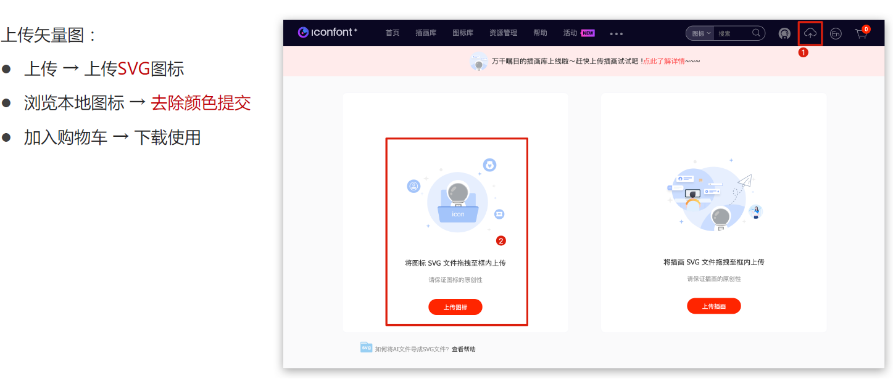

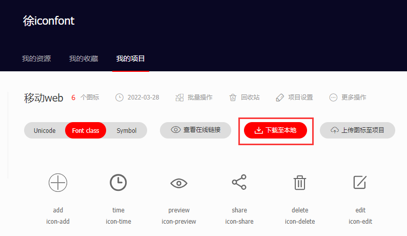

## 1.2  平面转换  transform

### 1.2.1  使用translate实现元素位移效果

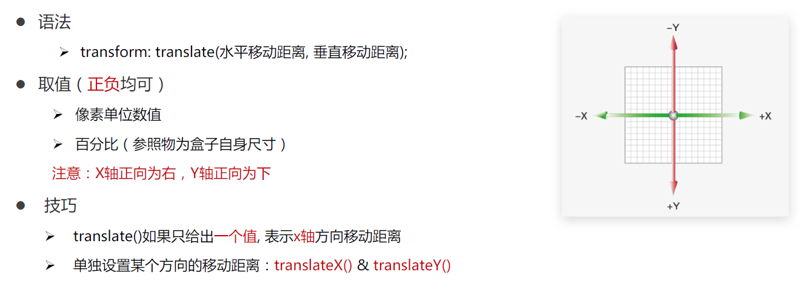

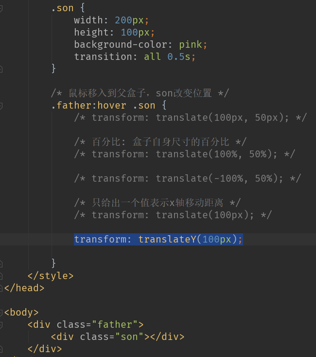

### 1.2.2  旋转  transform: rotate(角度);

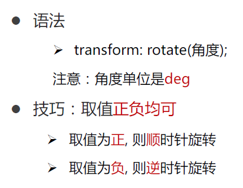

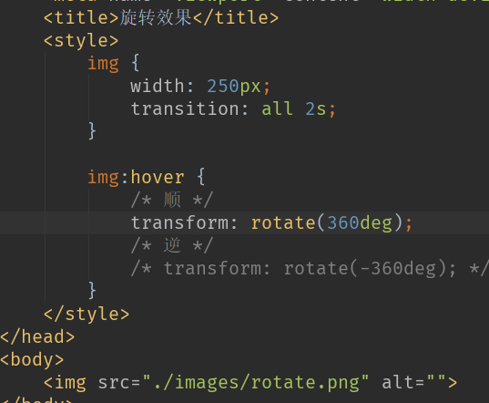

### 1.2.3  转换原点  transform-origin

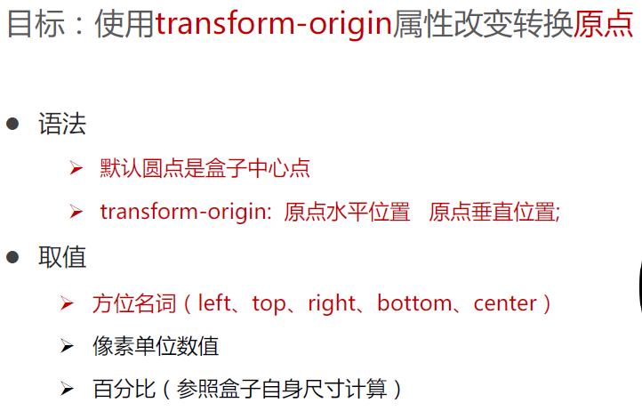

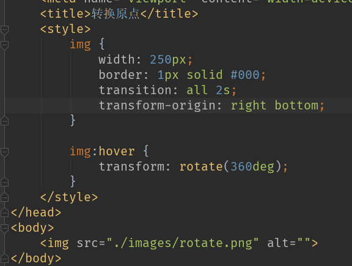

### 1.2.4  多重转换  transform: translate( ) rotate( )

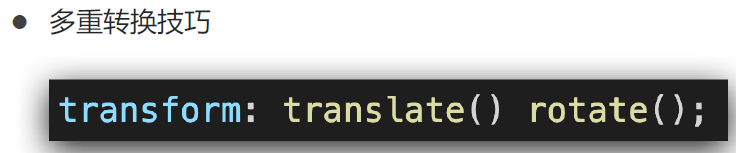

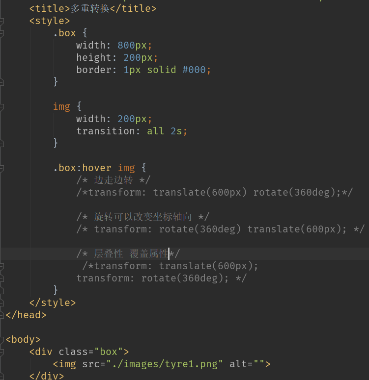

### 1.2.5   使用scale改变元素的尺寸  transform: scale(缩放倍数)

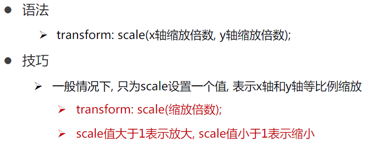

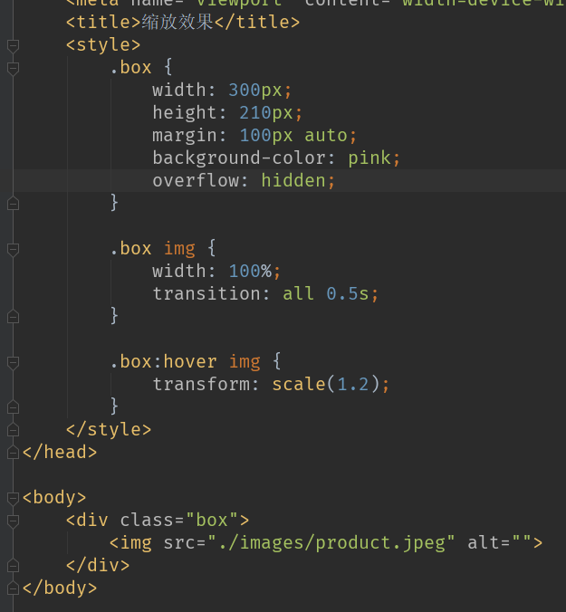

案列 参考  移动web 第一天

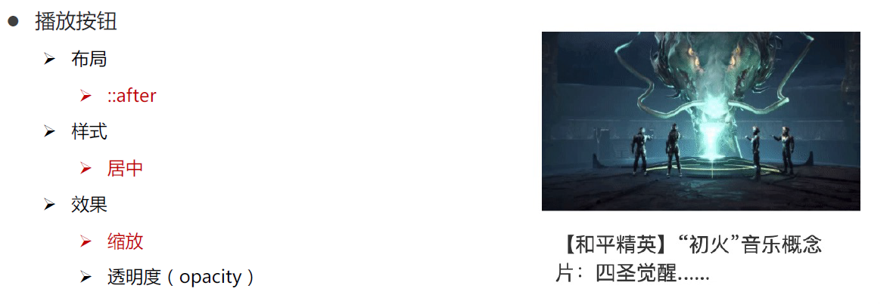

```
<!DOCTYPE html>
<html lang="en">
<head>
    <meta charset="UTF-8">
    <meta http-equiv="X-UA-Compatible" content="IE=edge">
    <meta name="viewport" content="width=device-width, initial-scale=1.0">
    <title>Document</title>
    <style>
        * {
            margin: 0;
            padding: 0;
        }

        li {
            list-style: none;
        }

        img {
            width: 100%;
        }

        .box {
            width: 249px;
            height: 210px;
            margin: 50px auto;
            overflow: hidden;
        }
        
        .box p {
            color: #3b3b3b;
            padding: 10px 10px 0 10px;
        }

        .box .pic {
            position: relative;
        }

        .box .pic::after {
            /* 播放按钮压在图片上面 - 居中 */
            position: absolute;
            left: 50%;
            top: 50%;
            /* margin-left: -29px;
            margin-top: -29px; */
            /* transform: translate(-50%, -50%); */

            content: '';
            width: 58px;
            height: 58px;
            background-image: url(./images/play.png);

            /* 大图 */
            transform: translate(-50%, -50%) scale(5);

            /* 透明,看不见 */
            opacity: 0;
            transition: all .5s;
        }

        /* lihover的时候,  谁变小pic::after */
        .box li:hover .pic::after {
            opacity: 1;
            transform: translate(-50%, -50%) scale(1);
        }
    </style>
</head>
<body>
    <div class="box">
        <ul>
            <li>
                <div class="pic"></div>
                <p>【和平精英】“初火”音乐概念片：四圣觉醒......</p>
            </li>
        </ul>
    </div>
</body>
</html>
```

## 1.3 渐变   linear-gradient(颜色1 , 颜色2)

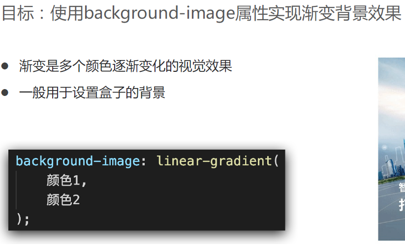

常用下面这种

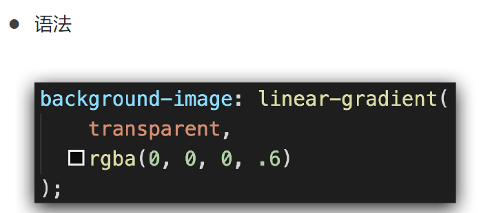

```
linear-gradient(
    /*transparent是全透明黑色(black)的速记法,即一个类似rgba(0,0,0,0)这样的值*/
        transparent,
        rgba(0,0,0, .6)
)
```

