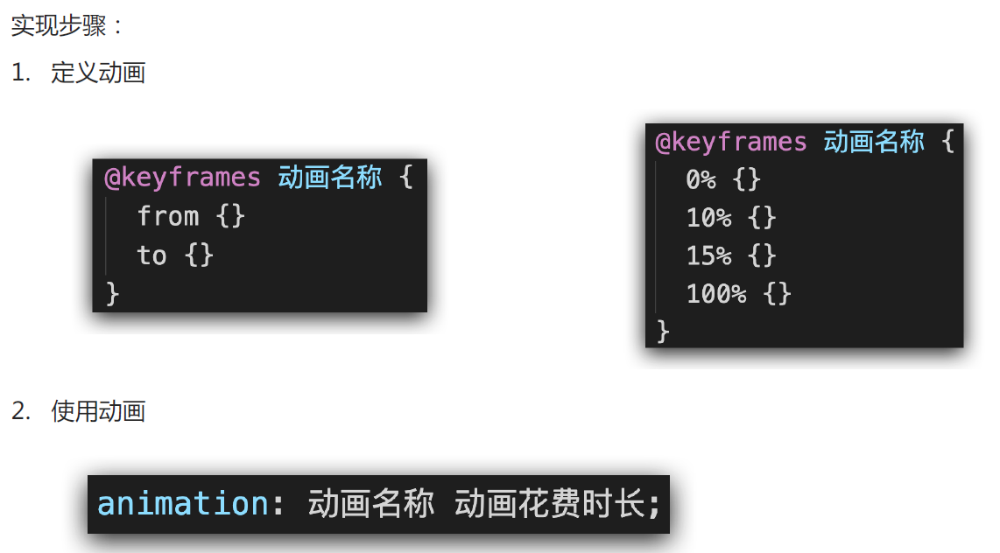

#  1空间转化和动画

## 1.1 空间转化

### 1.1.1  介绍 位移、旋转、缩放


#### 1.1.1.1  空间位移 translate


#### 1.1.1.2 透视效果 perspective 


#### 1.1.1.3 空间旋转  rotate


```
transform: rotate3d(0.5,0.2,0.8, 60deg);
```

#### 1.1.1.4 立体呈现  transform-style: preserve-3d


#### 1.1.1.5  空间缩放 scale


## 1.2 动画 animation

### 1.2.1  介绍


### 1.2.2 动画的实现步骤




### 1.2.3   动画属性


#### 1.2.3.1 用animation相关属性控制动画执行过程


#### 1.2.3.2  动画速度 animation-timing-function

##### 1.2.3.2.1 steps(数字)  逐帧动画


##### 1.2.3.2.2  linear    匀速


#### 1.2.3.3 代码讲解

```
<!DOCTYPE html>
<html lang="en">
<head>
    <meta charset="UTF-8">
    <meta http-equiv="X-UA-Compatible" content="IE=edge">
    <meta name="viewport" content="width=device-width, initial-scale=1.0">
    <title>animation复合属性</title>
    <style>
        .box {
            width: 200px;
            height: 100px;
            background-color: pink;
            /* animation: change 1s linear; */
            /* 分步动画 */
            /*animation: change 2s steps(3) ;*/
            /* 3: 重复3次播放 1s延迟执行*/
            /* animation: change 1s steps(3) 1s
            /* 3: 重复3次播放 */
            /* animation: change 1s steps(3) 1s 3; */
            /* 无限循环 */ /* alternate 改变动画方向*/
            /* animation: change 1s infinite alternate;*/
            /* 默认值, 动画停留在最初的状态 */
            /* animation: change 1s backwards; */
            /* 动画停留在结束状态 */
            /*animation: change 1s forwards;*/
        }

        @keyframes change {
            from {
                width: 200px;
            }
            to {
                width: 600px;
            }
        }

    </style>
</head>
<body>
    <div class="box"></div>
</body>
</html>
```

