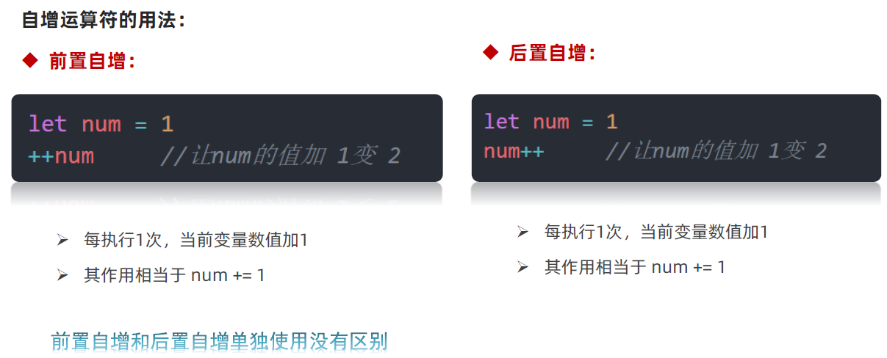
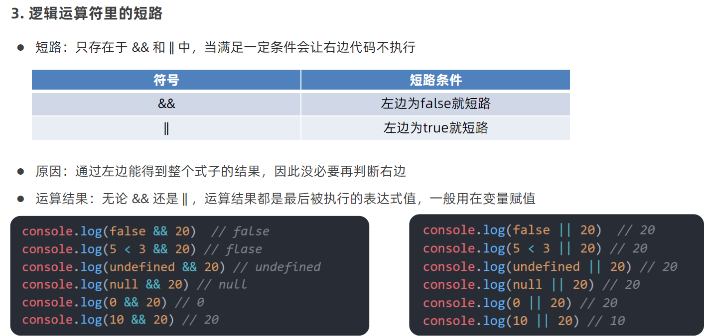

# 运算符和语句

# 1. 运算符

## 1.1  算术运算符

## 1.2  赋值运算符

## 1.3  一元运算符

## 1.4  比较 运算符

## 1.5  逻辑运算符

## 1.6 运算符优先级

# 2.语句

## 2.1 表达式和语句

## 2.2 分支语句

### 2.2.1 if 分支语句

### 2.2.2 三元运算符

### 2.2.3 switch 语句

## 2.3 循环语句

### 2.3.1 断点调试

### 2.3.2  while 循环

### 2.3.3 循环退出

